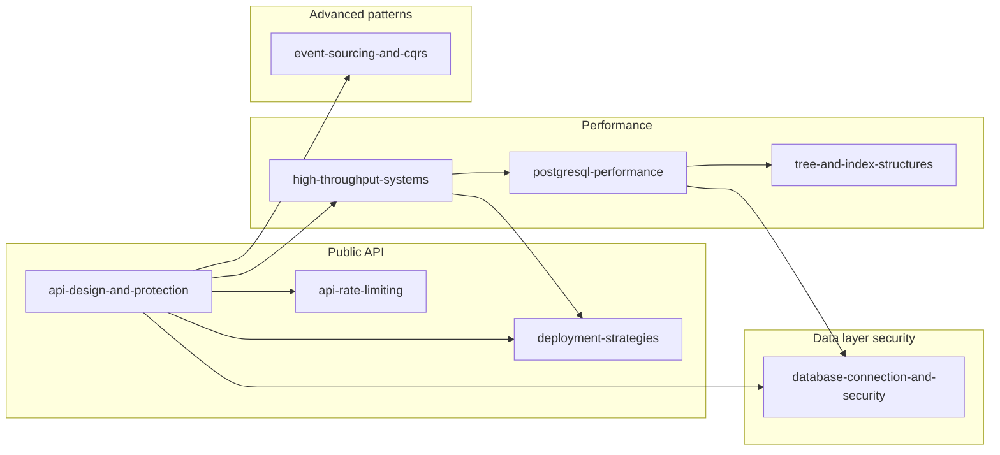

# Engineering Guides

Practical reference docs for building and operating production APIs and data systems. Each guide has a modular `README.md` (table of contents + section links), a combined `GUIDE.md` (full document), and `includes/*.md` (reusable sections).

> **Tip:** Browse by topic below, or follow a [learning path](#learning-paths). Open any guide's `GUIDE.md` when you want everything in one file.

---

## Guides at a glance

| Guide | What it covers |
|-------|----------------|
| [api-design-and-protection](api-design-and-protection/README.md) | REST design, protection, gateway, auth, identity, async, idempotency, stateless architecture |
| [api-rate-limiting](api-rate-limiting/README.md) | Limiter algorithms, scope, deployment layers, response strategies |
| [database-connection-and-security](database-connection-and-security/README.md) | DB credentials, TLS, Vault, cloud IAM, PgBouncer, production connection patterns |
| [deployment-strategies](deployment-strategies/README.md) | Rolling, blue/green, canary, feature flags, GitOps, progressive delivery |
| [event-sourcing-and-cqrs](event-sourcing-and-cqrs/README.md) | Event store, aggregates, CQRS, projections, outbox, sagas, API implications |
| [high-throughput-systems](high-throughput-systems/README.md) | End-to-end throughput: measure, cache, async, streaming, backpressure, scale |
| [postgresql-performance](postgresql-performance/README.md) | Measurement, indexing, queries, vacuum, pooling, replicas, bulk ops, consistency |
| [tree-and-index-structures](tree-and-index-structures/README.md) | B+, LSM, in-memory trees, specialized structures, decision guides |

---

## How the guides relate



---

## Learning paths

### Ship a public API

Design the contract, protect the edge, connect to the database safely, and deploy without downtime.

1. [api-design-and-protection](api-design-and-protection/README.md) — design, gateway, auth, checklist
2. [api-rate-limiting](api-rate-limiting/README.md) — algorithms and where to enforce limits
3. [database-connection-and-security](database-connection-and-security/README.md) — production credentials and IAM
4. [deployment-strategies](deployment-strategies/README.md) — rolling, canary, blue/green

### Make it fast

Optimize in order: measure, reduce work, fix the database hot path, then cache and scale.

1. [high-throughput-systems](high-throughput-systems/README.md) — system-wide throughput order and layers
2. [postgresql-performance](postgresql-performance/README.md) — indexes, queries, pooling, replicas
   - Read [§9 scale-out terminology](postgresql-performance/includes/09-views-functions-and-scale-out-terminology.md) first if partitioning vs replication vs sharding is unclear
3. [tree-and-index-structures](tree-and-index-structures/README.md) — B+ vs LSM when writes dominate
4. Global users → [HTS §13 multi-region](high-throughput-systems/includes/13-multi-region-read-routing.md) + [PG §14 consistency](postgresql-performance/includes/14-consistency-promises-and-costs.md)

### Global scale and consistency

Multi-region reads, consistency promises, and DR before expanding globally.

1. [high-throughput-systems §13 multi-region](high-throughput-systems/includes/13-multi-region-read-routing.md) — active-passive, read-local, geo routing
2. [postgresql-performance §14 consistency](postgresql-performance/includes/14-consistency-promises-and-costs.md) — read-your-writes, staleness, costs
3. [database-connection-and-security §12 DR](database-connection-and-security/includes/12-credential-rotation-and-dr.md) — RPO/RTO, failover drills
4. [deployment-strategies](deployment-strategies/README.md) — safe deploy during regional failover

### Event-sourced domain

Append-only writes, read projections, and reliable async integration.

1. [event-sourcing-and-cqrs](event-sourcing-and-cqrs/README.md) — core concepts and decision guide
2. [event-sourcing-and-cqrs §5 async](event-sourcing-and-cqrs/includes/05-async-integration.md) — outbox, reliable publish
3. [event-sourcing-and-cqrs §7 sagas](event-sourcing-and-cqrs/includes/07-sagas-and-distributed-workflows.md) — cross-service workflows, compensation, ops
4. [api-design-and-protection §10 async](api-design-and-protection/includes/10-async-patterns.md) — jobs, webhooks, polling
5. [api-design-and-protection §13 idempotency](api-design-and-protection/includes/13-idempotency.md) — safe command retries
6. [postgresql-performance §2 indexing](postgresql-performance/includes/02-indexing.md) — event table performance

### Production hardening

Security review, overload protection, and operational safety nets.

1. [api-design-and-protection §2 protection](api-design-and-protection/includes/02-api-protection.md) + [§6 threat model](api-design-and-protection/includes/06-threat-model.md)
2. [api-design-and-protection §12 identity](api-design-and-protection/includes/12-identity-rbac-iam-ad.md)
3. [database-connection-and-security](database-connection-and-security/README.md) — network, TLS, secrets, cloud identity
4. [high-throughput-systems §9 backpressure](high-throughput-systems/includes/09-backpressure-and-limits.md) + [api-rate-limiting](api-rate-limiting/README.md)

### DBA / platform engineer

Operate PostgreSQL safely: connections, migrations, backups, and deploy coupling.

1. [postgresql-performance](postgresql-performance/README.md) — measure, index, pool, maintain
2. [postgresql-performance §15 migrations](postgresql-performance/includes/15-schema-migration-checklist.md) — expand/contract, concurrent indexes
3. [database-connection-and-security](database-connection-and-security/README.md) — credentials, IAM, rotation, DR drills
4. [deployment-strategies §12–13](deployment-strategies/includes/12-schema-migrations-and-deploy.md) — schema + deploy order, SLO rollback

---

## Contributing

See [CONTRIBUTING.md](CONTRIBUTING.md) for layout, link conventions, and how to rebuild `GUIDE.md`.

| Resource | Purpose |
|----------|---------|
| [GLOSSARY.md](GLOSSARY.md) | Shared terms across guides |
| [CHANGELOG.md](CHANGELOG.md) | Section additions and renames |
| [RUNBOOK-TEMPLATE.md](RUNBOOK-TEMPLATE.md) | Copy per service for incidents |

Validate and build:

```bash
cd documents && make validate && make build-all
```

`make validate` checks file links, cross-file `#anchors`, and README ↔ includes sync. Optional: `make validate-external` for https URLs (see CONTRIBUTING).

Optional static site: `pip install mkdocs-material && mkdocs build -f mkdocs.yml` (from `documents/`; output in `../.mkdocs-site/`). Nav lists each guide's README, combined `GUIDE.md`, and individual `includes/` sections. CI verifies the site builds. Local preview: `mkdocs serve -f mkdocs.yml`.

---

## Scope

These guides cover **backend API, data, throughput, and deploy** patterns. They intentionally omit deep dives on frontend, mobile, Kubernetes networking, and generic Terraform — link out to official docs when you adopt those stacks.

---

## File layout (every guide)

```
documents/
├── README.md              ← start here
├── CONTRIBUTING.md
├── GLOSSARY.md
├── CHANGELOG.md
├── RUNBOOK-TEMPLATE.md
├── Makefile
├── mkdocs.yml             ← optional static site
├── scripts/
│   ├── build-guide.py
│   ├── validate-doc-links.py
│   └── validate-doc-readme.py
└── guide-name/
    ├── README.md
    ├── GUIDE.md
    └── includes/
```

---

## Cross-link convention

| Source | Path to sibling guide |
|--------|------------------------|
| `guide/includes/*.md` | `../../other-guide/...` |
| `guide/README.md` or `guide/GUIDE.md` | `../other-guide/...` |

Every guide ends with a **## See also** table (sibling guides). Section-level cross-links inside chapters may use **## See also** or **## Other guides in this repo** where context-specific.

Intra-guide links in `GUIDE.md` use bare filenames (e.g. `03-api-gateway.md`); they resolve to `includes/` when reading the combined document.
