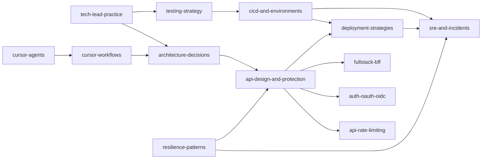
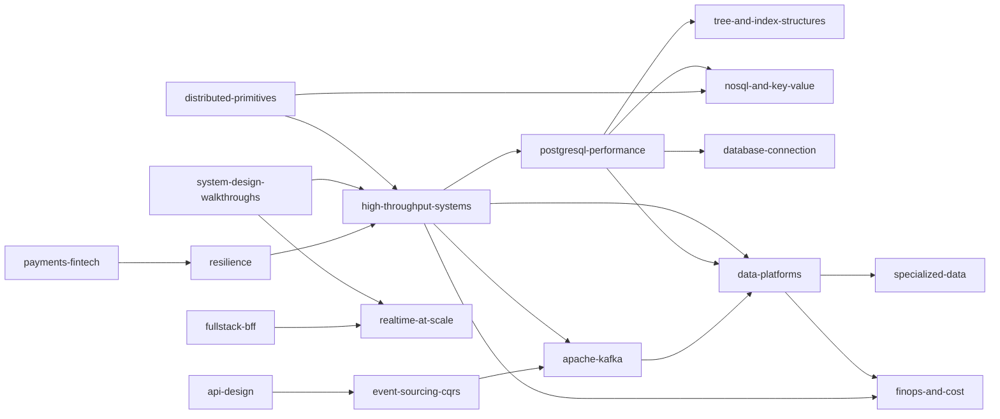
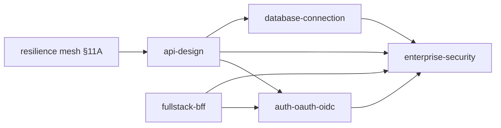

# Engineering Guides

Practical reference docs for building and operating production APIs and data systems. Each guide has a **README** (table of contents linking to sections) and **`includes/*.md`** (full articles).

> **Reading on GitHub:** Start from [learning paths](#learning-paths) or a guide README — **click a topic in the table** to open the full section file. Acronym expansions appear on first use in each file (`CDC(Change Data Capture)`).

---

## Guides at a glance

| Guide | What it covers |
|-------|----------------|
| [apache-kafka](apache-kafka/README.md) | Distributed commit log: internals, schema formats, setup, producers/consumers, integration, DR, testing |
| [api-design-and-protection](api-design-and-protection/README.md) | REST(Representational State Transfer) design, protection, gateway, auth, identity, async, idempotency, object storage uploads, stateless architecture |
| [api-rate-limiting](api-rate-limiting/README.md) | Limiter algorithms, scope, deployment layers, response strategies |
| [architecture-decisions](architecture-decisions/README.md) | System shape, Team Topologies, strangler/program modernization, ADRs/ARB(Architecture Review Board), tradeoffs, capacity, multi-tenant, failure domains, org/stage/pricing fit |
| [auth-oauth-oidc-and-login-security](auth-oauth-oidc-and-login-security/README.md) | OAuth(Open Authorization) 2.0 grants, OIDC(OpenID Connect) discovery/ID tokens, SSO(Single Sign-On)/multi-tenant B2B(Business-to-Business), token lifecycle, cookie/session CSRF(Cross-Site Request Forgery), login hardening |
| [cicd-and-environments](cicd-and-environments/README.md) | CI(Continuous Integration)/CD(Continuous Delivery) pipelines, env promotion, config vs secrets, flags, branching, rollback, container health, platform boundaries |
| [cursor-agents](cursor-agents/README.md) | Single vs multi agent, parallel Agents Window, subagents, auto-delegation |
| [cursor-workflows](cursor-workflows/README.md) | Cursor playbook: design → architecture → coding → review → ship → operate (MCP, mocks, stack rules) |
| [data-platforms](data-platforms/README.md) | Beyond one OLTP DB: warehouse/lake, search, Redis roles, caching coherence, ownership, migrations, analytics isolation |
| [database-connection-and-security](database-connection-and-security/README.md) | DB credentials, TLS(Transport Layer Security), Vault, cloud IAM(Identity and Access Management), PgBouncer, production connection patterns |
| [deployment-strategies](deployment-strategies/README.md) | Rolling, blue/green, canary, feature flags, GitOps(Git Operations), progressive delivery, feature→PROD playbook |
| [distributed-systems-primitives](distributed-systems-primitives/README.md) | CAP(Consistency, Availability, Partition Tolerance)/PACELC mechanisms, consistent hashing, unique IDs, consensus, service discovery, Bloom/HLL, clocks |
| [enterprise-security-compliance](enterprise-security-compliance/README.md) | Secure SDLC(Software Development Life Cycle), threat process, supply chain, secrets, audit/PII(Personally Identifiable Information), encryption, zero trust, compliance evidence |
| [event-sourcing-and-cqrs](event-sourcing-and-cqrs/README.md) | Event store, aggregates, CQRS(Command Query Responsibility Segregation), projections, outbox/inbox, sagas, API(Application Programming Interface) implications |
| [finops-and-cost](finops-and-cost/README.md) | Cost as design constraint: unit economics, drivers, right-sizing, retention, build vs managed, budgets |
| [fullstack-bff-and-clients](fullstack-bff-and-clients/README.md) | Fullstack TL ownership of UI↔API: BFF(Backend for Frontend), rendering, Web Vitals, realtime UX, a11y, browser auth |
| [high-throughput-systems](high-throughput-systems/README.md) | End-to-end throughput: measure, cache, async, streaming, backpressure, networking fundamentals, scale |
| [nosql-and-key-value-stores](nosql-and-key-value-stores/README.md) | DynamoDB / Cassandra / Mongo vs PostgreSQL; access-pattern modeling; multi-tenant Dynamo-style tradeoffs |
| [payments-and-fintech](payments-and-fintech/README.md) | PCI(Payment Card Industry) scope reduction, double-charge prevention, ledgers, fraud and reconciliation |
| [postgresql-performance](postgresql-performance/README.md) | Measurement, indexing, queries, vacuum, pooling, replicas, bulk ops, consistency |
| [realtime-at-scale](realtime-at-scale/README.md) | WebSocket fan-out, pub/sub backplanes, presence, CRDT(Conflict-free Replicated Data Type)/OT(Operational Transformation) |
| [resilience-patterns](resilience-patterns/README.md) | Timeouts, retries, circuit breakers, bulkheads, load shedding, idempotency, locks, delivery, cascades, chaos, policy placement, observability, drain |
| [specialized-data-systems](specialized-data-systems/README.md) | Time-series, graph DBs, vector/RAG(Retrieval-Augmented Generation), workflow engines (Temporal / Step Functions) |
| [sre-and-incidents](sre-and-incidents/README.md) | SLIs/SLOs, error budgets, observability culture, alerting, incident command, postmortems, on-call, drills, hypercare |
| [system-design-walkthroughs](system-design-walkthroughs/README.md) | End-to-end designs: URL shortener, feed, chat, geo, rate limiter, notifications, autocomplete, video |
| [tech-lead-practice](tech-lead-practice/README.md) | Vision/roadmap, product discovery, design & code reviews, mentoring, debt, debt×business×CX(Customer Experience), estimation, stakeholders, API ownership, build vs buy |
| [testing-strategy](testing-strategy/README.md) | Pyramid/diamond, what not to automate, contracts, E2E, load/chaos, flakes, quality gates, production verification |
| [tree-and-index-structures](tree-and-index-structures/README.md) | B+, LSM(Log-Structured Merge), in-memory trees, specialized structures, decision guides |

---

<a id="how-the-guides-relate"></a>
## How the guides relate

End-to-end **request / async / release / incident** pictures → [VISUAL-INDEX.md](VISUAL-INDEX.md). Guide relationships are split below so each view stays readable.

### Delivery view

Ship and operate: design → protect → deploy → watch.



### Data view

Throughput, stores, and platforms beyond one OLTP(Online Transaction Processing) database.



### Security view

Identity, compliance, and data-plane hardening.



---

## Learning paths

<a id="visual-first"></a>

### Visual-first

Pictures before prose — walk the [VISUAL-INDEX](VISUAL-INDEX.md) spines, then open one deep include each.

1. [Request path](VISUAL-INDEX.md#request-path) → [API gateway flows](api-design-and-protection/includes/03A-api-gateway-request-flows.md) · [DB connection overview](database-connection-and-security/includes/00-overview.md)
2. [Async write](VISUAL-INDEX.md#async-write) → [outbox/inbox](event-sourcing-and-cqrs/includes/05A-outbox-and-inbox.md)
3. [Release](VISUAL-INDEX.md#release) → [feature→PROD playbook](deployment-strategies/includes/14-feature-to-prod-playbook.md) · [hypercare](sre-and-incidents/includes/10A-hypercare-checklist.md)
4. [Incident](VISUAL-INDEX.md#incident) → [incident command](sre-and-incidents/includes/06-incident-command.md)
5. [Identity](VISUAL-INDEX.md#identity) → [OAuth grants](auth-oauth-oidc-and-login-security/includes/01-oauth2-grants-and-flows.md) · [fine AuthZ](api-design-and-protection/includes/12D-fine-grained-authz.md)
6. [Data platform](VISUAL-INDEX.md#data-platform) → [OLTP vs OLAP](data-platforms/includes/01-oltp-vs-olap.md) · [search ops](data-platforms/includes/02A-search-cluster-operations.md)
7. [DR / failover](VISUAL-INDEX.md#dr--failover) → [DR playbook](sre-and-incidents/includes/12A-disaster-recovery-playbook.md) · [multi-region write](high-throughput-systems/includes/13A-multi-region-write-and-failover.md)
8. [Realtime fan-out](VISUAL-INDEX.md#realtime-fan-out) → [connection fan-out](realtime-at-scale/includes/01-connection-fanout.md)
9. [Money movement](VISUAL-INDEX.md#money-movement) → [ledger](payments-and-fintech/includes/03-ledger-and-double-entry.md) · [refunds](payments-and-fintech/includes/03A-refunds-payouts-settlement.md)

### Tech Lead Fullstack (start here)

Decision-making, resilience, delivery, quality, and leadership — then deepen with the specialist paths below.

1. [architecture-decisions](architecture-decisions/README.md) — system shape, boundaries, ADRs → [§12 decision guide](architecture-decisions/includes/12-decision-guide.md) · [§13 capacity](architecture-decisions/includes/13-capacity-estimation.md) · [§14 org/stage/pricing](architecture-decisions/includes/14-org-stage-and-pricing-fit.md)
2. [distributed-systems-primitives](distributed-systems-primitives/README.md) + [resilience-patterns](resilience-patterns/README.md) — mechanisms and failure survival
3. [sre-and-incidents](sre-and-incidents/README.md) + [cicd-and-environments](cicd-and-environments/README.md) — operate and ship safely → release order [deployment §14 playbook](deployment-strategies/includes/14-feature-to-prod-playbook.md) · [§10A hypercare](sre-and-incidents/includes/10A-hypercare-checklist.md)
4. [testing-strategy](testing-strategy/README.md) + [enterprise-security-compliance](enterprise-security-compliance/README.md) — quality and enterprise readiness → erasure [ESC §7A](enterprise-security-compliance/includes/07A-erasure-and-dsar.md)
5. [auth-oauth-oidc-and-login-security](auth-oauth-oidc-and-login-security/README.md) + [api-design §12](api-design-and-protection/includes/12-identity-rbac-iam-ad.md) — login/SSO; B2B → [§2d](auth-oauth-oidc-and-login-security/includes/02D-multi-tenant-oidc-and-b2b-sso.md) · [§12C](api-design-and-protection/includes/12C-scim-and-jml-provisioning.md) · [§12D](api-design-and-protection/includes/12D-fine-grained-authz.md)
6. [fullstack-bff-and-clients](fullstack-bff-and-clients/README.md) + [tech-lead-practice](tech-lead-practice/README.md) — client seam and people/process → debt × CX [tech-lead §5A](tech-lead-practice/includes/05A-debt-business-cx-balance.md)
7. [finops-and-cost](finops-and-cost/README.md) + [data-platforms](data-platforms/README.md) — cost and data beyond one OLTP DB
8. Practice designs → [system-design-walkthroughs](system-design-walkthroughs/README.md)

### Solution Architect (design → decide → watch)

End-to-end SA path without requiring Cursor: discover the problem, choose a shape that fits the org, govern hard decisions, ship safely, then watch PROD with tech and business signals.

1. Discovery → [tech-lead §1A product discovery](tech-lead-practice/includes/01A-product-discovery.md) — evidence, metrics, kill criteria
2. Problem and options → [cursor-workflows §1 Solution design](cursor-workflows/includes/01-solution-design.md) (method) · [§1A templates](cursor-workflows/includes/01A-epic-feature-user-story-templates.md) · [system-design §1](system-design-walkthroughs/includes/01-how-to-approach.md)
3. Architecture artifacts → [cursor-workflows §2](cursor-workflows/includes/02-solution-architecture.md) · [architecture-decisions](architecture-decisions/README.md) — [§5 ADRs](architecture-decisions/includes/05-adrs-and-design-docs.md) · [§5A ARB/governance](architecture-decisions/includes/05A-architecture-governance.md) · [§6 tradeoffs](architecture-decisions/includes/06-tradeoff-frameworks.md) · [§13 capacity](architecture-decisions/includes/13-capacity-estimation.md)
4. Fit to company and teams → [architecture §14 org/stage/pricing](architecture-decisions/includes/14-org-stage-and-pricing-fit.md) · [§1A Team Topologies](architecture-decisions/includes/01A-team-topologies.md) · [finops §7](finops-and-cost/includes/07-architecture-cost-tradeoffs.md) · [tech-lead §9 build vs buy](tech-lead-practice/includes/09-build-vs-buy.md)
5. Survive failure → [architecture §11](architecture-decisions/includes/11-failure-domains.md) + [resilience-patterns](resilience-patterns/README.md) → [§12 checkout](resilience-patterns/includes/12-worked-example-checkout.md) · [§16 decisions](resilience-patterns/includes/16-decision-guide.md)
6. Debt vs roadmap vs CX → [tech-lead §5](tech-lead-practice/includes/05-tech-debt-portfolio.md) · [§5A](tech-lead-practice/includes/05A-debt-business-cx-balance.md)
7. Large legacy change → [architecture §4](architecture-decisions/includes/04-strangler-and-modernization.md) · [§4A modernization program](architecture-decisions/includes/04A-modernization-program.md)
8. Ship → [deployment §14 feature to PROD](deployment-strategies/includes/14-feature-to-prod-playbook.md) · [testing-strategy](testing-strategy/README.md) · [cicd-and-environments](cicd-and-environments/README.md)
9. Watch PROD → [sre §10A hypercare](sre-and-incidents/includes/10A-hypercare-checklist.md) · [sre §1–2](sre-and-incidents/includes/01-sli-slo-sla.md) · [HTS §11](high-throughput-systems/includes/11-observability.md) · [fullstack §4 Web Vitals](fullstack-bff-and-clients/includes/04-web-performance.md)
10. Practice → [system-design-walkthroughs](system-design-walkthroughs/README.md) · deepen via [Architecture & resilience](#architecture--resilience) path below

Cursor-specific agent loop (optional) → [cursor-workflows](cursor-workflows/README.md) §3–§6.

### Ship a public API

Design the contract, protect the edge, connect to the database safely, and deploy without downtime.

1. [api-design-and-protection](api-design-and-protection/README.md) — design, gateway ([§3 hub](api-design-and-protection/includes/03-api-gateway.md), [3A request flows](api-design-and-protection/includes/03A-api-gateway-request-flows.md)), auth, checklist · portal → [§7A](api-design-and-protection/includes/07A-developer-portal.md)
2. [api-rate-limiting](api-rate-limiting/README.md) — algorithms and where to enforce limits; multi-instance → [§12 distributed](api-rate-limiting/includes/12-distributed-rate-limiting.md)
3. [database-connection-and-security](database-connection-and-security/README.md) — production credentials and IAM
4. Large uploads → [api-design §18 object storage](api-design-and-protection/includes/18-object-storage-and-uploads.md)
5. Notifications → [§10D delivery](api-design-and-protection/includes/10D-notification-delivery.md) · [§10E provider ops](api-design-and-protection/includes/10E-notification-provider-operations.md)
6. [deployment-strategies](deployment-strategies/README.md) — rolling, canary, blue/green → end-to-end order [§14 playbook](deployment-strategies/includes/14-feature-to-prod-playbook.md)
7. [resilience-patterns](resilience-patterns/README.md) — timeouts/retries/breakers; [§11 placement](resilience-patterns/includes/11-policy-placement.md); [§12 checkout](resilience-patterns/includes/12-worked-example-checkout.md)
8. Spine → [VISUAL-INDEX — Request path](VISUAL-INDEX.md#request-path) · [Identity](VISUAL-INDEX.md#identity)

### Make it fast

Optimize in order: measure, reduce work, fix the database hot path, then cache and scale.

1. [high-throughput-systems](high-throughput-systems/README.md) — system-wide throughput order and layers
   - Async brokers and queues → [HTS §14 message brokers](high-throughput-systems/includes/14-message-brokers-and-queues.md) · queue ops → [§14A](high-throughput-systems/includes/14A-queue-broker-operations.md)
   - CDC(Change Data Capture) and search indexing → [HTS §15 CDC](high-throughput-systems/includes/15-cdc-and-search-indexing.md)
   - Spines → [VISUAL-INDEX](VISUAL-INDEX.md)
2. [postgresql-performance](postgresql-performance/README.md) — indexes, queries, pooling, replicas
   - Read [§9 scale-out terminology](postgresql-performance/includes/09-views-functions-and-scale-out-terminology.md) first if partitioning vs replication vs sharding is unclear
3. [tree-and-index-structures](tree-and-index-structures/README.md) — B+ vs LSM when writes dominate
4. Global users → [HTS §13 multi-region](high-throughput-systems/includes/13-multi-region-read-routing.md) + [PG §14 consistency](postgresql-performance/includes/14-consistency-promises-and-costs.md)

### Global scale and consistency

Multi-region reads, consistency promises, and DR before expanding globally.

1. [high-throughput-systems §13 multi-region](high-throughput-systems/includes/13-multi-region-read-routing.md) — active-passive, read-local, geo routing
2. [HTS §13A write/failover](high-throughput-systems/includes/13A-multi-region-write-and-failover.md) — sticky primary, cells vs multi-master, promote sequence
3. [architecture §10A cells/residency](architecture-decisions/includes/10A-regional-cells-and-residency.md) — tenant→cell pins, what not to replicate
4. [postgresql-performance §14 consistency](postgresql-performance/includes/14-consistency-promises-and-costs.md) — read-your-writes, staleness, costs
5. [sre §12A DR playbook](sre-and-incidents/includes/12A-disaster-recovery-playbook.md) — orchestrated region/primary failover + RACI
6. [database-connection-and-security §12 DR](database-connection-and-security/includes/12-credential-rotation-and-dr.md) — RPO(Recovery Point Objective)/RTO(Recovery Time Objective), credential drills
7. [deployment-strategies](deployment-strategies/README.md) — safe deploy during regional failover
8. Spine → [VISUAL-INDEX — DR / failover](VISUAL-INDEX.md#dr--failover)

### Event-sourced domain

Append-only writes, read projections, and reliable async integration.

1. [event-sourcing-and-cqrs](event-sourcing-and-cqrs/README.md) — core concepts and decision guide
2. [event-sourcing-and-cqrs §5 async](event-sourcing-and-cqrs/includes/05-async-integration.md) — outbox, reliable publish
3. [event-sourcing-and-cqrs §5A outbox/inbox](event-sourcing-and-cqrs/includes/05A-outbox-and-inbox.md) — publish/consume pair, relay ops, consumer dedup
4. [event-sourcing-and-cqrs §7 sagas](event-sourcing-and-cqrs/includes/07-sagas-and-distributed-workflows.md) — cross-service workflows, compensation, ops
5. [event-sourcing-and-cqrs §8 schema evolution](event-sourcing-and-cqrs/includes/08-event-schema-evolution.md) — upcasting, projector compatibility
6. [event-sourcing-and-cqrs §9 testing](event-sourcing-and-cqrs/includes/09-testing-and-verification.md) — aggregate, projector, and saga tests
7. [api-design-and-protection §10 async](api-design-and-protection/includes/10-async-patterns.md) — hub; [10A jobs + polling](api-design-and-protection/includes/10A-async-jobs-polling.md), [10B webhooks](api-design-and-protection/includes/10B-async-webhooks.md)
8. [api-design-and-protection §13 idempotency](api-design-and-protection/includes/13-idempotency.md) — hub; [13A client and server flow](api-design-and-protection/includes/13A-idempotency-client-and-server-flow.md)
9. [postgresql-performance §2 indexing](postgresql-performance/includes/02-indexing.md) — event table performance

### Event streaming with Kafka

Deep dive on Apache Kafka — setup, schema choice, semantics, and integration with outbox and CDC.

1. [apache-kafka](apache-kafka/README.md) — overview → [§9 setup](apache-kafka/includes/09-cluster-setup-and-requirements.md) → [§6 schema formats](apache-kafka/includes/06-serialization-and-schema-evolution.md) → [§3 producers](apache-kafka/includes/03-producers-and-delivery-guarantees.md) / [§4 consumers](apache-kafka/includes/04-consumers-and-consumer-groups.md) → [§12 testing](apache-kafka/includes/12-testing-and-verification.md)
2. [high-throughput-systems §14 message brokers](high-throughput-systems/includes/14-message-brokers-and-queues.md) + [§15 CDC](high-throughput-systems/includes/15-cdc-and-search-indexing.md) — when Kafka fits the system
3. [event-sourcing-and-cqrs §5 async](event-sourcing-and-cqrs/includes/05-async-integration.md) — transactional outbox → Kafka
4. [event-sourcing-and-cqrs §5A outbox/inbox](event-sourcing-and-cqrs/includes/05A-outbox-and-inbox.md) — relay ops, inbox dedup, poison rows
5. [event-sourcing-and-cqrs §7 sagas](event-sourcing-and-cqrs/includes/07-sagas-and-distributed-workflows.md) — partition keys and ordering
6. [api-design-and-protection §13 idempotency](api-design-and-protection/includes/13-idempotency.md) — consumer dedup

### Production hardening

Security review, overload protection, and operational safety nets.

1. [api-design-and-protection §2 protection](api-design-and-protection/includes/02-api-protection.md) + [§6 threat model](api-design-and-protection/includes/06-threat-model.md)
2. [auth-oauth-oidc-and-login-security](auth-oauth-oidc-and-login-security/README.md) + [api-design §12 identity](api-design-and-protection/includes/12-identity-rbac-iam-ad.md) + [§12C SCIM/JML](api-design-and-protection/includes/12C-scim-and-jml-provisioning.md) + [§12D fine AuthZ](api-design-and-protection/includes/12D-fine-grained-authz.md)
3. [database-connection-and-security](database-connection-and-security/README.md) — network, TLS, secrets, cloud identity
4. [enterprise-security-compliance](enterprise-security-compliance/README.md) — SDLC gates, supply chain, audit/PII(Personally Identifiable Information), [§7A erasure/DSAR](enterprise-security-compliance/includes/07A-erasure-and-dsar.md), compliance evidence
5. [high-throughput-systems §9 backpressure](high-throughput-systems/includes/09-backpressure-and-limits.md) + [api-rate-limiting §12 distributed limiting](api-rate-limiting/includes/12-distributed-rate-limiting.md) (Redis topology, regional quotas, fail-open) + [api-rate-limiting](api-rate-limiting/README.md)
6. Mesh vs gateway vs app retries → [resilience §11A service mesh](resilience-patterns/includes/11A-service-mesh-topology.md)

### Fullstack UI ↔ API

Own the client seam: BFF(Backend for Frontend) contracts, rendering, performance, and browser auth.

1. [fullstack-bff-and-clients](fullstack-bff-and-clients/README.md) — overview → [§3 BFF](fullstack-bff-and-clients/includes/03-bff-ownership.md) → [§1 architecture](fullstack-bff-and-clients/includes/01-frontend-architecture.md)
2. [fullstack §2 rendering](fullstack-bff-and-clients/includes/02-rendering-tradeoffs.md) + [§4 Web Vitals](fullstack-bff-and-clients/includes/04-web-performance.md)
3. [fullstack §7 auth UX](fullstack-bff-and-clients/includes/07-auth-ux.md) + [api-design §4 auth](api-design-and-protection/includes/04-auth-model.md) + [auth-oauth-oidc-and-login-security](auth-oauth-oidc-and-login-security/README.md) (grants, OIDC, cookies, login hardening)
4. Live updates → [fullstack §5](fullstack-bff-and-clients/includes/05-realtime-ux.md) + [api-design §10 async](api-design-and-protection/includes/10-async-patterns.md) · spine → [VISUAL-INDEX — Realtime](VISUAL-INDEX.md#realtime-fan-out)
5. Mobile clients → [fullstack §8A mobile API contracts](fullstack-bff-and-clients/includes/08A-mobile-api-contracts.md) (beyond OAuth redirects)

### Auth / login / SSO

OAuth(Open Authorization) grants, OIDC(OpenID Connect), cookies/sessions, and password login hardening. Role-specific shortcuts live in the guide [Reading paths](auth-oauth-oidc-and-login-security/README.md#reading-paths).

1. [auth-oauth-oidc-and-login-security](auth-oauth-oidc-and-login-security/README.md) — overview → [§6 decision guide](auth-oauth-oidc-and-login-security/includes/06-decision-guide.md)
2. Core protocol → [§1 grants](auth-oauth-oidc-and-login-security/includes/01-oauth2-grants-and-flows.md) + [§1a client auth/exchange](auth-oauth-oidc-and-login-security/includes/01A-client-auth-and-token-exchange.md) + [§1b scopes/consent](auth-oauth-oidc-and-login-security/includes/01B-scopes-and-consent.md) + [§2 OIDC](auth-oauth-oidc-and-login-security/includes/02-oidc-discovery-and-tokens.md) + [§2a logout/step-up](auth-oauth-oidc-and-login-security/includes/02A-oidc-logout-and-step-up.md) + [§2b SSO](auth-oauth-oidc-and-login-security/includes/02B-sso-integration-playbook.md) + [§2c SAML](auth-oauth-oidc-and-login-security/includes/02C-saml-protocol.md) + [§2d multi-tenant OIDC](auth-oauth-oidc-and-login-security/includes/02D-multi-tenant-oidc-and-b2b-sso.md) + [§3 tokens](auth-oauth-oidc-and-login-security/includes/03-token-lifecycle-and-validation.md) + [§3a integrity](auth-oauth-oidc-and-login-security/includes/03A-token-cookie-integrity.md) + [§3b revoke/logout](auth-oauth-oidc-and-login-security/includes/03B-revoke-logout-denylist.md) + [§3c denylist Redis](auth-oauth-oidc-and-login-security/includes/03C-denylist-redis-patterns.md) + [§3d lifetimes](auth-oauth-oidc-and-login-security/includes/03D-lifetimes-and-sliding-sessions.md) + [§3e concurrent sessions](auth-oauth-oidc-and-login-security/includes/03E-concurrent-sessions-and-devices.md)
3. Advanced OAuth → [§1c PAR](auth-oauth-oidc-and-login-security/includes/01C-pushed-authorization-requests.md) + [§1d resource indicators](auth-oauth-oidc-and-login-security/includes/01D-resource-indicators.md) + [§1e Device + CIBA](auth-oauth-oidc-and-login-security/includes/01E-device-authorization-and-ciba.md) + [§1f JAR/RAR](auth-oauth-oidc-and-login-security/includes/01F-jar-and-rar.md)
4. First-party web → [§4 cookie/session](auth-oauth-oidc-and-login-security/includes/04-cookie-session-and-csrf.md) + [§4a third-party/mobile](auth-oauth-oidc-and-login-security/includes/04A-third-party-cookies-and-mobile-redirects.md) + [§4b guest sessions](auth-oauth-oidc-and-login-security/includes/04B-anonymous-and-guest-sessions.md) + [fullstack §7](fullstack-bff-and-clients/includes/07-auth-ux.md)
5. Passwords / MFA(Multi-Factor Authentication) → [§5 login playbook](auth-oauth-oidc-and-login-security/includes/05-login-security-playbook.md) + [§5b signup/magic links](auth-oauth-oidc-and-login-security/includes/05B-signup-verify-and-magic-links.md) + [§5c WebAuthn/passkeys](auth-oauth-oidc-and-login-security/includes/05C-webauthn-and-passkeys.md) + [§5d impersonation](auth-oauth-oidc-and-login-security/includes/05D-impersonation-and-support-access.md)
6. Client-type matrix + RBAC(Role-Based Access Control) → [api-design §4](api-design-and-protection/includes/04-auth-model.md) + [§12](api-design-and-protection/includes/12-identity-rbac-iam-ad.md)
7. CI auth tests → [§5a](auth-oauth-oidc-and-login-security/includes/05A-auth-testing-checklist.md)

### Data platform (beyond one database)

Warehouse/lake, search, Redis roles, caching coherence, and analytics that do not starve OLTP.

1. [data-platforms](data-platforms/README.md) — overview → [§8 decision guide](data-platforms/includes/08-decision-guide.md) · spine → [VISUAL-INDEX — Data platform](VISUAL-INDEX.md#data-platform)
2. [data-platforms §1 OLTP vs OLAP](data-platforms/includes/01-oltp-vs-olap.md) + [§1A columnar OLAP ops](data-platforms/includes/01A-columnar-olap-operations.md) + [§7 analytics isolation](data-platforms/includes/07-analytics-without-harming-oltp.md)
3. [high-throughput-systems §15 CDC/search](high-throughput-systems/includes/15-cdc-and-search-indexing.md) + [data-platforms §2 search](data-platforms/includes/02-search-systems.md) + [§2A search cluster ops](data-platforms/includes/02A-search-cluster-operations.md)
4. [data-platforms §3 Redis roles](data-platforms/includes/03-redis-and-in-memory.md) + [§3A Redis ops](data-platforms/includes/03A-redis-operations.md) · [§4 caching coherence](data-platforms/includes/04-caching-end-to-end.md) vs [HTS §4](high-throughput-systems/includes/04-caching-layers.md)
5. [data-platforms §5 ownership](data-platforms/includes/05-data-ownership-lineage-retention.md) + [§5A data contracts/registries](data-platforms/includes/05A-data-contracts-and-registries.md)
6. [data-platforms §6 migration coordination](data-platforms/includes/06-migration-coordination.md) + [PG §15](postgresql-performance/includes/15-schema-migration-checklist.md)
7. [finops-and-cost §4 retention cost](finops-and-cost/includes/04-storage-and-retention-cost.md)

### FinOps / cost-aware design

Unit economics and architecture tradeoffs for Tech Leads.

1. [finops-and-cost](finops-and-cost/README.md) — overview → [§1 unit economics](finops-and-cost/includes/01-unit-economics.md)
2. [finops-and-cost §2 drivers](finops-and-cost/includes/02-cloud-cost-drivers.md) + [§3 right-sizing](finops-and-cost/includes/03-right-sizing-and-autoscaling.md)
3. [finops-and-cost §7 architecture cost](finops-and-cost/includes/07-architecture-cost-tradeoffs.md) + [§8 decision guide](finops-and-cost/includes/08-decision-guide.md)
4. [high-throughput-systems](high-throughput-systems/README.md) — reduce waste before buying scale
5. [data-platforms §5 ownership/retention](data-platforms/includes/05-data-ownership-lineage-retention.md)

### DBA / platform engineer

Operate PostgreSQL safely: connections, migrations, backups, and deploy coupling.

1. [postgresql-performance](postgresql-performance/README.md) — measure, index, pool, maintain
2. [postgresql-performance §15 migrations](postgresql-performance/includes/15-schema-migration-checklist.md) — expand/contract, concurrent indexes
3. [data-platforms §6 migration coordination](data-platforms/includes/06-migration-coordination.md) — org-scale CDC/search/warehouse sequencing
4. [postgresql-performance §16 backup/PITR](postgresql-performance/includes/16-backup-restore-and-pitr.md) — restore drills and WAL(Write-Ahead Log)
5. Multi-tenant ops → [§17 RLS](postgresql-performance/includes/17-row-level-security-multi-tenant.md) + [§18 silos](postgresql-performance/includes/18-schema-and-database-per-tenant.md)
6. [database-connection-and-security](database-connection-and-security/README.md) — credentials, IAM, rotation, DR drills
7. [deployment-strategies §12–13](deployment-strategies/includes/12-schema-migrations-and-deploy.md) — schema + deploy order, SLO(Service Level Objective) rollback

### On-call / incident response

Triage saturation-first, rollback, and DR when alerts fire.

1. [sre-and-incidents](sre-and-incidents/README.md) — SLOs, error budgets, alerting, incident command, postmortems, on-call
2. [RUNBOOK-TEMPLATE.md](RUNBOOK-TEMPLATE.md) or [example orders-api runbook](RUNBOOK-EXAMPLE-orders-api.md)
3. [high-throughput-systems §11 observability](high-throughput-systems/includes/11-observability.md) — triage order, RED(Rate, Errors, Duration)/USE(Utilization, Saturation, Errors), tracing · [§11A OTel/cardinality](high-throughput-systems/includes/11A-opentelemetry-and-cardinality.md) · platform product → [sre §4A](sre-and-incidents/includes/04A-observability-platform.md)
4. Spines → [VISUAL-INDEX — Incident](VISUAL-INDEX.md#incident) · After a ship → [sre §10A hypercare](sre-and-incidents/includes/10A-hypercare-checklist.md) (SLOs + business KPI(Key Performance Indicator) + CX)
5. Region/primary down → [sre §12A DR playbook](sre-and-incidents/includes/12A-disaster-recovery-playbook.md) · [VISUAL-INDEX — DR](VISUAL-INDEX.md#dr--failover)
6. [deployment-strategies §13 SLO rollback](deployment-strategies/includes/13-slo-rollback-triggers.md) + [cicd-and-environments §6](cicd-and-environments/includes/06-rollback-vs-forward-fix.md)
7. [postgresql-performance §16 backup/PITR](postgresql-performance/includes/16-backup-restore-and-pitr.md) + [database-connection §12 DR](database-connection-and-security/includes/12-credential-rotation-and-dr.md)

### Ship safely (CI/CD)

Build once, promote digests, progressive expose, and undo safely.

1. [deployment-strategies §14 feature to PROD playbook](deployment-strategies/includes/14-feature-to-prod-playbook.md) — ordered gates design → canary → runbook/drill
2. [cicd-and-environments](cicd-and-environments/README.md) — pipeline, promotion, config/secrets, flags, rollback · paved road → [§8A](cicd-and-environments/includes/08A-paved-road-catalog.md)
3. [deployment-strategies](deployment-strategies/README.md) — rolling, canary, blue/green, progressive delivery · flag ops → [§7A](deployment-strategies/includes/07A-feature-flag-operations.md)
4. [testing-strategy](testing-strategy/README.md) — pyramid, gates, production verification
5. [sre-and-incidents §1–§2](sre-and-incidents/includes/01-sli-slo-sla.md) — SLOs and error-budget gates on release
6. [sre §10A hypercare](sre-and-incidents/includes/10A-hypercare-checklist.md) — first 72h SLOs + business KPI + CX
7. [cursor-workflows §5 ship to PROD](cursor-workflows/includes/05-ship-to-prod.md) — post-merge Cursor workflow
8. [cursor-workflows §6 operate and learn](cursor-workflows/includes/06-operate-and-learn.md) — watch, cleanup, drills, next backlog
9. [database-connection-and-security](database-connection-and-security/README.md) — secrets and rotation during deploys

### Architecture & resilience

Choose system shape, then survive partial failure.

1. [architecture-decisions](architecture-decisions/README.md) — monolith↔services, DDD, ADRs, data ownership → [§1A Team Topologies](architecture-decisions/includes/01A-team-topologies.md) · [§5A ARB](architecture-decisions/includes/05A-architecture-governance.md) · [§13 capacity](architecture-decisions/includes/13-capacity-estimation.md) · [§14 org/stage/pricing](architecture-decisions/includes/14-org-stage-and-pricing-fit.md) · legacy programs [§4A](architecture-decisions/includes/04A-modernization-program.md)
2. [distributed-systems-primitives](distributed-systems-primitives/README.md) — hashing, IDs, consensus, clocks (mechanisms under CAP/PACELC)
3. [resilience-patterns](resilience-patterns/README.md) — timeouts, retries, breakers, bulkheads, placement ([§11A mesh](resilience-patterns/includes/11A-service-mesh-topology.md)), checkout example, chaos
4. [high-throughput-systems §9 backpressure](high-throughput-systems/includes/09-backpressure-and-limits.md) + [api-rate-limiting](api-rate-limiting/README.md)
5. [sre-and-incidents](sre-and-incidents/README.md) — error budgets when resilience is not enough alone

### System design practice (interview + production)

Clarify requirements, estimate capacity, then design end-to-end — linking into specialist guides for depth.

1. [system-design-walkthroughs §1 how to approach](system-design-walkthroughs/includes/01-how-to-approach.md) + [architecture-decisions §13 capacity](architecture-decisions/includes/13-capacity-estimation.md)
2. [system-design-walkthroughs](system-design-walkthroughs/README.md) — pick 3–4 problems across bottleneck classes → [§10 decision guide](system-design-walkthroughs/includes/10-decision-guide.md)
3. Deepen bottlenecks via [high-throughput-systems](high-throughput-systems/README.md), [realtime-at-scale](realtime-at-scale/README.md), [nosql-and-key-value-stores](nosql-and-key-value-stores/README.md)

### NoSQL / alternative primary stores

When PostgreSQL is not the right primary — access patterns first.

1. [nosql-and-key-value-stores](nosql-and-key-value-stores/README.md) — overview → [§1 when to choose](nosql-and-key-value-stores/includes/01-when-to-choose.md)
2. [§2 access-pattern modeling](nosql-and-key-value-stores/includes/02-access-pattern-modeling.md) (GSI/LSI(Local Secondary Index), hot partitions)
3. [§3 multi-tenant Dynamo-style](nosql-and-key-value-stores/includes/03-dynamo-style-multi-tenant.md) vs [PG §17 RLS](postgresql-performance/includes/17-row-level-security-multi-tenant.md) / [PG §18 silos](postgresql-performance/includes/18-schema-and-database-per-tenant.md)
4. [distributed-systems-primitives §2 consistent hashing](distributed-systems-primitives/includes/02-consistent-hashing.md) when sharding keys matter
5. Full SaaS(Software as a Service) path → [Multi-tenant SaaS data](#multi-tenant-saas-data)

### Realtime at scale

Fan-out architecture beyond client UX contracts.

1. [fullstack-bff-and-clients §5 realtime UX](fullstack-bff-and-clients/includes/05-realtime-ux.md) — product/UX contract
2. [realtime-at-scale](realtime-at-scale/README.md) — connection fan-out → pub/sub backplanes → presence
3. Collaborative editing → [realtime §4 CRDT/OT](realtime-at-scale/includes/04-crdt-and-ot.md)
4. Walkthrough practice → [system-design §4 chat](system-design-walkthroughs/includes/04-chat-and-presence.md)

### Specialized data systems

Time-series, graph, vector/RAG, feature serving, and durable workflows — only when OLTP + search are not enough.

1. [specialized-data-systems](specialized-data-systems/README.md) → [§5 decision guide](specialized-data-systems/includes/05-decision-guide.md)
2. Observability metrics → [§1 time-series](specialized-data-systems/includes/01-time-series.md) + [sre-and-incidents §4](sre-and-incidents/includes/04-observability-practice.md) · OTel(OpenTelemetry) ops → [HTS §11A](high-throughput-systems/includes/11A-opentelemetry-and-cardinality.md) · platform → [sre §4A](sre-and-incidents/includes/04A-observability-platform.md)
3. Saga vs Temporal → [§4 workflow engines](specialized-data-systems/includes/04-workflow-engines.md) + [event-sourcing §7](event-sourcing-and-cqrs/includes/07-sagas-and-distributed-workflows.md)
4. Online features / ML(Machine Learning) serving → [§3A feature stores](specialized-data-systems/includes/03A-feature-stores-and-ml-serving.md)
5. LLM(Large Language Model) edge → [§3B LLM gateway](specialized-data-systems/includes/03B-llm-gateway-and-inference-edge.md) (auth, budgets, PII, failover — not prompt craft)

### Payments / fintech

Money movement hardening beyond generic idempotency.

1. [payments-and-fintech](payments-and-fintech/README.md) — [§1 PCI scope](payments-and-fintech/includes/01-pci-scope-reduction.md) → [§2 double-charge](payments-and-fintech/includes/02-idempotency-and-double-charge.md)
2. [§3 ledger](payments-and-fintech/includes/03-ledger-and-double-entry.md) + [§3A refunds/payouts/settlement](payments-and-fintech/includes/03A-refunds-payouts-settlement.md) + [event-sourcing §7 sagas](event-sourcing-and-cqrs/includes/07-sagas-and-distributed-workflows.md)
3. [§4 fraud/reconciliation](payments-and-fintech/includes/04-fraud-and-reconciliation.md) + [enterprise-security-compliance](enterprise-security-compliance/README.md)
4. Spine → [VISUAL-INDEX — Money movement](VISUAL-INDEX.md#money-movement)

### Media uploads and edge networking

Large files, object storage, CDN(Content Delivery Network) delivery, and the network path that carries them.

1. [api-design §18 object storage](api-design-and-protection/includes/18-object-storage-and-uploads.md) — presigned uploads, multipart, virus scan
2. [system-design §9A CDN and media delivery](system-design-walkthroughs/includes/09A-cdn-and-media-delivery.md) — edge cache, ABR(Adaptive Bitrate), transcoding placement
3. [high-throughput-systems §16 networking](high-throughput-systems/includes/16-networking-fundamentals.md) — DNS(Domain Name System), HTTP(Hypertext Transfer Protocol)/2/3, TLS, draining
4. [HTS §2 entry and edge](high-throughput-systems/includes/02-entry-and-edge.md) + [finops §4 retention cost](finops-and-cost/includes/04-storage-and-retention-cost.md)
5. Practice → [system-design §9 video](system-design-walkthroughs/includes/09-video-streaming-basics.md)

### Testing strategy

What to automate, where, and how gates stay honest.

1. [testing-strategy](testing-strategy/README.md) — overview → [§9 decision guide](testing-strategy/includes/09-decision-guide.md)
2. [api-design §15 contracts](api-design-and-protection/includes/15-contract-and-schema-testing.md) + [testing-strategy §3](testing-strategy/includes/03-contract-testing-boundaries.md)
3. [cicd-and-environments §1](cicd-and-environments/includes/01-ci-pipeline-design.md) + [testing-strategy §7 quality gates](testing-strategy/includes/07-quality-gates.md)
4. [resilience-patterns §10 chaos](resilience-patterns/includes/10-chaos-and-failure-injection.md) + [§13 observability](resilience-patterns/includes/13-observability-for-resilience.md) + [testing-strategy §5 load/soak](testing-strategy/includes/05-load-soak-resilience-tests.md)

### Tech Lead practice

Direction, reviews, debt, and cross-team ownership.

1. [tech-lead-practice](tech-lead-practice/README.md) — overview → [§11 decision guide](tech-lead-practice/includes/11-decision-guide.md)
2. [tech-lead §1A product discovery](tech-lead-practice/includes/01A-product-discovery.md) + [§1 vision](tech-lead-practice/includes/01-technical-vision-and-roadmap.md)
3. [architecture-decisions §5 ADRs](architecture-decisions/includes/05-adrs-and-design-docs.md) + [§5A governance](architecture-decisions/includes/05A-architecture-governance.md) + [tech-lead §2 design reviews](tech-lead-practice/includes/02-design-reviews.md)
4. [tech-lead §5 debt](tech-lead-practice/includes/05-tech-debt-portfolio.md) + [§5A debt × business × CX](tech-lead-practice/includes/05A-debt-business-cx-balance.md) + [§7 stakeholders](tech-lead-practice/includes/07-stakeholder-communication.md)
5. [architecture §14 org/stage/pricing](architecture-decisions/includes/14-org-stage-and-pricing-fit.md) · [§1A Team Topologies](architecture-decisions/includes/01A-team-topologies.md) — when company/team shape changes the technical default
6. [sre-and-incidents](sre-and-incidents/README.md) — reliability as a leadership outcome · [§10A hypercare](sre-and-incidents/includes/10A-hypercare-checklist.md)

### B2B / partner API

Partner auth, quotas, and abuse caps.

1. [api-design-and-protection §4 auth](api-design-and-protection/includes/04-auth-model.md) + [§12 identity](api-design-and-protection/includes/12-identity-rbac-iam-ad.md)
2. [auth-oauth-oidc-and-login-security §1](auth-oauth-oidc-and-login-security/includes/01-oauth2-grants-and-flows.md) (client credentials) + [§3 tokens](auth-oauth-oidc-and-login-security/includes/03-token-lifecycle-and-validation.md)
3. Enterprise / BYO(Bring Your Own) IdP(Identity Provider) → [auth §2b SSO](auth-oauth-oidc-and-login-security/includes/02B-sso-integration-playbook.md) + [§2d multi-tenant OIDC](auth-oauth-oidc-and-login-security/includes/02D-multi-tenant-oidc-and-b2b-sso.md)
4. Provisioning / offboarding → [api-design §12C SCIM/JML](api-design-and-protection/includes/12C-scim-and-jml-provisioning.md) + [auth §3b revoke](auth-oauth-oidc-and-login-security/includes/03B-revoke-logout-denylist.md)
5. [api-design-and-protection §5 tiers](api-design-and-protection/includes/05-rate-limit-tiers.md)
6. [api-rate-limiting §6 scope](api-rate-limiting/includes/06-scope-identity.md)
7. [api-design-and-protection §16 multi-tenant](api-design-and-protection/includes/16-multi-tenant-apis.md) — if SaaS with org isolation
8. Data isolation depth → [Multi-tenant SaaS data](#multi-tenant-saas-data) path below

### Multi-tenant SaaS data

Choose isolation model, then enforce it in PostgreSQL (or Dynamo-style keys) and on every API/cache/queue path.

1. [architecture-decisions §10](architecture-decisions/includes/10-multi-tenant-system-models.md) — pool vs schema/DB silo vs cells; restore drills
2. [architecture §10A cells/residency](architecture-decisions/includes/10A-regional-cells-and-residency.md) — region pins, routing, forbidden replication
3. [auth §2d multi-tenant OIDC](auth-oauth-oidc-and-login-security/includes/02D-multi-tenant-oidc-and-b2b-sso.md) — IdP routing / multi-issuer (if B2B SSO)
4. [api-design §12C SCIM/JML](api-design-and-protection/includes/12C-scim-and-jml-provisioning.md) — provision / offboard
5. [postgresql-performance §17 RLS](postgresql-performance/includes/17-row-level-security-multi-tenant.md) — shared-table `tenant_id`, composite FKs, `SET LOCAL`, poolers
6. [postgresql-performance §18 silos](postgresql-performance/includes/18-schema-and-database-per-tenant.md) — `search_path`, migration fan-out, pool→silo cutover
7. [nosql-and-key-value-stores §3](nosql-and-key-value-stores/includes/03-dynamo-style-multi-tenant.md) — when the primary is key-value
8. [api-design-and-protection §16](api-design-and-protection/includes/16-multi-tenant-apis.md) — claim binding, cache/queue prefixes
9. Async bus → [apache-kafka §2 multi-tenant](apache-kafka/includes/02-topics-partitions-and-replication.md#multi-tenant-isolation)

### Cursor agents

Single-agent defaults, when to parallelize, and how to configure subagent auto-delegation.

1. [cursor-agents](cursor-agents/README.md) — overview → [§1 single agent](cursor-agents/includes/01-single-agent.md) vs [§2 multi agent](cursor-agents/includes/02-multi-agent.md)
2. [cursor-agents §3 subagents](cursor-agents/includes/03-subagents-and-auto-delegation.md) — `.cursor/agents/` descriptions, rules, built-in Explore/Bash/Browser
3. [cursor-agents §4 decision guide](cursor-agents/includes/04-decision-guide.md) — when to pick what, cost, rollout path
4. [cursor-workflows](cursor-workflows/README.md) — design → architecture → coding → review → [§5 ship](cursor-workflows/includes/05-ship-to-prod.md) → [§6 operate](cursor-workflows/includes/06-operate-and-learn.md)

---

## Contributing

See [CONTRIBUTING.md](CONTRIBUTING.md) for layout, link conventions, and validation.

| Resource | Purpose |
|----------|---------|
| [GLOSSARY.md](GLOSSARY.md) | Shared terms across guides |
| [CHANGELOG.md](CHANGELOG.md) | Section additions and renames |
| [RUNBOOK-TEMPLATE.md](RUNBOOK-TEMPLATE.md) | Copy per service for incidents |
| [RUNBOOK-EXAMPLE-orders-api.md](RUNBOOK-EXAMPLE-orders-api.md) | Filled example runbook |

Validate:

```bash
cd documents && make validate
```

`make validate` checks file links, cross-file `#anchors`, and README ↔ includes sync. Optional: `make validate-external` for https URLs (see CONTRIBUTING).

---

## Scope

These guides cover **backend API, data, throughput, deploy, architecture decisions, distributed primitives, system-design practice, NoSQL tradeoffs, realtime fan-out, specialized stores, payments/fintech, resilience, SRE(Site Reliability Engineering), CI/CD, testing, enterprise security/compliance, fullstack UI↔API (BFF/clients), FinOps, and Tech Lead practice**. They intentionally omit deep dives on native mobile toolchains, Kubernetes CNI networking, and generic Terraform — link out to official docs when you adopt those stacks. Networking fundamentals (DNS, HTTP versions, TLS placement) are covered at the API/edge layer in [HTS §16](high-throughput-systems/includes/16-networking-fundamentals.md), not as a full cloud-networking curriculum.

[cursor-agents](cursor-agents/README.md) and [cursor-workflows](cursor-workflows/README.md) are **meta/tooling** — how to use Cursor agents across design, architecture, coding, review, ship to PROD, and operate/learn; they are not backend architecture. The repo also ships a [`.cursor/`](.cursor/) folder (rules, hooks, doc-reviewer subagent) aligned with those guides.

---

## File layout (every guide)

```
documents/
├── README.md              ← start here
├── CONTRIBUTING.md
├── GLOSSARY.md
├── CHANGELOG.md
├── RUNBOOK-TEMPLATE.md
├── acronyms.json          ← acronym registry for expand-acronyms.py
├── VISUAL-INDEX.md        ← nine system spines (request / async / release / incident / identity / data / DR / realtime / money)
├── Makefile
├── .cursor/               ← agent rules, hooks, doc-reviewer (see cursor-agents guide)
├── scripts/
│   ├── expand-acronyms.py
│   ├── github-format.py
│   ├── validate-doc-links.py
│   ├── validate-doc-readme.py
│   └── validate-doc-prose.py
└── guide-name/
    ├── README.md
    └── includes/
```

---

## Cross-link convention

| Source | Path to sibling guide |
|--------|------------------------|
| `guide/includes/*.md` | `../../other-guide/...` |
| `guide/README.md` | `../other-guide/...` |

Every guide ends with a **## See also** table (sibling guides). Section-level cross-links inside chapters may use **## See also** or **## Other guides in this repo** where context-specific.