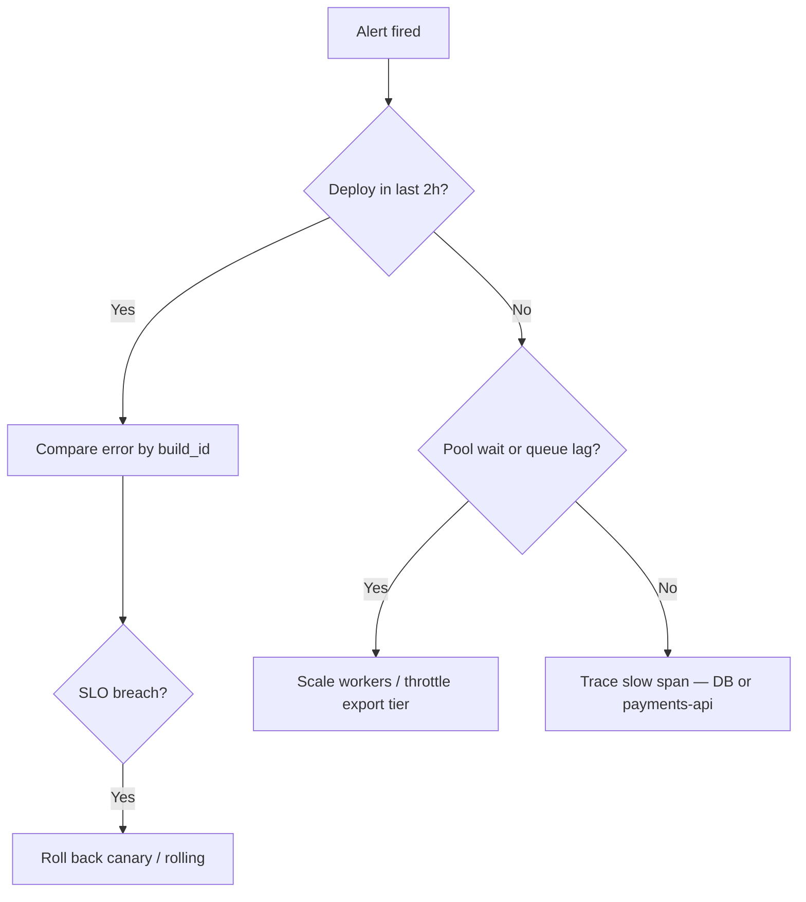

# Incident Runbook — orders-api (example)

Filled example for [RUNBOOK-TEMPLATE.md](RUNBOOK-TEMPLATE.md). Copy structure, replace values for your service.

> **Related:** SLO(Service Level Objective) rollback → [deployment-strategies/includes/13-slo-rollback-triggers.md](deployment-strategies/includes/13-slo-rollback-triggers.md) · Observability → [high-throughput-systems/includes/11-observability.md](high-throughput-systems/includes/11-observability.md) · DR restore → [postgresql-performance/includes/16-backup-restore-and-pitr.md](postgresql-performance/includes/16-backup-restore-and-pitr.md)

---

## Metadata

| Field | Value |
|-------|-------|
| **Service** | orders-api |
| **Owner** | platform-commerce /  |
| **Last tested** | 2026-05-15 (rollback drill) |
| **Severity** | SEV1 if checkout p99 > 2s or 5xx > 1% for 5 min |

---

## Symptoms

- Alert : p99 > 2s on , 
- Alert : 5xx > 1% on checkout routes
- Alert : SQS  depth > 10k for 15 min

**Dashboards:** Grafana  · Datadog 

---

## Triage (first 5 minutes)

| Check | Command / dashboard |
|-------|---------------------|
| Last deploy | Argo CD  ·  metric |
| Error by route | Grafana  by  |
| DB pool wait |  · pool metric  |
| Consumer lag | SQS  approximate age |
| Replication lag |  · lag < 5s SLO(Service Level Objective) |

---

## Mitigation options

| Option | When | Steps |
|--------|------|-------|
| **Rollback deploy** | Error spike matches new  | Argo rollback to previous revision; verify p99 < 500ms |
| **Disable flag** |  correlated | LaunchDarkly disable  |
| **Scale workers** | Queue lag, low 5xx | HPA  max 20 → manual 30 if needed |
| **Rate limit export** | Abuse or partner bulk export | Gateway tier cap; 429 on  |
| **Failover read** | Primary DB CPU saturated | Route session reads to primary only; pause replica reads for dashboards |
| **DB failover** | Primary unavailable | Runbook:  §12 + PG §16 PITR(Point-in-Time Recovery) |

---

## Escalation

| Condition | Escalate to |
|-----------|-------------|
| Payment double-capture suspected | payments team + SEV1 incident commander |
| Data corruption in  table | DBA + engineering lead |
| > 30 min SEV1 unresolved | commerce EM |

---

## Post-incident

- [ ] Timeline in  doc
- [ ] Root cause (5 whys)
- [ ] Action items with owners
- [ ] Update this runbook if steps were wrong
- [ ] Add regression test or alert if gap found

---

## Related guides

| Topic | Link |
|-------|------|
| Rollback triggers | [deployment-strategies §13](deployment-strategies/includes/13-slo-rollback-triggers.md) |
| DR / PITR | [PG §16 backup restore](postgresql-performance/includes/16-backup-restore-and-pitr.md) |
| On-call triage | [HTS §11 observability](high-throughput-systems/includes/11-observability.md) |
| Saga stuck orders | [ES §7 sagas](event-sourcing-and-cqrs/includes/07-sagas-and-distributed-workflows.md) |
