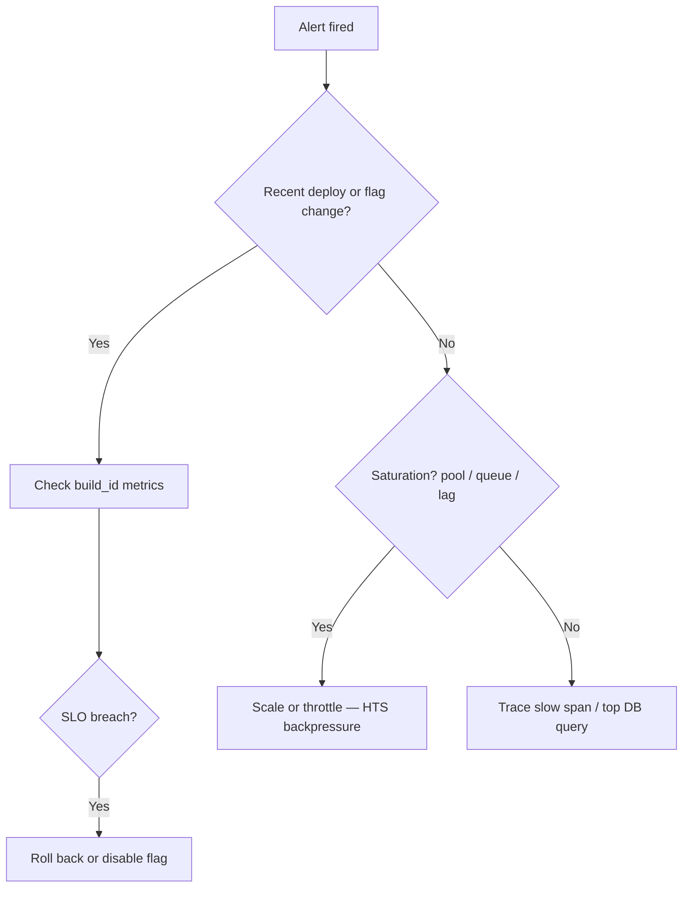

# Incident Runbook Template

Copy this file per service or incident type. Link from observability alerts and deployment runbooks.

See a filled example → [RUNBOOK-EXAMPLE-orders-api.md](RUNBOOK-EXAMPLE-orders-api.md).

> **Related:** SLO(Service Level Objective) rollback → [deployment-strategies/includes/13-slo-rollback-triggers.md](deployment-strategies/includes/13-slo-rollback-triggers.md) · Observability → [high-throughput-systems/includes/11-observability.md](high-throughput-systems/includes/11-observability.md)

---

## Metadata

| Field | Value |
|-------|-------|
| **Service** | _e.g. orders-api_ |
| **Owner** | _team / on-call rotation_ |
| **Last tested** | _YYYY-MM-DD_ |
| **Severity** | _SEV1 / SEV2 / SEV3_ |

---

## Symptoms

What the on-call engineer sees first:

- _e.g. p99 > 2s on `GET /v1/orders`_
- _e.g. 5xx rate > 1%_
- _e.g. queue depth monotonic growth_

**Alert names:** _link to Datadog/Prometheus alert IDs_

---

## Triage (first 5 minutes)

| Check | Command / dashboard |
|-------|---------------------|
| Last deploy | _CI / Argo CD / release dashboard_ |
| Error by route | _API health dashboard_ |
| DB pool wait | _pg_stat_activity / pool metrics_ |
| Consumer lag | _Kafka / SQS dashboard_ |
| Replication lag | _pg_stat_replication_ |

---

## Mitigation options

| Option | When | Steps |
|--------|------|-------|
| **Rollback deploy** | Correlated with new `build_id` | _link to deployment runbook_ |
| **Disable feature flag** | Bad feature, stable binary | _flag name, dashboard_ |
| **Scale horizontally** | CPU OK, queue/lag high | _HPA / manual replica count_ |
| **Enable backpressure** | Overload | _rate limit tier, 429, queue pause_ |
| **Failover DB** | Primary unavailable | _link to DR runbook §12_ |

---

## Escalation

| Condition | Escalate to |
|-----------|-------------|
| Data corruption suspected | DBA + engineering lead |
| Security incident | Security on-call |
| > 30 min SEV1 unresolved | _manager / incident commander_ |

---

## Post-incident

- [ ] Timeline in incident doc
- [ ] Root cause (5 whys)
- [ ] Action items with owners
- [ ] Update this runbook if steps were wrong
- [ ] Add regression test or alert if gap found

---

## Related guides

| Topic | Link |
|-------|------|
| Rollback triggers | [deployment-strategies §13](deployment-strategies/includes/13-slo-rollback-triggers.md) |
| DR restore | [database-connection-and-security §12](database-connection-and-security/includes/12-credential-rotation-and-dr.md) |
| On-call triage order | [high-throughput-systems §11](high-throughput-systems/includes/11-observability.md) |
