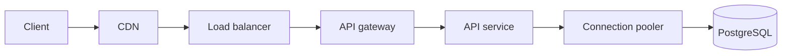
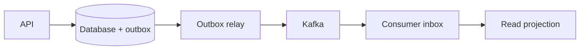
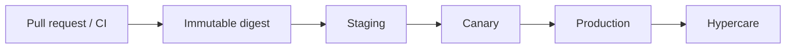
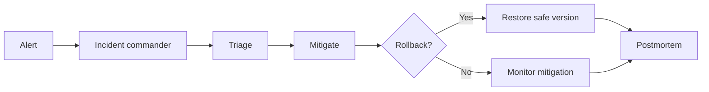
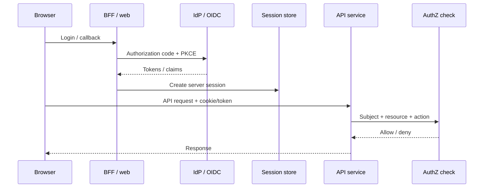
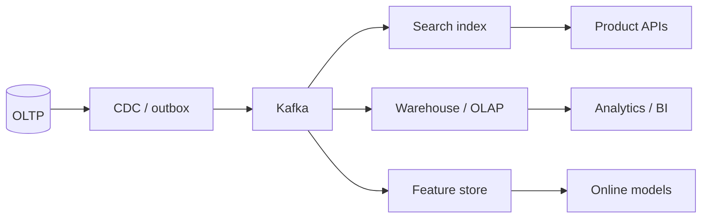
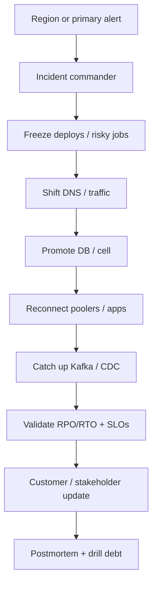
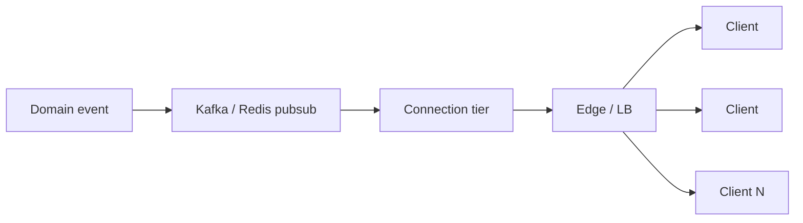
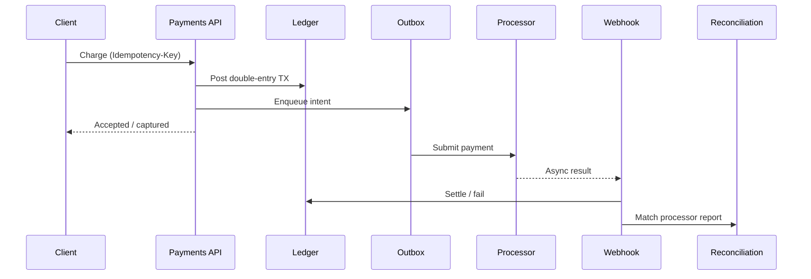

# Visual Index

Nine reusable system spines connect the guides in this corpus. They are intentionally simplified: use the linked sections for security, capacity, and failure behavior.

Guide-to-guide maps (Delivery / Data / Security) live in the root README under [How the guides relate](./README.md#how-the-guides-relate). Prefer the [Visual-first learning path](./README.md#visual-first) when you want pictures before prose.

| Spine | Use when |
|-------|----------|
| [Request path](#request-path) | Sync user request through edge → API → DB |
| [Async write](#async-write) | Reliable publish after a commit |
| [Release](#release) | Ship an immutable artifact to PROD |
| [Incident](#incident) | Stabilize customer impact |
| [Identity](#identity) | Login, session, and AuthZ on the request |
| [Data platform](#data-platform) | OLTP → streams → search / warehouse / features |
| [DR / failover](#dr--failover) | Region or primary is down |
| [Realtime fan-out](#realtime-fan-out) | One event → many open connections |
| [Money movement](#money-movement) | Charge, ledger, processor, reconcile |

---

## Request path

> **Related:** [API gateway request flows](api-design-and-protection/includes/03A-api-gateway-request-flows.md) · [HTS entry and edge](high-throughput-systems/includes/02-entry-and-edge.md) · [DB connection overview](database-connection-and-security/includes/00-overview.md) · [PG read scaling](postgresql-performance/includes/11-read-scaling-and-caching.md) · [Auth cookie/session](auth-oauth-oidc-and-login-security/includes/04-cookie-session-and-csrf.md)

The edge owns public admission and caching; the API owns business deadlines and authorization; the pooler protects PostgreSQL connections. Trace context and remaining deadline should pass through every hop — [HTS §11A OTel](high-throughput-systems/includes/11A-opentelemetry-and-cardinality.md).

---

## Async write

> **Related:** [outbox/inbox](event-sourcing-and-cqrs/includes/05A-outbox-and-inbox.md) · [HTS §14 brokers](high-throughput-systems/includes/14-message-brokers-and-queues.md) · [§14A queue ops](high-throughput-systems/includes/14A-queue-broker-operations.md) · [Kafka](apache-kafka/README.md)

The write and outbox record commit together. Relay and consumer processing are at-least-once; inbox/idempotency makes the projection effect safe under replay.

---

## Release

> **Related:** [CI/CD promotion](cicd-and-environments/includes/02-cd-and-promotion.md) · [Feature→PROD playbook](deployment-strategies/includes/14-feature-to-prod-playbook.md) · [Quality gates](testing-strategy/includes/07-quality-gates.md) · [Hypercare](sre-and-incidents/includes/10A-hypercare-checklist.md)

Promote the same immutable artifact. Canary gates must use user-facing SLO(Service Level Objective) and business signals; hypercare confirms the operational outcome after rollout.

---

## Incident

> **Related:** [Incident command](sre-and-incidents/includes/06-incident-command.md) · [HTS observability](high-throughput-systems/includes/11-observability.md) · [RUNBOOK-TEMPLATE](RUNBOOK-TEMPLATE.md) · [Circuit breakers](resilience-patterns/includes/03-circuit-breakers.md)

Stabilize customer impact before root cause. The IC(Incident Commander) keeps decision ownership and communications explicit; the postmortem turns evidence into follow-up work.

---

## Identity

> **Related:** [OAuth grants](auth-oauth-oidc-and-login-security/includes/01-oauth2-grants-and-flows.md) · [Cookie/session](auth-oauth-oidc-and-login-security/includes/04-cookie-session-and-csrf.md) · [Token lifecycle](auth-oauth-oidc-and-login-security/includes/03-token-lifecycle-and-validation.md) · [Fine-grained AuthZ](api-design-and-protection/includes/12D-fine-grained-authz.md) · [BFF auth UX](fullstack-bff-and-clients/includes/07-auth-ux.md)

AuthN(Authentication) establishes who; AuthZ(Authorization) decides what. Prefer server sessions for first-party web; validate tokens at the API; keep fine-grained AuthZ off the JWT(JSON Web Token) when relationships change often.

---

## Data platform

> **Related:** [OLTP vs OLAP](data-platforms/includes/01-oltp-vs-olap.md) · [CDC and search](high-throughput-systems/includes/15-cdc-and-search-indexing.md) · [Search ops](data-platforms/includes/02A-search-cluster-operations.md) · [Feature stores](specialized-data-systems/includes/03A-feature-stores-and-ml-serving.md) · [Outbox/inbox](event-sourcing-and-cqrs/includes/05A-outbox-and-inbox.md)

Protect the OLTP(Online Transaction Processing) primary: replicate out with CDC(Change Data Capture) or outbox, not ad-hoc dual writes. Each sink owns its lag SLO(Service Level Objective) and backfill story — [data-platforms §8](data-platforms/includes/08-decision-guide.md).

---

## DR / failover

> **Related:** [DR playbook](sre-and-incidents/includes/12A-disaster-recovery-playbook.md) · [Credential rotation and DR](database-connection-and-security/includes/12-credential-rotation-and-dr.md) · [PG backup/PITR](postgresql-performance/includes/16-backup-restore-and-pitr.md) · [HTS multi-region](high-throughput-systems/includes/13-multi-region-read-routing.md) · [Multi-region write](high-throughput-systems/includes/13A-multi-region-write-and-failover.md) · [Kafka DR](apache-kafka/includes/10-operations-dr-security-and-observability.md) · [Cells/residency](architecture-decisions/includes/10A-regional-cells-and-residency.md)

Decide RPO(Recovery Point Objective)/RTO(Recovery Time Objective) before the fire. IC owns the call to promote; DBAs own data promotion; platform owns DNS and deploy freeze. Full swimlane → [sre §12A](sre-and-incidents/includes/12A-disaster-recovery-playbook.md).

---

## Realtime fan-out

> **Related:** [Connection fan-out](realtime-at-scale/includes/01-connection-fanout.md) · [Pub/sub backplanes](realtime-at-scale/includes/02-pubsub-backplanes.md) · [Realtime UX](fullstack-bff-and-clients/includes/05-realtime-ux.md) · [Async streaming](api-design-and-protection/includes/10C-async-streaming.md)

One writer publishes; the connection tier fans out. Drain and reconnect storms are incident classes — [sre](sre-and-incidents/README.md) · [deployment rolling of socket servers](deployment-strategies/README.md).

---

## Money movement

> **Related:** [Double-charge prevention](payments-and-fintech/includes/02-idempotency-and-double-charge.md) · [Ledger](payments-and-fintech/includes/03-ledger-and-double-entry.md) · [Refunds/payouts](payments-and-fintech/includes/03A-refunds-payouts-settlement.md) · [Fraud/recon](payments-and-fintech/includes/04-fraud-and-reconciliation.md) · [Sagas](event-sourcing-and-cqrs/includes/07-sagas-and-distributed-workflows.md)

Money paths need stronger idempotency than generic CRUD(Create, Read, Update, Delete). Ledger truth first; processor is an adapter; reconciliation closes the loop.
