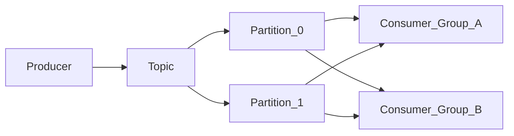

# Overview — Apache Kafka

Apache Kafka is a **distributed commit log**: producers append records to topic partitions; consumers read in order, at their own pace, and can replay history within retention.

> **Related:** When streaming beats queues → [HTS §7 streaming](../../high-throughput-systems/includes/07-streaming-pipelines.md) · Broker selection → [HTS §14 message brokers](../../high-throughput-systems/includes/14-message-brokers-and-queues.md) · Outbox integration → [ES §5 async integration](../../event-sourcing-and-cqrs/includes/05-async-integration.md)

---

## At a glance

| | **Task queue (SQS, RabbitMQ)** | **Apache Kafka** |
|--|-------------------------------|------------------|
| **Model** | Message consumed → removed (or acked away) | Append-only log; retention window |
| **Fan-out** | Duplicate publish or bridge | Native — multiple consumer groups |
| **Replay** | Limited unless stored elsewhere | Yes — reset offset or new group |
| **Ordering** | Per queue / FIFO(First In, First Out) shard | Per partition key |
| **Best for** | Jobs, retries, DLQ(Dead Letter Queue) | Event bus, CDC(Change Data Capture), audit, analytics |

**Rule of thumb:** Use Kafka when **many subscribers** need the **same history**, volume exceeds comfortable API(Application Programming Interface) throughput, or you need a **durable audit log** — not for simple background emails.

---

## Core vocabulary

| Term | Meaning |
|------|---------|
| **Broker** | Server that stores partitions and serves produce/fetch |
| **Topic** | Named stream; logical grouping of partitions |
| **Partition** | Ordered, immutable sequence of records; unit of parallelism |
| **Offset** | Monotonic position of a record within a partition |
| **Consumer group** | Cooperating consumers; each partition assigned to one member |
| **Replication factor** | Copy count per partition across brokers |
| **ISR(In-Sync Replicas)** | Followers caught up with the leader |

---

## Kafka vs database vs queue

| Store | Strength | Weakness for events |
|-------|----------|---------------------|
| **PostgreSQL** | ACID(Atomicity, Consistency, Isolation, Durability), queries, source of truth | Poor fan-out; not an event bus |
| **Redis / SQS(Simple Queue Service)** | Simple job dispatch | No durable shared replay log |
| **Kafka** | High-throughput fan-out + replay | No SQL(Structured Query Language); eventual consistency downstream |

Typical architecture: **PostgreSQL = source of truth** → **outbox or CDC** → **Kafka = integration bus** → consumers update read models, search, analytics.

---

## Document map

| # | Topic | File |
|---|-------|------|
| 1 | Commit log and internals | [01-commit-log-and-internals.md](01-commit-log-and-internals.md) |
| 2 | Topics, partitions, replication | [02-topics-partitions-and-replication.md](02-topics-partitions-and-replication.md) |
| 3 | Producers and delivery | [03-producers-and-delivery-guarantees.md](03-producers-and-delivery-guarantees.md) |
| 4 | Consumers and groups | [04-consumers-and-consumer-groups.md](04-consumers-and-consumer-groups.md) |
| 5 | Retention and compaction | [05-retention-compaction-and-storage.md](05-retention-compaction-and-storage.md) |
| 6 | Serialization and schema | [06-serialization-and-schema-evolution.md](06-serialization-and-schema-evolution.md) |
| 7 | Connect and Streams | [07-connect-streams-and-ecosystem.md](07-connect-streams-and-ecosystem.md) |
| 8 | Integration patterns | [08-integration-patterns.md](08-integration-patterns.md) |
| 9 | Cluster setup | [09-cluster-setup-and-requirements.md](09-cluster-setup-and-requirements.md) |
| 10 | Operations, DR, security | [10-operations-dr-security-and-observability.md](10-operations-dr-security-and-observability.md) |
| 11 | Decision guide | [11-decision-guide-and-common-mistakes.md](11-decision-guide-and-common-mistakes.md) |
| 12 | Testing | [12-testing-and-verification.md](12-testing-and-verification.md) |
| 13 | Failure modes and recovery | [13-failure-modes-troubleshooting-and-recovery.md](13-failure-modes-troubleshooting-and-recovery.md) |

---

## When to read other guides instead

| Question | Read |
|----------|------|
| Should we use Kafka or SQS at all? | [HTS §14](../../high-throughput-systems/includes/14-message-brokers-and-queues.md), [§11 decision guide](11-decision-guide-and-common-mistakes.md) |
| How do we publish reliably after a DB write? | [ES §5 outbox](../../event-sourcing-and-cqrs/includes/05-async-integration.md) |
| How do domain events evolve over years? | [ES §8 schema evolution](../../event-sourcing-and-cqrs/includes/08-event-schema-evolution.md) |
| How do sagas use partition keys? | [ES §7C sagas ops](../../event-sourcing-and-cqrs/includes/07C-sagas-operations.md) |
| CDC to search index | [HTS §15 CDC](../../high-throughput-systems/includes/15-cdc-and-search-indexing.md) |
| Poison pill, DLQ replay, offset recovery | [§13 failure modes](13-failure-modes-troubleshooting-and-recovery.md) |
| Where to store failed messages (DB vs Kafka) | [§8 storage decision](08-integration-patterns.md#where-to-store-messages-recovery-and-retry) |

---

## Common mistakes

| Mistake | Fix |
|---------|-----|
| Kafka as primary database | PostgreSQL (or event store) as source of truth |
| One partition for all traffic | Scale partitions with throughput |
| Skip Schema Registry in prod | Pick format in [§6](06-serialization-and-schema-evolution.md); enforce compatibility |
| No consumer lag monitoring | Alert on lag **growth rate** — [§10](10-operations-dr-security-and-observability.md) |
| No runbook for poison pills / DLQ | [§13 failure modes](13-failure-modes-troubleshooting-and-recovery.md) |