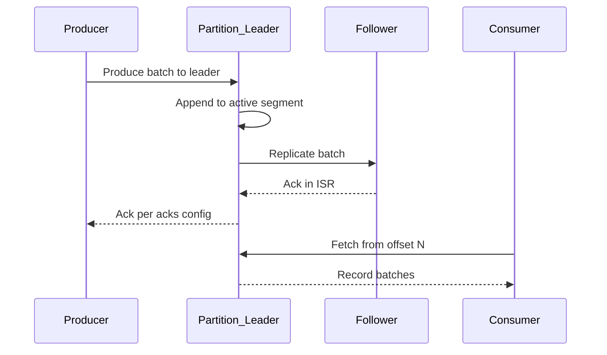

# Commit Log and Internals

Kafka's performance comes from treating a topic partition as an **append-only log on disk** — sequential writes, OS page cache, and minimal random I/O.

> **Related:** LSM write-optimized storage (Streams state) → [tree §4 LSM](../../tree-and-index-structures/includes/04-lsm-trees.md) · Replication → [§2 topics and partitions](02-topics-partitions-and-replication.md)

---

## At a glance

| Layer | Role |
|-------|------|
| **Log segment** | Immutable file chunk (`.log`, `.index`, `.timeindex`) |
| **Broker** | Hosts partition leaders/followers; serves produce and fetch |
| **Controller** | Manages partition leadership, ISR, topic metadata |
| **KRaft** | Built-in consensus (replaces ZooKeeper in modern clusters) |
| **Client** | Producer appends; consumer fetches by offset |

**Rule of thumb:** Kafka is fast because brokers **append sequentially** and consumers **read sequentially** — design payloads and partition counts to preserve that pattern.

---

## Log segments

Each partition is a directory of segment files:

| File | Purpose |
|------|---------|
| `00000000000000000000.log` | Record batch data |
| `00000000000000000000.index` | Offset → byte position in `.log` |
| `00000000000000000000.timeindex` | Timestamp → offset |

When a segment reaches `log.segment.bytes` or age limit, the broker rolls a new segment. Old segments are deleted or compacted per topic policy — see [§5 retention](05-retention-compaction-and-storage.md).

Records are stored in **batches** (magic byte, attributes, timestamp, key, value, headers). Batching amortizes disk and network cost.

---

## Read and write path

| Step | Detail |
|------|--------|
| **Produce** | Leader validates, assigns offset, appends; replicas pull or leader pushes depending on version/config |
| **Replication** | Followers in ISR catch up before `acks=all` succeeds |
| **Fetch** | Consumer sends offset; broker reads from page cache or disk |
| **Zero-copy** | Modern brokers use `sendfile`-style paths where possible |

**Page cache:** Leave RAM for the OS cache — broker JVM heap is often **4–6 GB**, not most of machine RAM. Sequential reads hit cache after warm-up.

---

## Broker roles

| Role | Responsibility |
|------|----------------|
| **Leader** | Handles all reads and writes for a partition |
| **Follower** | Replicates leader log; may become leader on failure |
| **Controller broker** | One broker elected controller — partition reassignment, leader election |
| **KRaft controller quorum** | Separate controller nodes (or combined mode) hold cluster metadata in a Raft log |

---

## KRaft vs ZooKeeper

| | **KRaft (Kafka Raft)** | **ZooKeeper (legacy)** |
|--|------------------------|------------------------|
| **Status** | Default for new clusters (Kafka 3.3+) | Deprecated; migrate to KRaft |
| **Metadata** | Internal Raft topic | External ZK ensemble |
| **Ops** | One system to operate | Two systems (Kafka + ZK) |
| **Quorum** | 3 or 5 controller nodes | 3 or 5 ZK nodes |

**New clusters:** use **KRaft** with odd-sized controller quorum. Co-located controller+broker is OK for smaller deployments; dedicated controllers for large prod.

---

## Controller responsibilities

| Task | Impact if broken |
|------|------------------|
| Leader election | Partition unavailable until new leader |
| ISR maintenance | Under-replicated partitions; risk if `min.insync.replicas` not met |
| Topic create/delete | Admin operations stall |
| Preferred leader balance | Uneven load across brokers |

Controller failover is automatic but causes brief metadata propagation — consumers may rebalance.

---

## Record structure (conceptual)

| Field | Use |
|-------|-----|
| **Key** | Partition routing; compaction identity |
| **Value** | Payload bytes (Avro, Protobuf, JSON, etc.) |
| **Headers** | Metadata without changing payload schema — [§3 headers](03-producers-and-delivery-guarantees.md#message-headers) |
| **Timestamp** | `CreateTime` or `LogAppendTime` |
| **Offset** | Broker-assigned, immutable |

---

## Common mistakes

| Mistake | Fix |
|---------|-----|
| Huge broker JVM heap | Leave RAM for page cache |
| OS disk shared with logs | Dedicated data volumes (SSD/NVMe) |
| Ignoring segment roll config | Tune `log.segment.bytes` for retention granularity |
| Running new prod on ZooKeeper | Plan KRaft — [§9 setup](09-cluster-setup-and-requirements.md) |

---

## Pros and cons

### Append-only log model

**Pros:** Sequential I/O; simple replication (follow the log); natural replay.

**Cons:** No in-place update; compaction and retention policies required; partition count hard to reduce later.
