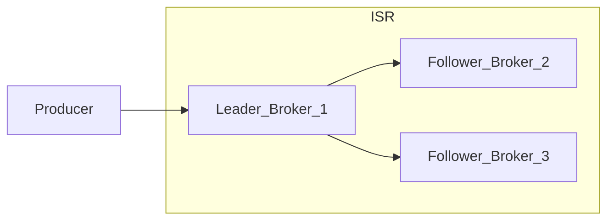

# Topics, Partitions, and Replication

A **topic** is a logical stream split into **partitions** — each partition is an ordered, replicated log. Partition design drives throughput, ordering, and failure behavior.

> **Related:** Multi-tenant API(Application Programming Interface) isolation → [api-design §16](../../api-design-and-protection/includes/16-multi-tenant-apis.md) · Saga partition keys → [ES §7C](../../event-sourcing-and-cqrs/includes/07C-sagas-operations.md) · PG tenant RLS → [PG §17](../../postgresql-performance/includes/17-row-level-security-multi-tenant.md)

---

## At a glance

| Concept | Guarantee |
|---------|-----------|
| **Partition** | Strict order **within** one partition only |
| **Key → partition** | Same key → same partition (hash modulo partition count) |
| **Replication factor (RF)** | Number of physical copies |
| **Leader** | Single broker handles reads/writes per partition |
| **ISR(In-Sync Replicas)** | Replicas within lag bound of leader |
| **`min.insync.replicas`** | Minimum ISR size for `acks=all` produce |

**Rule of thumb:** Choose partition count for **peak parallel consume/produce**, not "as few as possible." Increasing partitions later is easier than decreasing.

---

## Partition key and ordering

| Key choice | Ordering preserved | Risk |
|------------|-------------------|------|
| `order_id` | Per-order lifecycle | Even spread if IDs random |
| `user_id` | Per-user events | Hot user → hot partition |
| `tenant_id` | Per-tenant order | Large tenant saturates one partition |
| `saga_id` | Per-saga commands/events | Required for ordered choreography — [ES §7C](../../event-sourcing-and-cqrs/includes/07C-sagas-operations.md) |
| **null / round-robin** | No cross-record order | Maximum spread |

**Hot partition mitigation:** sub-shard keys (`user_id + bucket`), more partitions, or split high-volume tenants to dedicated topics.

---

## Replication flow

| Setting | Prod recommendation | Why |
|---------|---------------------|-----|
| `replication.factor` | **3** | Survive one broker loss |
| `min.insync.replicas` | **2** | `acks=all` still succeeds with one replica down |
| `unclean.leader.election.enable` | **false** | Avoid data loss from out-of-sync promotion |
| `acks` | **all** (with idempotent producer) | Durability before ack to client |

If ISR shrinks below `min.insync.replicas`, producers with `acks=all` **fail** — intentional fail-closed to prevent silent data loss.

---

## Rack and AZ awareness

| Config | Effect |
|--------|--------|
| `broker.rack` | Broker rack / AZ id |
| `replica.selector.class` + rack-aware assignment | Replicas on different racks |

Survives **AZ failure** without losing quorum of replicas for a partition.

---

## Partition count planning

| Factor | Guidance |
|--------|----------|
| **Target throughput** | More partitions → more parallel consumers (up to partition count per group) |
| **Consumer count** | Max useful consumers in one group = partition count |
| **Broker load** | Each partition = leader + follower files on disk |
| **Shrink partitions** | Not supported — plan ahead |
| **Increase partitions** | Supported; **key order for existing keys unchanged**, new keys may remap |

Rough sizing: start with `(expected_peak_MB_s / per_partition_throughput)` and round up; load-test before prod.

---

## Multi-tenant isolation

Kafka is **not** a tenant authZ layer — enforce tenant in application code and DB ([api §16](../../api-design-and-protection/includes/16-multi-tenant-apis.md)).

| Pattern | Isolation | Tradeoff |
|---------|-----------|----------|
| **Topic per tenant** | Strong; ACL(Access Control List) per topic | Topic explosion; ops overhead at 1000+ tenants |
| **Shared topic, `tenant_id` in key** | Few topics; partition by tenant | Hot tenant → hot partition |
| **Tenant in payload only** | Weakest | Cross-tenant leak if consumer bug; avoid |

| Control | Use |
|---------|-----|
| **ACLs** | Prefix patterns — `Produce` on `tenant-a.*`, `Consume` on specific groups |
| **Quotas** | `producer_byte_rate` / `consumer_byte_rate` per client principal — detail → [§10 quotas](10-operations-dr-security-and-observability.md#client-quotas-and-noisy-neighbor) |
| **App validation** | Every consumer checks `tenant_id` against auth context before side effects |

**Rule:** Match DB tenant isolation ([PG RLS](../../postgresql-performance/includes/17-row-level-security-multi-tenant.md)) in consumer handlers — Kafka ACLs alone are insufficient.

---

## Leader election and availability

| Event | Behavior |
|-------|----------|
| Leader broker dies | Controller elects new leader from ISR |
| Follower lagging | Dropped from ISR until caught up |
| All ISR lost | Partition offline until ops intervention (if unclean election disabled) |

Monitor **under-replicated partitions** and **offline partitions** — [§10](10-operations-dr-security-and-observability.md).

---

## Common mistakes

| Mistake | Fix |
|---------|-----|
| `replication.factor=1` in prod | RF=3 across racks/AZs |
| `acks=1` for financial events | `acks=all` + `min.insync.replicas=2` |
| Global ordering requirement | Single partition (bottleneck) or redesign boundaries |
| Tenant only in payload | Put `tenant_id` in key or strict consumer guards |
| 3 partitions, 20 consumers | Extra consumers idle — add partitions |

---

## Pros and cons

### High partition count

**Pros:** Parallelism; isolates hot keys across more buckets.

**Cons:** More file handles, election overhead, harder ops; empty consumer slots if over-partitioned.