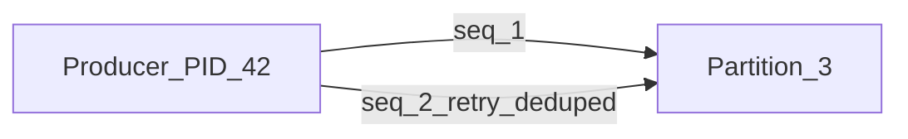
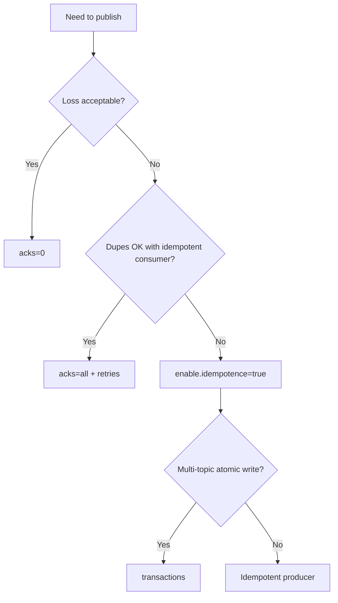

# Producers and Delivery Guarantees

Producers append record batches to partition leaders. Delivery semantics are controlled by **`acks`**, **retries**, **idempotence**, and optionally **transactions**.

> **Related:** Idempotency at API layer → [api-design §13](../../api-design-and-protection/includes/13-idempotency.md) · Consumer side → [§4 consumers](04-consumers-and-consumer-groups.md) · EOS limits → [§8 integration](08-integration-patterns.md)

---

## At a glance

| Guarantee | Config sketch | Duplicate risk |
|-----------|---------------|----------------|
| **At-most-once** | `acks=0` or no retries | No duplicates; may lose |
| **At-least-once** | `acks=1` or `all` + retries | Duplicates on retry |
| **Idempotent produce** | `enable.idempotence=true` | No duplicate **batches** per PID |
| **Transactional** | `transactional.id` + begin/commit | Atomic multi-partition produce; read-process-write with consumer |

**Rule of thumb:** Production defaults: **`enable.idempotence=true`**, **`acks=all`**, **`min.insync.replicas=2`** on topics — then make **consumers idempotent**.

---

## acks

| Value | Behavior | Use |
|-------|----------|-----|
| **`0`** | Fire-and-forget | Metrics where loss OK |
| **`1`** | Leader ack; replication async | Low durability (avoid for critical events) |
| **`all` / `-1`** | All ISR ack | Durable produce |

`acks=all` fails if ISR < `min.insync.replicas` — by design.

---

## Retries and ordering

| Setting | Effect |
|---------|--------|
| `retries` | Retry transient failures |
| `max.in.flight.requests.per.connection` | Pipelines requests; **>1 without idempotence** can reorder on retry |
| `enable.idempotence=true` | Sets safe defaults (acks=all, retries, max.in.flight=5 with ordering per partition) |

Without idempotence, a retry after timeout can produce **duplicate records** — consumers must dedup ([§8 inbox](08-integration-patterns.md)).

---

## Idempotent producer

Broker tracks **Producer ID (PID)** and **sequence number** per partition:



| Property | Limit |
|----------|-------|
| Deduplication scope | Same producer session, same partition |
| Survives | Broker restart if `transactional` / idempotent state retained |
| Does **not** replace | Consumer idempotency or DB unique constraints |

---

## Transactions

| Feature | Use case |
|---------|----------|
| **Multi-partition atomic write** | All-or-nothing publish to several topics |
| **Consume-transform-produce** | Read offset X, write output, commit offsets in one transaction |
| **`transactional.id`** | Fencing zombie producers on restart |

**End-to-end exactly-once (EOS)** within Kafka: transactional producer + read_committed consumer + idempotent sink **or** external idempotent store.

**Outside Kafka:** DB writes still need **outbox** or **inbox** — Kafka transactions do not commit PostgreSQL.

---

## Batching and compression

| Setting | Tradeoff |
|---------|----------|
| `linger.ms` | Wait to fill batch → higher latency, better throughput |
| `batch.size` | Upper bound on batch bytes |
| `compression.type` | `lz4`, `zstd`, `snappy` — CPU vs bandwidth |

Large messages (> ~1 MB default broker limit): store blob in S3, put reference in value — [HTS §7](../../high-throughput-systems/includes/07-streaming-pipelines.md).

---

## Message headers

Headers carry **metadata** without changing the payload schema:

| Header | Purpose |
|--------|---------|
| `correlation_id` | Request tracing across services |
| `traceparent` | W3C trace context — [HTS §11 observability](../../high-throughput-systems/includes/11-observability.md) |
| `saga_id` | Workflow correlation when partition key differs |
| `schema_version` | Optional when not in payload |
| `content-type` | Debug hint (`application/vnd.company.order.v2+avro`) |

**Rule:** **Business fields** in payload (schema-managed); **routing, tracing, workflow ids** in headers. Avoid duplicating the partition key in both unless consumers need it without deserialization.

```text
Key: order-123
Headers: correlation_id=req-abc, traceparent=00-...
Value: { Avro/Protobuf/JSON payload }
```

Producers set headers per record; consumers read before or after value deserialization.

---

## Delivery semantics summary



---

## Common mistakes

| Mistake | Fix |
|---------|-----|
| `acks=1` for domain events | `acks=all` + ISR settings |
| Retries without idempotence | Enable idempotence or dedup consumer |
| Assume EOS to PostgreSQL | Outbox + idempotent consumer |
| Trace id only in payload | Use headers; keep payload schema stable |
| Giant JSON in value | Compress + reference external storage |

---

## Pros and cons

### Idempotent + acks=all

**Pros:** Strong broker-side durability; safe retries.

**Cons:** Higher latency; fails when ISR degraded; still requires consumer dedup for full pipeline.
