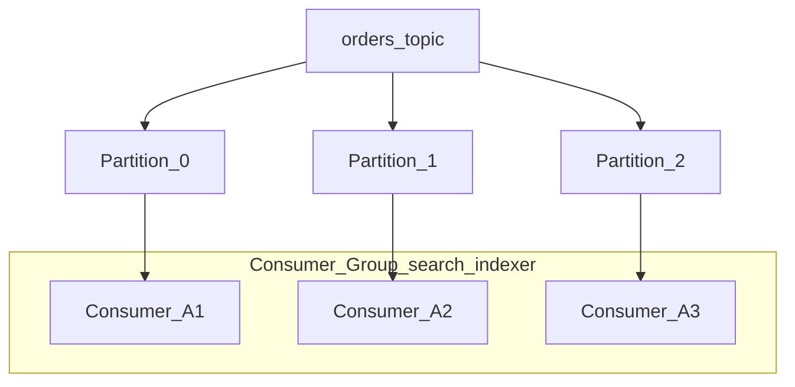

# Consumers and Consumer Groups

Consumers read from partitions at a tracked **offset**. A **consumer group** divides partitions among members so each partition is processed by **one consumer in the group**.

> **Related:** Streaming backpressure → [HTS §7](../../high-throughput-systems/includes/07-streaming-pipelines.md) · Idempotency → [api-design §13](../../api-design-and-protection/includes/13-idempotency.md) · Lag ops → [§10](10-operations-dr-security-and-observability.md)

---

## At a glance

| Rule | Detail |
|------|--------|
| **One consumer per partition per group** | Max parallel consumers in group = partition count |
| **Multiple groups** | Same topic; independent offsets and lag |
| **Offset commit** | Marks progress; auto vs manual tradeoffs |
| **Rebalance** | Partition reassignment when members join/leave |
| **Consumer lag** | Latest offset − committed consumer offset |

**Rule of thumb:** Commit offsets **after** side effects succeed (DB write, webhook sent) — commit-before-write loses data on crash; write-before-commit-without-idempotency duplicates.

---

## Consumer group mechanics

| Component | Role |
|-----------|------|
| **Group coordinator** | Broker managing group membership |
| **`__consumer_offsets` topic** | Stores committed offsets |
| **Group leader consumer** | Assigns partitions (protocol-dependent) |

Adding a 4th consumer to a 3-partition topic: **one consumer idle**.

---

## Rebalance protocols

| Protocol | Behavior |
|----------|----------|
| **Range** | Partitions split by range — can imbalance |
| **Round-robin** | Even spread (older) |
| **Cooperative-sticky** | Incremental rebalance; fewer stop-the-world pauses |

**Static membership** (`group.instance.id`): reduce rebalance churn on rolling deploys — consumer rejoins same instance id.

| Pitfall | Symptom | Fix |
|---------|---------|-----|
| **`max.poll.interval.ms` exceeded** | Slow handler → consumer kicked → rebalance storm | Optimize handler; increase interval cautiously |
| **`session.timeout.ms` too low** | GC pause → false failure | Tune timeout and heartbeat |
| Frequent scale events | Constant rebalance | Static membership; cooperative protocol |

---

## Offset commit strategies

| Mode | Behavior | Risk |
|------|----------|------|
| **Auto commit** | Periodic commit of last polled offset | May commit before processing finishes |
| **Manual sync commit** | Block until broker acks | Slower; clear failure point |
| **Manual async commit** | Non-blocking | Commit order not guaranteed |

**Recommended pattern:**

1. Poll batch
2. Process record (idempotent handler)
3. Commit offset (or commit sync per batch after DB transaction)

For **exactly-once to DB:** same transaction as inbox row or use outbox on producer side — [§8](08-integration-patterns.md).

---

## Consumer lag

| Metric | Meaning |
|--------|---------|
| **Lag per partition** | `log_end_offset - committed_offset` |
| **Growing lag** | Consume rate < produce rate |
| **Lag spike after deploy** | Slow code path or poison message |

Alert on **lag growth rate**, not only absolute lag — [§10](10-operations-dr-security-and-observability.md).

| Action | When |
|--------|------|
| Scale consumers | Lag growing; count < partition count |
| Add partitions | All consumers busy; still behind |
| Optimize handler | CPU-bound per message |
| Pause consumption | Downstream DB outage — protect origin |

---

## Pause, resume, and seek

| API / tool | Use |
|------------|-----|
| **`pause()` / `resume()`** | Stop fetching a partition during downstream outage |
| **`seek()`** | Replay from offset; new projection rebuild |
| **Reset offsets CLI** | Disaster recovery — [§10 DR](10-operations-dr-security-and-observability.md) |

New consumer group with `auto.offset.reset=earliest` replays retention window.

---

## read_committed isolation

When consuming from transactional producers:

| Setting | Effect |
|---------|--------|
| `isolation.level=read_committed` | Hide aborted transaction messages |
| `read_uncommitted` (default) | See all written batches |

Use `read_committed` when upstream uses Kafka transactions.

---

## Multiple consumer groups

| Group | Example use |
|-------|-------------|
| `search-indexer` | OpenSearch projection |
| `analytics` | Warehouse sink |
| `notifications` | Email worker |

Each maintains **independent lag** — slow analytics does not block search if groups are separate.

---

## Common mistakes

| Mistake | Fix |
|---------|-----|
| Auto-commit + DB write | Manual commit after successful write |
| More consumers than partitions | Increase partitions or accept idle consumers |
| Long sync HTTP in poll loop | Async worker pool; respect `max.poll.interval.ms` |
| No idempotency on retry | Dedup table or natural keys — [api §13](../../api-design-and-protection/includes/13-idempotency.md) |
| Single group for unrelated SLAs | Split groups by downstream |

---

## Pros and cons

### Manual commit after processing

**Pros:** Aligns offset with business side effects.

**Cons:** Slower; must handle commit failures and duplicates explicitly.
