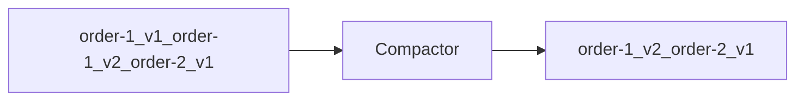

# Retention, Compaction, and Storage

Topics retain data by **time**, **size**, or **compaction policy**. Storage planning ties retention to disk, replay windows, and compliance.

> **Related:** Streaming pipeline sizing → [HTS §7](../../high-throughput-systems/includes/07-streaming-pipelines.md) · Cluster disk → [§9 setup](09-cluster-setup-and-requirements.md)

---

## At a glance

| Policy | Keeps | Deletes |
|--------|-------|---------|
| **Delete (default)** | Records within retention window | Old segments by time/bytes |
| **Compact** | Latest record **per key** | Older versions; tombstones after delay |
| **Compact + delete** | Latest per key + time bound | Combined behavior |

**Rule of thumb:** **Delete** for event streams and audit logs with fixed retention. **Compact** for changelog topics (config, KV state, connector offsets).

---

## Delete retention

| Config | Meaning |
|--------|---------|
| `retention.ms` | Max age of segment |
| `retention.bytes` | Max size per partition |
| `segment.ms` / `segment.bytes` | Roll active segment |

Disk sizing (rough):

```text
storage ≈ produce_rate × avg_message_size × retention_seconds × replication_factor
```

Add headroom for replication, compaction overhead, and growth.

---

## Log compaction

Compaction retains the **latest value for each key** — like an LSM(Log-Structured Merge) merge by key:



| Use case | Example topic |
|----------|---------------|
| **Config / feature flags** | `app-config` |
| **Connector offsets** | `connect-offsets` |
| **KTable changelog** | Kafka Streams internal topics |
| **Entity latest state** | `user-profile-compacted` |

**Tombstones:** record with `value=null` deletes key after `delete.retention.ms`.

---

## Compact vs delete decision

| Need | Policy |
|------|--------|
| Full event history for replay | **Delete** with long retention |
| Only latest state per entity | **Compact** |
| Audit — nothing dropped early | **Delete** + long `retention.ms`; legal hold via mirror |
| GDPR delete user | Tombstone on compacted topic + consumer handling |

Domain event store stays in **PostgreSQL** — Kafka retention is not unlimited archive unless sized and governed.

---

## Tiered storage

| Feature | Benefit |
|---------|---------|
| **Remote storage (S3, etc.)** | Cheaper long retention; local disk hot tier |
| **Fetch from tier** | Transparent to consumers (latency tradeoff) |

Use when retention months/years but local NVMe insufficient — ops complexity increases.

---

## Message size limits

| Limit | Default / guidance |
|-------|-------------------|
| `message.max.bytes` (broker) | ~1 MB default |
| `max.request.size` (producer) | Must align with broker |
| Large payloads | S3/GCS reference in value; metadata in headers |

---

## Topic naming conventions

| Pattern | Example |
|---------|---------|
| `{domain}.{entity}.{event}` | `orders.order.created` |
| `{env}.{domain}...` | `prod.orders.order.created` (if shared cluster) |
| **DLQ(Dead Letter Queue)** | `orders.order.created.dlq` |
| **Retry** | `orders.order.created.retry` |

Full governance rules, enforcement, and CI(Continuous Integration) checks → [§9 topic naming governance](09-cluster-setup-and-requirements.md#topic-naming-governance).

---

## Common mistakes

| Mistake | Fix |
|---------|-----|
| Infinite retention on high-volume topic | Tiered storage or aggregate to warehouse |
| Compact topic without keys | Every record needs key for compaction |
| Undersized disk | Monitor log dir; alert before 80% |
| Compaction for immutable audit | Use delete policy + compliance retention |

---

## Pros and cons

### Log compaction

**Pros:** Bounded storage for keyed state; fast latest-value reads for Streams.

**Cons:** Loses history per key; tombstone timing nuances; not a compliance archive alone.