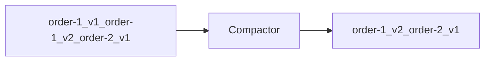
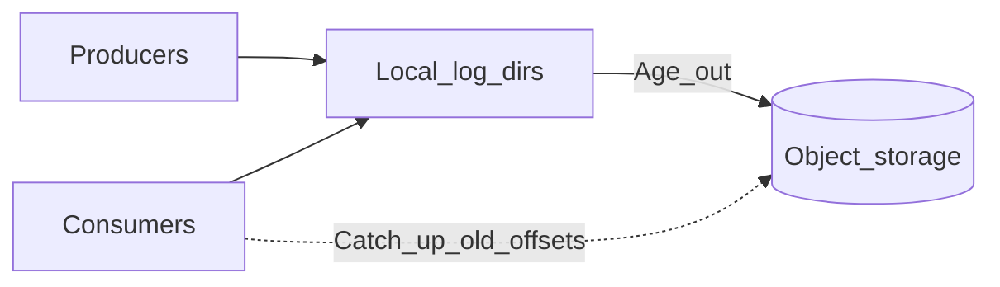

# Retention, Compaction, and Storage

Topics retain data by **time**, **size**, or **compaction policy**. Storage planning ties retention to disk, replay windows, and compliance.

> **Related:** Streaming pipeline sizing → [HTS §7](../../high-throughput-systems/includes/07-streaming-pipelines.md) · Cluster disk → [§9 setup](09-cluster-setup-and-requirements.md) · Audit/PII(Personally Identifiable Information) retention on the bus → [ESC §6](../../enterprise-security-compliance/includes/06-audit-logging-and-retention.md) · [ESC §7](../../enterprise-security-compliance/includes/07-pii-and-data-classification.md) · Storage cost → [finops §4](../../finops-and-cost/includes/04-storage-and-retention-cost.md)

---

## At a glance

| Policy | Keeps | Deletes |
|--------|-------|---------|
| **Delete (default)** | Records within retention window | Old segments by time/bytes |
| **Compact** | Latest record **per key** | Older versions; tombstones after delay |
| **Compact + delete** | Latest per key + time bound | Combined behavior |

**Rule of thumb:** **Delete** for event streams and audit logs with fixed retention. **Compact** for changelog topics (config, KV state, connector offsets).

---

## Delete retention

| Config | Meaning |
|--------|---------|
| `retention.ms` | Max age of segment |
| `retention.bytes` | Max size per partition |
| `segment.ms` / `segment.bytes` | Roll active segment |

Disk sizing (rough):

```text
storage ≈ produce_rate × avg_message_size × retention_seconds × replication_factor
```

Add headroom for replication, compaction overhead, and growth.

---

## Log compaction

Compaction retains the **latest value for each key** — like an LSM(Log-Structured Merge) merge by key:



| Use case | Example topic |
|----------|---------------|
| **Config / feature flags** | `app-config` |
| **Connector offsets** | `connect-offsets` |
| **KTable changelog** | Kafka Streams internal topics |
| **Entity latest state** | `user-profile-compacted` |

**Tombstones:** record with `value=null` deletes key after `delete.retention.ms`.

---

## Compact vs delete decision

| Need | Policy |
|------|--------|
| Full event history for replay | **Delete** with long retention |
| Only latest state per entity | **Compact** |
| Audit — nothing dropped early | **Delete** + long `retention.ms`; legal hold via mirror |
| GDPR delete user | Tombstone on compacted topic + consumer handling |

Domain event store stays in **PostgreSQL** — Kafka retention is not unlimited archive unless sized and governed.

---

## Tiered storage

Keep **hot** segments on local NVMe and age **cold** segments to object storage (S3, GCS, Azure Blob) so retention can stretch to months/years without sizing every broker for full history.

| Layer | Holds | Latency | Cost |
|-------|-------|---------|------|
| **Local (hot)** | Recent segments actively produced/consumed | Low (disk / page cache) | High $/GB |
| **Remote (cold)** | Aged segments past local retention window | Higher (object GET + restore) | Low $/GB |



| When to enable | When to skip |
|----------------|--------------|
| Compliance/audit topics need 90d–1y+ in Kafka itself | Retention ≤ 7–14d fits comfortably on local disk |
| Replay/rebuild windows longer than NVMe budget | Warehouse/lake already lands durable copy within hours |
| Managed offering includes tiered storage with known RPO(Recovery Point Objective) | Team cannot operate restore latency / remote fetch alerts |

### Ops checklist

| Concern | Practice |
|---------|----------|
| **Local retention** | Size hot tier for peak produce + consumer lag buffer — not full topic retention |
| **Remote fetch SLO(Service Level Objective)** | Alert when remote fetch latency or error rate spikes; lag runbooks must mention cold-tier catch-up |
| **Broker disk** | Still alert at 80% local — tiering does not remove hot-path disk risk |
| **Compaction** | Prefer delete-retention topics for long cold history; compacted changelogs stay mostly hot |
| **DR / MM2(MirrorMaker 2)** | Mirror primary cluster; do not assume remote objects alone are your failover — [§10 DR](10-operations-dr-security-and-observability.md) |
| **Cost** | Object storage + GET fees vs shorter Kafka retention + warehouse land — [finops §4](../../finops-and-cost/includes/04-storage-and-retention-cost.md) |

**Rule of thumb:** Tiered storage is for **keeping Kafka as the replay window** cheaper — not a substitute for a governed warehouse archive or WORM(Write Once Read Many) security audit store ([ESC §6](../../enterprise-security-compliance/includes/06-audit-logging-and-retention.md)).

### Pros and cons

**Pros:** Long retention without ballooning broker NVMe; consumers still use normal offsets.

**Cons:** Catch-up from cold tier is slower; more failure modes (object permissions, network); ops must monitor remote fetch health.

---

## Message size limits

| Limit | Default / guidance |
|-------|-------------------|
| `message.max.bytes` (broker) | ~1 MB default |
| `max.request.size` (producer) | Must align with broker |
| Large payloads | S3/GCS reference in value; metadata in headers |

---

## Topic naming conventions

| Pattern | Example |
|---------|---------|
| `{domain}.{entity}.{event}` | `orders.order.created` |
| `{env}.{domain}...` | `prod.orders.order.created` (if shared cluster) |
| **DLQ(Dead Letter Queue)** | `orders.order.created.dlq` |
| **Retry** | `orders.order.created.retry` |

Full governance rules, enforcement, and CI(Continuous Integration) checks → [§9 topic naming governance](09-cluster-setup-and-requirements.md#topic-naming-governance).

---

## Common mistakes

| Mistake | Fix |
|---------|-----|
| Infinite retention on high-volume topic | Tiered storage or aggregate to warehouse |
| Compact topic without keys | Every record needs key for compaction |
| Undersized disk | Monitor log dir; alert before 80% |
| Compaction for immutable audit | Use delete policy + compliance retention |
| Tiered storage as only compliance archive | Land to WORM/warehouse; document Kafka RPO separately |
| Ignoring remote-fetch latency in lag SLOs | Separate hot vs cold catch-up expectations |

---

## Pros and cons

### Log compaction

**Pros:** Bounded storage for keyed state; fast latest-value reads for Streams.

**Cons:** Loses history per key; tombstone timing nuances; not a compliance archive alone.