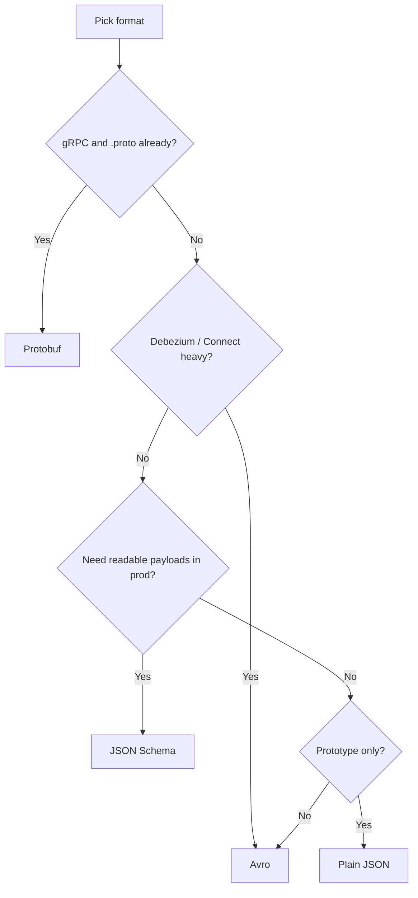
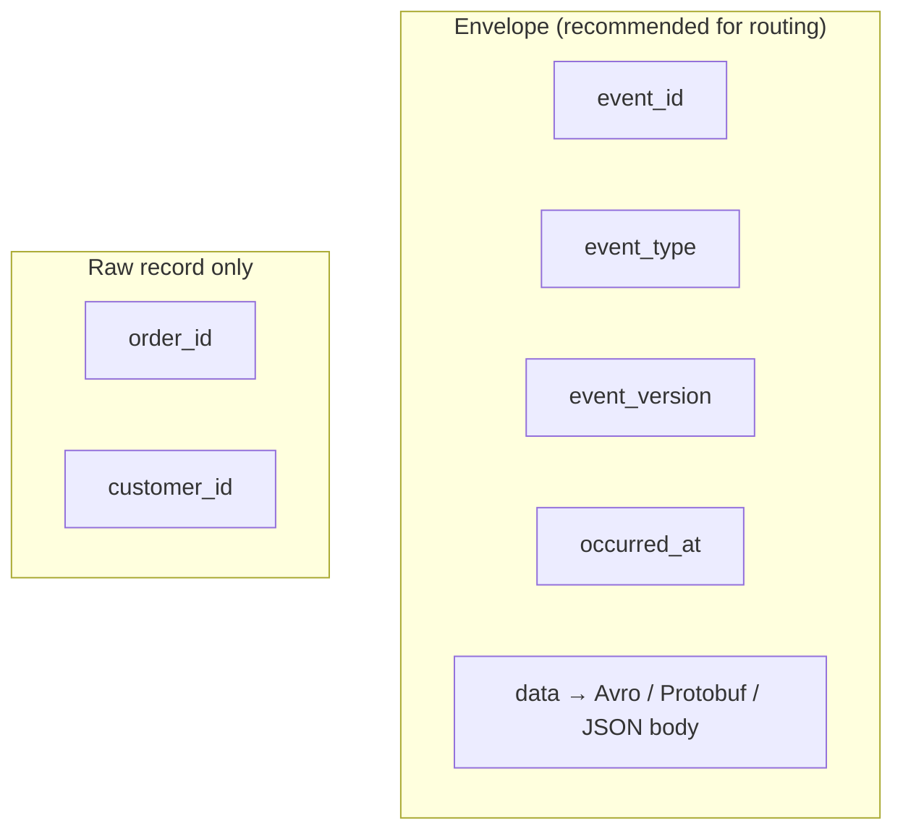
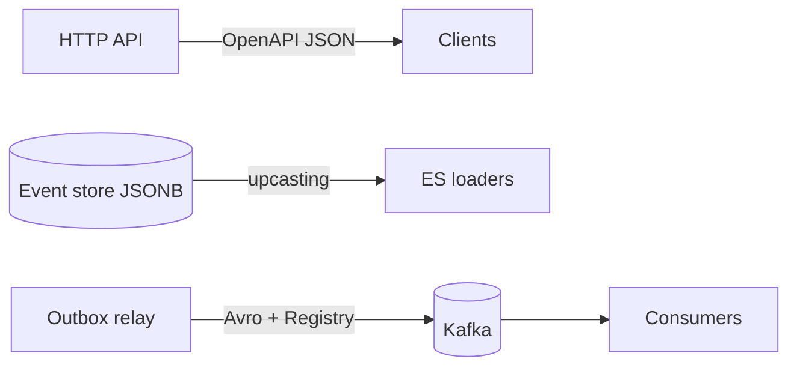

# Serialization and Schema Evolution

Kafka carries opaque bytes — **serializers** turn objects into values and **Schema Registry** (or conventions) govern evolution across producers and consumers.

> **Related:** Domain event evolution → [ES §8](../../event-sourcing-and-cqrs/includes/08-event-schema-evolution.md) · Contract CI(Continuous Integration) → [api-design §15](../../api-design-and-protection/includes/15-contract-and-schema-testing.md) · Testing → [§12](12-testing-and-verification.md)

---

## At a glance

| Layer | Responsibility |
|-------|----------------|
| **Serializer** | Object ↔ bytes on produce/consume |
| **Schema** | Field types, evolution rules |
| **Schema Registry** | Central schema store + compatibility checks |
| **Wire format** | How schema id or bytes prefix the payload |

**Rule of thumb:** Pick one primary format per platform; enforce **backward-compatible** changes by default; run compatibility checks in CI before deploy.

---

## Choosing Avro, Protobuf, JSON Schema, or plain JSON

| Format | Strengths | Weaknesses | Typical fit |
|--------|-----------|------------|-------------|
| **Plain JSON** | Human-readable; zero tooling | No enforcement; large on wire; fragile evolution | Local dev, low-volume internal |
| **JSON Schema** | JSON ecosystem; readable | Larger than binary; tooling varies | Teams on OpenAPI / JSON Schema already |
| **Avro** | Compact; excellent Registry integration; evolvable with defaults | Less natural in protobuf-first shops | Kafka + Connect/Debezium; analytics |
| **Protobuf** | Strong types; gRPC(Google Remote Procedure Call) interop; compact | Evolution rules differ; subject naming discipline | gRPC services → Kafka; `.proto` as source of truth |



**Default recommendation:** **Avro + Schema Registry** for polyglot event buses unless the org standard is Protobuf.

---

## Confluent wire format

Most Registry-integrated serializers prepend:

| Byte | Content |
|------|---------|
| 0 | Magic byte (`0x0`) |
| 1–4 | Schema ID (big-endian int) |
| 5+ | Serialized payload |

Consumers fetch schema by ID from Registry — payload stays compact without embedded full schema.

**Raw Protobuf/JSON** without Registry is valid but shifts evolution burden entirely to code deployment.

---

## Schema Registry essentials

| Concept | Detail |
|---------|--------|
| **Subject** | Usually `{topic-name}-value` or `{topic-name}-key` |
| **Version** | Incremented on registered schema change |
| **Compatibility** | Gate for allowed registrations |

### Compatibility modes

| Mode | Allows | Safe for |
|------|--------|----------|
| **BACKWARD** | New schema reads old data | Deploy consumer before producer |
| **FORWARD** | Old schema reads new data | Deploy producer before consumer |
| **FULL** | Both directions | Rolling deploy either order |
| **TRANSITIVE** | Full across all history versions | Strict pipelines |

Default prod: **`BACKWARD`** or **`FULL`** on value subjects.

---

## Evolution rules by format

### Avro

| Change | Safe? |
|--------|-------|
| Add field **with default** | Yes (backward) |
| Remove optional field | Often yes with care |
| Rename field | No — add new, deprecate old |
| Change type | No |

Use unions `"type": ["null", "string"]` for optional fields.

### Protobuf

| Change | Safe? |
|--------|-------|
| Add new field number | Yes (unknown fields ignored) |
| **`reserved`** deprecated numbers/names | Prevents reuse accidents |
| Change wire type of field number | No |
| Rename field | OK (number matters) |

Use `buf breaking` or similar in CI — [§12](12-testing-and-verification.md).

### JSON Schema

| Change | Safe? |
|--------|-------|
| Add optional property | Yes with `additionalProperties` policy |
| Remove required property | Breaking |
| Tighten types | Breaking |

---

## Naming conventions

Topic names → [§5 topic naming](05-retention-compaction-and-storage.md#topic-naming-conventions). This section covers **schema subjects**, **record shapes**, and **field names**.

### Schema Registry subjects

| Strategy | Subject name | When |
|----------|--------------|------|
| **TopicNameStrategy** (default) | `{topic}-value`, `{topic}-key` | One event type per topic — **recommended** |
| **RecordNameStrategy** | `com.example.order.OrderCreated` | Multiple event types on one topic |
| **TopicRecordNameStrategy** | `{topic}.com.example.order.OrderCreated` | Multi-type topic + explicit Avro record names |

**Rule of thumb:** One event type per topic + `TopicNameStrategy` — simplest ACLs, CI, and ops.

### Avro record naming

```json
{
  "type": "record",
  "name": "OrderCreated",
  "namespace": "com.example.commerce.order",
  "fields": [
    { "name": "order_id", "type": "string" },
    { "name": "created_at", "type": "long", "logicalType": "timestamp-millis" }
  ]
}
```

| Element | Convention | Example |
|---------|------------|---------|
| **Record name** | PascalCase, past tense | `OrderCreated`, `PaymentFailed` |
| **Namespace** | Reverse-DNS(Domain Name System) + domain | `com.example.commerce.order` |
| **Field names** | `snake_case` | `order_id`, `customer_id` |
| **Enums** | PascalCase type; `UPPER` values | `OrderStatus.PENDING` |
| **Optional fields** | Union with `null` + default | `["null", "string"]`, `"default": null` |

### Protobuf naming

| Element | Convention |
|---------|------------|
| **Package** | Lowercase dot-separated | `commerce.order` |
| **Message** | PascalCase, past tense | `OrderCreated` |
| **Fields** | `snake_case` | `order_id = 1` |
| **Field numbers** | Never change or reuse — use `reserved` |

Use `buf lint` in CI — [§12](12-testing-and-verification.md).

### JSON Schema / JSON payloads

Pick **one** casing convention per bounded context and match your HTTP(Hypertext Transfer Protocol) API(Application Programming Interface):

| If HTTP API uses… | Event JSON uses… |
|-------------------|------------------|
| `snake_case` (common in REST(Representational State Transfer)) | `snake_case` |
| `camelCase` (OpenAPI default in some stacks) | `camelCase` |

Never mix casings in the same schema or envelope.

---

## Event envelope vs raw payload



| Approach | When |
|----------|------|
| **Raw Avro/Protobuf record** | One type per topic; `TopicNameStrategy`; simplest path |
| **Envelope wrapper** | Multiple routers, audit fields, or alignment with HTTP webhooks |
| **CloudEvents** | Cross-vendor portability, serverless triggers, partner integrations |

### Recommended envelope (aligns with HTTP webhooks)

Same shape as [api §10B webhook payload](../../api-design-and-protection/includes/10B-async-webhooks.md#webhook-payload) — one mental model for push and bus:

```json
{
  "event_id": "evt_9f2a",
  "event_type": "commerce.order.created",
  "event_version": 1,
  "occurred_at": "2026-06-14T18:30:00Z",
  "data": {
    "order_id": "ord_abc123",
    "customer_id": "cus_xyz",
    "total_amount_cents": 9999,
    "currency": "USD"
  }
}
```

| Field | Purpose |
|-------|---------|
| `event_id` | Consumer dedup / idempotency — [api §13](../../api-design-and-protection/includes/13-idempotency.md) |
| `event_type` | Routing, deserialization, upcasting — [ES §8](../../event-sourcing-and-cqrs/includes/08-event-schema-evolution.md) |
| `event_version` | Schema version for upcaster chain |
| `occurred_at` | Business time (not Kafka broker timestamp) |
| `data` | Domain payload — Avro/Protobuf/JSON Schema applies here |

Put `event_id`, `event_type`, and `event_version` in **Kafka headers** when the value is a compact Avro record; use a full JSON envelope when partners need readable payloads.

### CloudEvents

[CloudEvents](https://cloudevents.io/) is a CNCF standard envelope — use when events cross cloud boundaries or tools expect `specversion` / `source` / `type`:

```json
{
  "specversion": "1.0",
  "id": "evt_9f2a",
  "type": "commerce.order.created",
  "source": "/commerce/order-service",
  "time": "2026-06-14T18:30:00Z",
  "datacontenttype": "application/avro",
  "data": "<serialized payload or base64>"
}
```

Map `type` ↔ `event_type`, `id` ↔ `event_id`, `time` ↔ `occurred_at`. Prefer CloudEvents when integrating with Knative, Azure Event Grid, or partner SDKs; use the simpler envelope above for internal-only buses.

---

## Field-level rules

| Topic | Recommendation |
|-------|----------------|
| **Timestamps** | Avro/Protobuf: `long` millis UTC + `logicalType`; JSON: ISO 8601 `…Z` |
| **Money** | `long` minor units + `currency` string — never `float` / `double` |
| **IDs** | `string` with documented prefix (`ord_`, `cus_`, `evt_`) |
| **Large blobs** | S3/GCS URI in value; metadata only on the bus — [§5 message size limits](05-retention-compaction-and-storage.md#message-size-limits) |
| **PII(Personally Identifiable Information)** | Separate topic or field-level encryption; document in schema description |
| **Deletes** | Explicit tombstone or `*.deleted` event — not silent omission |

---

## Domain events vs transport schema

Two contracts, one domain — do not conflate them:



| Layer | Contract | Format | Guide |
|-------|----------|--------|-------|
| **HTTP API** | Request/response | OpenAPI / JSON | [api §7](../../api-design-and-protection/includes/07-openapi-swagger.md) |
| **Event store** | Immutable history | JSONB + `schema_version` | [ES §8](../../event-sourcing-and-cqrs/includes/08-event-schema-evolution.md) |
| **Kafka bus** | Wire payload | Avro / Protobuf + Registry | This section |
| **Webhooks** | Partner push | JSON envelope | [api §10B](../../api-design-and-protection/includes/10B-async-webhooks.md) |
| **Contract CI** | All of the above | Spectral, Registry compat, Pact | [api §15](../../api-design-and-protection/includes/15-contract-and-schema-testing.md) |

Use the **same `event_type` string** (`commerce.order.created`) across store metadata, Kafka headers, and webhooks. Store `schema_version` in payload, header, or envelope; align deploy order with Registry compatibility mode.

---

## Multi-format clusters

Allowed but costly:

| Situation | Mitigation |
|-----------|------------|
| Topic A = Avro, Topic B = Protobuf | Document per-topic; separate CI checks |
| Migration Avro → Protobuf | Dual-write or new topic + consumer cutover |
| External partners | Dedicated subjects; `FORWARD` compatibility |

---

## Common mistakes

| Mistake | Fix |
|---------|-----|
| Breaking schema without CI gate | Registry compatibility + [api §15](../../api-design-and-protection/includes/15-contract-and-schema-testing.md) |
| Schema only in producer repo | Register in Registry; version in subject |
| Plain JSON in prod high-volume | Avro or Protobuf + compression |
| Mix formats without topic docs | Topic catalog with serializer type |
| Rename Avro field | Add new field; upcast in ES loader if event store |
| Mix `camelCase` and `snake_case` in one schema | Pick one convention per bounded context |
| `double` for currency | `long` cents + `currency` field |
| No envelope metadata on multi-type topics | `event_type` header or CloudEvents wrapper |

---

## Pros and cons

### Avro + Schema Registry

**Pros:** Compact; mature Kafka tooling; enforced evolution.

**Cons:** Operational dependency on Registry HA; learning curve for schema authors.