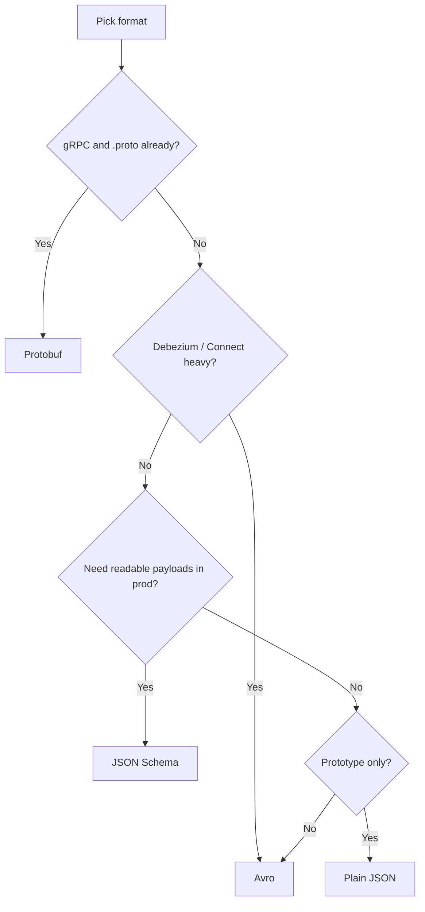

# Serialization and Schema Evolution

Kafka carries opaque bytes — **serializers** turn objects into values and **Schema Registry** (or conventions) govern evolution across producers and consumers.

> **Related:** Domain event evolution → [ES §8](../../event-sourcing-and-cqrs/includes/08-event-schema-evolution.md) · Contract CI → [api-design §15](../../api-design-and-protection/includes/15-contract-and-schema-testing.md) · Testing → [§12](12-testing-and-verification.md)

---

## At a glance

| Layer | Responsibility |
|-------|----------------|
| **Serializer** | Object ↔ bytes on produce/consume |
| **Schema** | Field types, evolution rules |
| **Schema Registry** | Central schema store + compatibility checks |
| **Wire format** | How schema id or bytes prefix the payload |

**Rule of thumb:** Pick one primary format per platform; enforce **backward-compatible** changes by default; run compatibility checks in CI before deploy.

---

## Choosing Avro, Protobuf, JSON Schema, or plain JSON

| Format | Strengths | Weaknesses | Typical fit |
|--------|-----------|------------|-------------|
| **Plain JSON** | Human-readable; zero tooling | No enforcement; large on wire; fragile evolution | Local dev, low-volume internal |
| **JSON Schema** | JSON ecosystem; readable | Larger than binary; tooling varies | Teams on OpenAPI / JSON Schema already |
| **Avro** | Compact; excellent Registry integration; evolvable with defaults | Less natural in protobuf-first shops | Kafka + Connect/Debezium; analytics |
| **Protobuf** | Strong types; gRPC interop; compact | Evolution rules differ; subject naming discipline | gRPC services → Kafka; `.proto` as source of truth |

**Default recommendation:** **Avro + Schema Registry** for polyglot event buses unless the org standard is Protobuf.

---

## Confluent wire format

Most Registry-integrated serializers prepend:

| Byte | Content |
|------|---------|
| 0 | Magic byte (`0x0`) |
| 1–4 | Schema ID (big-endian int) |
| 5+ | Serialized payload |

Consumers fetch schema by ID from Registry — payload stays compact without embedded full schema.

**Raw Protobuf/JSON** without Registry is valid but shifts evolution burden entirely to code deployment.

---

## Schema Registry essentials

| Concept | Detail |
|---------|--------|
| **Subject** | Usually `{topic-name}-value` or `{topic-name}-key` |
| **Version** | Incremented on registered schema change |
| **Compatibility** | Gate for allowed registrations |

### Compatibility modes

| Mode | Allows | Safe for |
|------|--------|----------|
| **BACKWARD** | New schema reads old data | Deploy consumer before producer |
| **FORWARD** | Old schema reads new data | Deploy producer before consumer |
| **FULL** | Both directions | Rolling deploy either order |
| **TRANSITIVE** | Full across all history versions | Strict pipelines |

Default prod: **`BACKWARD`** or **`FULL`** on value subjects.

---

## Evolution rules by format

### Avro

| Change | Safe? |
|--------|-------|
| Add field **with default** | Yes (backward) |
| Remove optional field | Often yes with care |
| Rename field | No — add new, deprecate old |
| Change type | No |

Use unions `"type": ["null", "string"]` for optional fields.

### Protobuf

| Change | Safe? |
|--------|-------|
| Add new field number | Yes (unknown fields ignored) |
| **`reserved`** deprecated numbers/names | Prevents reuse accidents |
| Change wire type of field number | No |
| Rename field | OK (number matters) |

Use `buf breaking` or similar in CI — [§12](12-testing-and-verification.md).

### JSON Schema

| Change | Safe? |
|--------|-------|
| Add optional property | Yes with `additionalProperties` policy |
| Remove required property | Breaking |
| Tighten types | Breaking |

---

## Domain events vs transport schema

| Concern | Guide |
|---------|-------|
| **Event store immutability, upcasting** | [ES §8](../../event-sourcing-and-cqrs/includes/08-event-schema-evolution.md) |
| **Kafka payload format, Registry** | This section |
| **API contract testing** | [api §15](../../api-design-and-protection/includes/15-contract-and-schema-testing.md) |

Store `schema_version` in payload or header; align deploy order with compatibility mode.

---

## Multi-format clusters

Allowed but costly:

| Situation | Mitigation |
|-----------|------------|
| Topic A = Avro, Topic B = Protobuf | Document per-topic; separate CI checks |
| Migration Avro → Protobuf | Dual-write or new topic + consumer cutover |
| External partners | Dedicated subjects; `FORWARD` compatibility |

---

## Common mistakes

| Mistake | Fix |
|---------|-----|
| Breaking schema without CI gate | Registry compatibility + [api §15](../../api-design-and-protection/includes/15-contract-and-schema-testing.md) |
| Schema only in producer repo | Register in Registry; version in subject |
| Plain JSON in prod high-volume | Avro or Protobuf + compression |
| Mix formats without topic docs | Topic catalog with serializer type |
| Rename Avro field | Add new field; upcast in ES loader if event store |

---

## Pros and cons

### Avro + Schema Registry

**Pros:** Compact; mature Kafka tooling; enforced evolution.

**Cons:** Operational dependency on Registry HA; learning curve for schema authors.
