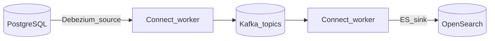

# Connect, Streams, and Ecosystem

Beyond custom producers/consumers, **Kafka Connect** integrates external systems and **Kafka Streams** builds stream processing with embedded state.

> **Related:** LSM(Log-Structured Merge) state stores → [tree §4 LSM](../../tree-and-index-structures/includes/04-lsm-trees.md) · CDC(Change Data Capture) → [§8 integration](08-integration-patterns.md) · Mirror/DR → [§10 DR](10-operations-dr-security-and-observability.md)

---

## At a glance

| Tool | Best for |
|------|----------|
| **Custom consumer/producer** | Full control; simple one-off |
| **Kafka Connect** | JDBC, S3, Debezium CDC, Elasticsearch sinks |
| **Kafka Streams** | Stateful transforms, joins, aggregations in JVM |
| **MirrorMaker 2** | Cross-cluster replication |
| **ksqlDB / Flink** | SQL(Structured Query Language) or large-scale stream processing (external) |

**Rule of thumb:** Use **Connect** for **integration** (DB ↔ Kafka). Use **Streams** when processing stays in Kafka and needs **local state**. Use **Flink** when Connect/Streams cannot scale the logic.

---

## Kafka Connect

| Concept | Role |
|---------|------|
| **Connector** | Source or sink plugin (Debezium, S3, JDBC) |
| **Task** | Parallel units of connector work |
| **Worker** | JVM running connectors |
| **SMT(Simple Message Transform)** | Lightweight map/filter in pipeline |
| **Dead letter queue** | Route failed records to DLQ(Dead Letter Queue) topic — config detail in [§8 DLQ](08-integration-patterns.md#retry-and-dlq-deep-dive) |

### When Connect

| Scenario | Connect? |
|----------|----------|
| Debezium CDC | Yes — standard path — [HTS §15](../../high-throughput-systems/includes/15-cdc-and-search-indexing.md) |
| Copy topic → S3 archive | Yes — S3 sink |
| Complex business rules | Custom consumer often clearer |
| Non-JVM team owns logic | Custom consumer in their language |

Run Connect workers **separate from brokers** in production — [§9 setup](09-cluster-setup-and-requirements.md).

---

## Kafka Streams

| Feature | Detail |
|---------|------|
| **Topology** | DAG(Directed Acyclic Graph) of processors |
| **State stores** | RocksDB-backed changelog topics (LSM) — [tree §4](../../tree-and-index-structures/includes/04-lsm-trees.md) |
| **Exactly-once** | `processing.guarantee=exactly_once_v2` (broker + Streams cooperation) |
| **Repartition topics** | Created automatically for key changes |

### When Streams

| Fit | Misfit |
|-----|--------|
| Join two Kafka topics | Heavy ML inference |
| Session windows, aggregations | Non-JVM stack requirement |
| Compact changelog for KTable | Cross-region active-active (prefer Flink + careful design) |

---

## MirrorMaker 2 (MM2)

| Capability | Use |
|------------|-----|
| Topic replication | DR standby cluster — [§10 DR](10-operations-dr-security-and-observability.md) |
| Offset sync | Consumer failover planning |
| Bidirectional | Multi-region (complex — conflict handling manual) |

MM2 is **async** — RPO(Recovery Point Objective) > 0; not a synchronous dual-write.

---

## Ecosystem map

| Component | Purpose |
|-----------|---------|
| **Schema Registry** | Schemas for Connect converters — [§6](06-serialization-and-schema-evolution.md) |
| **REST(Representational State Transfer) Proxy** | HTTP(Hypertext Transfer Protocol) produce/consume (limited; not primary API(Application Programming Interface)) |
| **Cruise Control** | Rebalance partitions, broker maintenance |
| **Redpanda / WarpStream** | Kafka-compatible APIs; different ops model |

---

## Connect vs custom consumer

| Factor | Connect | Custom |
|--------|---------|--------|
| Time to integrate DB/ES | Fast | Slower |
| Operational surface | Connector version + worker | Your code only |
| Transform logic | SMTs (limited) | Full language |
| Team skills | Config-heavy | Code-heavy |

---

## Common mistakes

| Mistake | Fix |
|---------|-----|
| Connect on broker JVM | Dedicated worker cluster |
| Streams state without changelog backup | Monitor changelog topics; RF=3 |
| MM2 as active-active without idempotency | Design consumers idempotent; accept lag |
| SMT doing heavy enrichment | Stream processing app or consumer |

---

## Pros and cons

### Kafka Connect

**Pros:** Reusable connectors; ops model for integrations; Debezium maturity.

**Cons:** Worker scaling and connector bugs; SMTs tempt logic in config.