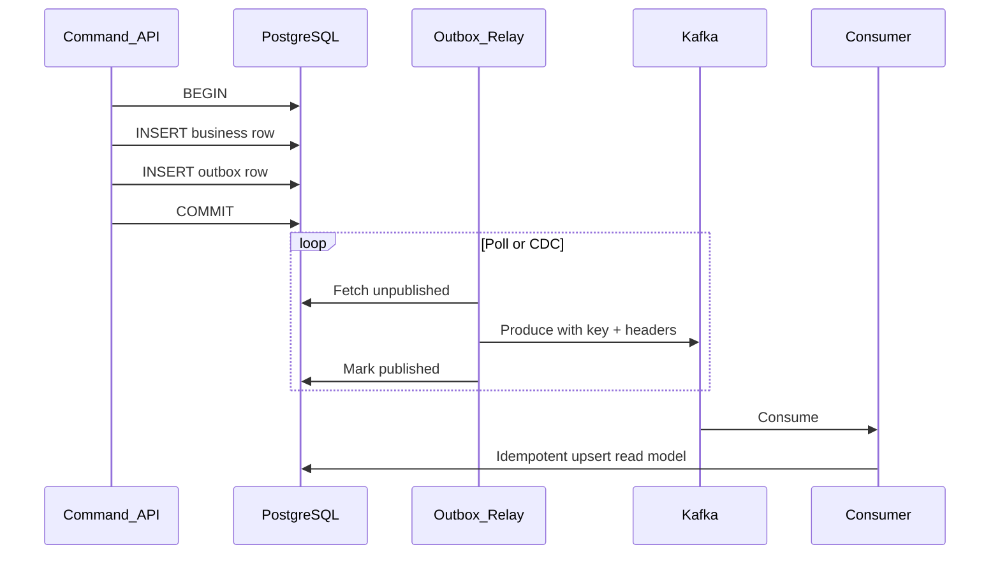
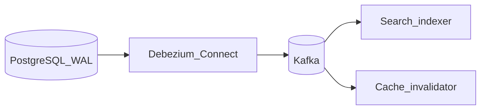

# Integration Patterns

Production Kafka usage almost always sits **between** a durable write (database or event store) and **idempotent consumers** — not as a lone source of truth.

> **Related:** Outbox detail → [ES §5 async integration](../../event-sourcing-and-cqrs/includes/05-async-integration.md) · CDC pipeline → [HTS §15 CDC](../../high-throughput-systems/includes/15-cdc-and-search-indexing.md) · Async API hub → [api-design §10](../../api-design-and-protection/includes/10-async-patterns.md) · Idempotency → [api-design §13](../../api-design-and-protection/includes/13-idempotency.md)

---

## At a glance

| Pattern | Solves |
|---------|--------|
| **Transactional outbox** | Reliable publish after DB commit |
| **CDC (Debezium)** | Capture DB changes without app dual-write |
| **Inbox (consumer dedup)** | At-least-once → effective once |
| **Partition by saga_id** | Ordered saga steps |
| **Retry / DLQ topics** | Poison message isolation |
| **Headers** | Tracing and correlation without schema churn |

**Rule of thumb:** Never **dual-write** DB + Kafka in one request without outbox or CDC — crash between steps causes drift.

---

## Transactional outbox → Kafka



| Relay | Pros | Cons |
|-------|------|------|
| **Polling app** | Simple | DB load; slight lag |
| **Debezium on outbox table** | Low lag | Connector ops |
| **In-process after commit** | Dev only | Not crash-safe |

Full SQL and architecture → [ES §5](../../event-sourcing-and-cqrs/includes/05-async-integration.md).

**Produce settings:** idempotent producer, `acks=all`, partition key = `aggregate_id` or `tenant_id`.

---

## CDC with Debezium



| Path | When |
|------|------|
| **CDC** | Many tables; near-real-time; app unchanged |
| **Outbox** | Explicit domain events; control payload shape |

Pipeline detail → [HTS §15](../../high-throughput-systems/includes/15-cdc-and-search-indexing.md).

---

## Saga and workflow ordering

| Requirement | Kafka mechanism |
|-------------|-----------------|
| All saga events ordered together | **Partition key = `saga_id`** |
| Command routing | Header `saga_id` + correlation_id when key is entity id |
| Cross-partition sagas | Orchestrator or choreography with idempotent steps — [ES §7](../../event-sourcing-and-cqrs/includes/07-sagas-and-distributed-workflows.md) |

---

## Inbox pattern (consumer dedup)

```text
BEGIN;
  INSERT INTO inbox (message_id, ...) ON CONFLICT DO NOTHING;
  -- if inserted: apply side effect
  UPDATE read_model ...;
COMMIT;
commit Kafka offset;
```

Pairs with at-least-once delivery — [ES §7C inbox](../../event-sourcing-and-cqrs/includes/07C-sagas-operations.md#inbox-pattern-consumer-dedup).

---

## Headers in integration flows

| Header | Set by | Read by |
|--------|--------|---------|
| `correlation_id` | API / outbox relay | All consumers; tracing |
| `traceparent` | API gateway or service | Observability — [HTS §11](../../high-throughput-systems/includes/11-observability.md) |
| `saga_id` | Saga orchestrator | Downstream saga participants |
| `event_type` | Outbox relay | Router consumers (optional if in payload) |
| `schema_version` | Producer | Consumer upcaster selection |

Keep **tenant_id** in payload for schema validation; optionally duplicate in key for partition isolation — [§2 multi-tenant](02-topics-partitions-and-replication.md#multi-tenant-isolation).

---

## Retry and DLQ

| Stage | Pattern |
|-------|---------|
| Transient failure | Retry topic with backoff header or delayed republish |
| Max retries exceeded | **DLQ topic** + alert |
| Bad schema | Fix producer; do not infinite retry |
| Downstream outage | Pause consumer partition — [§4](04-consumers-and-consumer-groups.md) |

Naming: `{source-topic}.retry`, `{source-topic}.dlq`.

---

## Projectors vs integration consumers

| Type | Updates | Offset commit |
|------|---------|---------------|
| **Read model projector** | Query DB | After projection TX |
| **Side effect worker** | Email, webhook | After send + idempotency record |
| **Connect sink** | External system | Connector-managed |

---

## Common mistakes

| Mistake | Fix |
|---------|-----|
| Publish before DB commit | Outbox in same transaction |
| No inbox on consumer | Dedup by business key |
| DLQ without monitoring | Alert on DLQ rate |
| Webhook directly from Kafka consumer without SSRF checks | [api §10B webhooks](../../api-design-and-protection/includes/10B-async-webhooks.md) |
| Trace only in logs | Propagate `traceparent` header |

---

## Pros and cons

### Outbox + Kafka

**Pros:** Consistent with DB; replay from outbox or event store; clear ownership.

**Cons:** Relay lag; extra table; must operate relay HA.
