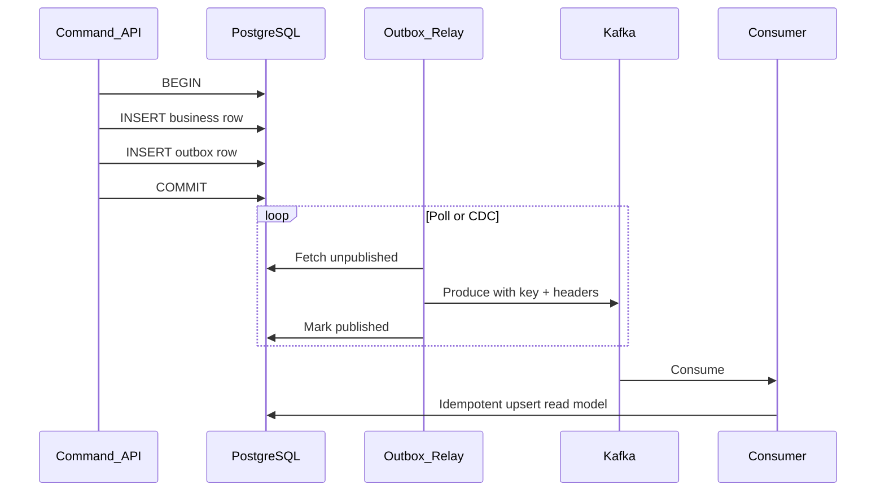
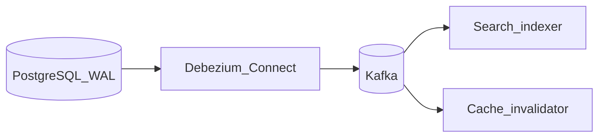
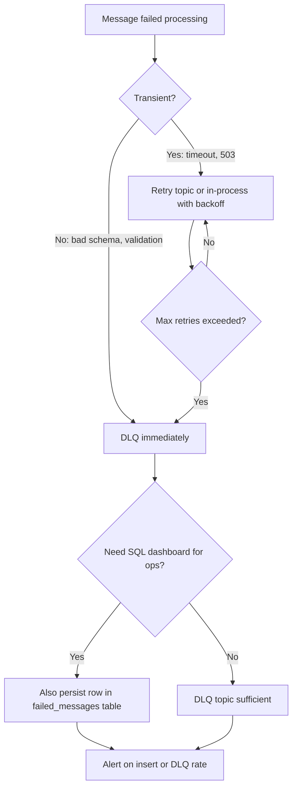
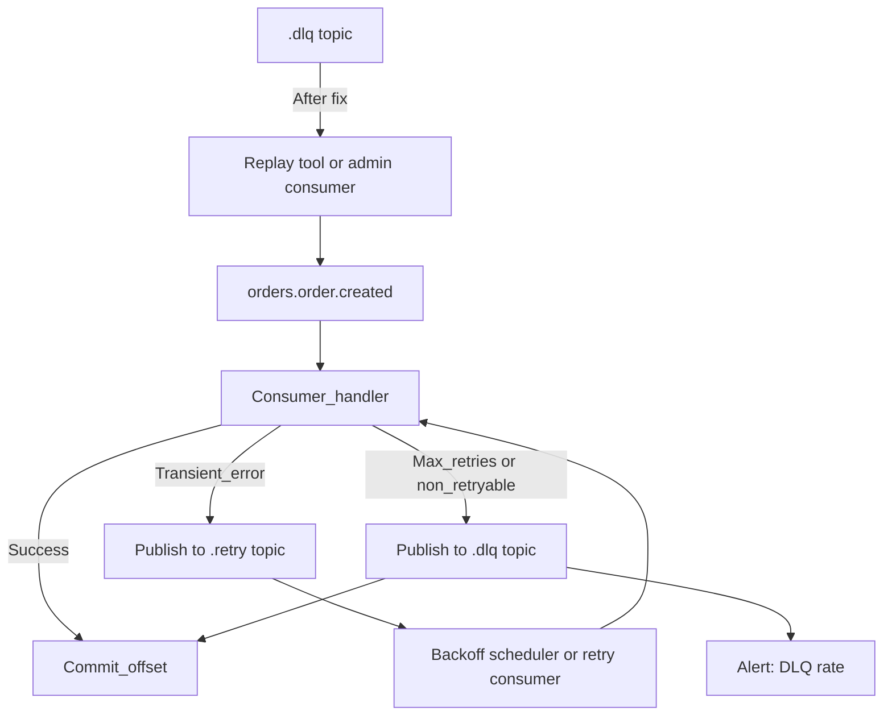

# Integration Patterns

Production Kafka usage almost always sits **between** a durable write (database or event store) and **idempotent consumers** — not as a lone source of truth.

> **Related:** Outbox detail → [ES §5 async integration](../../event-sourcing-and-cqrs/includes/05-async-integration.md) · Outbox + inbox pair → [ES §5A](../../event-sourcing-and-cqrs/includes/05A-outbox-and-inbox.md) · CDC(Change Data Capture) pipeline → [HTS §15 CDC](../../high-throughput-systems/includes/15-cdc-and-search-indexing.md) · Async API(Application Programming Interface) hub → [api-design §10](../../api-design-and-protection/includes/10-async-patterns.md) · Idempotency → [api-design §13](../../api-design-and-protection/includes/13-idempotency.md) · Failure runbooks → [§13](13-failure-modes-troubleshooting-and-recovery.md)

---

## At a glance

| Pattern | Solves |
|---------|--------|
| **Transactional outbox** | Reliable publish after DB commit |
| **CDC (Debezium)** | Capture DB changes without app dual-write |
| **Inbox (consumer dedup)** | At-least-once → effective once |
| **Partition by saga_id** | Ordered saga steps |
| **Retry / DLQ(Dead Letter Queue) topics** | Poison message isolation — [deep dive](#retry-and-dlq-deep-dive) |
| **Where to store failures** | DB vs Kafka decision — [storage table](#where-to-store-messages-recovery-and-retry) |
| **Headers** | Tracing and correlation without schema churn |

**Rule of thumb:** Never **dual-write** DB + Kafka in one request without outbox or CDC — crash between steps causes drift.

---

## Transactional outbox → Kafka



| Relay | Pros | Cons |
|-------|------|------|
| **Polling app** | Simple | DB load; slight lag |
| **Debezium on outbox table** | Low lag | Connector ops |
| **In-process after commit** | Dev only | Not crash-safe |

Full SQL(Structured Query Language) and architecture → [ES §5](../../event-sourcing-and-cqrs/includes/05-async-integration.md) · [ES §5A](../../event-sourcing-and-cqrs/includes/05A-outbox-and-inbox.md).

**Produce settings:** idempotent producer, `acks=all`, partition key = `aggregate_id` or `tenant_id`.

---

## CDC with Debezium



| Path | When |
|------|------|
| **CDC** | Many tables; near-real-time; app unchanged |
| **Outbox** | Explicit domain events; control payload shape |

Pipeline detail → [HTS §15](../../high-throughput-systems/includes/15-cdc-and-search-indexing.md).

---

## Saga and workflow ordering

| Requirement | Kafka mechanism |
|-------------|-----------------|
| All saga events ordered together | **Partition key = `saga_id`** |
| Command routing | Header `saga_id` + correlation_id when key is entity id |
| Cross-partition sagas | Orchestrator or choreography with idempotent steps — [ES §7](../../event-sourcing-and-cqrs/includes/07-sagas-and-distributed-workflows.md) |

---

## Inbox pattern (consumer dedup)

```text
BEGIN;
  INSERT INTO inbox (message_id, ...) ON CONFLICT DO NOTHING;
  -- if inserted: apply side effect
  UPDATE read_model ...;
COMMIT;
commit Kafka offset;
```

Pairs with at-least-once delivery — [ES §5A inbox](../../event-sourcing-and-cqrs/includes/05A-outbox-and-inbox.md#inbox-pattern-consumer).

---

## Headers in integration flows

| Header | Set by | Read by |
|--------|--------|---------|
| `correlation_id` | API / outbox relay | All consumers; tracing |
| `traceparent` | API gateway or service | Observability — [HTS §11](../../high-throughput-systems/includes/11-observability.md) |
| `saga_id` | Saga orchestrator | Downstream saga participants |
| `event_type` | Outbox relay | Router consumers (optional if in payload) |
| `schema_version` | Producer | Consumer upcaster selection |

Keep **tenant_id** in payload for schema validation; optionally duplicate in key for partition isolation — [§2 multi-tenant](02-topics-partitions-and-replication.md#multi-tenant-isolation).

---

## Where to store messages (recovery and retry)

Kafka is a **durable log**, not a job queue. Choose storage by **lifecycle** and **who needs to query it**.

| Need | Store | Why |
|------|-------|-----|
| **Source of truth** | PostgreSQL (or event store) | ACID(Atomicity, Consistency, Isolation, Durability); authoritative business state |
| **Reliable publish after DB write** | Outbox table → Kafka | Same transaction as business row — [outbox above](#transactional-outbox--kafka) |
| **At-least-once dedup** | Inbox table | `ON CONFLICT DO NOTHING` before side effect |
| **Integration fan-out + replay window** | Kafka main topic | Retention-bound replay; multiple consumer groups |
| **Transient retry (seconds–minutes)** | Retry topic **or** in-process retry | Same partition key preserves order |
| **Poison / manual fix queue** | DLQ topic | Isolates bad records; alert and triage |
| **Ops UI, SQL audit, long-lived failed jobs** | PostgreSQL `failed_messages` table | Queryable; optional — use when DLQ is not enough |
| **Compliance archive (years)** | S3 / warehouse | Kafka retention is not unlimited archive — [§5](05-retention-compaction-and-storage.md) |

**Decision flow:**



**Rule of thumb:** Use **Kafka retry/DLQ topics** for stream-native recovery. Add a **DB table** only when ops needs SQL queries, assignment workflows, or retention longer than DLQ topic policy. Never use Kafka alone as source of truth for business state.

| Pattern | Kafka retry/DLQ only | Kafka + DB failed_messages |
|---------|----------------------|----------------------------|
| Volume | High-throughput events | Lower; ops-heavy workflows |
| Ops model | Replay tool republishes to main topic | Dashboard, manual status transitions |
| Ordering | Partition key on republish | N/A (out of band) |

---

## Retry and DLQ deep dive

Kafka has **no native delayed retry** (unlike SQS visibility timeout). Retries are an **application pattern**.

### End-to-end flow



### Topic naming

| Topic | Example | Retention |
|-------|---------|-----------|
| Main | `orders.order.created` | Domain default (e.g. 7d) |
| Retry | `orders.order.created.retry` | Short (1–3d) |
| DLQ | `orders.order.created.dlq` | Longer (14–30d) for triage |

Full naming rules → [§9 topic governance](09-cluster-setup-and-requirements.md#topic-naming-governance).

### Retry strategies

| Strategy | How | When |
|----------|-----|------|
| **In-process retry** | Loop N times with exponential backoff inside poll handler | Fast transient (single dependency blip) |
| **Retry topic** | Publish failed record to `.retry`; separate consumer or same group republishes to main | Preserve main topic progress; visible retry queue |
| **Header backoff** | Set `retry_after_ms`, `retry_count` on record; retry consumer skips until due | Ordered retry per partition |
| **Scheduled republish** | Cron/job reads retry topic or DB and produces to main | Long delays (minutes–hours) |
| **Pause partition** | Stop fetch during downstream outage | DB/API down — not a retry — [§4 pause](04-consumers-and-consumer-groups.md#pause-resume-and-seek) |

**Exponential backoff (retry topic):**

```text
delay_ms = min(base_ms * 2^retry_count, max_delay_ms)
```

Track `retry_count` in headers; cap at `max_retries` (e.g. 5) then route to DLQ.

### Retryable vs non-retryable

| Error type | Action |
|------------|--------|
| Downstream timeout, 503, connection reset | Retry with backoff |
| Downstream 4xx (except 429) | Usually DLQ — fix data |
| Deserialization / schema error | **DLQ immediately** — do not retry |
| Validation failure (business rule) | DLQ or skip per policy |
| Unknown null FK | DLQ — data fix required |
| Rate limit 429 | Retry with longer backoff |

### DLQ record shape

Include enough context to replay without guessing:

| Field | Location | Purpose |
|-------|----------|---------|
| Original key | Record key | Same partition on replay |
| Original value | Record value | Unchanged payload |
| `original_topic` | Header | Source topic |
| `original_partition` | Header | Debug |
| `original_offset` | Header | Traceability |
| `error_message` | Header | Triage |
| `error_type` | Header | `transient`, `validation`, `deserialization` |
| `retry_count` | Header | Audit |
| `failed_at` | Header | ISO timestamp |
| `consumer_group` | Header | Which handler failed |
| `correlation_id` | Header | Cross-service trace |

### Application DLQ vs Connect DLQ

| | **Custom consumer** | **Kafka Connect sink** |
|--|---------------------|------------------------|
| **Mechanism** | Your code publishes to `.dlq` | `errors.tolerance=all`, `errors.deadletterqueue.topic.name` |
| **When record lands in DLQ** | Handler catch block after max retries | Converter or sink put failure |
| **Offset** | You commit past record after DLQ publish | Connector manages source offsets |
| **Replay** | Republish tool → main topic | Fix and restart; may need manual sink fix |
| **Monitoring** | Alert on `.dlq` produce rate | Connect task status + DLQ rate — [§7](07-connect-streams-and-ecosystem.md) |

### Consumer handler pattern (pseudo-code)

```text
for record in poll():
  try:
    if is_duplicate(record):          # inbox check
      commit offset; continue
    process(record)                   # side effect in TX with inbox insert
    commit offset
  except TransientError as e:
    if header retry_count >= MAX:
      publish_to_dlq(record, e)
      commit offset
    else:
      publish_to_retry(record, retry_count + 1)
      commit offset                   # advance past poison on main topic
  except NonRetryableError as e:
    publish_to_dlq(record, e)
    commit offset
```

**Critical:** On retry-topic pattern, **commit main topic offset** after publishing to retry — otherwise one bad record blocks the partition forever.

### DLQ reprocessing

| Method | Steps |
|--------|-------|
| **Admin replay consumer** | Read `.dlq`; validate fix; produce to main topic with same key; mark replayed in header |
| **One-shot CLI/tool** | Stream DLQ → produce to main (ops-run, dry-run first) |
| **Manual fix + skip** | Fix DB directly; do not replay if side effect already applied |

Replay requirements:

- **Idempotent handler** (inbox or natural key) — replays duplicate
- **Same partition key** — preserves per-entity order
- **Schema compatible** — fix schema before replay if deserialization was the cause

### Detection and alerting

| Signal | Alert |
|--------|-------|
| Messages/min to `*.dlq` | > 0 sustained or spike vs 7d baseline |
| Retry topic lag growing | Retry consumer cannot keep up |
| Single-partition main topic lag | Possible poison pill — [§13 runbook](13-failure-modes-troubleshooting-and-recovery.md#runbook-poison-pill) |
| Consumer log `error_type=non_retryable` | Page if rate > threshold |

Dashboards: DLQ rate by topic, retry count histogram, top `error_type` in DLQ headers.

### Kafka vs SQS/RabbitMQ (expectations)

| Feature | SQS / RabbitMQ | Kafka |
|---------|----------------|-------|
| Built-in retry delay | Visibility timeout / TTL | **You implement** (retry topic, scheduler) |
| Message removed on ack | Yes | Offset advanced; record remains until retention |
| DLQ | Native queue config | **DLQ topic** pattern |
| Per-message nack | Yes | Republish to retry/DLQ + commit offset |

---

## Optional: failed_messages database table

When DLQ topic alone is insufficient (ops dashboard, assignment, long audit):

```sql
CREATE TABLE failed_messages (
  id            UUID PRIMARY KEY,
  message_id    TEXT NOT NULL UNIQUE,  -- inbox key or event id
  topic         TEXT NOT NULL,
  partition     INT,
  kafka_offset  BIGINT,
  payload       JSONB NOT NULL,
  error_type    TEXT NOT NULL,
  error_message TEXT,
  retry_count   INT NOT NULL DEFAULT 0,
  status        TEXT NOT NULL DEFAULT 'pending',  -- pending, replayed, discarded
  failed_at     TIMESTAMPTZ NOT NULL DEFAULT now(),
  replayed_at   TIMESTAMPTZ
);
```

Write in **same transaction** as DLQ publish confirmation, or treat DLQ as source and sync via small indexer consumer. Prefer **one source of truth** for failed state to avoid drift.

---

## Projectors vs integration consumers

| Type | Updates | Offset commit |
|------|---------|---------------|
| **Read model projector** | Query DB | After projection TX |
| **Side effect worker** | Email, webhook | After send + idempotency record |
| **Connect sink** | External system | Connector-managed |

---

## Common mistakes

| Mistake | Fix |
|---------|-----|
| Publish before DB commit | Outbox in same transaction |
| No inbox on consumer | Dedup by business key |
| Infinite in-process retry on poison pill | DLQ + commit offset; see [§13 poison pill runbook](13-failure-modes-troubleshooting-and-recovery.md#runbook-poison-pill) |
| DLQ without monitoring | Alert on DLQ rate |
| Retry during downstream outage | Pause partition — [§4](04-consumers-and-consumer-groups.md#pause-resume-and-seek) |
| Store all failures only in DB | Use Kafka DLQ for stream replay; DB optional for ops UI |
| Webhook directly from Kafka consumer without SSRF(Server-Side Request Forgery) checks | [api §10B webhooks](../../api-design-and-protection/includes/10B-async-webhooks.md) |
| Trace only in logs | Propagate `traceparent` header |

---

## Pros and cons

### Outbox + Kafka

**Pros:** Consistent with DB; replay from outbox or event store; clear ownership.

**Cons:** Relay lag; extra table; must operate relay HA.