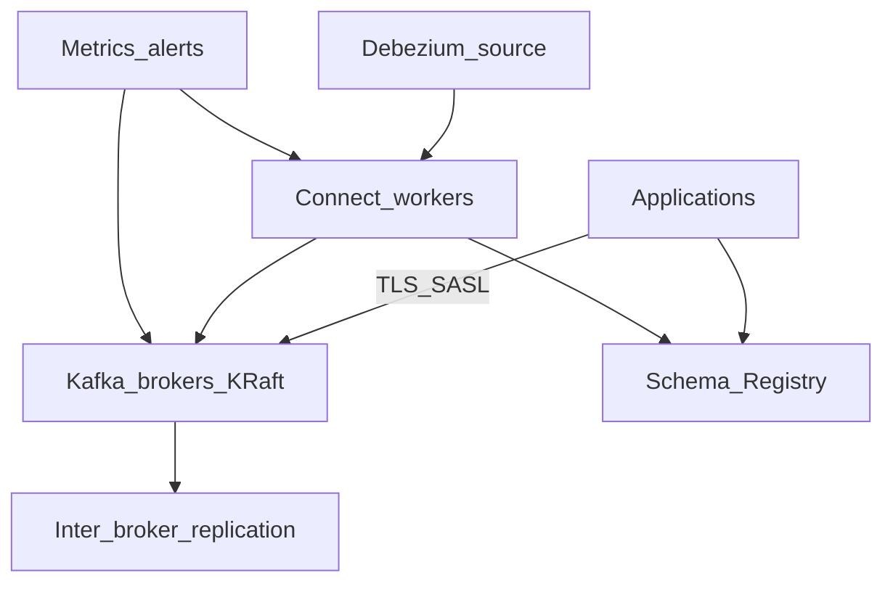

# Cluster Setup and Requirements

Before provisioning brokers, decide **purpose**, **topology**, **companion services**, and **environment parity**. This section covers requirements — not install scripts.

> **Related:** Decision to use Kafka → [§11 decision guide](11-decision-guide-and-common-mistakes.md) · Day-2 ops → [§10 operations](10-operations-dr-security-and-observability.md) · HTS streaming context → [HTS §7](../../high-throughput-systems/includes/07-streaming-pipelines.md)

---

## At a glance

| Tier | Brokers | RF | Schema Registry | Connect |
|------|---------|----|-----------------|---------|
| **Local dev** | 1 (KRaft combined) | 1 | Optional | Optional |
| **Staging** | 3 | 3 | Yes | If prod uses |
| **Production** | 3+ across AZs | 3 | HA (3+) | Dedicated workers |

**Rule of thumb:** Staging should mirror **prod serializer format**, **ACL model**, and **RF/min.insync** — not necessarily prod throughput.

---

## Pre-flight checklist

| Area | Requirement |
|------|-------------|
| **Purpose** | Event bus, CDC, audit, analytics — [§11](11-decision-guide-and-common-mistakes.md) |
| **Cluster mode** | **KRaft** (Kafka 3.3+); avoid new ZooKeeper clusters |
| **Controller quorum** | 3 or 5 nodes (odd); dedicated or combined |
| **Brokers** | 3+ prod; dedicated data volumes |
| **Storage** | SSD/NVMe; size = retention × rate × RF + headroom — [§5](05-retention-compaction-and-storage.md) |
| **Network** | Low latency broker mesh; bandwidth ≥ produce_rate × RF |
| **JVM** | ~4–6 GB heap; rest for OS page cache |
| **OS** | High `ulimit` files; tune swap (`vm.swappiness` low) |
| **Replication** | `RF=3`, `min.insync.replicas=2`, unclean leader election **off** |
| **Schema Registry** | Required for Avro/Protobuf/JSON Schema prod — [§6](06-serialization-and-schema-evolution.md) |
| **Connect** | Separate worker cluster if CDC/sinks — [§7](07-connect-streams-and-ecosystem.md) |
| **Security** | TLS + SASL; ACLs before traffic — [§10](10-operations-dr-security-and-observability.md) |
| **Observability** | Lag, under-replicated partitions, disk; log aggregation |
| **Governance** | Topic naming; who creates topics; default retention |

---

## Setup dependency diagram

---

## KRaft topology

| Mode | Use |
|------|-----|
| **Combined** (broker + controller) | Dev, small staging |
| **Dedicated controllers** | Large prod; isolate controller load |

Quorum loss (majority controllers down) blocks metadata changes — plan maintenance accordingly.

---

## Managed vs self-hosted

| | **Managed (MSK, Confluent Cloud, Aiven)** | **Self-hosted** |
|--|-------------------------------------------|-----------------|
| **Provider owns** | Broker OS, patches, disk replace, KRaft ops | — |
| **You own** | Topics, ACLs, schemas, Connect config, client tuning | Everything |
| **When to choose** | Limited Kafka ops team | Cost, compliance, custom tuning at scale |

Managed still requires **your** Schema Registry, Connect, and topic design.

---

## Local dev workflow

| Option | When | Notes |
|--------|------|-------|
| **Docker Compose (Kafka + KRaft)** | Laptop integration | Single broker; RF=1 |
| **Redpanda single node** | Fast CI/dev | Kafka-compatible API |
| **Testcontainers** | Automated tests | Real broker per suite — [§12](12-testing-and-verification.md) |
| **Plain JSON** | Early spike | Switch to Registry format before staging |

| Practice | Why |
|----------|-----|
| Match staging serializers | Catch schema bugs early |
| Separate dev cluster from prod | Never point dev code at prod brokers |
| Seed test topics via IaC or scripts | Reproducible integration tests |

No docker-compose YAML in this guide — use vendor docs for compose templates.

---

## Companion service sizing

| Service | Minimum prod |
|---------|--------------|
| **Schema Registry** | 3 instances behind load balancer; RF=3 for `_schemas` topic |
| **Connect** | 2+ workers; scale tasks with connector throughput |
| **REST Proxy** | Optional; not a substitute for native clients |

---

## Topic defaults (prod starter)

| Setting | Suggested |
|---------|-----------|
| `replication.factor` | 3 |
| `min.insync.replicas` | 2 |
| `retention.ms` | Domain-specific (7d events, 30d audit) |
| `compression.type` | `producer` → `lz4` or `zstd` |
| `cleanup.policy` | `delete` unless compacted changelog |

---

## Common mistakes

| Mistake | Fix |
|---------|-----|
| Single broker prod | 3 brokers, RF=3 |
| Dev plain JSON, prod Avro surprise | Staging uses prod format |
| Connect on broker nodes | Dedicated workers |
| No topic creation governance | CI or admin API only |
| Undersized disk | Formula in [§5](05-retention-compaction-and-storage.md) |

---

## Pros and cons

### KRaft-only cluster

**Pros:** Single system; simpler ops than ZooKeeper era.

**Cons:** Controller quorum planning; upgrade discipline during KRaft maturity.
