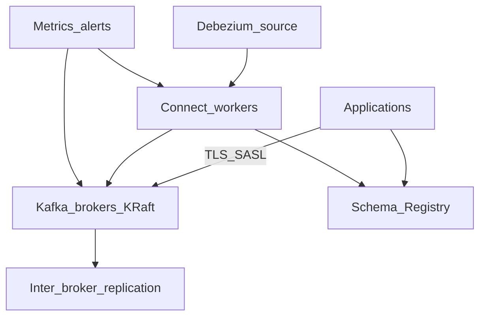

# Cluster Setup and Requirements

Before provisioning brokers, decide **purpose**, **topology**, **companion services**, and **environment parity**. This section covers requirements — not install scripts.

> **Related:** Decision to use Kafka → [§11 decision guide](11-decision-guide-and-common-mistakes.md) · Day-2 ops → [§10 operations](10-operations-dr-security-and-observability.md) · HTS streaming context → [HTS §7](../../high-throughput-systems/includes/07-streaming-pipelines.md)

---

## At a glance

| Tier | Brokers | RF | Schema Registry | Connect |
|------|---------|----|-----------------|---------|
| **Local dev** | 1 (KRaft combined) | 1 | Optional | Optional |
| **Staging** | 3 | 3 | Yes | If prod uses |
| **Production** | 3+ across AZs | 3 | HA (3+) | Dedicated workers |

**Rule of thumb:** Staging should mirror **prod serializer format**, **ACL(Access Control List) model**, and **RF/min.insync** — not necessarily prod throughput.

---

## Pre-flight checklist

| Area | Requirement |
|------|-------------|
| **Purpose** | Event bus, CDC(Change Data Capture), audit, analytics — [§11](11-decision-guide-and-common-mistakes.md) |
| **Cluster mode** | **KRaft** (Kafka 3.3+); avoid new ZooKeeper clusters |
| **Controller quorum** | 3 or 5 nodes (odd); dedicated or combined |
| **Brokers** | 3+ prod; dedicated data volumes |
| **Storage** | SSD/NVMe; size = retention × rate × RF + headroom — [§5](05-retention-compaction-and-storage.md) |
| **Network** | Low latency broker mesh; bandwidth ≥ produce_rate × RF |
| **JVM** | ~4–6 GB heap; rest for OS page cache |
| **OS** | High `ulimit` files; tune swap (`vm.swappiness` low) |
| **Replication** | `RF=3`, `min.insync.replicas=2`, unclean leader election **off** |
| **Schema Registry** | Required for Avro/Protobuf/JSON Schema prod — [§6](06-serialization-and-schema-evolution.md) |
| **Connect** | Separate worker cluster if CDC/sinks — [§7](07-connect-streams-and-ecosystem.md) |
| **Security** | TLS(Transport Layer Security) + SASL; ACLs before traffic — [§10](10-operations-dr-security-and-observability.md) |
| **Observability** | Lag, under-replicated partitions, disk; log aggregation |
| **Governance** | Topic naming — [§9 governance](#topic-naming-governance); event catalog + ownership SLOs — [§9 catalog](#event-catalog-and-ownership-slos) |
| **Client quotas** | Default produce/fetch byte rates per principal — [§10 quotas](10-operations-dr-security-and-observability.md#client-quotas-and-noisy-neighbor) |

---

## Setup dependency diagram



---

## KRaft topology

| Mode | Use |
|------|-----|
| **Combined** (broker + controller) | Dev, small staging |
| **Dedicated controllers** | Large prod; isolate controller load |

Quorum loss (majority controllers down) blocks metadata changes — plan maintenance accordingly.

---

## Managed vs self-hosted

| | **Managed (MSK, Confluent Cloud, Aiven)** | **Self-hosted** |
|--|-------------------------------------------|-----------------|
| **Provider owns** | Broker OS, patches, disk replace, KRaft ops | — |
| **You own** | Topics, ACLs, schemas, Connect config, client tuning | Everything |
| **When to choose** | Limited Kafka ops team | Cost, compliance, custom tuning at scale |

Managed still requires **your** Schema Registry, Connect, and topic design.

---

## Local dev workflow

| Option | When | Notes |
|--------|------|-------|
| **Docker Compose (Kafka + KRaft)** | Laptop integration | Single broker; RF=1 |
| **Redpanda single node** | Fast CI(Continuous Integration)/dev | Kafka-compatible API(Application Programming Interface) |
| **Testcontainers** | Automated tests | Real broker per suite — [§12](12-testing-and-verification.md) |
| **Plain JSON** | Early spike | Switch to Registry format before staging |

| Practice | Why |
|----------|-----|
| Match staging serializers | Catch schema bugs early |
| Separate dev cluster from prod | Never point dev code at prod brokers |
| Seed test topics via IaC(Infrastructure as Code) or scripts | Reproducible integration tests |

No docker-compose YAML in this guide — use vendor docs for compose templates.

---

## Companion service sizing

| Service | Minimum prod |
|---------|--------------|
| **Schema Registry** | 3 instances behind load balancer; RF=3 for `_schemas` topic |
| **Connect** | 2+ workers; scale tasks with connector throughput |
| **REST(Representational State Transfer) Proxy** | Optional; not a substitute for native clients |

---

## Topic defaults (prod starter)

| Setting | Suggested |
|---------|-----------|
| `replication.factor` | 3 |
| `min.insync.replicas` | 2 |
| `retention.ms` | Domain-specific (7d events, 30d audit) |
| `compression.type` | `producer` → `lz4` or `zstd` |
| `cleanup.policy` | `delete` unless compacted changelog |

---

## Topic naming governance

Enforce naming in **CI**, **IaC(Infrastructure as Code)**, or **admin-only topic creation** — not ad hoc from application startup.

### Naming rules

| Rule | Standard |
|------|----------|
| **Format** | `{domain}.{entity}.{event}` — lowercase, dot-separated |
| **Characters** | `[a-z0-9.-]` only; no spaces or underscores in new topics |
| **Length** | ≤ 249 characters (Kafka limit); prefer ≤ 80 for readability |
| **Environment** | **Pick one org-wide:** (A) separate cluster per env, **or** (B) `{env}.{domain}.{entity}.{event}` prefix on shared cluster |
| **Retry / DLQ(Dead Letter Queue)** | Suffix `.retry` and `.dlq` on **same domain path** — `orders.order.created.retry` |
| **Internal / platform** | Prefix `_internal.` or team prefix — `_internal.connect-offsets` (Connect manages); avoid user traffic |
| **Streams / Connect auto topics** | Document allowed prefixes (`*.repartition`, `*.changelog`, `connect-*`); do not manually create |
| **Version in topic name** | **Avoid** — use Schema Registry version in payload; exception: explicit major breaking boundary (`orders.v2.order.created`) |
| **Multi-tenant** | **Avoid** topic-per-tenant at scale — use shared topic + `tenant_id` in key — [§2 multi-tenant](02-topics-partitions-and-replication.md#multi-tenant-isolation) |
| **Consumer group id** | `{service}-{purpose}` — e.g. `search-indexer`, `notifications-email`; no env in group id if cluster is env-scoped |

### Examples

| Valid | Invalid | Why |
|-------|---------|-----|
| `orders.order.created` | `OrdersOrderCreated` | No camelCase |
| `payments.invoice.paid` | `payments_invoice_paid` | Use dots not underscores |
| `orders.order.created.dlq` | `dlq-orders` | DLQ suffix on source path |
| `search-indexer` (group) | `consumer-group-1` | Non-descriptive group id |

### Schema subject alignment

| Topic | Registry subject |
|-------|------------------|
| `orders.order.created` | `orders.order.created-value`, `orders.order.created-key` |

Detail → [§6 naming](06-serialization-and-schema-evolution.md#naming-conventions).

### Who creates topics

| Model | When | Enforcement |
|-------|------|-------------|
| **IaC / GitOps(Git Operations)** | Recommended prod | PR review; naming linter in CI |
| **Admin API / ticket** | Central platform team | Runbook + naming checklist |
| **Auto-create by broker** | Dev only | `auto.create.topics.enable=false` in staging/prod |

Applications should **fail fast** if topic missing — not silently create misnamed topics.

### CI naming linter (example checks)

```text
- Match regex: ^[a-z][a-z0-9]*(\.[a-z][a-z0-9]*)+(\.(retry|dlq))?$
- Reject: prod., staging. prefix if cluster is env-isolated
- Require: RF=3, min.insync.replicas=2 for prod topics
- Require: retention.ms documented in topic manifest
```

### Topic manifest (recommended)

Each topic in Git with metadata:

| Field | Example |
|-------|---------|
| `name` | `orders.order.created` |
| `partitions` | 12 |
| `replication.factor` | 3 |
| `retention.ms` | 604800000 (7d) |
| `owner` | team-orders@company.com |
| `description` | Order created domain event |
| `classification` | internal / confidential / restricted — [ESC §7](../../enterprise-security-compliance/includes/07-pii-and-data-classification.md) |
| `freshness_slo_s` | 60 (p99 consume lag target) |
| `consumers` | `search-indexer`, `notifications-email` |

---

## Event catalog and ownership SLOs

Treat the topic manifest set as the **event catalog**: discoverable contracts for producers, consumers, retention, and freshness — not only IaC(Infrastructure as Code) for brokers.

| Catalog field | Why |
|---------------|-----|
| **Owner** | On-call for schema breaks, poison pills, retention changes |
| **Producers / consumers** | Incident blast radius; contract test matrix |
| **Classification** | PII(Personally Identifiable Information) and audit retention — [ESC §6](../../enterprise-security-compliance/includes/06-audit-logging-and-retention.md) / [§7](../../enterprise-security-compliance/includes/07-pii-and-data-classification.md) |
| **Freshness SLO(Service Level Objective)** | Max acceptable consumer lag (e.g. p99 < 60s) — page when breached |
| **Schema subject + compatibility** | CI gate before deploy — [§6](06-serialization-and-schema-evolution.md) |
| **Delete / erasure path** | How GDPR-style deletes reach consumers and warehouses — [data-platforms §5](../../data-platforms/includes/05-data-ownership-lineage-retention.md) |

### Platform ownership model

| Role | Owns |
|------|------|
| **Domain team** | Topic semantics, schema evolution, consumer correctness, freshness SLO |
| **Kafka platform** | Cluster SLOs (availability, under-replicated), quotas, ACL(Access Control List) machinery, self-service topic PR path |
| **Security / legal** | Classification labels, retention floors for audit topics |

**Rule of thumb:** No production produce without a catalog row (owner + SLO + classification). Orphan topics are deleted or quarantined.

### Freshness SLO examples

| Topic class | Typical freshness SLO | Alert |
|-------------|----------------------|-------|
| User-facing projection (search, feed) | p99 lag < 30–60s | Page domain on-call |
| Async notifications | p99 lag < 5–15 min | Ticket / business hours |
| Analytics / warehouse land | lag < batch window (e.g. 1h) | Platform + data owner |
| Audit / compliance bus | lag < 5 min + pipeline integrity | Security + platform |

Align catalog freshness with observability dashboards — [§10](10-operations-dr-security-and-observability.md#observability-integration). Broader dataset ownership → [data-platforms §5](../../data-platforms/includes/05-data-ownership-lineage-retention.md).

---

## Common mistakes

| Mistake | Fix |
|---------|-----|
| Single broker prod | 3 brokers, RF=3 |
| Dev plain JSON, prod Avro surprise | Staging uses prod format |
| Connect on broker nodes | Dedicated workers |
| No topic creation governance | CI or admin API only — [§9 governance](09-cluster-setup-and-requirements.md#topic-naming-governance) |
| Undersized disk | Formula in [§5](05-retention-compaction-and-storage.md) |
| Topics without catalog owner / SLO | Require manifest fields before merge |
| Shared cluster with no client quotas | Default quotas per principal — [§10](10-operations-dr-security-and-observability.md#client-quotas-and-noisy-neighbor) |

---

## Pros and cons

### KRaft-only cluster

**Pros:** Single system; simpler ops than ZooKeeper era.

**Cons:** Controller quorum planning; upgrade discipline during KRaft maturity.