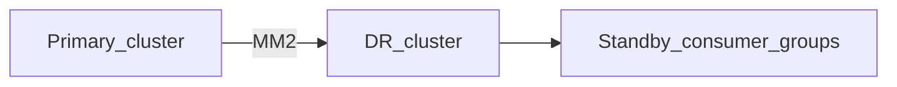

# Operations, DR, Security, and Observability

Running Kafka in production means monitoring **lag and replication**, securing clients, planning **disaster recovery**, and tying alerts to runbooks.

> **Related:** DR vocabulary → [database-connection §12 DR](../../database-connection-and-security/includes/12-credential-rotation-and-dr.md) · Observability patterns → [HTS §11](../../high-throughput-systems/includes/11-observability.md) · Runbook template → [RUNBOOK-TEMPLATE.md](../../RUNBOOK-TEMPLATE.md) · Setup baseline → [§9](09-cluster-setup-and-requirements.md) · **Failure catalog and runbooks** → [§13](13-failure-modes-troubleshooting-and-recovery.md)

---

## At a glance

| Signal | Severity |
|--------|----------|
| **Consumer lag growing** | Capacity or slow handler |
| **Under-replicated partitions** | Broker failure or network |
| **Offline partitions** | No leader in ISR(In-Sync Replicas) |
| **ISR shrink** | Follower lag or broker down |
| **Disk usage > 80%** | Retention or sizing issue |

**Rule of thumb:** Alert on **lag derivative** (rate of growth) and **under-replicated partitions** — not lag alone on low-traffic topics.

---

## Key metrics

| Metric | Source | Action |
|--------|--------|--------|
| `kafka.server:type=BrokerTopicMetrics,name=MessagesInPerSec` | JMX / Prometheus | Capacity |
| Consumer lag per partition | Burrow, Kafka exporter, MSK metrics | Scale consumers |
| `UnderReplicatedPartitions` | Broker JMX | Check broker / network |
| `OfflinePartitionsCount` | Cluster | Incident — leader election |
| Request latency produce/fetch | Broker | Hot disk or network |
| Connect task failures | Connect REST(Representational State Transfer) | Connector config / DLQ(Dead Letter Queue) |

---

## Consumer lag operations

| Symptom | Diagnosis | Fix |
|---------|-----------|-----|
| Lag flat, high | Steady overload | Add consumers to partition limit; optimize handler |
| Lag spike after deploy | Regression or poison pill | Roll back; inspect DLQ — [§13 poison pill](13-failure-modes-troubleshooting-and-recovery.md#runbook-poison-pill) |
| One partition hot lag | Skewed key | Rekey strategy — [§2](02-topics-partitions-and-replication.md) |
| All groups lag | Broker or disk | Broker ops — disk, network |

Runbook row → [RUNBOOK-TEMPLATE.md](../../RUNBOOK-TEMPLATE.md) consumer lag section. Detailed runbooks → [§13](13-failure-modes-troubleshooting-and-recovery.md).

---

## Broker tuning (day-2)

| Area | Guidance |
|------|----------|
| **Heap** | 4–6 GB typical; avoid consuming RAM needed for page cache |
| **Disk** | Monitor log dirs; expand or reduce retention |
| **Network** | 10 GbE+ for heavy replication cross-AZ |
| **Thread pools** | Tune under sustained high fetch/produce |
| **Cruise Control** | Automated partition rebalance on broker add/remove |

Details build on [§9 setup](09-cluster-setup-and-requirements.md) — do not duplicate checklist here.

---

## Security

| Layer | Practice |
|-------|----------|
| **Wire encryption** | TLS(Transport Layer Security) between clients and brokers; inter-broker TLS |
| **Authentication** | SASL SCRAM, OAuth (OIDC), or mTLS(Mutual Transport Layer Security) |
| **Authorization** | ACLs (open source) or RBAC (Confluent); least privilege per principal |
| **Quotas** | Byte rate per client id — multi-tenant fairness — [§2](02-topics-partitions-and-replication.md) |
| **Admin access** | Separate admin principals; audit topic delete |

| Principal | Typical ACL(Access Control List) |
|-----------|-------------|
| Service producer | `WRITE` on specific topics |
| Service consumer | `READ` + `GROUP` on specific group |
| Connect | `READ`/`WRITE` on internal + target topics |
| Human admin | Restricted; break-glass only |

---

## Disaster recovery

Link RPO(Recovery Point Objective)/RTO(Recovery Time Objective) definitions → [database-connection §12](../../database-connection-and-security/includes/12-credential-rotation-and-dr.md).

| Scenario | Pattern | Stream RPO note |
|----------|---------|-----------------|
| **Single broker loss** | RF=3, auto leader election | RPO ≈ 0 if `acks=all` and ISR healthy |
| **AZ / region loss** | MirrorMaker 2 to standby cluster | RPO = replication lag (seconds–minutes) |
| **Accidental topic delete** | Restrict DELETE ACLs; mirror cluster backup | Replay from mirror if within retention |
| **Consumer rebuild** | New group `earliest` or reset offsets | Bounded by topic retention |
| **Schema Registry loss** | Registry HA; backup subjects | Consumers cache schema id → schema |
| **Corrupt partition** | Restore from mirror; rebuild consumers | Coordinate offset reset |

**Stream RPO ≠ DB PITR(Point-in-Time Recovery):** Kafka retention and replication define how far back you can replay — not PostgreSQL WAL(Write-Ahead Log) recovery.

Failover checklist:

1. Confirm mirror lag acceptable
2. Point consumers to DR bootstrap servers (or DNS(Domain Name System) cutover)
3. Reset or sync consumer groups per runbook
4. Verify Schema Registry subject parity

---

## Observability integration

| Practice | Detail |
|----------|--------|
| **OpenTelemetry** | Propagate `traceparent` in headers — [§3 headers](03-producers-and-delivery-guarantees.md#message-headers) |
| **Structured logs** | topic, partition, offset, key hash, correlation_id |
| **Dashboards** | Lag by group; broker disk; produce/consume rate |
| **SLO(Service Level Objective) example** | 99% of events consumed within 60s of publish |

---

## Incident triage order

1. **Offline / under-replicated partitions** — cluster health
2. **Disk full** — retention or expansion
3. **Lag growth** — consumer capacity or downstream DB
4. **Auth failures** — cert expiry, ACL change
5. **Schema errors** — incompatible deploy — [§6](06-serialization-and-schema-evolution.md)

---

## Common mistakes

| Mistake | Fix |
|---------|-----|
| Lag alert without rate | Derivative alert |
| TLS enabled, ACLs open | Principle of least privilege |
| No DR drill | Failover test to mirror cluster quarterly |
| Delete topic ACL for apps | Admin-only |
| Ignore Connect DLQ | Monitor connector dead letter topics — [§8 DLQ](08-integration-patterns.md#detection-and-alerting) |

---

## Pros and cons

### MirrorMaker DR cluster

**Pros:** Geographic redundancy; replay buffer.

**Cons:** Async lag; active-active complexity; cost of second cluster.