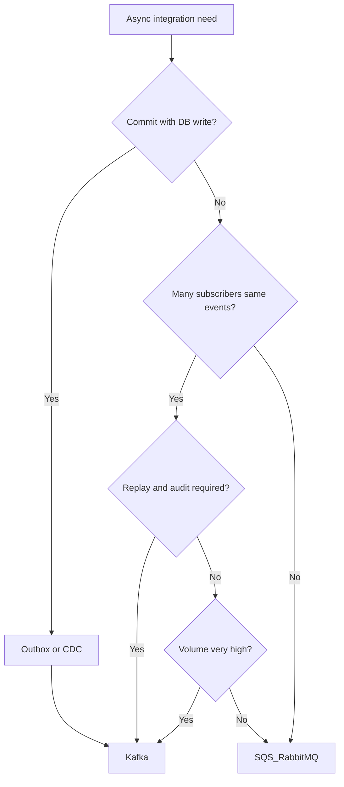

# Decision Guide and Common Mistakes

Use this section when choosing **Kafka vs alternatives**, **managed vs self-hosted**, and **anti-patterns** to avoid.

> **Related:** HTS broker overview → [HTS §14 message brokers](../../high-throughput-systems/includes/14-message-brokers-and-queues.md) · Streaming use cases → [HTS §7](../../high-throughput-systems/includes/07-streaming-pipelines.md) · Setup → [§9](09-cluster-setup-and-requirements.md)

---

## At a glance

| Need | Lean toward |
|------|-------------|
| Simple background job | **SQS / RabbitMQ** |
| Fan-out + replay + audit | **Kafka** |
| AWS-native, few consumers | **Kinesis** or SQS |
| Reliable publish after PG write | **Outbox → Kafka** — [§8](08-integration-patterns.md) |
| DB change capture without app code | **Debezium → Kafka** |

**Rule of thumb:** Pick **queue** for jobs; pick **log** for events many systems must read and replay.

---

## Kafka vs queue vs Kinesis

| Need | Queue (SQS, RabbitMQ) | Stream (Kafka) | Kinesis |
|------|-------------------------|----------------|---------|
| Job with poll result (`202`) | Natural | Awkward | Awkward |
| 5+ independent consumers | Bridge or duplicate | Native | Shards + fan-out |
| Replay last N days | External store | Retention window | Retention window |
| Strict per-entity order | FIFO(First In, First Out) shard | Partition key | Partition key |
| Ops complexity | Lower | Higher | Managed middle |
| Cross-cloud portability | Varies | High (open protocol) | AWS-bound |

Full HTS table → [HTS §14](../../high-throughput-systems/includes/14-message-brokers-and-queues.md).

---

## Decision flow

---

## When Kafka is the right choice

| Signal | Example |
|--------|---------|
| Event bus between 5+ services | Order lifecycle → search, warehouse, email, analytics |
| CDC(Change Data Capture) to multiple sinks | Debezium → Kafka → OpenSearch + cache |
| Audit log with retention | Compliance stream |
| Reprocess on new logic | Reset consumer offset; rebuild projection |
| High throughput fan-out | Metrics, clickstream |

---

## When Kafka is the wrong choice

| Signal | Better fit |
|--------|------------|
| Fire-and-forget emails | SQS + worker |
| Request/response RPC | HTTP(Hypertext Transfer Protocol)/gRPC |
| Primary source of truth | PostgreSQL / event store |
| Team cannot operate 3+ brokers | Managed Kafka or simpler queue |
| Global ordering of everything | Redesign boundaries or accept single partition bottleneck |

---

## Managed vs self-hosted

| Signal | Managed | Self-hosted |
|--------|---------|-------------|
| Small platform team | Strong | Weak |
| Strict cost control at scale | Depends | Often cheaper at very high volume |
| Compliance requires customer-managed keys | Check offering | Full control |
| Need latest upstream Kafka quickly | Provider lag | You patch |

Options: Amazon MSK, Confluent Cloud, Aiven, Redpanda Cloud — evaluate SLA, Connect support, Schema Registry bundling.

---

## Product comparison (Kafka ecosystem)

| Product | Notes |
|---------|-------|
| **Apache Kafka** | Reference; full ecosystem |
| **Redpanda** | Kafka API(Application Programming Interface); different implementation; simpler ops for some teams |
| **Amazon Kinesis** | Managed; AWS integration; shard model |
| **Pulsar** | Multi-tenancy native; different ops model |

This guide focuses on **Apache Kafka semantics** — most apply to API-compatible products with verification.

---

## Anti-patterns catalog

| Anti-pattern | Why it hurts | Fix |
|--------------|--------------|-----|
| Kafka for simple emails | Ops > benefit | SQS |
| Dual-write DB + publish | Lost or duplicate messages | Outbox — [§8](08-integration-patterns.md) |
| One partition | No scale | Increase partitions |
| `RF=1` prod | Data loss on broker death | RF=3 |
| Infinite retention | Disk bankruptcy | Tiered storage or warehouse export |
| Hot key without sharding | One partition maxed | Sub-key or dedicated topic |
| No Schema Registry in prod | Breaking changes in prod | [§6](06-serialization-and-schema-evolution.md) |
| Consumer auto-commit + DB | Lost messages | Manual commit after TX |
| Using Kafka as job queue with result | No natural job status | [api §10A jobs](../../api-design-and-protection/includes/10A-async-jobs-polling.md) |

---

## Common mistakes (summary)

| Mistake | Section |
|---------|---------|
| Ignore consumer lag growth | [§10](10-operations-dr-security-and-observability.md) |
| Wrong serializer in staging | [§9](09-cluster-setup-and-requirements.md) |
| Saga without partition key | [§2](../../event-sourcing-and-cqrs/includes/07C-sagas-operations.md) |
| Skip integration tests | [§12](12-testing-and-verification.md) |

---

## Pros and cons

### Adopting Kafka platform-wide

**Pros:** Unified integration; replay; decoupled teams; mature Connect ecosystem.

**Cons:** Operational cost; schema discipline; eventual consistency education; not a silver bullet for async.
