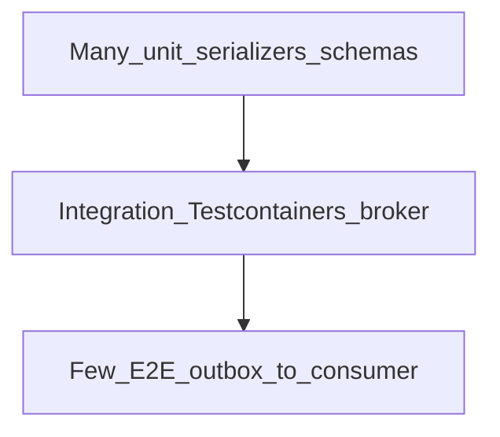
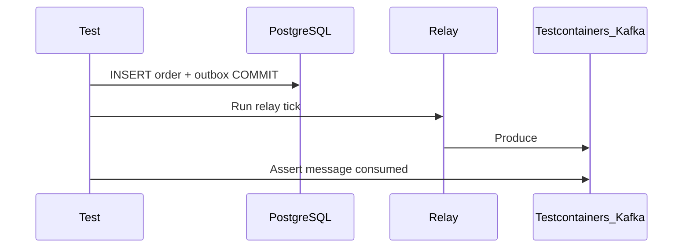

# Testing and Verification

Kafka systems need tests at serializer, producer, consumer, and integration layers — especially **schema compatibility** and **outbox relay** paths.

> **Related:** ES testing patterns → [ES §9 testing](../../event-sourcing-and-cqrs/includes/09-testing-and-verification.md) · Contract CI → [api-design §15 contract testing](../../api-design-and-protection/includes/15-contract-and-schema-testing.md) · Schema formats → [§6](06-serialization-and-schema-evolution.md) · Local broker → [§9 dev workflow](09-cluster-setup-and-requirements.md#local-dev-workflow)

---

## At a glance

| Layer | What to prove | Technique |
|-------|---------------|-----------|
| **Schema** | Compatible evolution | Registry API(Application Programming Interface); `buf breaking`; compatibility CI |
| **Serializer** | Round-trip bytes | Unit tests with golden fixtures |
| **Producer** | Topic, key, headers | Mock or Testcontainers |
| **Consumer** | Idempotent handler; commit order | Testcontainers + real topic |
| **Outbox relay** | Message only after DB commit | PG + Kafka integration test |
| **Rebalance** | No duplicate side effects on rolling deploy | Smoke test with cooperative consumer |

**Rule of thumb:** Test **behavior from messages** — golden payloads per schema version; same compatibility rules as production Registry.

---

## Testing pyramid



---

## Schema and contract tests

| Check | Tooling |
|-------|---------|
| Backward compatible change | Schema Registry `POST /compatibility/subjects/...` |
| Protobuf breaking change | `buf breaking` against main |
| Avro in Maven | `kafka-schema-registry-maven-plugin` |
| CI gate | Fail build on incompatible schema — [api §15](../../api-design-and-protection/includes/15-contract-and-schema-testing.md) |

Store golden **serialized bytes** or JSON equivalents per `schema_version` in repo.

---

## Serializer unit tests

```text
Given: OrderCreatedV2 Avro record
When:  serialize → deserialize
Then:  fields match; unknown fields ignored on read (forward compat)
```

| Fixture | Purpose |
|---------|---------|
| `order-created-v1.bin` | Old consumer reads old bytes |
| `order-created-v2.bin` | New fields with defaults |

Align with [ES §8 upcasting](../../event-sourcing-and-cqrs/includes/08-event-schema-evolution.md) for stored domain events — Kafka payload tests are **transport-layer**.

---

## Producer tests

| Approach | Scope |
|----------|-------|
| **Mock producer** | Verify topic, key, header calls |
| **Testcontainers Kafka** | Real broker; consume test record |

Assert:

- Partition key = expected (`aggregate_id`, `tenant_id`)
- Headers include `correlation_id`, `traceparent` when required
- `acks=all` config in integration profile

---

## Consumer tests

| Scenario | Assert |
|----------|--------|
| Happy path | Side effect once; offset committed |
| Duplicate delivery | Inbox dedup — second message no-op — [§8](08-integration-patterns.md) |
| Poison message | Routed to DLQ(Dead Letter Queue) after N tries |
| DB failure mid-batch | Offset not committed; retry succeeds |

Use **Testcontainers** (Kafka + PostgreSQL) for outbox + consumer pipeline — mirror [ES §9 outbox integration](../../event-sourcing-and-cqrs/includes/09-testing-and-verification.md).

---

## Outbox relay integration test



| Check | Failure means |
|-------|---------------|
| No message before commit | Relay reads uncommitted rows |
| Message after rollback | Transaction boundary bug |
| Published flag set once | Relay idempotency broken |

---

## Consumer group smoke tests

| Test | Method |
|------|--------|
| Rebalance on member join | Start 2 consumers; partitions split |
| Static membership | Same `group.instance.id` survives restart |
| Cooperative rebalance | No full stop during scale-up (metrics) |

Run in staging — expensive for every CI run.

---

## CI pipeline checklist

| Stage | Gate |
|-------|------|
| PR | Schema compatibility vs main branch |
| PR | Unit serializer + consumer handler tests |
| Merge | Integration tests with Testcontainers |
| Pre-prod | Load test consumer lag under peak synthetic produce |

---

## Common mistakes

| Mistake | Fix |
|---------|-----|
| Mock-only; never Testcontainers | At least one integration path |
| No golden old-schema fixtures | Regression on compatibility |
| Test with plain JSON, prod Avro | Staging format parity — [§9](09-cluster-setup-and-requirements.md) |
| Shared prod topic for tests | Isolated cluster or topic prefix |
| Skip DLQ path tests | Inject bad record; assert DLQ |

---

## Pros and cons

### Testcontainers Kafka

**Pros:** Real broker semantics; catches config mistakes.

**Cons:** Slower CI; Docker required; resource heavy at scale — shard integration job.
