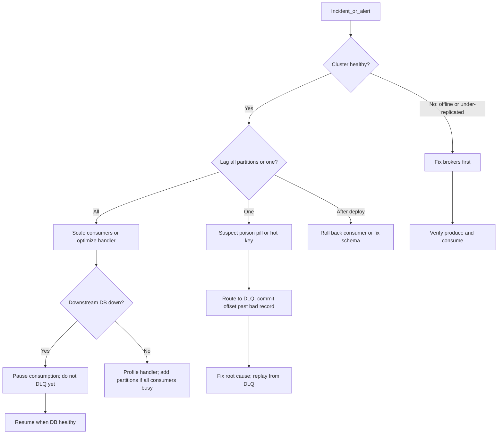

# Failure Modes, Troubleshooting, and Recovery

When Kafka misbehaves in production, symptoms span **brokers**, **clients**, **schemas**, **Connect**, and **application handlers**. This section catalogs common failures, how to detect them, and step-by-step recovery — including poison pills and consumer offset recovery.

> **Related:** Retry/DLQ(Dead Letter Queue) implementation → [§8 retry and DLQ](08-integration-patterns.md#retry-and-dlq-deep-dive) · Lag ops → [§10 operations](10-operations-dr-security-and-observability.md) · Consumer pause/seek → [§4](04-consumers-and-consumer-groups.md) · DR(Disaster Recovery) failover → [§10 DR](10-operations-dr-security-and-observability.md#disaster-recovery) · Runbook template → [RUNBOOK-TEMPLATE.md](../../RUNBOOK-TEMPLATE.md)

---

## At a glance

| Layer | Typical symptom | First check |
|-------|-----------------|-------------|
| **Broker** | Produce timeout, under-replicated partitions | Broker metrics, disk, ISR(In-Sync Replicas) |
| **Producer** | `NOT_ENOUGH_REPLICAS`, record too large | Topic RF/min.insync, message size |
| **Consumer** | Lag spike, rebalance storm | Handler latency, poison pill, `max.poll.interval.ms` |
| **Schema** | Deserialization errors after deploy | Registry compatibility, subject version |
| **Connect** | Task `FAILED`, sink stall | Connect REST(Representational State Transfer) API(Application Programming Interface), connector DLQ |
| **Application** | DLQ rate up, partial projection | Inbox, retry count, downstream DB |

**Rule of thumb:** Fix **cluster health** (offline/under-replicated partitions, disk) before tuning consumers. Fix **poison pills** before scaling consumers — extra instances will not help one bad partition.

---

## Error catalog

### Broker and cluster

| Error / signal | Cause | Impact | Fix |
|----------------|-------|--------|-----|
| `UnderReplicatedPartitions` > 0 | Broker down, network partition, slow follower | Reduced durability; `acks=all` may fail | Restore broker; check inter-broker network; disk I/O |
| `OfflinePartitionsCount` > 0 | No leader in ISR; unclean election disabled | Produce/consume blocked for partition | Bring followers into ISR or ops intervention — [§2](02-topics-partitions-and-replication.md) |
| ISR shrink | Follower lag exceeds `replica.lag.time.max.ms` | Fewer replicas ack `acks=all` | Fix follower broker; reduce produce rate temporarily |
| Disk > 80% on log dir | Retention too long or undersized volume | Broker may reject writes | Reduce retention, expand disk, tiered storage — [§5](05-retention-compaction-and-storage.md) |
| Controller quorum loss | Majority KRaft controllers unavailable | No metadata changes; topic create fails | Restore controller nodes — [§9](09-cluster-setup-and-requirements.md) |
| Request timeout (fetch/produce) | Hot disk, network saturation, GC pause | Client retries, duplicates possible | Broker tuning; idempotent producer — [§3](03-producers-and-delivery-guarantees.md) |

### Producer

| Error / signal | Cause | Impact | Fix |
|----------------|-------|--------|-----|
| `NOT_ENOUGH_REPLICAS` / `NOT_ENOUGH_REPLICAS_AFTER_APPEND` | ISR < `min.insync.replicas` | Produce fails (fail-closed) | Restore replicas; temporarily lower min.insync only with risk acceptance |
| `RECORD_TOO_LARGE` | Message exceeds `message.max.bytes` | Record rejected | Shrink payload; reference blob in S3 — [§5 message size](05-retention-compaction-and-storage.md#message-size-limits) |
| `UNKNOWN_TOPIC_OR_PARTITION` | Topic missing or metadata stale | Produce fails | Create topic; refresh metadata; check ACL(Access Control List) |
| Produce timeout + retry | Leader slow, network blip | Duplicate records if not idempotent | `enable.idempotence=true` — [§3](03-producers-and-delivery-guarantees.md) |
| Serialization failure | Schema mismatch, Registry down | Record never sent | Fix schema; Registry HA — [§6](06-serialization-and-schema-evolution.md) |
| `AuthorizationException` | ACL missing `WRITE` | Produce denied | Update ACL for principal + topic |

### Consumer

| Error / signal | Cause | Impact | Fix |
|----------------|-------|--------|-----|
| Lag growing (all partitions) | Throughput > consume capacity | Stale read models | Scale consumers to partition count; optimize handler — [§4](04-consumers-and-consumer-groups.md) |
| Lag on **one partition only** | Hot key or **poison pill** | That key's order stuck | Identify partition; skip to DLQ — [poison pill runbook](#runbook-poison-pill) |
| `CommitFailedException` / rebalance during commit | Member left group mid-batch | Possible duplicate or reprocess | Idempotent handler + inbox — [§8](08-integration-patterns.md) |
| `max.poll.interval.ms` exceeded | Handler too slow (DB, HTTP(Hypertext Transfer Protocol)) | Consumer kicked; rebalance storm | Async worker pool; tune interval; optimize handler |
| `session.timeout.ms` / heartbeat failure | GC pause, network | False "dead" consumer | Tune timeout vs heartbeat; reduce heap pressure |
| Frequent rebalance on deploy | New members join constantly | Processing pauses | Static membership (`group.instance.id`) — [§4](04-consumers-and-consumer-groups.md) |
| Deserialization error | Schema incompatible deploy | Consumer loop errors | Roll back consumer or register compatible schema |
| Offset commit after crash | Auto-commit or commit-before-write | **Lost** messages (committed but not processed) | Manual commit after side effect — [§4](04-consumers-and-consumer-groups.md) |
| Duplicate side effects | Commit-after-write without idempotency | Double emails, double charges | Inbox pattern — [§8 inbox](08-integration-patterns.md#inbox-pattern-consumer-dedup), [ES §5A](../../event-sourcing-and-cqrs/includes/05A-outbox-and-inbox.md#inbox-pattern-consumer) |

### Schema Registry

| Error / signal | Cause | Impact | Fix |
|----------------|-------|--------|-----|
| `409 Schema incompatible` | Breaking change registered | Deploy blocked (good) | Fix schema to meet compatibility mode — [§6](06-serialization-and-schema-evolution.md) |
| Unknown schema ID in payload | Producer used unregistered schema | Consumer cannot deserialize | Register schema; redeploy producer |
| Registry unavailable | Registry cluster down | Produce/consume may halt | Registry HA; consumers cache schema by ID |
| Subject not found | Wrong subject naming | Serialization fails | Align `{topic}-value` convention — [§6 naming](06-serialization-and-schema-evolution.md#naming-conventions) |

### Kafka Connect

| Error / signal | Cause | Impact | Fix |
|----------------|-------|--------|-----|
| Connector state `FAILED` | Config error, sink DB down, converter error | Pipeline stopped | `GET /connectors/{name}/status`; restart task |
| Task repeated failures | Poison record in source | Task stuck retrying | Enable `errors.tolerance=all` + DLQ — [§7](07-connect-streams-and-ecosystem.md) |
| DLQ topic growing | Bad records not fixable at sink | Data not landing in target | Inspect DLQ payload; fix source; replay |
| Offset lag on source connector | DB load, large snapshot | CDC(Change Data Capture) delay | Scale tasks; tune Debezium — [HTS §15](../../high-throughput-systems/includes/15-cdc-and-search-indexing.md) |

### Application and integration

| Error / signal | Cause | Impact | Fix |
|----------------|-------|--------|-----|
| Dual-write drift | Publish without outbox | Events missing or extra vs DB | Outbox or CDC — [§8](08-integration-patterns.md) |
| Outbox relay stuck | Relay down, DB lock | Events not published | HA relay; monitor unpublished outbox count |
| Downstream DB outage | Consumer writes fail | Lag grows; retries exhaust | **Pause** partition consumption — [§4 pause](04-consumers-and-consumer-groups.md#pause-resume-and-seek) |
| DLQ rate spike | Bad deploy, bad data batch | Manual intervention needed | Alert → triage → fix → replay — [§8 DLQ replay](08-integration-patterns.md#dlq-reprocessing) |
| Projection gap | Offset reset wrong, skipped messages | Incomplete read model | Rebuild projection — [runbook: projection rebuild](#runbook-projection-rebuild) |

---

## Detection matrix

| What to monitor | Alert condition | Tooling |
|-----------------|-------------------|---------|
| Consumer lag **growth rate** | Lag increases > N msgs/min for M minutes | Burrow, Kafka Exporter, MSK/Confluent metrics |
| Single-partition lag outlier | One partition lag >> p95 of others | Per-partition lag dashboard |
| Under-replicated partitions | Count > 0 for > 5 min | Broker JMX / Prometheus |
| Offline partitions | Count > 0 | Pager — immediate |
| Broker disk usage | > 80% on any log dir | Node exporter + broker metrics |
| DLQ produce rate | > 0 sustained or spike vs baseline | Topic rate metric on `*.dlq` |
| Connect task state | `FAILED` | Connect REST + exporter |
| Deserialization errors | Log rate spike | Structured logs (`error_type=deserialization`) |
| Outbox unpublished count | Growing backlog | DB metric on outbox table |
| Schema registration failures | 409 rate in Registry logs | Registry audit log |

**SLO(Service Level Objective) example:** 99% of events consumed within 60s of publish — alert when p95 lag exceeds 60s for 10 min.

---

## Recovery decision tree



---

## Runbooks

### Runbook: poison pill

A **poison pill** is a record that always fails processing (bad payload, bug, missing FK) and blocks or stalls its partition.

| Step | Action |
|------|--------|
| 1. **Detect** | One partition lag rising; others flat; error logs repeat same `offset` / `key` |
| 2. **Confirm** | Note `topic`, `partition`, `offset`, `key`; reproduce in staging if possible |
| 3. **Classify** | Transient (downstream timeout) → retry topic. Permanent (bad data, code bug) → DLQ |
| 4. **Isolate** | Publish enriched record to `{topic}.dlq` with headers: `original_offset`, `error`, `retry_count`, `failed_at` |
| 5. **Advance** | Commit offset **past** the poison record (after DLQ publish succeeds) |
| 6. **Fix** | Patch consumer, fix data, or skip business rule |
| 7. **Replay** | Republish from DLQ to main topic — idempotent handler required — [§8 DLQ replay](08-integration-patterns.md#dlq-reprocessing) |
| 8. **Post-incident** | Add test case for payload shape; alert on DLQ rate |

**Do not:** Infinite in-process retry on the same offset — blocks the partition and triggers `max.poll.interval.ms` failure.

---

### Runbook: consumer lag (capacity)

| Step | Action |
|------|--------|
| 1. **Detect** | Lag growth rate alert — [§10](10-operations-dr-security-and-observability.md) |
| 2. **Rule out poison pill** | Check per-partition lag skew |
| 3. **Count consumers** | If consumers < partitions, scale up to partition count |
| 4. **Profile handler** | DB slow queries, external HTTP, large batches |
| 5. **Add partitions** | Only if all consumers busy and produce rate exceeds consume rate — [§2](02-topics-partitions-and-replication.md) |
| 6. **Temporary relief** | Increase `max.poll.interval.ms` only as bridge — not a fix |

---

### Runbook: downstream outage (DB / API)

| Step | Action |
|------|--------|
| 1. **Detect** | Consumer errors correlate with downstream 5xx; lag all partitions |
| 2. **Pause** | `consumer.pause(partitions)` — stop fetching; **do not** commit offsets past unprocessed batch |
| 3. **Wait** | Downstream recovers; verify connectivity |
| 4. **Resume** | `consumer.resume(partitions)`; process backlog |
| 5. **Avoid** | Sending all failed messages to DLQ during outage — creates massive manual replay |

---

### Runbook: projection rebuild

When consumer logic changes and you need to reprocess history:

| Step | Action |
|------|--------|
| 1. **Choose strategy** | New consumer group vs reset offsets on existing group |
| 2. **New group (safer)** | Deploy consumer with `group.id=search-indexer-v2`; `auto.offset.reset=earliest` |
| 3. **Rebuild store** | Truncate or version read model table; replay from retention window |
| 4. **Cutover** | Stop v1 consumer; route traffic to v2 read model when lag ≈ 0 |
| 5. **Reset offsets (destructive)** | `kafka-consumer-groups --reset-offsets` only with ops approval and runbook |
| 6. **Bound** | Replay limited by topic `retention.ms` — not full history unless archived |

Blue/green variant: run v2 group in parallel until caught up, then decommission v1 — no downtime.

---

### Runbook: lost messages (auto-commit)

| Step | Action |
|------|--------|
| 1. **Detect** | Business reports missing events; consumer logs show commits before processing |
| 2. **Stop** | Disable auto-commit; deploy manual commit after side effect |
| 3. **Recover data** | Replay from Kafka if within retention: reset offsets or new group `earliest` |
| 4. **Dedup** | Inbox prevents duplicate side effects on replay — [§8 inbox](08-integration-patterns.md#inbox-pattern-consumer-dedup) |
| 5. **Gap beyond retention** | Reconcile from source of truth (PostgreSQL, outbox archive) |

---

### Runbook: schema break on deploy

| Step | Action |
|------|--------|
| 1. **Detect** | Deserialization error spike; consumer crash loop |
| 2. **Roll back** | Deploy previous consumer version (reads old schema) |
| 3. **Fix forward** | Register backward-compatible schema; or upcaster in consumer — [§6](06-serialization-and-schema-evolution.md) |
| 4. **Never** | Infinite retry on deserialization — route to DLQ immediately (non-retryable) |

---

### Runbook: Connect sink failure

| Step | Action |
|------|--------|
| 1. **Detect** | Connector `FAILED`; sink DB errors; DLQ topic rate |
| 2. **Inspect** | `GET /connectors/{name}/status`; stack trace in worker logs |
| 3. **Fix config** | Converter, PK mode, table mapping |
| 4. **Restart** | Restart connector task after fix |
| 5. **DLQ records** | Fix payload; republish to source topic or sink manually |
| 6. **Prevent** | `errors.tolerance=all`, `errors.deadletterqueue.topic.name` — [§7](07-connect-streams-and-ecosystem.md) |

---

### Runbook: broker disk full

| Step | Action |
|------|--------|
| 1. **Detect** | Disk alert; produce errors; broker log errors |
| 2. **Short-term** | Reduce `retention.ms` on high-volume topics (ops approval) |
| 3. **Expand** | Add disk volume or broker capacity |
| 4. **Long-term** | Tiered storage; warehouse export — [§5](05-retention-compaction-and-storage.md) |
| 5. **Never** | Delete log segments manually without runbook |

---

## Offset recovery cheat sheet

| Goal | Method | Risk |
|------|--------|------|
| Reprocess last 24h | Reset group offsets to timestamp | Duplicates — need inbox |
| New logic, parallel run | New `group.id` + `earliest` | Double write to read model unless isolated |
| Skip one bad offset | Seek to offset+1 after DLQ | Gap if DLQ publish failed |
| Disaster replay | New group on DR cluster | Mirror lag bounds RPO(Recovery Point Objective) — [§10 DR](10-operations-dr-security-and-observability.md) |
| Connect replay | Reset connector offsets (source) | May re-emit CDC events — sink must upsert |

CLI example (ops-only, after approval):

```bash
kafka-consumer-groups --bootstrap-server $BOOTSTRAP \
  --group search-indexer \
  --topic orders.order.created \
  --reset-offsets --to-datetime 2026-07-11T00:00:00.000 \
  --execute
```

Always run `--dry-run` first.

---

## Common mistakes

| Mistake | Fix |
|---------|-----|
| Scale consumers for poison pill | DLQ the record; one partition stays hot |
| DLQ during DB outage | Pause consumption instead |
| Reset offsets without inbox | Duplicates corrupt read models |
| Infinite retry on deserialization | Non-retryable → DLQ immediately |
| Fix broker by lowering `min.insync.replicas` without risk review | Restores writes but weakens durability |
| No per-partition lag dashboard | Cannot detect poison pills |

---

## Pros and cons

### Centralized error catalog + runbooks

**Pros:** Faster incident response; consistent recovery; onboarding for on-call.

**Cons:** Must stay updated as client libraries and managed offerings evolve; runbooks need periodic drills.