# API Design & Protection Guide (Full)

> Combined view of all sections. Modular sources live in `includes/`.

---

# Overview — API(Application Programming Interface) Design, Protection & Full Flow

This guide covers how to **design** public and internal APIs, **protect** them in production, and wire the pieces together: gateway, auth, rate limits, threat modeling, and OpenAPI/Swagger.

> **Related:** Rate limiting algorithms → [api-rate-limiting](../api-rate-limiting/README.md) · Event sourcing / audit writes → [event-sourcing-and-cqrs](../event-sourcing-and-cqrs/README.md) · Throughput order → [high-throughput-systems](../high-throughput-systems/README.md) · Decision checklist → [§9 Checklist](09-checklist-and-practices.md)

## What this guide covers

| Layer | Topics |
|-------|--------|
| **Design** | Resources, versioning, errors, pagination, idempotency |
| **Protection** | AuthN/AuthZ, WAF(Web Application Firewall), TLS(Transport Layer Security), validation, logging |
| **Entry architecture** | Load balancer vs API gateway, flows, tech stacks |
| **Gateway** | Product choice, routing, policy enforcement |
| **Auth model** | OAuth(Open Authorization), API keys, mTLS(Mutual Transport Layer Security), webhooks |
| **Identity (RBAC(Role-Based Access Control) / IAM(Identity and Access Management) / AD(Active Directory))** | Enterprise identity, roles, AD → API access |
| **Rate tiers** | Free → Enterprise quotas |
| **Threat model** | STRIDE(Spoofing, Tampering, Repudiation, Information Disclosure, Denial of Service, Elevation of Privilege) + OWASP(Open Worldwide Application Security Project) API Top 10 |
| **OpenAPI/Swagger** | Contract-first design, docs, contract tests |
| **Async patterns** | Jobs, polling, webhooks, SSE(Server-Sent Events), streaming |
| **Idempotency** | Safe retries, Idempotency-Key, storage patterns |
| **Stateless architecture** | Externalized state, scaling, token-based auth, deploy freedom |

## End-to-end request flow

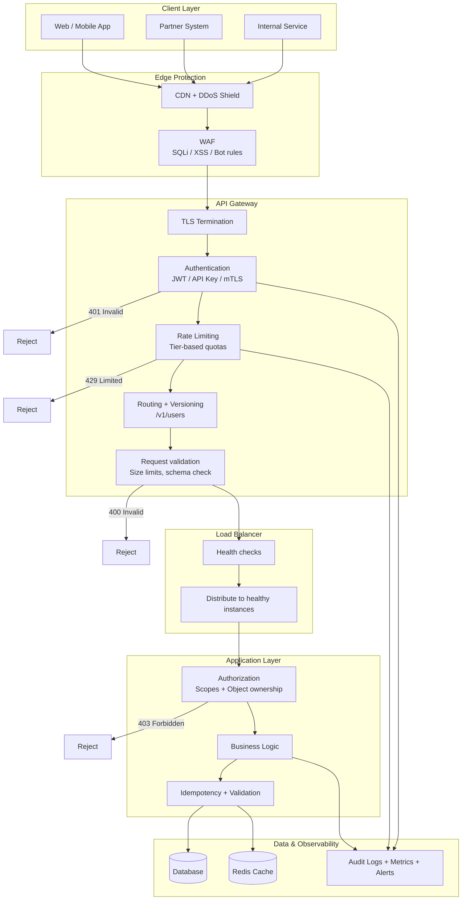

## Sequence: one protected API call

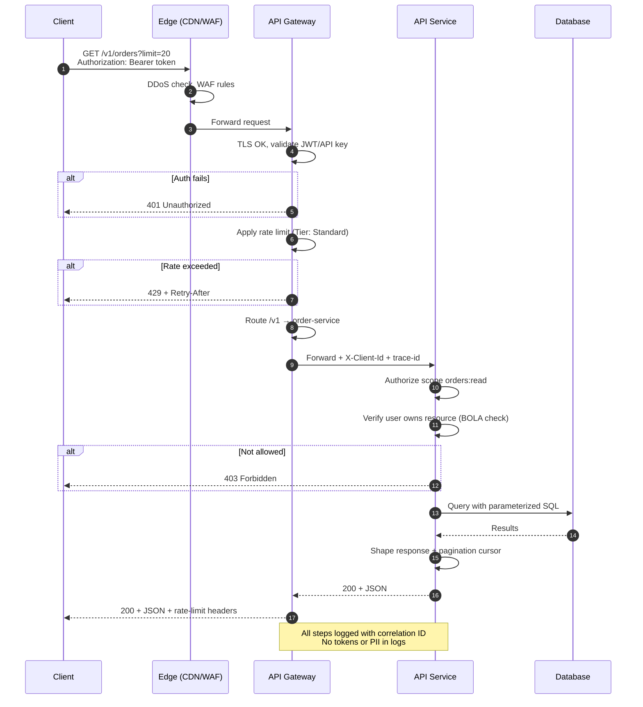

## Trust zones

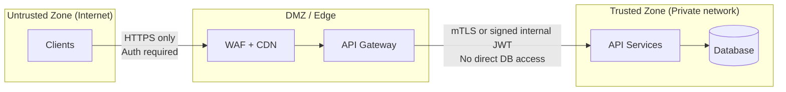

## Default recommendation

For most **public SaaS APIs**:

1. **Design** contract-first with OpenAPI (`/v1`, consistent errors, cursor pagination)
2. **Edge**: Cloudflare or equivalent (DDoS + WAF + bot management)
3. **Gateway**: Kong or AWS API Gateway (authN, tier rate limits, routing)
4. **Load balancer**: ALB or equivalent per service group (scale + health checks)
5. **App**: OAuth for users, scoped API keys for partners; object-level AuthZ in code
6. **Operate**: contract tests in CI, monitoring on 401/403/429/5xx, key rotation

See [Load Balancer, API Gateway & Entry Architecture](03-api-gateway.md) for flows and stack choices.

## Pros of this layered approach

- Each layer has a single responsibility — easier to reason about and audit
- Failures are contained (edge absorbs DDoS; gateway absorbs auth/rate abuse)
- Design contract (OpenAPI) stays separate from runtime enforcement (gateway)
- Teams can evolve services behind a stable `/v1` surface

## Cons of this layered approach

- More moving parts — ops complexity, cost, and latency hops
- Policies must stay consistent across edge, gateway, and app (drift risk)
- Over-engineering for internal-only APIs with trusted callers
- Debugging requires correlation IDs across all layers

## When a simpler stack is enough

- Internal-only APIs behind VPN with mTLS and trusted services
- Early MVP with one service, HTTPS + API key + basic rate limit
- Batch/integration workloads with low QPS and contractual SLAs only

## Common mistakes

| Mistake | Fix |
|---------|-----|
| Full gateway stack on day-one MVP | HTTPS + API key + basic rate limit first |
| AuthN at gateway without app AuthZ | Object-level checks on every `{id}` route |
| OpenAPI as docs only, not CI contract | Spectral + breaking diff + contract tests |
| Rate limits only by IP for B2B APIs | Per API key / user identity |
| No correlation ID across layers | `X-Request-Id` from edge through app |

---

# API(Application Programming Interface) Design Best Practices

> **Scope:** **General REST(Representational State Transfer)/HTTP(Hypertext Transfer Protocol) API design** — resources, errors, pagination, contracts. Event-sourced command/query APIs → [ES §4 API design implications](../event-sourcing-and-cqrs/includes/04-api-design-implications.md).

> **Related:** Protection layers → [§2 API protection](02-api-protection.md) · OpenAPI contract → [§7 OpenAPI / Swagger](07-openapi-swagger.md) · Idempotency → [§13 Idempotency](13-idempotency.md) · Versioning → [§14 API versioning](14-api-versioning-and-deprecation.md)

## What it is

API design defines **how clients interact with your system**: URLs, HTTP methods, request/response shapes, errors, pagination, and versioning. Good design is **predictable**, **consistent**, and **hard to misuse**.

## Core principles

### 1. Design around resources, not actions

Use **nouns** in paths; let HTTP verbs express behavior.

```http
GET    /v1/users/123
POST   /v1/users
PATCH  /v1/users/123
DELETE /v1/users/123
```

When CRUD does not fit, use a **sub-resource command** sparingly:

```http
POST /v1/orders/123/cancel
POST /v1/payments/456/refund
```

### 2. Be consistent

- Plural resource names: `/users`, `/orders`
- One JSON casing convention (`snake_case` or `camelCase`) everywhere
- ISO 8601 UTC dates: `2026-06-14T18:30:00Z`
- Same pagination and error shape on every endpoint
- Same wrapper pattern (either always `{ "data": ... }` or never)

### 3. Use HTTP methods and status codes correctly

| Method | Use for |
|--------|---------|
| `GET` | Read (safe, idempotent) |
| `POST` | Create or non-idempotent actions |
| `PUT` | Full replace |
| `PATCH` | Partial update |
| `DELETE` | Remove |

| Code | Meaning |
|------|---------|
| `200` | Success with body |
| `201` | Created |
| `204` | Success, no body |
| `400` | Malformed request |
| `401` | Not authenticated |
| `403` | Authenticated but not allowed |
| `404` | Resource not found |
| `409` | Conflict (duplicate, stale state) |
| `422` | Semantically invalid input |
| `429` | Rate limited |
| `500` | Server error |

**Do not** return `200` with `{ "success": false }`. **Do not** use `404` to hide authorization failures when existence leakage matters.

### 4. Standard response shapes

**List success:**

```json
{
  "data": [
    { "id": "ord_123", "status": "open", "created_at": "2026-06-14T10:00:00Z" }
  ],
  "pagination": {
    "next_cursor": "abc",
    "has_more": true
  }
}
```

**Error (same shape everywhere):**

```json
{
  "error": {
    "code": "invalid_email",
    "message": "Email must be a valid address.",
    "request_id": "req_9f2a",
    "details": [
      { "field": "email", "issue": "format" }
    ]
  }
}
```

### 5. Pagination, filtering, sorting

```http
GET /v1/orders?status=open&sort=-created_at&limit=20&cursor=abc
```

- Document supported filters explicitly
- Cap `limit` (e.g. max 100)
- Prefer **cursor pagination** for large or frequently changing datasets
- Offset pagination is simpler but performs poorly at scale

### 6. Versioning

| Approach | Example | Pros | Cons |
|----------|---------|------|------|
| **URL path** | `/v1/users` | Visible, easy to route | URLs change per version |
| **Header** | `Accept: application/vnd.app.v1+json` | Clean URLs | Harder to test in browser |
| **Query param** | `/users?version=1` | Easy to add | Messy, easy to forget |

**Rules:**

- Add optional fields freely; removing or renaming fields is **breaking**
- Deprecate with `Deprecation` and `Sunset` headers
- Never make breaking changes in place on a stable version

### 7. Write safety

```http
POST /v1/orders
Authorization: Bearer ...
Idempotency-Key: 7c9e6679-7425-40de-944b-e07fc1f90ae7
Content-Type: application/json
```

- **Idempotency keys** on POST with side effects (payments, orders) — full guide → [Idempotency](13-idempotency.md)
- **Optimistic concurrency** with `ETag` / `If-Match` on updates — maps to aggregate version checks; return `409 Conflict` on stale writes
- Whitelist writable fields — prevent mass assignment

For operations that may run longer than ~30 seconds (exports, batch jobs), use async job resources — see [Async patterns](10-async-patterns.md).

Event-sourced write models use the same headers for command APIs — see [Event Sourcing & CQRS](../event-sourcing-and-cqrs/includes/04-api-design-implications.md).

### 8. Modeling tips

- Stable IDs: prefixed strings (`usr_`, `ord_`) or UUIDs — avoid exposing auto-increment integers publicly
- Money: minor units + currency code, or decimal string — **never floats**
- Enums as strings, not magic numbers
- Relationships via sub-resources: `GET /v1/users/123/orders`

## REST vs RPC-style HTTP

| Style | Pros | Cons | When to use |
|-------|------|------|-------------|
| **REST (resource-oriented)** | Predictable, cacheable, standard tooling | Awkward for complex actions | Default for most HTTP APIs |
| **RPC-style** (`POST /createOrder`) | Familiar to some teams | Inconsistent, poor cache semantics | Legacy integrations only |
| **GraphQL** | Flexible queries, one endpoint | Complexity, caching, authorization per field | Mobile/apps with varied data needs |
| **gRPC** | Performance, strong contracts | Not browser-native | Internal microservices |

## Common mistakes

- Verbs in every URL (`/getUser`, `/deleteUser`)
- Inconsistent pluralization (`/user` vs `/orders`)
- Returning entire DB rows (password hashes, internal flags)
- Undocumented query parameters
- Giant response objects with 80+ fields
- Silent breaking changes without version bump

## Pros of strong API design

- Faster partner and client integration
- Fewer support tickets and misuse bugs
- Easier to add gateway policies and contract tests
- Clear evolution path via versioning

## Cons / trade-offs

- Contract-first design slows initial prototyping
- Strict consistency requires discipline across teams
- Over-versioning creates maintenance burden (`/v1` … `/v5`)
- REST purity can fight natural business language — pragmatic command endpoints are OK in moderation

---

# API(Application Programming Interface) Protection

> **Related:** Entry architecture → [§3 Gateway](03-api-gateway.md) · Auth model → [§4 Auth model](04-auth-model.md) · Threat model → [§6 Threat model](06-threat-model.md) · Rate limits → [api-rate-limiting](../api-rate-limiting/README.md)

## What it is

API protection is **layered defense**: verify callers, limit abuse, validate input, encrypt transport, and detect attacks. No single control is sufficient.

## Defense in depth

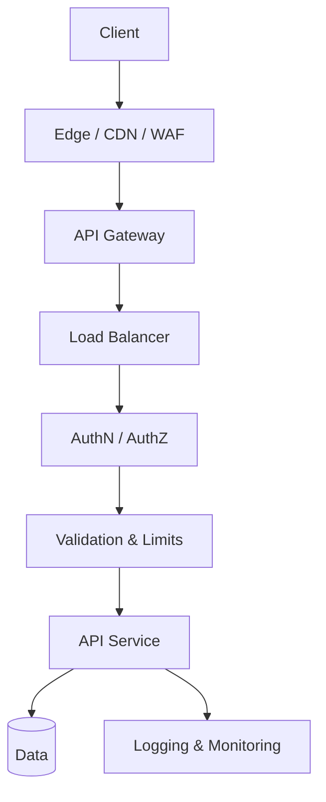

> LB may be omitted for a single-instance MVP. See [entry architecture](03-api-gateway.md).

## Protection layers

| Layer | Responsibilities | Typical tools |
|-------|------------------|---------------|
| **Edge** | DDoS, WAF(Web Application Firewall), bot management, geo rules | Cloudflare, AWS Shield, Fastly |
| **Gateway** | TLS(Transport Layer Security), authN, rate limits, routing, size limits | Kong, AWS API Gateway, Azure APIM |
| **Load balancer** | Health checks, scale replicas | AWS ALB/NLB, NGINX, K8s Service |
| **Application** | authZ, validation, idempotency, business rules | Your service code |
| **Data** | Encryption at rest, least-privilege DB roles | RDS, PostgreSQL RLS |
| **Operations** | Audit logs, alerting, secret rotation, pen tests | Datadog, SIEM, Vault |

## 1. Transport security

- **HTTPS only** — reject or redirect HTTP(Hypertext Transfer Protocol)
- **TLS 1.2+** (prefer 1.3)
- **HSTS** for browser-facing APIs
- **mTLS(Mutual Transport Layer Security)** for high-trust B2B or internal service mesh

### Pros

- Industry baseline; required for compliance
- Protects credentials and data in transit

### Cons

- Certificate management overhead
- mTLS adds operational complexity for partners

## 2. Authentication (AuthN)

Prove **who** is calling.

| Method | Best for |
|--------|----------|
| OAuth(Open Authorization) 2.0 / OIDC(OpenID Connect) | User-facing and third-party apps |
| API keys | Server-to-server, partners |
| JWT(JSON Web Token) access tokens | Stateless auth across services |
| mTLS | High-trust B2B, internal mesh |

**Practices:**

- Never put credentials in URL query strings
- Fail closed → `401`, not anonymous fallback
- Rotate secrets; support overlapping validity during rotation
- Store secrets in a vault, not in code or git

## 3. Authorization (AuthZ)

Prove **what** the caller may do — always in the **application layer**, not gateway alone.

- Scope-based: `orders:read`, `orders:write`
- Object-level: user 123 may only access their orders (**BOLA(Broken Object-Level Authorization)** — OWASP(Open Worldwide Application Security Project) API #1)
- RBAC(Role-Based Access Control) / ABAC as appropriate

| Response | When |
|----------|------|
| `401` | Missing or invalid credentials |
| `403` | Valid credentials but insufficient permission |

## 4. Input validation

Treat all input as hostile: body, query, path, headers.

- Validate type, length, format, range, enum
- Reject unknown fields on write (mass assignment)
- Parameterized queries — no SQL(Structured Query Language) string concatenation
- Cap payload size and JSON nesting depth
- Sanitize file uploads

## 5. Rate limiting

Controls **how much** a caller can consume. Not a substitute for auth.

See the dedicated guide: [api-rate-limiting](../api-rate-limiting/README.md).

## 6. Idempotency and replay protection

**Write idempotency** (client retries, duplicate POSTs):

- `Idempotency-Key` on POST with side effects — see [Idempotency](13-idempotency.md)

**Inbound webhook replay protection:**

- HMAC(Hash-based Message Authentication Code) signatures + timestamps for webhooks
- Constant-time signature comparison
- Reject stale signed requests
- Dedup by `event_id` in a shared store

## 7. CORS, CSRF, browser-facing APIs

- CORS: allowlist origins; never `*` with credentials
- CSRF tokens or SameSite cookies for cookie-based sessions
- Security headers: `Content-Security-Policy`, `X-Content-Type-Options`

## 8. Logging and monitoring

**Log safely:**

- Request/correlation ID, client ID, endpoint, status, latency
- Rate-limit and auth failure counts

**Never log:**

- Raw tokens, API keys, passwords, full PAN, unnecessary PII

**Alert on:**

- Spikes in `401`, `403`, `429`
- Error rate anomalies
- Unusual geo or IP patterns

## Fail-open vs fail-closed

| Strategy | Pros | Cons | When |
|----------|------|------|------|
| **Fail closed** (reject if limiter down) | Safer under attack | Availability hit if Redis/gateway fails | Financial, auth, write endpoints |
| **Fail open** (allow if limiter down) | Higher availability | Vulnerable during outages | Read-heavy, internal low-risk |

Default: **fail closed** for auth and expensive writes; document the choice. Production fail-open policy and war stories → [api-rate-limiting §11](../api-rate-limiting/includes/11-common-mistakes-and-architecture.md).

## Pros of layered API protection

- Attack surface reduced at each hop
- Blast radius contained (edge absorbs volumetric attacks)
- Clear audit trail when combined with correlation IDs
- Aligns with compliance frameworks (SOC2, PCI)

## Cons

- Latency added at each layer
- Cost of WAF, gateway, and observability tooling
- Policy drift if edge, gateway, and app disagree
- False positives from WAF/bot rules blocking legitimate clients

## Common mistakes

| Mistake | Fix |
|---------|-----|
| WAF only, no app validation | Validate input in service layer too |
| Rate limit store down with no policy | Document fail-open vs fail-closed per endpoint class |
| Log `Authorization` headers | Redact tokens; log client ID only |
| TLS termination only at app | Terminate at edge/gateway; enforce HTTPS |
| No alert on 401/403/429 spikes | Dashboard + paging on auth and limit anomalies |

---

# Load Balancer, API(Application Programming Interface) Gateway & Entry Architecture

How traffic enters your API stack: what load balancers and API gateways each do, how they work together, and which products to pick by scenario.

> **Scope:** **Architecture lens** — LB vs gateway, request flows, product selection. Throughput tips (CDN(Content Delivery Network) cache, hop count, TLS(Transport Layer Security) CPU) → [HTS §2 Entry and edge](../high-throughput-systems/includes/02-entry-and-edge.md).
>
> **Related:** Rate-limit deployment layers → [api-rate-limiting §7](../api-rate-limiting/includes/07-deployment-layers.md) · Throughput tips → [HTS §2 Entry and edge](../high-throughput-systems/includes/02-entry-and-edge.md)

---

## At a glance

| | **Load balancer (LB)** | **API gateway** |
|---|---|---|
| **Primary job** | Distribute traffic across healthy backends | Manage, secure, and route **API** traffic |
| **Layer** | L4 (TCP/UDP) or L7 (HTTP(Hypertext Transfer Protocol)) | L7 (HTTP/HTTPS) |
| **Routing** | IP, port, basic path/host | Path, method, headers, version, tenant |
| **Auth / rate limits** | Usually none (minimal at L7) | JWT(JSON Web Token), API keys, OAuth(Open Authorization), throttling, usage plans |
| **Transformation** | Rare | Request/response rewrite, aggregation |
| **Examples** | AWS ALB/NLB, NGINX, HAProxy | Kong, AWS API Gateway, Azure APIM, Cloudflare |

**Rule of thumb:** A load balancer sends traffic to the right **server**. An API gateway sends traffic to the right **API operation** with policy and developer-facing concerns.

Stateless app tiers (no sticky sessions) → [Stateless architecture](11-stateless-architecture.md).

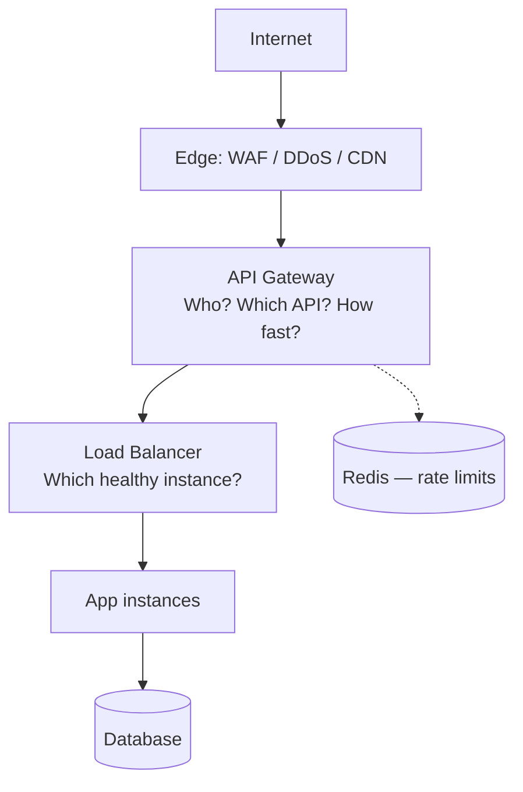

---

## Load balancer vs API gateway

Both sit in front of backend services, but they solve different problems.

### Comparison

| Concern | Load balancer | API gateway |
|---------|---------------|-------------|
| Scale identical app instances | ✅ Primary use | Optional upstream LB |
| API keys, JWT, OAuth at the edge | ❌ | ✅ |
| Path routing `/users`, `/orders` | Basic (L7 ALB) | ✅ Rich |
| Usage plans / product tiers | ❌ | ✅ |
| Health checks + failover | ✅ | Via upstream targets |
| mTLS(Mutual Transport Layer Security) service-to-service | NLB or mesh | Client mTLS at gateway |
| Global low latency | CDN(Content Delivery Network) in front | Edge gateway (Cloudflare) |

### When to use which

| Scenario | Use |
|----------|-----|
| Scale web app or microservice replicas | **Load balancer** |
| Single entry point for many microservices | **API gateway** |
| Public third-party API with keys and quotas | **API gateway** |
| Raw TCP / internal non-HTTP(Hypertext Transfer Protocol) traffic | **L4 load balancer** (not gateway) |
| TLS termination + simple path routing only | **L7 load balancer** may be enough |
| BFF(Backend for Frontend), request aggregation, GraphQL federation | **API gateway** or dedicated BFF |

### Overlap (why people confuse them)

Modern **L7 load balancers** (AWS ALB, NGINX) can do path routing, TLS, and WAF(Web Application Firewall) integration. **API gateways** also load-balance across upstreams. The difference is **intent**:

- **LB** — infrastructure: availability and distribution
- **Gateway** — application/API: contracts, security, developer experience

### Gateway vs load balancer vs service mesh

| Component | Role | Direction | Pros | Cons |
|-----------|------|-----------|------|------|
| **Load balancer** | Distribute traffic to healthy instances | North-south (to apps) | Simple, fast | No API-aware policies |
| **API gateway** | Auth, limits, versioning, routing | North-south (from clients) | Central API policy | Extra hop, cost |
| **Service mesh** | mTLS, retries, observability between services | East-west (service-to-service) | Zero-trust internal | Not a public API product alone |

---

## Request flows

### Flow 1 — Load balancer only

Traffic spreads across identical (or similar) service instances. The client uses one hostname; the LB picks a backend.

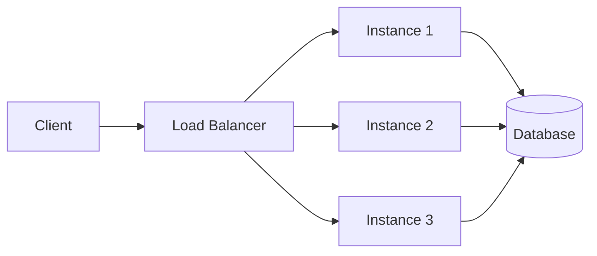

**Steps:**

1. Client → `GET https://api.example.com/users/123`
2. LB receives request (often TLS termination here)
3. Health checks exclude unhealthy instances
4. LB picks instance (round-robin, least connections, etc.)
5. Same instance handles the full request/response

**Good for:** scaling one service, high availability, simple path pools (`/api` → one pool, `/static` → another).

---

### Flow 2 — API gateway only (single backend pool)

The gateway handles API concerns; one service (or small set) sits behind it.

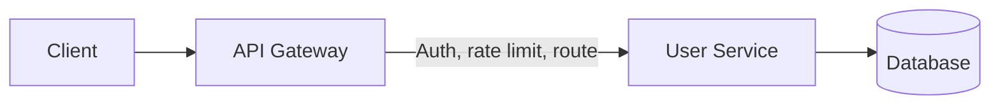

**Steps:**

1. Client → `GET /v2/users/123` with `Authorization: Bearer …`
2. Gateway validates API key or JWT
3. Applies rate limit per client or subscription tier
4. Routes `/v2/users/*` → User Service
5. May strip path prefix, add internal headers, log metrics
6. Forwards to backend; returns response (optionally transformed)

**Good for:** public APIs, versioning, monetization, central auth, OpenAPI-backed portals.

---

### Flow 3 — Both together (common at scale)

**Gateway** for API policy; **LB** for scaling each microservice.

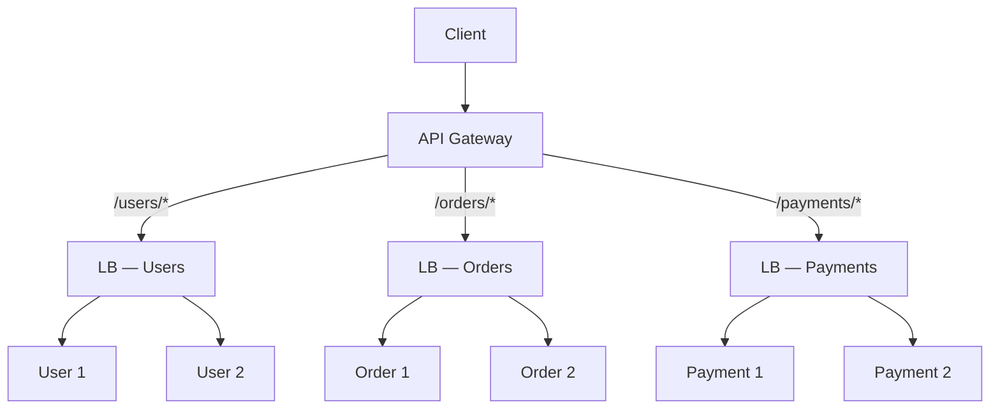

**Example — `GET /orders/456`:**

```
Client
  → API Gateway     (auth, rate limit, route to Orders)
  → Orders LB       (pick healthy Order pod)
  → Order Service   (business logic)
  → Database
  ← response back through the chain
```

---

### Flow 4 — Sequence: what each layer sees

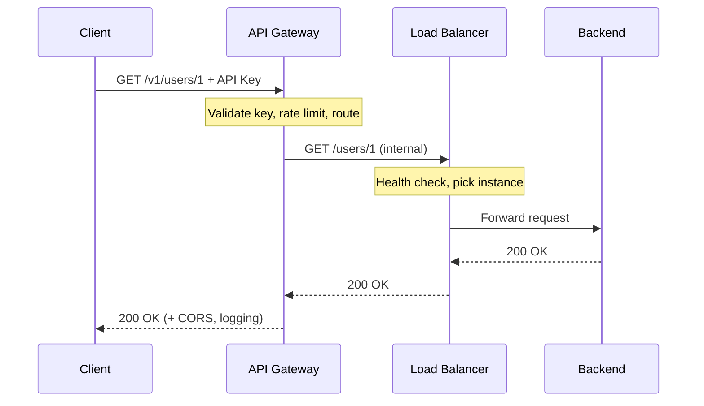

This sequence matches the protected call in [Overview — full flow](00-overview.md#sequence-one-protected-api-call); the overview diagram adds edge WAF and application AuthZ layers.

---

## Tech stacks by scenario

### Layer reference

| Layer | Job | Common choices |
|-------|-----|----------------|
| **Edge** | DDoS, WAF, coarse rate limits | Cloudflare, AWS CloudFront + WAF, Fastly |
| **API gateway** | Auth, API keys, versioning, routing | Kong, AWS API Gateway, Azure APIM, Cloudflare API Gateway |
| **Load balancer** | Scale + health-check backends | AWS ALB/NLB, GCP LB, Azure App Gateway, NGINX, HAProxy |
| **Services** | Business logic | Node, Go, Java microservices, or monolith |
| **Rate-limit store** | Shared counters across gateway instances | Redis (ElastiCache, Memorystore, etc.) |

### Stack decision flow

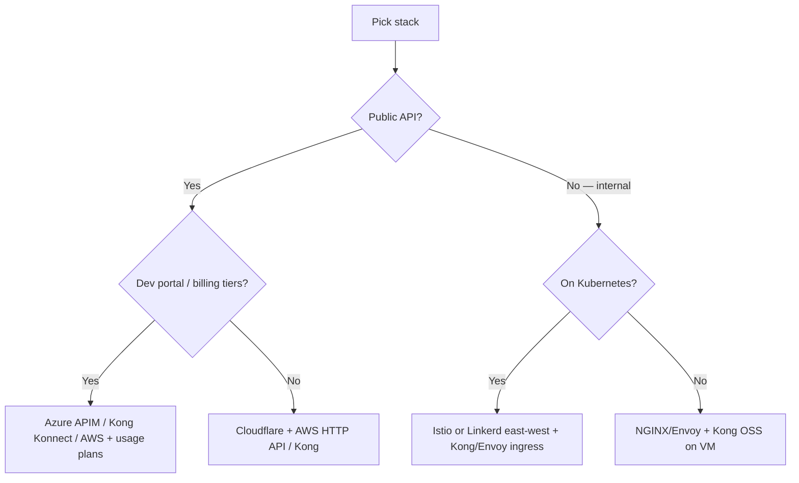

### Recommended stacks by API type

| API type | Stack |
|----------|-------|
| **Public SaaS API** | Cloudflare (edge) → Kong or AWS API Gateway → **ALB per service** → pods/VMs |
| **AWS-native** | Route 53 → CloudFront + WAF → API Gateway → ALB → ECS/EKS/Lambda |
| **Kubernetes** | Ingress / Gateway API or Kong Ingress → K8s Service (LB) → pods; Istio/Linkerd for east-west |
| **B2B partner API** | Azure Front Door or Cloudflare → Azure APIM or Kong → ALB + optional client mTLS |
| **Mobile backend** | Cloudflare + AWS HTTP API + Cognito/OAuth → ALB → services |
| **Internal microservices** | Istio/Linkerd mTLS + ingress gateway for north-south; mesh for east-west |
| **Startup MVP** | Cloudflare + single gateway (AWS HTTP API or Kong OSS); skip separate LB until you scale |
| **Self-hosted / on-prem** | HAProxy or NGINX (LB) → Kong OSS or Tyk → app servers; Redis for limits |

### Scenario details

#### Public SaaS API

```
Cloudflare (edge)
  → Kong or AWS API Gateway (auth, tiers, routing)
    → ALB / NGINX (per microservice)
      → ECS/EKS pods or EC2
```

| Piece | Pick |
|-------|------|
| Edge | Cloudflare (WAF + edge rate limits) |
| Gateway | Kong Konnect or AWS API Gateway + usage plans |
| LB | AWS ALB (L7) per service group |
| Auth | Auth0, Cognito, or Kong OAuth/JWT plugins |
| Limits | Gateway + Redis; app layer for plan-specific quotas |

#### AWS-native

```
Route 53 → CloudFront + WAF → API Gateway → ALB → ECS Fargate / EKS / Lambda
```

| Piece | Pick |
|-------|------|
| Gateway | AWS API Gateway (HTTP API for simple; REST(Representational State Transfer) for usage plans) |
| LB | ALB for containers; NLB for raw TCP |
| Auth | Cognito, Lambda authorizers, IAM (internal) |
| IaC | Terraform or AWS CDK |

#### Kubernetes

| Piece | Pick |
|-------|------|
| Gateway (north-south) | Kong Ingress, Envoy Gateway, Istio ingress, or cloud LB + Gateway API |
| LB (in-cluster) | Kubernetes Service + cloud LB annotation or MetalLB |
| East-west | Istio or Linkerd — **not** a substitute for a public API gateway |
| Limits | Kong + Redis, or Envoy rate limit service |

**Mental model:** Ingress/Gateway API ≈ API gateway layer; Kubernetes Service ≈ load balancer for pods.

#### Greenfield default

If no strong constraints: **Cloudflare** (edge) + **Kong** or **AWS API Gateway** + **ALB** per service + **EKS/ECS** + **Cognito/Auth0** + **OpenAPI 3** contract.

---

## Choosing an API gateway product

Once you know you need a gateway (not just an LB), pick the product.

### Gateway selection flow

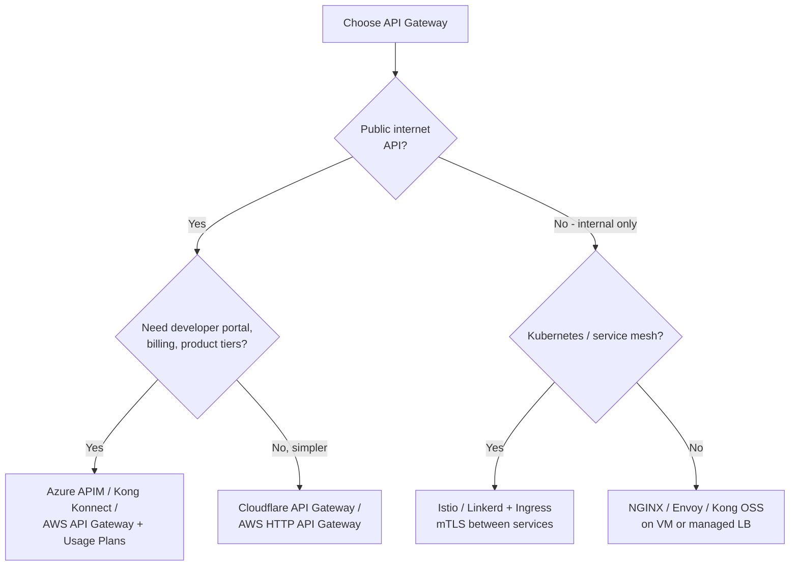

### Gateway comparison matrix

| Gateway | Best for | Auth | Rate limits | WAF/DDoS | Pros | Cons |
|---------|----------|------|-------------|----------|------|------|
| **AWS API Gateway** | AWS-native stacks | Cognito, Lambda authorizer, IAM | Throttling + usage plans | Via AWS WAF + Shield | Deep AWS integration, usage plans for tiers | Vendor lock-in, config complexity |
| **Kong / Kong Konnect** | Multi-cloud, plugins | OAuth, JWT, key-auth, mTLS | Redis-backed, flexible | Pair with Cloudflare/AWS WAF | Rich plugin ecosystem, portable | Self-hosted ops unless Konnect |
| **Azure APIM** | Enterprise B2B | OAuth, certs, subscriptions | Per-subscription quotas | Azure Front Door + WAF | Developer portal, enterprise features | Heavier, Azure-centric |
| **Cloudflare API Gateway** | Edge-first, global latency | JWT, mTLS, API tokens | Edge rate limiting | Built-in WAF + DDoS | Low ops, global edge | Less backend transformation |
| **NGINX / Envoy** | Self-hosted, K8s ingress | External auth subrequest | lua/redis modules | External WAF required | Full control, predictable cost | You operate everything |
| **Istio / Linkerd** | Internal microservices | mTLS + RBAC(Role-Based Access Control) | Local limits | Not north-south alone | Strong east-west zero-trust | Wrong tool as sole public gateway |

---

## What the gateway should do

| Responsibility | Gateway | Load balancer | Application |
|----------------|---------|---------------|-------------|
| TLS termination | ✅ | ✅ (common) | Optional internal mTLS |
| Authentication (AuthN) | ✅ | ❌ | Validate internal identity headers |
| Rate limiting | ✅ | ❌ | Optional second layer on expensive ops |
| Routing `/v1` → service | ✅ | Basic | — |
| Request size limits | ✅ | Sometimes | — |
| Health checks + failover | Via upstream | ✅ | — |
| Authorization (AuthZ) | Partial (scopes) | ❌ | ✅ Object-level checks |
| Business logic | ❌ | ❌ | ✅ |
| Idempotency | ❌ | ❌ | ✅ |

---

## Importing OpenAPI into gateway

Some gateways (Kong, Azure APIM, AWS) can **import OpenAPI** to auto-create routes.

### Pros

- Faster bootstrap from contract-first spec
- Routes stay aligned with documented paths

### Cons

- Policies (rate limits, auth) still configured separately
- Spec drift if import is one-time only — use CI to verify

See [OpenAPI / Swagger](07-openapi-swagger.md) for the full lifecycle role of the spec.

---

## Pros and cons

### Using a load balancer

**Pros:** Simple, fast, proven HA pattern; minimal latency overhead.

**Cons:** No API-aware auth, tiers, or versioning; wrong tool for public API products alone.

### Using an API gateway

**Pros:** Central auth, rate limits, and routing; hides internal topology; usage plans map to product tiers.

**Cons:** Single point of failure if not HA; added latency (typically single-digit ms); can become a policy junk drawer; migration pain if chosen wrong.

### Using both (typical production)

**Pros:** Clear separation — gateway for API policy, LB for scaling each service.

**Cons:** More hops, cost, and operational surface; requires correlation IDs for debugging.

## Common mistakes

| Mistake | Fix |
|---------|-----|
| Gateway as only auth layer | App still enforces object-level AuthZ |
| One-time OpenAPI import, never synced | CI verify routes match spec |
| LB only for public API products | Add gateway for auth, tiers, versioning |
| Policy junk drawer in gateway | Keep business rules in app; gateway for cross-cutting |
| No health check distinction | Readiness must include DB/cache dependencies |

---

# Auth Model

> **Related:** Enterprise identity → [§12 Identity RBAC / IAM / AD](12-identity-rbac-iam-ad.md) · Gateway enforcement → [§3 Gateway](03-api-gateway.md) · Webhook security → [§10 Async patterns](10-async-patterns.md)

## What it is

The **auth model** defines how clients prove identity (authentication) and how the system decides what they may access (authorization). Gateway handles AuthN; services must handle AuthZ — especially **object-level** permissions.

OAuth(Open Authorization) and JWT(JSON Web Token) tell you **who** called; **RBAC(Role-Based Access Control)** and **IAM(Identity and Access Management)** define **what roles and permissions** they have. Enterprise identity often flows from Active Directory (or Entra ID) into token claims and API(Application Programming Interface) policies.

Full details → [Identity: RBAC, IAM & Active Directory](12-identity-rbac-iam-ad.md)

## Auth by client type

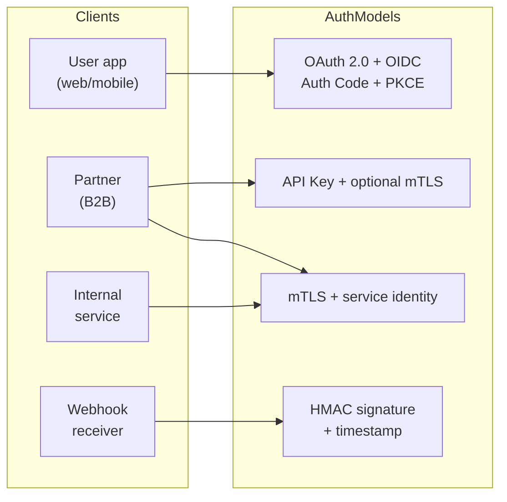

## Decision matrix

| Client | Auth model | Token lifetime | Gateway | Application |
|--------|------------|----------------|---------|-------------|
| **End-user app** | OAuth 2.0 + PKCE(Proof Key for Code Exchange) → JWT | Access: ~15 min; refresh: days | Validate JWT sig, iss, aud, exp | Scopes + user owns resource |
| **Partner / server** | API key + IP allowlist; optional mTLS(Mutual Transport Layer Security) | Rotate quarterly | Key lookup → `client_id` | Scope per key; audit all calls |
| **Internal service** | mTLS + short-lived service JWT | 5–15 min | Terminate mTLS, forward identity | RBAC / service allowlists |
| **Webhooks (inbound)** | HMAC(Hash-based Message Authentication Code)-SHA256 + timestamp | N/A | Optional IP allowlist | Verify signature, reject replays |

## Layered auth flow

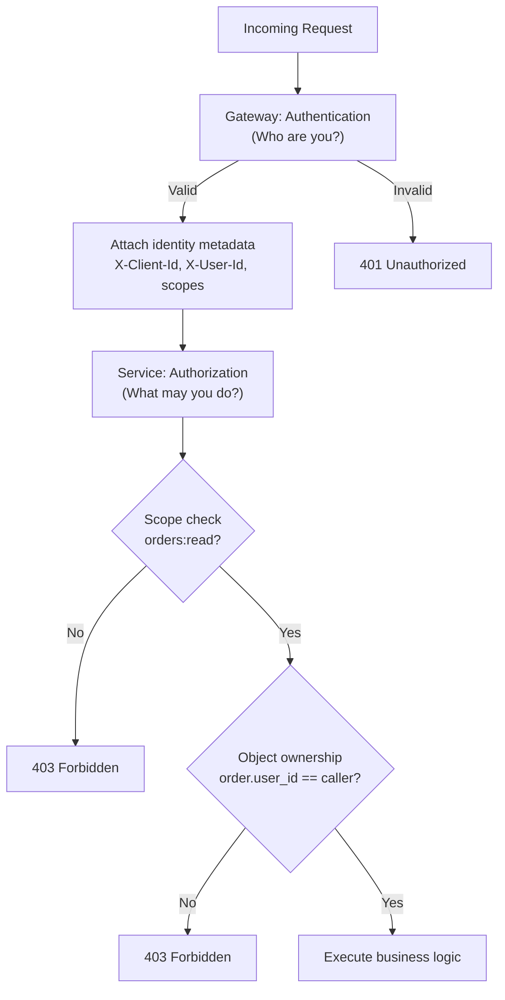

## OAuth 2.0 + OIDC (user-facing)

### Pros

- Industry standard; SDK support everywhere
- Short-lived access tokens; refresh token rotation
- Fine-grained scopes
- PKCE secures public clients (SPAs, mobile)

### Cons

- Complex to implement correctly (many failure modes)
- Token validation overhead at gateway
- Refresh token storage must be secure
- Implicit flow is deprecated — avoid it

**Best practices:**

- Authorization Code + PKCE for public clients
- Lock redirect URIs exactly
- Minimal scopes per client
- Short access token TTL

## API keys (server-to-server)

### Pros

- Simple for partners to integrate
- Easy to issue, revoke, and rotate
- Maps cleanly to rate-limit tiers

### Cons

- Long-lived secrets — high impact if leaked
- No built-in user context (service identity only)
- Often sent in headers — must never log them
- IP allowlists break with dynamic partner IPs

**Best practices:**

- Scoped keys (read-only where possible)
- Rotation with overlapping validity
- Store hashed keys server-side if feasible
- Per-key audit logging

## JWT access tokens

### Pros

- Stateless validation (no DB lookup per request)
- Works across distributed services
- Claims carry scopes and subject

### Cons

- Hard to revoke instantly without blocklist or short TTL
- Payload is signed, not encrypted — no secrets in claims
- Clock skew and algorithm confusion attacks if validation is sloppy
- Teams misuse JWTs as long-lived "API keys"

**Best practices:**

- Validate: signature, `exp`, `iss`, `aud`, `nbf`
- Short TTL (minutes)
- Asymmetric keys (RS256) with key rotation

## mTLS (mutual TLS(Transport Layer Security))

### Pros

- Strong cryptographic identity for B2B and internal calls
- No shared secret in every request header
- Fits zero-trust internal mesh

### Cons

- Certificate lifecycle management for every client
- Partner onboarding friction
- Not suitable for browser clients
- Debugging connectivity issues is harder

## HMAC webhooks

### Pros

- Proves payload integrity and origin
- No OAuth dance for simple callbacks

### Cons

- Shared secret rotation requires coordination
- Replay attacks if timestamp/nonce not enforced
- Each provider uses different header conventions

## Auth model comparison summary

| Model | Security | Ease of integration | Revocation | Best fit |
|-------|----------|---------------------|------------|----------|
| OAuth + JWT | High | Medium | Medium (short TTL + revoke refresh) | User apps |
| API key | Medium | High | High (revoke key) | Partners, scripts |
| mTLS | Very high | Low | Medium (cert revoke) | B2B, internal |
| HMAC webhook | Medium | Medium | Medium | Inbound webhooks |

## Common mistakes

- AuthN at gateway but **no object-level AuthZ** in app (BOLA(Broken Object-Level Authorization))
- Long-lived JWTs treated as permanent API keys
- Returning `404` instead of `403` inconsistently
- Logging `Authorization` headers
- One global admin API key for all partners

---

# Rate-Limit Tiers

> **Scope:** **Product lens** — tier definitions, per-endpoint multipliers, canonical `429` headers. Algorithms, deployment layers, and production architecture → [api-rate-limiting](../api-rate-limiting/README.md).
>
> **Related:** Limiter algorithms → [api-rate-limiting](../api-rate-limiting/README.md) · Gateway usage plans → [§3 Gateway](03-api-gateway.md) · Async escape hatch → [§10 Async patterns](10-async-patterns.md)

## What it is

**Rate-limit tiers** map product plans (Free, Standard, Professional, Enterprise) to request quotas. Limits should be keyed by **identity** (API(Application Programming Interface) key, user, subscription) — not IP alone.

For algorithm details (fixed window, token bucket, sliding window), see: [api-rate-limiting](../api-rate-limiting/README.md).

## Tier flow

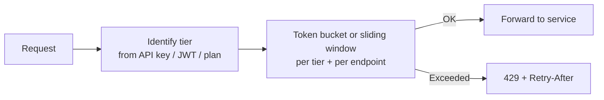

## Tier definitions

| Tier | Typical caller | Requests/min | Requests/day | Burst | Expensive endpoints* | Monthly quota |
|------|----------------|--------------|--------------|-------|----------------------|---------------|
| **Free** | Trial / dev | 60 | 10,000 | 10 | 5/min | 100K |
| **Standard** | Paid small team | 600 | 500,000 | 100 | 30/min | 5M |
| **Professional** | Production app | 3,000 | 5,000,000 | 500 | 150/min | 50M |
| **Enterprise** | Contract | Custom | Custom | Custom | Custom SLA | Unlimited† |
| **Internal** | Your services | 10,000+ | N/A | High | Separate pool | N/A |

\*Expensive: reports, search, bulk export, ML inference, file processing  
†Still apply abuse caps and cost alerts

## Per-endpoint multipliers

Apply stricter limits to costlier operations:

| Endpoint class | Limit multiplier | Example |
|----------------|------------------|---------|
| Read single resource | 1× base | `GET /v1/users/123` |
| List / search | 0.5× base | `GET /v1/orders?...` |
| Write | 0.3× base | `POST /v1/orders` |
| Bulk / export | 0.05× base | `POST /v1/reports/export` |
| Auth / token | 0.2× base + CAPTCHA at edge | `POST /oauth/token` |

## Response headers

Always return rate-limit metadata (canonical header set for product tiers):

```http
HTTP/1.1 429 Too Many Requests
Retry-After: 60
X-RateLimit-Limit: 600
X-RateLimit-Remaining: 0
X-RateLimit-Reset: 1718380860
```

Response strategies (hard reject vs throttle, retry-storm prevention) → [api-rate-limiting §9 Response strategies](../api-rate-limiting/includes/09-response-strategies.md).

## Layered limits

Enforce **global → per-IP → per-tier/API(Application Programming Interface) key → per-endpoint** (cheapest check first). This section defines **product tiers**; where each layer runs and how counters are shared is in the rate-limiting guide:

- Deployment layers (edge, gateway, app) → [api-rate-limiting §7](../api-rate-limiting/includes/07-deployment-layers.md)
- Production architecture diagram + fail-open policy → [api-rate-limiting §11](../api-rate-limiting/includes/11-common-mistakes-and-architecture.md)

## Async escape hatch

For heavy work, return `202 Accepted` instead of holding a request slot — tier limits still apply at enqueue time, but the client does not block on completion.

Full design (job states, webhooks, SSE(Server-Sent Events), OpenAPI) → [Async patterns](10-async-patterns.md).

## Mapping tiers to gateway products

| Platform | Feature |
|----------|---------|
| **AWS API Gateway** | Usage plans + API keys |
| **Kong** | Consumers, plugins, Redis rate limiting |
| **Azure APIM** | Subscriptions + product tiers |
| **Cloudflare** | Rate limiting rules per hostname/path |

## Pros of tier-based rate limiting

- Fair monetization aligned with product plans
- Protects infrastructure cost predictably
- Clear upgrade path for customers hitting limits
- Combines with analytics for capacity planning

## Cons

- Complex to communicate (multiple counters confuse developers)
- Wrong tier defaults frustrate free-tier users
- Enterprise "unlimited" still needs abuse protection
- Per-endpoint multipliers require maintenance as API evolves
- Distributed rate limiting needs Redis/similar — failure mode → [api-rate-limiting §11](../api-rate-limiting/includes/11-common-mistakes-and-architecture.md#5-fail-open-vs-fail-closed)

## Tier design best practices

- Document limits in OpenAPI description and developer portal
- Return consistent `429` body with `request_id`
- Offer `Retry-After` always
- Monitor `429` rate per tier — signals product or attack issues
- Separate **auth endpoint** limits to prevent credential stuffing

## Common mistakes

| Mistake | Fix |
|---------|-----|
| IP-only limits for authenticated B2B | Rate limit by API key / `client_id` |
| Enterprise tier with no abuse cap | "Unlimited" still needs ceiling + monitoring |
| Opaque 429 without `Retry-After` | Standard body + retry header always |
| Same limit for cheap GET and expensive POST | Per-endpoint multipliers |
| Tier limits only in dashboard, not OpenAPI | Document quotas in spec and portal |

---

# Threat Model

> **Related:** Protection layers → [§2 API protection](02-api-protection.md) · AuthZ gaps (BOLA(Broken Object-Level Authorization)) → [§4 Auth model](04-auth-model.md) · Pre-launch checklist → [§9 Checklist](09-checklist-and-practices.md)

## What it is

A **threat model** identifies what can go wrong, who might attack, and which controls mitigate each risk. For APIs, combine **STRIDE(Spoofing, Tampering, Repudiation, Information Disclosure, Denial of Service, Elevation of Privilege)** (systematic categories) with **OWASP(Open Worldwide Application Security Project) API(Application Programming Interface) Security Top 10** (API-specific risks).

## STRIDE mapped to layers

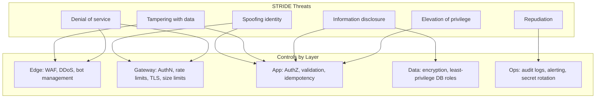

## STRIDE detail

| Threat | Definition | API example | Primary control |
|--------|------------|-------------|-----------------|
| **Spoofing** | Pretending to be someone else | Stolen API key, forged JWT(JSON Web Token) | Strong authN, short TTL, rotation |
| **Tampering** | Modifying data in transit or storage | SQL(Structured Query Language) injection, MITM | TLS(Transport Layer Security), WAF(Web Application Firewall), parameterized queries |
| **Repudiation** | Denying an action | Partner denies placing order | Audit logs with correlation IDs; append-only domain events ([Event Sourcing](../event-sourcing-and-cqrs/includes/04-api-design-implications.md#audit-and-history-apis)) |
| **Information disclosure** | Leaking sensitive data | Verbose errors, BOLA(Broken Object-Level Authorization) | Safe errors, object-level AuthZ |
| **Denial of service** | Making service unavailable | Flood expensive endpoints | Rate limits, WAF, autoscaling |
| **Elevation of privilege** | Gaining unauthorized access | Mass assignment `role=admin` | Field whitelists, RBAC(Role-Based Access Control) |

## OWASP API Security Top 10 (2023)

| # | Risk | Example attack | Control |
|---|------|----------------|---------|
| 1 | **Broken object-level authorization (BOLA)** | `GET /v1/orders/999` (not yours) | Owner check on every `{id}` route |
| 2 | **Broken authentication** | Leaked API key, weak OAuth(Open Authorization) | MFA for admin, key rotation, PKCE(Proof Key for Code Exchange) |
| 3 | **Broken object property-level authorization** | PATCH sets `"role":"admin"` | Whitelist writable fields |
| 4 | **Unrestricted resource consumption** | Flood `POST /search` | Tier limits, pagination caps, async queues |
| 5 | **Broken function-level authorization** | Regular user calls `/admin` | RBAC on every route; separate admin surface |
| 6 | **Unrestricted access to sensitive business flows** | Automated checkout abuse | Step-up auth, fraud signals, flow limits |
| 7 | **Server-side request forgery (SSRF(Server-Side Request Forgery))** | Webhook URL → `169.254.169.254` | Outbound allowlist; block private IPs |
| 8 | **Security misconfiguration** | Debug mode in prod | Hardened defaults, no stack traces in errors |
| 9 | **Improper inventory management** | Old `/v0` still exposed | API inventory, Sunset headers, gateway audit |
| 10 | **Unsafe consumption of third-party APIs** | Malformed upstream crashes parser | Validate external responses, timeouts, circuit breakers |

## Trust zones

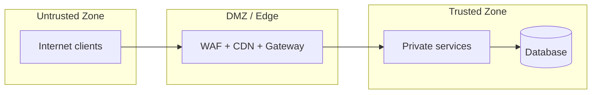

**Assumption:** Everything in the untrusted zone is hostile. Everything crossing into trusted must be authenticated, validated, and logged.

## Threat modeling workshop (minimal)

1. **Draw data flow** — client → edge → gateway → service → DB
2. **List assets** — user PII, payment data, API keys, admin functions
3. **List actors** — anonymous, authenticated user, partner, insider, attacker
4. **Apply STRIDE** per component
5. **Map to OWASP API** for API-specific gaps
6. **Prioritize** — likelihood × impact
7. **Assign controls** — design, gateway, code, ops
8. **Revisit** on every major API version or new endpoint class

## Pros of formal threat modeling

- Finds BOLA and auth gaps before production
- Aligns security and product teams on priorities
- Evidence for compliance audits
- Reduces pen-test surprises

## Cons

- Time-consuming if done as heavy documentation only
- Can become stale if not tied to CI/CD and reviews
- Over-focus on theoretical threats vs actual abuse patterns
- Not a substitute for penetration testing and monitoring

## Red team vs real abuse

| Approach | Pros | Cons |
|----------|------|------|
| **Threat modeling (design-time)** | Cheap, early | May miss novel attacks |
| **Pen testing (periodic)** | Finds real exploitable bugs | Point-in-time snapshot |
| **Production monitoring** | Catches live abuse | Reactive; damage may already occur |
| **Bug bounty** | Continuous testing | Noise, cost, scope management |

Use all four at different maturity stages.

## Common mistakes

| Mistake | Fix |
|---------|-----|
| Threat model doc never updated | Revisit on major version or new endpoint class |
| STRIDE workshop only, no monitoring | Production alerts on abuse patterns |
| Assume gateway stops BOLA | Object ownership checks in app code |
| Pen test once, no follow-up | Track findings to closure; retest |
| Ignore insider / partner threat actors | Include in actor list and controls |

---

# OpenAPI / Swagger

> **Related:** Contract testing in CI → [§15 Contract and schema testing](15-contract-and-schema-testing.md) · Versioning → [§14 API versioning](14-api-versioning-and-deprecation.md) · Gateway import → [§3 Gateway](03-api-gateway.md)

## What it is

**OpenAPI Specification (OAS)** is a standard format (`openapi.yaml` / `openapi.json`) for describing REST(Representational State Transfer) APIs. **Swagger** is the tooling ecosystem around OAS: Swagger Editor, Swagger UI, Swagger Codegen, and related validators.

Swagger does **not** replace gateway auth, WAF(Web Application Firewall), or rate limits. It defines and documents the **contract**; runtime protection is configured separately.

## Where Swagger fits in the lifecycle

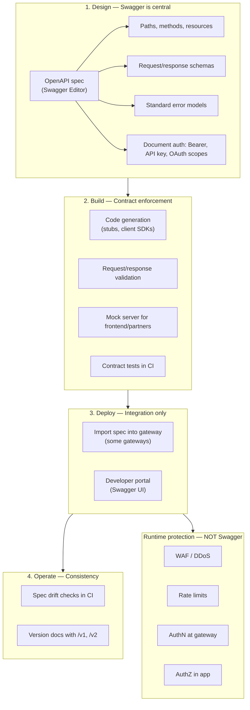

## Step-by-step responsibilities

| Step | Swagger/OpenAPI role | What actually enforces security |
|------|----------------------|----------------------------------|
| **Design** | Define paths, schemas, errors, auth schemes | Threat modeling (separate) |
| **Build** | Codegen, validation middleware, mocks, contract tests | App validation code |
| **Deploy** | Publish Swagger UI; optional gateway route import | Gateway policies, WAF, TLS(Transport Layer Security) |
| **Operate** | Detect spec vs implementation drift | Monitoring, key rotation |

## Example spec fragment

```yaml
openapi: 3.0.3
info:
  title: Orders API
  version: 1.0.0

paths:
  /v1/orders:
    get:
      summary: List orders
      security:
        - BearerAuth: [orders:read]
      parameters:
        - name: limit
          in: query
          schema:
            type: integer
            maximum: 100
        - name: cursor
          in: query
          schema:
            type: string
      responses:
        '200':
          description: OK
        '401':
          $ref: '#/components/responses/Unauthorized'
        '429':
          $ref: '#/components/responses/RateLimited'

components:
  securitySchemes:
    BearerAuth:
      type: http
      scheme: bearer
      bearerFormat: JWT
```

Document rate-limit headers in response descriptions even though the gateway enforces them.

## Swagger UI (developer portal)

### Pros

- Interactive docs — partners try endpoints with real auth
- Always in sync if generated from the same spec as CI
- Reduces integration support burden
- Shows required scopes and error codes

### Cons

- Exposes full API(Application Programming Interface) surface to attackers (mitigate with auth on try-it-out)
- Can drift from implementation if not CI-gated
- Not a substitute for narrative guides and examples
- Large specs are hard to navigate without grouping/tags

## Contract testing in CI

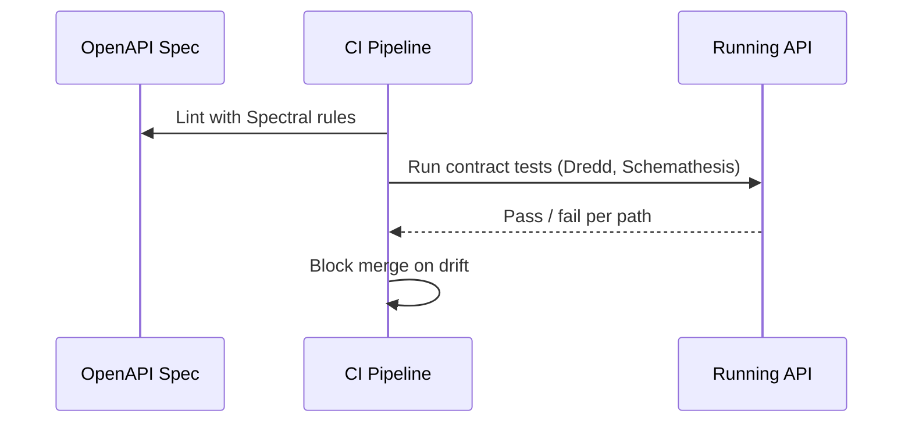

### Pros

- Catches breaking changes before release
- Enforces design standards via Spectral (e.g. must document `401`, must use `/v1`)

### Cons

- Test maintenance cost
- May not cover all edge cases or AuthZ logic
- False confidence if only happy paths are tested

## Code generation

| Direction | Pros | Cons |
|-----------|------|------|
| **Server stubs from spec** | Fast bootstrap; matches contract | Generated code quality varies; merge pain |
| **Client SDKs from spec** | Consistent partner integrations | SDK versioning and publishing overhead |
| **Hand-written server + spec** | Full control | Drift risk without CI checks |

## Gateway import from OpenAPI

Some gateways auto-create routes from the spec.

### Pros

- Faster initial gateway setup
- Route paths match documentation

### Cons

- Auth, rate limits, WAF still manual
- One-time import drifts quickly — prefer pipeline sync or verification

## OpenAPI vs implementation — who wins?

| Approach | Pros | Cons |
|----------|------|------|
| **Contract-first** (spec → code) | Design reviewed before build | Slower start |
| **Code-first** (code → spec) | Faster for small teams | Spec often neglected |
| **Hybrid + CI drift check** | Balance speed and safety | Requires discipline |

**Recommendation:** Contract-first for public/partner APIs; CI contract tests for all.

## Terminology

| Term | Meaning |
|------|---------|
| **OpenAPI (OAS)** | The specification standard |
| **Swagger Editor** | Edit OpenAPI visually or as YAML |
| **Swagger UI** | Renders spec as interactive HTML docs |
| **Spectral** | Linter for OpenAPI style and security rules |
| **Schemathesis / Dredd** | Contract test runners |

## What Swagger does NOT do

| Capability | Swagger? | Who does it |
|------------|----------|-------------|
| Rate limiting | No | API Gateway, Cloudflare |
| WAF / DDoS | No | Edge provider |
| JWT(JSON Web Token) validation | No | Gateway / middleware |
| Object-level AuthZ | No | Application |
| Idempotency enforcement | No | Application |
| Secret storage | No | Vault, cloud secret managers |

## Mental model

```
OpenAPI/Swagger  =  blueprint and instruction manual
API Gateway      =  bouncer, traffic cop, ID checker
Your app         =  business rules and object permissions
```

## Pros of using OpenAPI/Swagger in the workflow

- Single source of truth for design, docs, and tests
- Faster partner onboarding
- Enforces consistency (errors, pagination, auth documentation)
- Integrates with gateway and SDK pipelines

## Cons

- Learning curve for OpenAPI syntax and tooling
- Large specs become hard to maintain without modular `$ref` files
- Spec cannot express all runtime policies (rate tier numbers, WAF rules)
- Codegen can produce ugly or insecure boilerplate if used blindly

## Common mistakes

| Mistake | Fix |
|---------|-----|
| Spec drift from implementation | Contract tests fail CI on mismatch |
| Monolithic 5k-line spec | Modular `$ref` files per domain |
| Document auth but not scopes | List OAuth(Open Authorization) scopes per operation |
| Treat spec as rate-limit source of truth | Document tiers in portal; enforce in gateway |
| Skip breaking-change detection | `openapi-diff` / oasdiff on every PR |

---

# Lifecycle & Reference Architecture

> **Related:** Deploy safely → [deployment-strategies](../deployment-strategies/README.md) · Stateless scaling → [§11 Stateless architecture](11-stateless-architecture.md) · Checklist → [§9 Checklist](09-checklist-and-practices.md)

## Full lifecycle

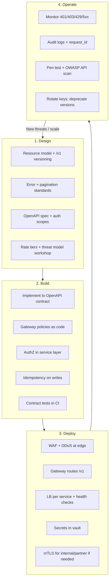

## Reference architecture — public SaaS API

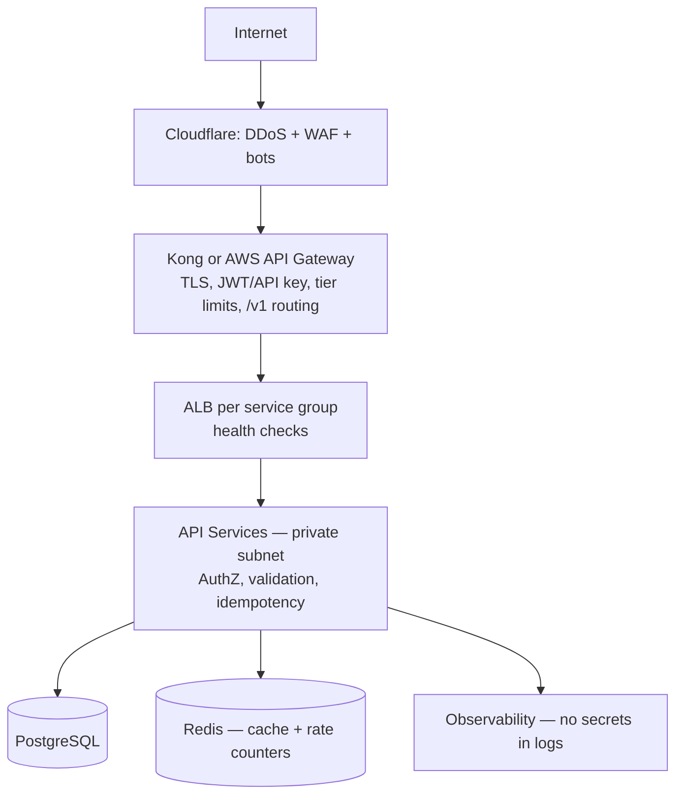

**Text view:**

```
Internet
   │
   ▼
[ Cloudflare: DDoS + WAF + bot management ]
   │
   ▼
[ Kong or AWS API Gateway ]
   • TLS termination
   • JWT / API key validation
   • Tier-based rate limits (Redis)
   • /v1 routing
   │
   ▼
[ Load balancer per service — e.g. AWS ALB ]
   • Health checks
   • Scale pods/VMs horizontally
   │
   ▼
[ API Services (private subnet) ]
   • Scope + object authorization
   • Input validation + idempotency
   • Structured errors
   │
   ├──► PostgreSQL (encrypted, least-privilege role)
   ├──► Redis (cache + rate limit counters)
   └──► Observability (logs, metrics, traces — no secrets)
```

Entry-layer details and stack options → [Load Balancer, API Gateway & Entry Architecture](03-api-gateway.md).

Why app instances must not hold session state → [Stateless architecture](11-stateless-architecture.md).

## Layer responsibility matrix

| Layer | Responsibility | Does NOT do |
|-------|----------------|-------------|
| **OpenAPI spec** | Contract, docs, CI validation | Runtime enforcement |
| **Edge (CDN(Content Delivery Network)/WAF(Web Application Firewall))** | DDoS, bot rules, geo block | Business logic |
| **API Gateway** | AuthN, rate limits, routing, size caps | Object-level AuthZ; instance scaling |
| **Load balancer** | Health checks, distribute to replicas | API keys, tiers, versioning |
| **Application** | AuthZ, validation, idempotency | TLS(Transport Layer Security) at edge (usually) |
| **Database** | Persist with encryption + least privilege | Rate limiting |
| **Observability** | Detect abuse, debug with correlation IDs | Block attacks alone |

## Version evolution

```mermaid
flowchart LR
    V1["/v1 — stable"] --> V2["/v2 — new breaking changes"]
    V1 --> Dep["Deprecation headers on /v1"]
    Dep --> Sunset["Sunset date → retire /v1"]
```

**Safe changes (no new version):**

- Add optional response fields
- Add new endpoints
- Add new enum values (if clients tolerate unknowns)

**Breaking changes (require /v2):**

- Remove or rename fields
- Change field types or semantics
- Change auth requirements

## Async and long-running work

Do not hold rate-limit slots for minutes-long work. Use the **job resource pattern**: `POST` → `202 Accepted` + `Location: /v1/jobs/{id}` → poll or webhook → signed result URL.

See [Async patterns](10-async-patterns.md) for full flows (polling, webhooks, SSE(Server-Sent Events), streaming), HTTP(Hypertext Transfer Protocol) contracts, and architecture.

## Event Sourcing and CQRS (optional write/read split)

For audit-heavy domains, commands append to an **event store**; queries hit **read projections** (eventual consistency). Gateway routes command POSTs and query GETs; scale each tier independently.

```mermaid
flowchart TB
    Client[Client] --> GW[API Gateway]
    GW --> CMD[Command API]
    GW --> QRY[Query API]
    CMD --> ES[(Event Store)]
    ES --> PROJ[Projectors]
    PROJ --> RM[(Read Models)]
    QRY --> RM
```

Full pattern → [Event Sourcing & CQRS](../event-sourcing-and-cqrs/README.md).

## Internal vs public API architectures

| Aspect | Public API | Internal API |
|--------|------------|--------------|
| Edge | Full WAF + DDoS | Optional; VPN/private network |
| Gateway | Full features + tiers | Lightweight ingress or mesh |
| Load balancer | ALB/NLB per service | K8s Service or internal LB |
| Auth | OAuth(Open Authorization) + API keys | mTLS(Mutual Transport Layer Security) + service JWT(JSON Web Token) |
| Rate limits | Product tiers | High limits; concurrency caps |
| OpenAPI | Required + portal | Recommended for discovery |
| Threat model | Full OWASP(Open Worldwide Application Security Project) + abuse | Focus on lateral movement |

## Pros of the reference architecture

- Proven pattern used by most SaaS platforms
- Scales horizontally at edge, gateway, and load balancer
- Clear separation for security audits
- OpenAPI stays the contract; gateway enforces traffic

## Cons

- High operational surface area
- Cost at scale (edge + gateway + LB + Redis + observability)
- Overkill for monolith MVP — start simpler and evolve
- Requires strong platform team or managed services

## Simpler MVP evolution path

```mermaid
flowchart LR
    M1["MVP:<br/>HTTPS + API key<br/>+ basic rate limit"] --> M2["Growth:<br/>+ WAF + OAuth<br/>+ OpenAPI portal"]
    M2 --> M3["Scale:<br/>+ tiered limits<br/>+ gateway + LB<br/>+ threat monitoring"]
```

Do not build the full stack on day one unless compliance requires it.

## Common mistakes

| Mistake | Fix |
|---------|-----|
| Deploy full reference arch for MVP | Evolve MVP → growth → scale path |
| Skip contract tests in CI | OpenAPI lint + breaking diff on every PR |
| Liveness probe hits DB | Readiness checks dependencies; liveness stays light |
| No build ID in metrics/logs | Tag traces with version for rollback correlation |
| Rotate secrets without dual-active window | Overlap old/new credentials during deploy |

---

# Checklist & Cross-Cutting Practices

> **Related:** Threat model → [§6 Threat model](06-threat-model.md) · Lifecycle → [§8 Lifecycle](08-lifecycle-and-architecture.md) · Rate limiting → [api-rate-limiting](../api-rate-limiting/README.md)

## Pre-launch checklist

| Area | Check |
|------|-------|
| **Design** | `/v1` resources, plural nouns, standard error shape |
| **Design** | Cursor pagination with max `limit` |
| **Design** | Idempotency-Key on POST with side effects — [§13](13-idempotency.md) |
| **Design** | Long work uses `202` + job resource, not held connections |
| **Design** | Separate rate limits for expensive POST vs job status GET |
| **Design** | Webhook `callback_url` SSRF(Server-Side Request Forgery)-protected; outbound HMAC(Hash-based Message Authentication Code) signed |
| **OpenAPI** | Spec published; Swagger UI or portal live |
| **OpenAPI** | CI contract tests pass; Spectral lint clean |
| **Auth** | OAuth(Open Authorization) + PKCE(Proof Key for Code Exchange) for user apps; scoped API(Application Programming Interface) keys for partners |
| **AuthZ** | Object ownership on every `{id}` route (BOLA(Broken Object-Level Authorization)) |
| **AuthZ** | Writable field whitelist on PATCH/POST |
| **Gateway** | Rate tiers configured; `429` + headers returned |
| **Load balancer** | Health checks enabled; targets only healthy instances |
| **Architecture** | App tier stateless — no sticky sessions; durable state in DB/Redis/S3 |
| **Architecture** | Identity from validated JWT(JSON Web Token)/API key, not server memory or request body alone |
| **Edge** | HTTPS only; WAF(Web Application Firewall) enabled; DDoS protection on |
| **Protection** | Payload size capped; request timeouts set |
| **Protection** | Secrets in vault; not in git or logs |
| **Threats** | OWASP(Open Worldwide Application Security Project) API Top 10 reviewed for new endpoints |
| **Ops** | Correlation IDs end-to-end |
| **Ops** | Alerts on 401/403/429 spikes and 5xx error rate |
| **Ops** | Runbook for key rotation and incident response |

## HTTP(Hypertext Transfer Protocol) status code quick reference

| Code | Use | Do not use for |
|------|-----|----------------|
| `200` | Success with body | Errors |
| `201` | Resource created | Updates |
| `204` | Success, no body | Errors |
| `400` | Malformed syntax | Business rule violations |
| `401` | Missing/invalid auth | Permission denied |
| `403` | Authenticated, not allowed | Missing auth |
| `404` | Resource not found | Hiding auth failures (when sensitive) |
| `409` | Conflict / duplicate | Generic validation |
| `422` | Valid JSON, invalid semantics | Malformed JSON |
| `429` | Rate limited | Generic errors |
| `500` | Unexpected server fault | Client mistakes |

## Common mistakes

| Mistake | Why it hurts | Fix |
|--------------|--------------|-----|
| `200` + `{ success: false }` | Breaks HTTP semantics, caching, monitoring | Proper status codes |
| AuthN only at gateway | BOLA(Broken Object-Level Authorization) vulnerabilities | Object checks in app |
| IP-only rate limits | Bypassed via distributed IPs; unfair shared NAT | Identity-based tiers |
| Logging Authorization header | Credential leak in logs | Redact sensitive headers |
| Undocumented breaking changes | Broken clients, angry partners | Version bump + Sunset |
| Swagger spec neglected | Docs lie | CI contract tests |
| Fail-open rate limiter on writes | Abuse during Redis outage | Fail closed on expensive routes |
| Sync POST for multi-minute work | 504 timeouts, slot exhaustion | Job + poll or webhook ([§10](10-async-patterns.md)) |
| Sticky sessions with in-memory state | Scale/deploy breaks user sessions | Externalize state; token auth ([§11](11-stateless-architecture.md)) |
| `200` + pending on async POST | Breaks HTTP semantics | `202` + `Location` + `Retry-After` |

## Cross-cutting best practices

### Documentation

- OpenAPI as source of truth for public APIs
- Document rate tiers, auth scopes, and error codes in portal
- Provide curl examples and idempotency guidance — see [Idempotency](13-idempotency.md)

### Testing

- Unit tests for AuthZ and validation
- Contract tests against OpenAPI
- Load tests on list and search endpoints
- Periodic OWASP ZAP / API security scans

### Observability

- Structured JSON logs with `request_id`, `client_id`, `route`, `status`, `latency_ms`
- Metrics: RPS, p99 latency, error rate, 429 rate per tier
- Distributed tracing across gateway → service → DB

### Secret and key management

- Rotate API keys on schedule and after incidents
- Support two active keys during rotation window
- Never commit `.env` or credentials to git

## Other guides in this repo

| Guide | Topics |
|-------|--------|
| [api-rate-limiting](../api-rate-limiting/README.md) | Algorithms, deployment layers, common mistakes |
| [event-sourcing-and-cqrs](../event-sourcing-and-cqrs/README.md) | Event store, CQRS(Command Query Responsibility Segregation), outbox, audit APIs |
| [database-connection-and-security](../database-connection-and-security/README.md) | DB credentials, IAM(Identity and Access Management), vault patterns |
| [deployment-strategies](../deployment-strategies/README.md) | Safe rollout of API changes |
| [high-throughput-systems](../high-throughput-systems/README.md) | End-to-end throughput: measure, cache, async, streaming, backpressure |
| [tree-and-index-structures](../tree-and-index-structures/README.md) | B+ vs LSM(Log-Structured Merge) storage engines for write-heavy workloads |

## Quick decision summary

| Question | Default answer |
|----------|----------------|
| REST(Representational State Transfer) or GraphQL? | REST for public APIs unless strong client flexibility need |
| URL or header versioning? | URL `/v1` for simplicity |
| Gateway required? | Yes for public; optional for internal mTLS(Mutual Transport Layer Security) mesh |
| User auth? | OAuth 2.0 + PKCE → JWT |
| Partner auth? | Scoped API key + optional mTLS |
| Rate limit algorithm? | Sliding window counter + token bucket for bursts |
| Spec tooling? | OpenAPI + Swagger UI + Spectral + contract CI |
| Where is AuthZ? | Always in application code |

## Pros of using this checklist

- Catches gaps before launch (especially BOLA and rate limits)
- Repeatable across teams and services
- Audit-friendly evidence of security review

## Cons

- Checkbox fatigue if treated as bureaucracy only
- Must be updated when architecture or threats evolve
- Does not replace pen testing or production monitoring

## Common mistakes

| Mistake | Fix |
|---------|-----|
| Checklist as one-time paperwork | Re-run before each major release |
| BOLA unchecked on new `{id}` routes | Ownership test in CI or review gate |
| Idempotency only on payments | All side-effect POSTs that clients retry |
| Webhook `callback_url` without SSRF guard | Allowlist or validate outbound URLs |
| Sticky sessions on "stateless" API | Externalize session to Redis/DB |

---

# Async Patterns in API(Application Programming Interface) Design

How to design APIs for work that outlasts connection timeouts: job resources, polling, webhooks, streaming, and how each layer (gateway, queue, workers) participates.

> **Scope:** **HTTP(Hypertext Transfer Protocol)/API contract lens** — job resources, status codes, polling, webhooks. Queue sizing, worker autoscale, and throughput → [HTS §6 Async, queues, and workers](../high-throughput-systems/includes/06-async-queues-workers.md). Reliable domain-event publish → [ES §5 Async integration](../event-sourcing-and-cqrs/includes/05-async-integration.md).

> **Related:** Rate-limit async escape hatch → [Rate-limit tiers](05-rate-limit-tiers.md#async-escape-hatch) · Idempotency → [Idempotency](13-idempotency.md) · Webhook HMAC(Hash-based Message Authentication Code) → [Auth model](04-auth-model.md#hmac-webhooks) · Reference stack → [Lifecycle & architecture](08-lifecycle-and-architecture.md) · Domain events + outbox → [Event Sourcing & CQRS](../event-sourcing-and-cqrs/includes/05-async-integration.md) · Read consistency after jobs → [Strong consistency — promises and costs](../postgresql-performance/includes/14-consistency-promises-and-costs.md)

---

## What it is

**Async API design** moves long or expensive work off the request thread. The client starts work, receives a trackable handle (usually a **job resource**), and retrieves the result via polling, push (webhook), or stream — instead of holding an HTTP connection open for minutes.

**Rule of thumb:** If work might exceed **~10–30 seconds**, or is CPU/IO expensive (exports, ML inference, bulk search), design it async from day one.

---

## Why sync breaks

```mermaid
flowchart TB
    subgraph Sync["Synchronous (bad for heavy work)"]
        C1[Client] -->|POST /export| GW1[Gateway]
        GW1 -->|holds connection 5 min| W1[Worker]
        W1 -->|blocks slot| W1
        W1 -->|timeout 504| C1
    end

    subgraph Async["Asynchronous (correct)"]
        C2[Client] -->|POST /export| GW2[Gateway]
        GW2 -->|~50ms| A2[API]
        A2 -->|enqueue| Q2[(Queue)]
        A2 -->|202 + job URL| C2
        C2 -->|poll or webhook| A2
        Q2 --> W2[Worker]
        W2 -->|writes result| S2[(Storage)]
    end
```

| Problem with sync | What async fixes |
|-------------------|------------------|
| Gateway/LB connection timeouts (30–60s typical) | Client disconnects after `202` |
| Rate-limit slot held for minutes | Only enqueue costs a write slot |
| Worker thread blocked on I/O | Workers pull from queue at their pace |
| Client retries → duplicate work | Job ID + idempotency keys |
| Unpredictable latency | Explicit job states |

---

## Pattern 1 — Job resource + polling (default)

The **async escape hatch** used in [Rate-limit tiers](05-rate-limit-tiers.md#async-escape-hatch). Best default for reports, exports, batch jobs, and any operation with unpredictable duration.

### Full sequence

```mermaid
sequenceDiagram
    autonumber
    participant C as Client
    participant G as Gateway
    participant A as API
    participant Q as Queue
    participant W as Worker
    participant S as Object Storage

    C->>G: POST /v1/reports/export<br/>Idempotency-Key: abc
    G->>G: Auth + tier + expensive-endpoint limit
    G->>A: Forward
    A->>A: Validate input, check idempotency
    A->>Q: Enqueue job job_123
    A-->>C: 202 Accepted<br/>Location: /v1/jobs/job_123<br/>Retry-After: 5

    loop Poll until terminal state
        C->>G: GET /v1/jobs/job_123
        G->>A: Forward
        A-->>C: 200 { status: "processing", progress: 40 }
    end

    Q->>W: Dequeue job_123
    W->>W: Generate report
    W->>S: Upload report.pdf
    W->>A: Update job → completed

    C->>G: GET /v1/jobs/job_123
    A-->>C: 200 { status: "completed", result: { download_url } }
```

### Job state machine

```mermaid
stateDiagram-v2
    [*] --> queued: POST returns 202
    queued --> processing: worker picks up
    processing --> completed: success
    processing --> failed: unrecoverable error
    processing --> cancelled: client DELETE or TTL
    queued --> cancelled: client DELETE
    failed --> [*]
    completed --> [*]
    cancelled --> [*]
```

### HTTP contract

**Start work:**

```http
POST /v1/reports/export
Authorization: Bearer …
Idempotency-Key: 7c9e6679-7425-40de-944b-e07fc1f90ae7
Content-Type: application/json

{ "format": "csv", "filters": { "status": "open" } }
```

**Response:**

```http
HTTP/1.1 202 Accepted
Location: /v1/jobs/job_abc123
Retry-After: 5
Content-Type: application/json

{
  "data": {
    "id": "job_abc123",
    "status": "queued",
    "created_at": "2026-06-14T18:30:00Z",
    "links": {
      "self": "/v1/jobs/job_abc123",
      "cancel": "/v1/jobs/job_abc123"
    }
  }
}
```

**Poll status:**

```json
{
  "data": {
    "id": "job_abc123",
    "status": "processing",
    "progress": { "percent": 40, "message": "Fetching rows…" },
    "created_at": "2026-06-14T18:30:00Z",
    "updated_at": "2026-06-14T18:30:12Z"
  }
}
```

**Completed:**

```json
{
  "data": {
    "id": "job_abc123",
    "status": "completed",
    "result": {
      "download_url": "https://cdn.example.com/exports/…",
      "expires_at": "2026-06-14T19:30:00Z"
    }
  }
}
```

### Design rules

| Decision | Recommendation |
|----------|----------------|
| Status codes | `202` on create; `200` on GET (job is a resource) |
| `Location` header | Always point to the job resource |
| `Retry-After` | On `202` and in responses while status is non-terminal |
| Progress | Optional `percent` + `message`; avoid false precision |
| Result delivery | Signed URL to object storage — not inline megabyte payloads |
| TTL | Auto-expire jobs and artifacts (e.g. 24h); document in API |
| Cancel | `DELETE /v1/jobs/{id}` → `status: cancelled` if not yet started |
| Idempotency | Same `Idempotency-Key` → return same `job_id`, do not enqueue twice |

### Polling rate limits

```mermaid
flowchart LR
    Poll[GET /jobs/id] --> Cheap["Cheap read limit<br/>e.g. 60/min"]
    Create[POST /export] --> Expensive["Expensive write limit<br/>e.g. 5/min"]
```

- Apply a **separate, generous** limit on `GET /jobs/{id}` vs the expensive `POST`.
- Return `Retry-After` so well-behaved clients back off.
- Consider **ETag** / `If-None-Match` — return `304` when status unchanged.

---

## Pattern 2 — Webhooks (server push)

Polling wastes requests when completion is rare or slow. **Webhooks** push terminal state to a client URL. See [HMAC webhooks](04-auth-model.md#hmac-webhooks) for inbound verification; apply the same pattern **outbound**.

### Flow

```mermaid
sequenceDiagram
    autonumber
    participant C as Client
    participant A as Your API
    participant Q as Queue
    participant W as Worker
    participant WH as Client webhook endpoint

    C->>A: POST /v1/reports/export<br/>{ callback_url: "https://client.app/hooks" }
    A->>Q: Enqueue job_123
    A-->>C: 202 + Location: /v1/jobs/job_123

    Note over C: Client can stop polling

    Q->>W: Process job_123
    W->>A: Mark completed

    A->>WH: POST + X-Signature (HMAC)<br/>{ type: "job.completed", job_id, result }
    WH-->>A: 200 OK

    alt Delivery fails
        A->>WH: Retry with exponential backoff
    end
```

### Webhook payload

```json
{
  "id": "evt_9f2a",
  "type": "job.completed",
  "created_at": "2026-06-14T18:35:00Z",
  "data": {
    "job_id": "job_123",
    "status": "completed",
    "result": { "download_url": "…" }
  }
}
```

### Security controls

```mermaid
flowchart TB
    WH[Your API sends webhook] --> Sig["Sign: HMAC-SHA256(secret, timestamp + body)"]
    Sig --> Headers["Headers: X-Signature, X-Timestamp"]
    Client[Client receiver] --> Verify["Verify signature + timestamp window"]
    Verify --> Reject["Reject replays older than ~5 min"]
```

| Control | Why |
|---------|-----|
| HMAC signature | Proves payload came from you |
| Timestamp | Prevents replay attacks |
| Event ID (`evt_…`) | Client deduplicates |
| HTTPS only | Transport security |
| **SSRF(Server-Side Request Forgery) on `callback_url`** | Block private IPs, metadata endpoints (OWASP(Open Worldwide Application Security Project) API #7) |

### Hybrid: webhook + poll fallback

```mermaid
flowchart TD
    Start[Job created] --> WH{Client registered webhook?}
    WH -->|Yes| Push[Push on terminal state]
    WH -->|No| Poll[Client polls GET /jobs/id]
    Push --> Fallback[If delivery fails N times]
    Fallback --> Poll
```

**Best practice:** webhook primary, `GET /jobs/{id}` always available as source of truth.

---

## Pattern 3 — Long polling

For **near-real-time** status without webhooks (mobile, firewalled clients):

```mermaid
sequenceDiagram
    participant C as Client
    participant A as API

    C->>A: GET /v1/jobs/job_123?wait=30
    Note over A: Hold request up to 30s until status changes
    A-->>C: 200 { status: "completed" }

    Note over C: On timeout with no change, reconnect immediately
```

| Pros | Cons |
|------|------|
| Fewer requests than short polling | Holds a server connection |
| Simple client logic | Gateway timeout must exceed `wait` |
| Works through most firewalls | Less scalable than webhooks at high volume |

---

## Pattern 4 — Server-Sent Events (SSE(Server-Sent Events))

**One-way server → client stream** over HTTP. Good for progress logs, live feeds, LLM token streaming.

```mermaid
sequenceDiagram
    participant C as Client
    participant A as API

    C->>A: GET /v1/jobs/job_123/events<br/>Accept: text/event-stream
    A-->>C: event: progress\ndata: {"percent":10}\n\n
    A-->>C: event: progress\ndata: {"percent":50}\n\n
    A-->>C: event: completed\ndata: {"download_url":"…"}\n\n
    Note over A: Close stream
```

```http
GET /v1/jobs/job_123/events
Accept: text/event-stream
Authorization: Bearer …
```

Response (chunked):

```
event: progress
data: {"percent": 10}

event: completed
data: {"download_url": "https://…"}
```

| Good for | Not good for |
|----------|--------------|
| Progress UI, log tailing | Client → server messages |
| Browser `EventSource` API | Binary payloads (use WebSockets) |
| AI/LLM token streams | High concurrency without connection planning |

---

## Pattern 5 — Chunked streaming (NDJSON)

**Incremental results in a single request** — search results, large CSV rows, LLM output:

```mermaid
flowchart LR
    C[Client] -->|POST /v1/search/stream| A[API]
    A -->|chunk 1| C
    A -->|chunk 2| C
    A -->|chunk N| C
    A -->|close stream| C
```

```http
HTTP/1.1 200 OK
Content-Type: application/x-ndjson
Transfer-Encoding: chunked

{"id":"res_1","title":"…"}
{"id":"res_2","title":"…"}
```

One JSON object per line. Client must stay connected; mid-stream retry is harder than job + poll.

---

## Pattern 6 — Sync timeout fallback (avoid if possible)

Gateway timeout can force a hybrid — prefer **always `202`** for known-slow endpoints:

```mermaid
sequenceDiagram
    participant C as Client
    participant G as Gateway
    participant A as API

    C->>G: POST /v1/process
    G->>A: Forward sync attempt

    alt Completes in under gateway timeout
        A-->>C: 200 { result }
    else Still running at timeout
        G-->>C: 504 Gateway Timeout
        Note over C: GET /jobs by correlation or Idempotency-Key
    end
```

---

## Pattern comparison

| Pattern | Direction | Connection | Best for | Complexity |
|---------|-----------|------------|----------|------------|
| **Job + poll** | Client pulls | Short | Reports, exports, batch jobs | Low |
| **Webhooks** | Server pushes | Short (outbound) | B2B integrations | Medium |
| **Long poll** | Client pulls | Long (held) | Near-real-time status | Medium |
| **SSE(Server-Sent Events)** | Server pushes | Long | Progress, feeds, LLM tokens | Medium |
| **WebSockets** | Bidirectional | Long | Chat, live collaboration | High |
| **NDJSON stream** | Server pushes in one request | Long | Search, incremental pipelines | Medium |

### Decision flow

```mermaid
flowchart TD
    Q1{Work greater than ~30s?}
    Q1 -->|No| Sync[Sync 200/201]
    Q1 -->|Yes| Q2{Client can host webhook?}
    Q2 -->|Yes| WH[Job + webhook + poll fallback]
    Q2 -->|No| Q3{Need live progress UI?}
    Q3 -->|Yes| SSE[SSE or long poll]
    Q3 -->|No| Poll[Job + poll]
```

---

## End-to-end architecture

How async work fits the [reference architecture](08-lifecycle-and-architecture.md):

```mermaid
flowchart TB
    C[Client] --> Edge[Edge WAF]
    Edge --> GW[API Gateway<br/>auth + tier limits]
    GW --> API[API Service]

    API -->|POST expensive op| Q[(Job Queue<br/>SQS / Redis / RabbitMQ)]
    API -->|202| C

    Q --> W1[Worker 1]
    Q --> W2[Worker 2]

    W1 --> DB[(PostgreSQL — job state)]
    W2 --> DB
    W1 --> S3[(Object Storage — results)]

    W1 -->|optional| WH[Client webhook URL]
    C -->|GET /jobs/id| GW
```

| Layer | Async role |
|-------|------------|
| **Gateway** | Strict limits on expensive `POST`; lighter limits on `GET /jobs`; configure timeouts for long poll/SSE |
| **API** | Validate, enqueue, return `202` — never block on worker completion |
| **Queue** | Decouple burst from worker capacity |
| **Worker** | Idempotent processing; atomic job state updates |
| **Storage** | Artifacts via signed URLs, not DB blobs |

### Domain events and transactional outbox

Job queues handle **long work** (`202` + poll). **Transactional outbox** handles **reliable delivery** after a write: append domain events and outbox rows in one DB transaction; a relay publishes to Kafka or workers. Used heavily in [Event Sourcing & CQRS](../event-sourcing-and-cqrs/includes/05-async-integration.md) — combine with job resources when an event triggers minutes-long processing.

---

## Idempotency across async

```mermaid
sequenceDiagram
    participant C as Client
    participant A as API

    C->>A: POST /export Idempotency-Key: K1
    A-->>C: 202 job_123

    Note over C: Network timeout — client retries

    C->>A: POST /export Idempotency-Key: K1
    A-->>C: 202 job_123 (same job, no duplicate enqueue)
```

Without idempotency, retries create duplicate exports, charges, or notifications. See [Idempotency](13-idempotency.md).

---

## OpenAPI modeling

```yaml
paths:
  /v1/reports/export:
    post:
      summary: Start async export
      responses:
        '202':
          description: Job accepted
          headers:
            Location:
              schema: { type: string }
            Retry-After:
              schema: { type: integer }
          content:
            application/json:
              schema:
                $ref: '#/components/schemas/Job'

  /v1/jobs/{job_id}:
    get:
      summary: Poll job status
      responses:
        '200':
          content:
            application/json:
              schema:
                $ref: '#/components/schemas/Job'

components:
  schemas:
    Job:
      type: object
      properties:
        id: { type: string, example: job_abc123 }
        status:
          type: string
          enum: [queued, processing, completed, failed, cancelled]
        progress:
          type: object
          properties:
            percent: { type: integer, minimum: 0, maximum: 100 }
        result: { type: object }
        error: { $ref: '#/components/schemas/Error' }
```

See [OpenAPI / Swagger](07-openapi-swagger.md) for contract-first workflow.

---

## Common mistakes

| Mistake | Fix |
|---------|-----|
| `200 OK` with `{ "status": "pending" }` on POST | Use `202 Accepted` + `Location` |
| No job resource — client cannot recover after disconnect | Always expose `GET /jobs/{id}` |
| Polling with no `Retry-After` | Clients hammer every 100ms |
| Inline 50MB response body | Signed URL to storage |
| Webhook without signature | HMAC + timestamp |
| Arbitrary `callback_url` | SSRF allowlist |
| Same rate limit for POST export and GET status | Separate tiers |
| Missing `failed` / `cancelled` states | Full state machine |

---

## Pros of async-first design

- Protects worker pools, connection limits, and rate-limit fairness
- Clear UX for long operations with explicit progress
- Retries and idempotency integrate naturally via job IDs
- Webhooks reduce polling load for B2B partners

## Cons

- More API surface (`/jobs`, events, webhook registration)
- Polling and SSE still consume limits and connections
- Webhook delivery, retries, and SSRF controls add operational complexity
- Clients must implement state machines — document clearly in portal

---

## HTTP status codes for async

| Code | Use |
|------|-----|
| `202` | Work accepted; body describes job; `Location` set |
| `200` | Job status read; terminal state includes result or error |
| `304` | Job status unchanged (optional, with ETag) |
| `404` | Unknown job ID |
| `409` | Cancel rejected (already completed) |
| `429` | Poll or create rate limited |
| `504` | Sync fallback only — avoid by using `202` upfront |

---

# Stateless Architecture

Why stateless application tiers matter for APIs: how requests flow without server-side sessions, how state is externalized, and how this enables load balancing, scaling, and safe deployments.

> **Scope:** **Architecture lens** — what stateless means, auth flows, externalized state, migration, and deploy safety. Throughput prerequisites (pool sizing, per-request cost, replica scaling) → [HTS §3 Stateless app tier](../high-throughput-systems/includes/03-stateless-app-tier.md).
>
> **Related:** Entry layer (LB + gateway) → [Load Balancer & API Gateway](03-api-gateway.md) · JWT(JSON Web Token) auth → [Auth model](04-auth-model.md) · Idempotency store → [Idempotency](13-idempotency.md) · Reference stack → [Lifecycle & architecture](08-lifecycle-and-architecture.md) · Async workers → [Async patterns](10-async-patterns.md) · Blue/green deploys → [deployment-strategies §3](../deployment-strategies/includes/03-blue-green.md)

---

## At a glance

| | **Stateless app tier** | **Stateful app tier** |
|---|---|---|
| **Session data** | Not stored in app memory | Stored on a specific server |
| **Any instance serves any request** | Yes | No — sticky sessions required |
| **Scale out** | Add identical replicas | Session replication or affinity |
| **Instance failure** | Other instances continue | Users on that node lose session |
| **Request context** | Token, headers, body, external store | Server-side session object |
| **Typical fit** | REST(Representational State Transfer) APIs, microservices, serverless | WebSockets rooms, legacy session apps |

**Rule of thumb:** "Stateless" applies to the **application tier**, not the whole system. Durable state lives in **databases, caches, queues, and object storage** — not in individual process memory.

---

## What it is

**Stateless architecture** means each HTTP(Hypertext Transfer Protocol) request is handled **independently**. The server does not rely on in-memory data from prior requests to decide what to do next. Any context needed to serve a request either:

1. **Travels with the request** — JWT, API(Application Programming Interface) key, tenant header, trace ID, body
2. **Lives in shared external stores** — PostgreSQL, Redis, S3, message queues

This is the default pattern behind modern API stacks: load balancers distribute freely, API gateways validate tokens without session affinity, and instances can be replaced at any time.

```mermaid
flowchart LR
    subgraph Request["Every request carries or derives"]
        Token[JWT / API key]
        Headers[Headers: tenant-id, trace-id]
        Body[Request body]
    end

    subgraph App["Stateless app instance"]
        Handler[Request handler]
        Handler --> Validate[Validate token]
        Validate --> Fetch[Fetch from external store]
    end

    subgraph External["External state (shared)"]
        DB[(PostgreSQL)]
        Redis[(Redis cache)]
        S3[(Object storage)]
    end

    Request --> Handler
    Fetch --> DB
    Fetch --> Redis
    Fetch --> S3
```

Nothing in the app instance **must** survive after the response is sent.

---

## Stateless vs stateful

```mermaid
flowchart TB
    subgraph Stateful["Stateful architecture"]
        C1[Client A] --> LB1[Load Balancer<br/>sticky session]
        LB1 --> S1[Server 1<br/>session: Client A data]
        LB1 --> S2[Server 2<br/>session: Client B data]
        S1 -.->|Client A must return here| S1
    end

    subgraph Stateless["Stateless architecture"]
        C2[Client A] --> LB2[Load Balancer<br/>round-robin / least-conn]
        LB2 --> A1[Instance 1]
        LB2 --> A2[Instance 2]
        LB2 --> A3[Instance 3]
        A1 --> Store[(Shared DB / Redis)]
        A2 --> Store
        A3 --> Store
    end
```

| Concern | Stateless | Stateful |
|---------|-----------|----------|
| Horizontal scaling | Add/remove replicas freely | Session migration or sticky routing |
| Deployments (rolling, blue/green) | New instances serve traffic immediately | Must drain sessions or replicate state |
| Failure recovery | Blast radius = one request | Cohort of users may lose session |
| Load balancer config | Round-robin, least connections | Sticky cookies or IP hash |
| Auth model | JWT / API keys in request | Server-side session cookie |

---

## Request flow

How a stateless API call works end-to-end (extends the [overview sequence](00-overview.md#sequence-one-protected-api-call)):

```mermaid
sequenceDiagram
    autonumber
    participant C as Client
    participant LB as Load Balancer
    participant A2 as App Instance 2
    participant A1 as App Instance 1
    participant DB as Database / Cache

    C->>LB: GET /v1/orders<br/>Authorization: Bearer eyJ...
    LB->>A2: Route to any healthy instance
    A2->>A2: Validate JWT (signature + claims)
    Note over A2: user_id=42 from token — no session lookup
    A2->>DB: SELECT orders WHERE user_id=42
    DB-->>A2: Rows
    A2-->>C: 200 OK + JSON

    Note over C,DB: Next request may hit App Instance 1 — no problem.<br/>Identity comes from the token, not server memory.

    C->>LB: GET /v1/orders/99
    LB->>A1: Different instance
    A1->>A1: Validate JWT → user_id=42
    A1->>DB: SELECT + ownership check
    A1-->>C: 200 OK
```

### What each layer stores

| Layer | Holds state? | What it stores |
|-------|--------------|----------------|
| **Client** | Yes (client-side) | Access token, refresh token, local cache |
| **CDN(Content Delivery Network) / Edge** | Cache only | Cacheable GET responses (no user sessions) |
| **API Gateway** | Minimal | Rate-limit counters (Redis), optional token denylist |
| **Load balancer** | No | Routing table, health status only |
| **App instance** | **No durable state** | Request-scoped variables only |
| **Database / Redis** | Yes (source of truth) | Users, orders, carts, job state |
| **Queue / Workers** | Job state in DB | Interchangeable worker pool |

---

## Key principles

### 1. Identity and authorization in the request

Use **JWT access tokens**, **API keys**, or signed headers so any instance can authenticate without a server-side session table lookup (or with a minimal, cacheable lookup).

See [Auth model — JWT](04-auth-model.md) for token design.

```mermaid
flowchart LR
    Login[POST /login] --> AuthSvc[Auth service]
    AuthSvc --> DB[(User store)]
    AuthSvc --> Token[Issue JWT]
    Token --> Client[Client stores token]
    Client --> API[Any API instance validates JWT locally]
```

### 2. No session affinity at the load balancer

Prefer **round-robin**, **least connections**, or **random** — not sticky cookies — unless a legacy stateful component requires it.

Entry-layer details → [Load Balancer & API Gateway](03-api-gateway.md#request-flows).

### 3. Externalize all durable state

| Data type | Store | Not |
|-----------|-------|-----|
| User profiles, orders | PostgreSQL | In-memory map per server |
| Shopping cart (if needed) | Redis or DB keyed by `user_id` | Session cookie blob |
| Uploaded files | S3 / object storage | Local disk on instance |
| Async jobs | DB + queue | Blocking request thread |
| Rate-limit counters | Redis (shared) | Per-instance counters |

### 4. Idempotent operations

Retries and duplicate requests are common at scale. Design writes to be safe when repeated — idempotency keys, UPSERT, natural keys. See [Idempotency](13-idempotency.md).

### 5. Configuration via environment

Instances are interchangeable. Config comes from environment variables, secrets managers, or config services — not baked into local files on one machine.

### 6. Workers are stateless too

Async [workers](10-async-patterns.md) pull jobs from a queue, read/write shared stores, and exit. Any worker can process any job.

```mermaid
flowchart TB
    API[API — stateless] -->|enqueue| Q[(Queue)]
    Q --> W1[Worker 1]
    Q --> W2[Worker 2]
    W1 --> DB[(Job state in DB)]
    W2 --> DB
    W1 --> S3[(Results in object storage)]
    W2 --> S3
```

---

## Stateless auth flow

Typical token-based flow for public APIs:

```mermaid
sequenceDiagram
    autonumber
    participant U as User / Client
    participant Auth as Auth service
    participant API as API (any instance)
    participant DB as Database

    U->>Auth: POST /oauth/token (credentials or code)
    Auth->>DB: Verify user
    Auth-->>U: access_token (JWT) + refresh_token

    U->>API: GET /v1/profile<br/>Authorization: Bearer access_token
    Note over API: Validate signature + expiry<br/>Optional: check revocation list
    API->>DB: Fetch profile by user_id from claims
    API-->>U: 200 Profile JSON

    U->>Auth: POST /oauth/token (refresh_token)
    Auth-->>U: New access_token
```

| Approach | Stateless? | Tradeoff |
|----------|------------|----------|
| JWT access token (short TTL) | Yes — local validation | Revocation needs denylist or very short TTL |
| Opaque token + Redis lookup | Hybrid | DB/cache hit per request; easier revocation |
| Server-side session cookie | No | Requires sticky sessions or shared session store |
| API key in header | Yes | Key rotation and scoping discipline required |

---

## Reference architecture (stateless app tier)

How stateless services fit the [reference stack](08-lifecycle-and-architecture.md#reference-architecture--public-saas-api):

```mermaid
flowchart TB
    Client[Client] --> Edge[Edge: WAF / DDoS]
    Edge --> GW[API Gateway<br/>auth, rate limits]
    GW --> LB[Load Balancer<br/>no sticky sessions]
    LB --> App1[App instance 1]
    LB --> App2[App instance 2]
    LB --> App3[App instance 3]

    App1 --> Redis[(Redis — cache, rate limits, ephemeral data)]
    App2 --> Redis
    App3 --> Redis

    App1 --> DB[(PostgreSQL — source of truth)]
    App2 --> DB
    App3 --> DB

    App1 --> Queue[(Queue — async jobs)]
    App2 --> Queue
    App3 --> Queue
```

| Pattern | Role in stateless design |
|---------|--------------------------|
| **JWT access tokens** | Identity travels with every request |
| **Redis** | Shared cache and counters — not per-app memory |
| **PostgreSQL** | Durable transactional state |
| **Message queue** | Decouple work; workers are interchangeable |
| **Object storage** | Files and exports — not local disk |
| **Idempotency keys** | Safe retries without duplicate side effects |

---

## Benefits

| Benefit | Why it matters for APIs |
|---------|-------------------------|
| **Horizontal scaling** | Scale on CPU, latency, or queue depth — not session count |
| **High availability** | Failed instance does not strand a cohort of users |
| **Simple deployments** | Blue/green, rolling, canary — new instances serve traffic immediately |
| **Cloud-native fit** | Containers, Kubernetes, serverless, auto-scaling |
| **Load balancer freedom** | Any routing algorithm; no session drain on scale-down |
| **Easier testing** | Each request is self-contained; no hidden server state |
| **Multi-region** | Requests can land in any region if data is shared or replicated |
| **Rate-limit fairness** | Shared Redis counters; identity-based tiers work across nodes |

---

## Use cases

| Use case | Why stateless fits |
|----------|-------------------|
| **REST / GraphQL public APIs** | Each call is independent; JWT/API keys carry identity |
| **Microservices** | Services scale and fail independently |
| **Third-party partner APIs** | Unknown client count; elastic scale required |
| **Serverless / FaaS** | Functions are ephemeral by design |
| **Mobile & SPA backends** | Clients hold tokens; no cookie-based server sessions |
| **CDN-backed read APIs** | Cacheable responses; no per-server session |
| **Queue workers** | Workers pull jobs; no affinity to a specific machine |
| **Blue/green & canary deploys** | New version instances accept traffic without session migration |

---

## Pros and cons

### Pros

- Elastic scaling — add replicas under load, remove them off-peak
- Resilience — blast radius of a bad instance is one request, not many users
- Operational simplicity — identical instances, no session replication cluster
- Aligns with [12-factor app](https://12factor.net/processes) — processes are disposable; state is external
- Pairs naturally with API gateway + load balancer entry architecture
- Enables safe [deployment strategies](../deployment-strategies/README.md) (rolling, blue/green)

### Cons

- **Token management complexity** — expiry, refresh tokens, revocation lists, key rotation
- **More network I/O** — context often fetched from DB/cache every request (mitigate with caching)
- **JWT payload size** — embedding too many claims bloats headers
- **Revocation is harder** — stateless JWTs cannot be "deleted" without extra infra (denylist, short TTL)
- **Not ideal for all workloads** — WebSockets, long-lived connections, in-memory game rooms
- **Consistency tradeoffs** — distributed caches and read replicas introduce eventual consistency

See [Strong consistency — promises and costs](../postgresql-performance/includes/14-consistency-promises-and-costs.md) for definitions, costs, and when to require primary reads.

---

## Consistency and read routing

Stateless APIs often fetch context from a DB or cache on every request. That makes **read routing** a consistency decision, not just a performance one.

| Read type | Route to | Example endpoints |
|-----------|----------|-------------------|
| **Strong / session-critical** | Primary DB | `GET /me`, post-checkout order status, balance after transfer |
| **Eventual / stale OK** | Read replica or cache | Product lists, dashboards, search suggestions |
| **Read-your-writes** | Primary for N seconds after user's write, or poll until visible | Create resource → immediate GET by ID |

**API practices:**

- Document consistency per endpoint in OpenAPI (e.g. "Read model may lag up to 30s")
- Return **`409 Conflict`** with `ETag` / version on stale updates — aligns with optimistic concurrency on the write side
- After **`202` async jobs**, treat result reads like projections — poll until complete; don't assume immediate consistency on a replica

> **Related:** Layered read path and replication lag → [Read scaling and caching](../postgresql-performance/includes/11-read-scaling-and-caching.md) · CQRS(Command Query Responsibility Segregation) projector lag → [Eventual consistency in read models](../event-sourcing-and-cqrs/includes/02-cqrs-and-read-models.md#eventual-consistency)
- **Security discipline** — never trust client-sent identity without cryptographic validation

---

## When stateless is the wrong default

| Scenario | Better approach |
|----------|-----------------|
| **WebSocket / SSE(Server-Sent Events) connection state** | Stateful connection gateway + stateless business logic behind it |
| **In-memory chat/game room** | Dedicated stateful service or CRDT/sync layer |
| **Heavy model loaded once per GPU** | Stateful worker pool with routing to warm instances |
| **Legacy apps with server sessions** | Sticky sessions temporarily → migrate to external session store (Redis) |
| **Strong immediate revocation required** | Short-lived tokens + introspection endpoint or session store lookup |

**Hybrid is common:** stateless HTTP API + stateful connection layer (WebSocket server forwarding to stateless services).

```mermaid
flowchart LR
    Client[Client] --> WS[WebSocket gateway<br/>holds connection]
    WS --> API1[Stateless API]
    WS --> API2[Stateless API]
    API1 --> DB[(Shared DB)]
    API2 --> DB
```

---

## Migrating from stateful to stateless

```mermaid
flowchart TD
    S1[Server-side sessions in memory] --> S2[External session store<br/>Redis keyed by session_id]
    S2 --> S3[JWT access tokens<br/>no session store for reads]
    S3 --> S4[Remove sticky sessions<br/>from load balancer]
```

| Step | Action |
|------|--------|
| 1 | Move session data from app memory to Redis or DB |
| 2 | Issue JWT or opaque tokens; stop growing in-memory session maps |
| 3 | Remove sticky sessions from load balancer |
| 4 | Verify any instance can serve any authenticated request |
| 5 | Externalize uploads, temp files, and local caches |

---

## Common mistakes

| Mistake | Fix |
|---------|-----|
| Sticky sessions enabled "just in case" | Remove affinity once auth is token-based |
| User ID from request body without token validation | Derive identity only from validated JWT/API key |
| Rate limits stored per instance | Shared Redis counters at gateway or app |
| Shopping cart in server memory | Redis or DB keyed by `user_id` |
| File uploads to local disk | Stream to object storage (S3) |
| Assuming "no session" means "no state anywhere" | State belongs in external stores, not nowhere |
| Long-lived JWT with no revocation plan | Short TTL + refresh token + optional denylist |

---

## Checklist: is your app tier stateless?

| Check | Pass? |
|-------|-------|
| Any instance can handle any request without sticky sessions | |
| User identity comes from validated token/key, not server memory | |
| Durable data is in DB/cache/storage, not local disk or RAM | |
| You can kill an instance mid-traffic without corrupting user state | |
| You can add a new instance and immediately send it traffic | |
| Uploads, temp files, and job state are externalized | |
| Rate limits and idempotency use shared stores | |
| Config and secrets come from env/vault, not local files | |

---

## Decision summary

| Question | Default for public APIs |
|----------|-------------------------|
| Store sessions in app memory? | No — use JWT or external session store |
| Sticky sessions on load balancer? | No — unless legacy migration in progress |
| Where does durable state live? | PostgreSQL + Redis + object storage + queue |
| Where is AuthZ enforced? | Application code on every instance ([Auth model](04-auth-model.md)) |
| Can workers share a queue? | Yes — design workers as stateless consumers |
| Stateless at the gateway too? | Gateway holds policy state (rate limits in Redis), not user sessions |

---

# Identity: RBAC(Role-Based Access Control), IAM(Identity and Access Management) & Active Directory

Enterprise identity foundations for APIs: how IAM governs access, how RBAC assigns permissions through roles, and how Active Directory (and cloud IdPs) feed tokens and policies your gateway and services enforce.

> **Related:** Auth protocols (OAuth(Open Authorization), JWT(JSON Web Token), mTLS(Mutual Transport Layer Security)) → [Auth model](04-auth-model.md) · Gateway enforcement → [Load Balancer & API Gateway](03-api-gateway.md) · Multi-tenant claims → [16-multi-tenant-apis.md](16-multi-tenant-apis.md) · DB connection identity → [database-connection-and-security](../database-connection-and-security/README.md)

---

## At a glance

| Concept | What it is | Primary question |
|---------|------------|------------------|
| **IAM** | Discipline + systems for identity and access lifecycle | Who are you, and are you allowed to do this? |
| **RBAC** | Access **model**: permissions via **roles** | What role do you have, and what does that role allow? |
| **Active Directory (AD(Active Directory))** | Microsoft **directory service** (identity store + auth) | Where do users, groups, and computers live in the org? |

**Relationship:** AD (or another IdP) holds identities → IAM is the overall framework that uses them → RBAC is one common way IAM assigns permissions at apps, APIs, and cloud layers.

For **how clients authenticate** (OAuth, API(Application Programming Interface) keys, JWT validation), see [Auth model](04-auth-model.md). This section covers **organizational identity** and **authorization structure**.

---

## What IAM is

**Identity and Access Management (IAM)** is the end-to-end lifecycle and enforcement of access across people, services, and resources.

| Area | Examples |
|------|----------|
| **Authentication (AuthN)** | Password, MFA, SSO, certificates, API keys |
| **Authorization (AuthZ)** | RBAC, ABAC, resource policies |
| **Provisioning** | SCIM, LDAP sync, just-in-time (JIT) access |
| **Governance** | Access reviews, least privilege, audit logs |
| **Federation** | SAML, OIDC(OpenID Connect) — trust external IdPs |
| **Secrets & keys** | Service principals, workload identity |

Cloud **IAM** (AWS IAM, Azure RBAC, GCP IAM) applies the same ideas to cloud control planes: principals + policies + enforcement at the API layer.

### IAM components

```mermaid
flowchart TB
    subgraph Identity["Identity layer"]
        U[Users / humans]
        S[Service accounts / workloads]
        IdP[Identity Provider<br/>AD, Entra ID, Okta, Cognito]
    end

    subgraph AuthN["Authentication — Who are you?"]
        Login[Login / SSO / MFA]
        Token[Tokens: session, JWT, SAML assertion]
    end

    subgraph AuthZ["Authorization — What can you do?"]
        RBAC[RBAC — roles]
        ABAC[ABAC — attributes]
        PBAC[Policy-based — IAM policies]
    end

    subgraph Enforcement["Enforcement points"]
        App[Applications]
        GW[API Gateway]
        Cloud[Cloud IAM — AWS / Azure / GCP]
    end

    U --> IdP
    S --> IdP
    IdP --> Login --> Token
    Token --> AuthZ
    AuthZ --> App
    AuthZ --> GW
    AuthZ --> Cloud
```

### IAM lifecycle (joiner-mover-leaver)

```mermaid
sequenceDiagram
    participant HR as HR / JML process
    participant IdP as Identity Provider (e.g. AD)
    participant IAM as IAM / Provisioning
    participant App as App / API / Cloud

    HR->>IdP: New hire → create user
    IdP->>IAM: User + group membership
    IAM->>App: Provision account / assign roles
    Note over App: User can authenticate

    HR->>IdP: Role change / transfer
    IdP->>IAM: Update groups
    IAM->>App: Update roles / permissions

    HR->>IdP: Termination
    IdP->>IAM: Disable account
    IAM->>App: Revoke access immediately
```

### Pros of a formal IAM program

- Single source of truth for who has access and why
- Faster onboarding/offboarding with fewer orphaned accounts
- Audit trail for compliance (SOC2, ISO 27001)
- Consistent mapping from org structure → app permissions

### Cons

- Tooling sprawl (AD, IdP, SCIM, cloud IAM, app-local roles)
- Group-to-role mapping drift if not governed
- Over-permissioning when teams copy "admin" roles for convenience

---

## What RBAC is

**Role-Based Access Control (RBAC)** assigns permissions to **roles**, not directly to every user. Users get roles; roles get permissions.

### RBAC model

```mermaid
flowchart LR
    subgraph Users
        Alice[Alice]
        Bob[Bob]
    end

    subgraph Roles
        Dev[Developer]
        Ops[Ops Engineer]
        Admin[Admin]
    end

    subgraph Permissions
        R1[read:api/users]
        W1[write:api/orders]
        D1[delete:database]
        A1[manage:all]
    end

    Alice --> Dev
    Bob --> Ops
    Bob --> Admin

    Dev --> R1
    Dev --> W1
    Ops --> R1
    Ops --> W1
    Admin --> A1
    Ops -.-> D1
```

### RBAC hierarchy (NIST-style)

```mermaid
flowchart TB
    U[Users] -->|assigned| R[Roles]
    R -->|grants| P[Permissions / Privileges]
    P -->|on| O[Objects / Resources<br/>APIs, files, DB tables]

    R --> RH[Role hierarchy<br/>Senior Dev inherits Dev]
    R --> SoD[Separation of Duties<br/>e.g. approver ≠ requester]
    R --> C[Constraints<br/>time, location, MFA]
```

### RBAC vs other access models

| Model | Basis of access | Good for |
|-------|-----------------|----------|
| **RBAC** | Job function (role) | Orgs with stable job titles |
| **ABAC** | Attributes (dept, clearance, resource tags) | Fine-grained, dynamic rules |
| **ACL** | Per-resource list of who can access | Small sets, file shares |
| **PBAC / Policy** | Declarative policies (Rego, IAM JSON) | Cloud, APIs, zero-trust |

### RBAC at the API layer

Map roles to **scopes** or **route policies** at the gateway and re-check in the app for object-level AuthZ ([Auth model — layered flow](04-auth-model.md#layered-auth-flow)).

```mermaid
sequenceDiagram
    participant Client
    participant GW as API Gateway
    participant IdP as IdP / AD + OIDC
    participant API as Backend API

    Client->>GW: GET /orders + Bearer JWT
    GW->>GW: Validate JWT signature & expiry
    GW->>GW: Extract roles/scopes from token
    alt role contains "order-reader"
        GW->>API: Forward request
        API-->>Client: 200 + data
    else missing role
        GW-->>Client: 403 Forbidden
    end
```

| RBAC artifact | API example |
|---------------|-------------|
| **Role** | `order-reader`, `order-admin` |
| **Permission** | `GET /orders`, `POST /orders`, `DELETE /orders/{id}` |
| **Assignment** | Alice → `order-reader` (via AD group → app role mapping) |

Gateway checks **coarse** role/scope; the app still enforces **object ownership** (BOLA(Broken Object-Level Authorization)) — see [Auth model](04-auth-model.md).

---

## What Active Directory is

**Active Directory (AD)** is Microsoft's directory service for Windows-centric enterprises. It is primarily an **identity store and authentication system**, not a full IAM product by itself — though **Microsoft Entra ID** (Azure AD) extends it for cloud and modern protocols.

### AD logical structure

```mermaid
flowchart TB
    Forest[Forest — security boundary]
    Forest --> Domain1[Domain: corp.example.com]
    Forest --> Domain2[Domain: dev.example.com]

    Domain1 --> DC1[Domain Controllers<br/>auth + replication]
    Domain1 --> OU1[OU: Engineering]
    Domain1 --> OU2[OU: Finance]

    OU1 --> User1[User: alice@corp]
    OU1 --> Group1[Group: DevTeam]
    OU2 --> User2[User: bob@corp]

    Group1 --> User1
    DC1 --> LDAP[LDAP / Kerberos]
```

### Key AD concepts

| Term | Meaning |
|------|---------|
| **Domain** | Administrative + authentication boundary (e.g. `corp.example.com`) |
| **Forest** | Collection of domains with shared schema |
| **Domain Controller (DC)** | Server that authenticates users and holds directory data |
| **OU (Organizational Unit)** | Container for users/groups/computers; delegation and GPO |
| **Security Group** | Collection of principals; permissions and RBAC mapping |
| **GPO (Group Policy)** | Central config for machines/users (password policy, software) |
| **Kerberos** | Default AD auth protocol (tickets, mutual auth) |
| **LDAP** | Directory query protocol (read users, groups, attributes) |

### AD authentication flow (Kerberos — simplified)

```mermaid
sequenceDiagram
    participant User as User / Client
    participant DC as Domain Controller
    participant Svc as Service / App / File Server

    User->>DC: 1. Login (username + password)
    DC->>DC: Verify credentials
    DC-->>User: 2. TGT (Ticket-Granting Ticket)

    User->>DC: 3. Request service ticket (TGT + service name)
    DC-->>User: 4. Service ticket for Svc

    User->>Svc: 5. Present service ticket
    Svc->>Svc: Validate ticket with DC trust
    Svc-->>User: 6. Access granted
```

Modern APIs rarely terminate Kerberos at the gateway directly. Typical pattern: AD → Entra ID / IdP → **OIDC/SAML** → JWT with groups/roles → gateway + app.

### AD vs Microsoft Entra ID

| | **On-prem AD** | **Microsoft Entra ID** |
|--|----------------|------------------------|
| **Primary use** | Windows domain, LAN, legacy apps | Cloud, SaaS, modern auth (OIDC/SAML) |
| **Protocol** | Kerberos, NTLM, LDAP | OAuth(Open Authorization) 2.0, OIDC, SAML |
| **Structure** | Domains, OUs, GPO | Tenants, users, groups, conditional access |
| **Hybrid** | — | AD Connect syncs on-prem AD ↔ cloud |

---

## How RBAC, IAM, and AD work together

End-to-end enterprise picture for API access:

```mermaid
flowchart TB
    subgraph Source["Identity source"]
        AD[Active Directory<br/>users, groups, OUs]
    end

    subgraph IAMPlatform["IAM platform"]
        Sync[Sync / Federation<br/>AD Connect, SCIM]
        Entra[Entra ID / IdP]
        RBACEngine[RBAC mapping<br/>AD group → App role]
        Policy[Policies + MFA + Conditional Access]
    end

    subgraph Apps["Applications & APIs"]
        SaaS[SaaS apps]
        GW[API Gateway]
        Cloud[Cloud resources]
    end

    AD --> Sync --> Entra
    Entra --> RBACEngine
    RBACEngine --> Policy
    Policy --> SaaS
    Policy --> GW
    Policy --> Cloud

    User([Employee]) -->|login SSO| Entra
    Entra -->|JWT with roles/groups| GW
```

### Concrete example

1. **AD:** Alice is in security group `Finance-Analysts`
2. **IAM provisioning:** Sync maps `Finance-Analysts` → app role `finance-reader`
3. **RBAC:** Role `finance-reader` allows `GET /reports`, `GET /invoices`
4. **Enforcement:** API gateway reads JWT `roles: ["finance-reader"]`; app verifies resource ownership

```mermaid
flowchart LR
    ADG[AD Group:<br/>Finance-Analysts] --> Map[Group-to-Role mapping]
    Map --> Role[App Role:<br/>finance-reader]
    Role --> Perm[Permissions:<br/>read reports, read invoices]
    Perm --> GW[API Gateway enforces]
    Perm --> App[App enforces object-level AuthZ]
```

---

## Decision flow: can this user access this API?

Unified authorization check (IAM + RBAC + token from AD-backed IdP):

```mermaid
flowchart TD
    Start([Request with credentials]) --> AuthN{Authenticated?<br/>valid token / MFA}
    AuthN -->|No| Deny1[401 Unauthorized]
    AuthN -->|Yes| Identity[Resolve identity<br/>user ID, groups, roles]

    Identity --> RBAC{User has required role<br/>or scope?}
    RBAC -->|No| Deny2[403 Forbidden]
    RBAC -->|Yes| Policy{Other IAM policies?<br/>IP, time, resource, ABAC}
    Policy -->|Fail| Deny3[403 Forbidden]
    Policy -->|Pass| Object{Object-level AuthZ<br/>user owns resource?}
    Object -->|Fail| Deny4[403 Forbidden]
    Object -->|Pass| Allow[Allow → execute business logic]

    Allow --> Audit[Log access decision]
```

Aligns with the [layered auth flow](04-auth-model.md#layered-auth-flow): gateway handles AuthN and coarse AuthZ; the app must still run the object check.

---

## Comparison summary

| | **IAM** | **RBAC** | **Active Directory** |
|--|---------|----------|----------------------|
| **Type** | Framework + tooling | Access **model** | Directory + auth **product** |
| **Answers** | Full identity lifecycle | "What can this role do?" | "Who is this user in the org?" |
| **Scope** | People, apps, cloud, APIs | Permissions via roles | Typically enterprise Windows / hybrid |
| **Typical artifacts** | Policies, MFA, audit, provisioning | Roles, bindings, permissions | Users, groups, OUs, GPO, DCs |
| **In API context** | Gateway auth, OAuth, lifecycle | JWT roles/scopes, usage plans | SSO source; groups → API roles |

---

## API design takeaways

| Practice | Why |
|----------|-----|
| Map AD/IdP **groups** → app **roles**, not raw group names in app code | Survives reorgs; central mapping table |
| Put **roles/scopes in JWT** (short TTL) | Stateless validation at gateway |
| Enforce **object-level AuthZ in app** | RBAC alone does not prevent BOLA(Broken Object-Level Authorization) |
| Automate **JML** (joiner-mover-leaver) | Orphan accounts are a top audit finding |
| Regular **access reviews** | Least privilege over time |
| Log **who** (subject), **what** (resource), **decision** | Audit without logging tokens |

Default stack for public SaaS APIs (extends [overview default](00-overview.md#default-recommendation)):

1. **Entra ID / Okta** (fed from AD if hybrid) for employee SSO
2. **OAuth 2.0 + OIDC** for user-facing apps → JWT with scopes/roles
3. **Scoped API keys** for partners (see [Auth model](04-auth-model.md))
4. **Gateway** validates token + coarse RBAC; **app** validates object ownership
5. **Cloud IAM** for service-to-service and data-layer access ([database-connection-and-security](../database-connection-and-security/README.md))

---

## Common mistakes

| Mistake | Fix |
|---------|-----|
| Checking AD group names hard-coded in every service | Central group → role mapping; roles in token claims |
| RBAC at gateway only, no object AuthZ in app | Layered AuthZ per [Auth model](04-auth-model.md) |
| Long-lived JWT with embedded admin role | Short TTL + refresh; minimal claims |
| No offboarding automation | Disable IdP account → revoke app + API access same day |
| Same role for humans and service accounts | Separate service principals with narrower permissions |
| Confusing cloud IAM with app RBAC | Cloud IAM protects AWS/Azure resources; app RBAC protects business operations |

---

## Related reading

| Guide | Topics |
|-------|--------|
| [Auth model](04-auth-model.md) | OAuth, JWT, API keys, mTLS, webhook HMAC(Hash-based Message Authentication Code) |
| [API Gateway](03-api-gateway.md) | JWT validation, routing, policy at the edge |
| [database-connection-and-security](../database-connection-and-security/README.md) | RDS IAM, Vault, workload identity to databases |
| [api-rate-limiting — scope identity](../api-rate-limiting/includes/06-scope-identity.md) | Identity keys for rate-limit tiers |

---

# Idempotency

How to design writes that are safe to retry: HTTP(Hypertext Transfer Protocol) semantics, `Idempotency-Key` headers, storage patterns, and how idempotency fits async jobs, webhooks, and stateless app tiers.

> **Related:** Write safety contract → [API design §7](01-api-design.md#7-write-safety) · Webhook replay → [API protection §6](02-api-protection.md#6-idempotency-and-replay-protection) · Async job retries → [Async patterns](10-async-patterns.md) · Shared stores → [Stateless architecture](11-stateless-architecture.md) · Event-sourced commands → [Event Sourcing & CQRS](../event-sourcing-and-cqrs/includes/04-api-design-implications.md) · Multi-step sagas → [Sagas and distributed workflows](../event-sourcing-and-cqrs/includes/07-sagas-and-distributed-workflows.md#idempotency-patterns-specific-to-sagas)

---

## At a glance

| Question | Answer |
|----------|--------|
| **What is it?** | Repeating the same operation has the same effect as doing it once |
| **Who enforces it?** | **Application layer** — not gateway or load balancer ([entry architecture](03-api-gateway.md#what-the-gateway-should-do)) |
| **When is a key required?** | `POST` (and some `PATCH`) with side effects: payments, orders, provisioning, external calls |
| **Where to store keys?** | Shared **Redis** or **PostgreSQL** — never per-instance memory ([stateless checklist](11-stateless-architecture.md#checklist-is-your-app-tier-stateless)) |
| **Updates to existing resources?** | Use `ETag` / `If-Match`, not idempotency keys |
| **Inbound webhooks?** | HMAC(Hash-based Message Authentication Code) + timestamp + dedup by event ID — see [API protection §6](02-api-protection.md#6-idempotency-and-replay-protection) |

**Rule of thumb:** If a client might retry on timeout and a duplicate would charge money, create a row, or send a notification — require `Idempotency-Key`.

---

## What it is

**Idempotent** means calling an operation multiple times does not change state beyond the first successful application.

| Term | Meaning |
|------|---------|
| **Safe** | No side effects (reads) |
| **Idempotent** | Side effects happen at most once; repeats are no-ops or return the same outcome |

### HTTP methods (default semantics)

| Method | Idempotent? | Safe? | Notes |
|--------|-------------|-------|-------|
| `GET` | Yes | Yes | Cache-friendly reads |
| `PUT` | Yes | No | Full replace — same payload → same final state |
| `DELETE` | Yes | No | Second call → `404` or `204`; still idempotent |
| `PATCH` | Design-dependent | No | Use version checks for safe updates |
| `POST` | **No** | No | Creates or triggers actions — **needs explicit protection** |

Examples:

- `GET /orders/123` twice → same order, no extra writes.
- `DELETE /orders/123` twice → gone after first call; second is harmless.
- `POST /orders` twice with the same JSON body → **two orders** unless you implement idempotency.

---

## When to use what

### Natural idempotency (no header)

Design these to be idempotent by HTTP semantics or resource identity:

- **`GET`** — all reads
- **`PUT /resources/{id}`** — client-known ID; same body → same state
- **`DELETE /resources/{id}`** — delete is naturally repeatable

### `Idempotency-Key` header (explicit)

Require on **`POST`** when the operation:

- Moves money (charges, refunds, transfers)
- Creates durable resources (orders, subscriptions, tickets)
- Triggers external side effects (email, SMS, partner API(Application Programming Interface) calls)
- Enqueues async work the client may retry ([Async patterns](10-async-patterns.md))
- Runs on unreliable networks (mobile, partner integrations)

```http
POST /v1/orders
Authorization: Bearer ...
Idempotency-Key: 7c9e6679-7425-40de-944b-e07fc1f90ae7
Content-Type: application/json
```

### Optimistic concurrency (updates, not creates)

For **`PATCH`** / **`PUT`** on existing resources, prefer **`ETag`** / **`If-Match`**:

```http
PATCH /v1/orders/123
If-Match: "v5"
Content-Type: application/json
```

Return **`409 Conflict`** on stale version. This prevents lost updates; it is complementary to idempotency keys, not a replacement.

### When you can skip idempotency keys

- Pure reads
- `PUT` / `DELETE` with stable resource IDs already designed for repeat calls
- Fire-and-forget events where duplicates are harmless
- Domain models with a **natural dedup key** (e.g. `client_reference_id` on payments with a unique constraint)

---

## Client contract

### Key generation

- Client generates a **UUID v4** (or similar) **once per user action**
- **Reuse the same key** on retries of the *same* logical operation
- **Never reuse** the key for a different operation (different amount, recipient, or payload)

### Scope

The server must scope keys per caller and route:

```
(tenant_id or client_id, endpoint, idempotency_key)
```

The same key from two different API keys or tenants must not collide.

### Same key, different body → reject

If the client sends the same `Idempotency-Key` with a **different request body**, return **`422`** or **`409`**:

```json
{
  "error": {
    "code": "idempotency_key_reused",
    "message": "Idempotency-Key was already used with a different request body.",
    "request_id": "req_9f2a"
  }
}
```

Store a hash of the normalized request body alongside the key to detect mismatches.

### Response replay

On retry, return the **same HTTP status and body** as the original — including errors.

| First response | Retry with same key |
|----------------|---------------------|
| `201 Created` + order body | Same `201` + same body |
| `422 Unprocessable Entity` | Same `422` — do not re-validate differently |
| `500` before completion | May retry processing (see in-progress below) |

Document whether you cache error responses for the full TTL (Stripe-style) or only successes.

---

## Server flow

```mermaid
sequenceDiagram
    participant Client
    participant API
    participant Store as Idempotency Store
    participant DB as Database / Payment

    Client->>API: POST /orders + Idempotency-Key: abc
    API->>Store: Claim key abc
    alt Key already completed
        Store-->>API: Cached response
        API-->>Client: Same response as first call
    else Key in progress
        Store-->>API: Lock held
        API-->>Client: 409 Conflict + Retry-After
    else Key new
        Store-->>API: Lock acquired
        API->>DB: Create order + side effects
        DB-->>API: Order ord_123
        API->>Store: Save response for abc
        API-->>Client: 201 Created
    end

    Note over Client,API: Network timeout — client retries
    Client->>API: POST /orders + Idempotency-Key: abc
    API->>Store: Lookup abc
    Store-->>API: Cached 201
    API-->>Client: 201 Created (no duplicate order)
```

### Order of operations (critical)

1. Authenticate and authorize
2. **Claim the idempotency key** (atomic)
3. If replay → return cached response
4. Execute business logic and external calls
5. Persist result and mark key **completed**
6. Return response

**Never** charge a card, insert a row, or send email before the key is claimed.

### Concurrent duplicates

Two identical requests arriving simultaneously:

| Strategy | Behavior |
|----------|----------|
| **First wins + lock** | Second gets `409 Conflict` with `Retry-After`, or blocks until first completes |
| **Optimistic insert** | DB unique constraint on key; loser reads cached result |

Avoid both requests executing business logic.

### In-progress and crashed workers

Use a short-lived **processing** state:

```
SET key "processing" NX EX 300   → claim with 5-minute lock
... work ...
SET key {response_json} EX 86400 → final state with 24h TTL
```

If the worker crashes mid-flight, the lock expires and a retry may safely re-attempt — or return `409` until you define recovery semantics for your domain.

---

## Where to store idempotency keys

Enforcement lives in the **application**; storage must be **shared** across all app instances ([Stateless architecture](11-stateless-architecture.md)).

| Store | Best for | Pros | Cons |
|-------|----------|------|------|
| **Redis** | Default for API idempotency | Fast `SET NX`, TTL, response cache; often colocated with rate limits | Another failure domain; define fail-closed vs fail-open |
| **PostgreSQL** | Writes already in same DB transaction | Strong consistency; unique constraint is authoritative | Slower than Redis; couples to DB availability |
| **Domain table** | Payments, orders with `client_reference_id` | No separate idempotency table; business key is the dedup key | Requires modeling upfront |

**Not here:** gateway, load balancer, or app instance memory.

### Pattern A — Redis

```text
Key:   idem:{tenant}:{endpoint}:{idempotency_key}
Value: { status, headers, body, request_hash, created_at }
TTL:   86400 (24h) for completed; 300 (5m) for "processing"
```

```text
SET key "processing" NX EX 300     → if fail, GET and return cached or 409
... do work ...
SET key {response_json} XX EX 86400
```

### Pattern B — PostgreSQL

```sql
CREATE TABLE idempotency_records (
  tenant_id       UUID NOT NULL,
  idempotency_key TEXT NOT NULL,
  request_hash    TEXT NOT NULL,
  response_status INT,
  response_body   JSONB,
  created_at      TIMESTAMPTZ DEFAULT now(),
  PRIMARY KEY (tenant_id, idempotency_key)
);
```

```text
BEGIN;
INSERT ... ON CONFLICT DO NOTHING RETURNING *;
-- no row → SELECT existing and return cached response
-- row inserted → process, UPDATE with response, COMMIT
```

Combine with the business write in one transaction when possible.

### Pattern C — Natural domain key

```json
{
  "amount": 5000,
  "currency": "usd",
  "client_reference_id": "checkout-session-abc"
}
```

Unique constraint on `(merchant_id, client_reference_id)`. Duplicate insert fails; return the existing payment. No separate idempotency table when the domain model already deduplicates.

### TTL and cleanup

| Setting | Typical value |
|---------|---------------|
| Completed response cache | **24 hours** to **7 days** |
| Processing lock | **5–15 minutes** |
| After TTL expires | Treat as new key, or return `409` if strict forever-dedup is required |

Expire with Redis TTL or a background job on DB rows.

---

## Async jobs

When `POST` returns **`202 Accepted`** with a job resource, the idempotency key prevents duplicate enqueue on client retry. Full flow → [Async patterns § Pattern 1 — Job resource + polling](10-async-patterns.md#pattern-1--job-resource--polling-default) and [§ Idempotency across async](10-async-patterns.md#idempotency-across-async).

Job **workers** must also deduplicate on `job_id` or message ID for at-least-once queue delivery.

---

## Webhook replay protection

Idempotency for **inbound** webhooks is replay protection — different header, same goal:

- HMAC signature over body + timestamp
- Reject requests older than a skew window (e.g. 5 minutes)
- Constant-time signature comparison
- Dedup by `event_id` in a shared store

Details → [API protection §6](02-api-protection.md#6-idempotency-and-replay-protection) and [Auth model — HMAC webhooks](04-auth-model.md#hmac-webhooks).

---

## Event-sourced commands

Command APIs (`POST /commands/PlaceOrder`) use the same `Idempotency-Key` header. Store `key → (aggregate_id, resulting_version)` with TTL so duplicate commands do not append duplicate events.

Details → [Event Sourcing & CQRS — API design](../event-sourcing-and-cqrs/includes/04-api-design-implications.md).

---

## OpenAPI modeling

```yaml
paths:
  /v1/orders:
    post:
      summary: Create order
      parameters:
        - name: Idempotency-Key
          in: header
          required: true
          schema:
            type: string
            format: uuid
          description: >
            Unique key for this operation. Retries must reuse the same key
            and request body.
      responses:
        '201':
          description: Order created
        '409':
          description: Idempotency key conflict (in progress or body mismatch)
        '422':
          description: Idempotency key reused with different body
```

OpenAPI documents the contract; **runtime enforcement remains in application code** ([OpenAPI / Swagger](07-openapi-swagger.md)).

---

## Observability

Log safely:

- `idempotency_key` (or truncated hash)
- `request_id`, `client_id`, endpoint
- Outcome: `fresh`, `replay`, `conflict`, `body_mismatch`

Never log full payment payloads or PII unnecessarily. Idempotency replay metrics help investigate duplicate-charge reports.

---

## Common mistakes

| Mistake | Risk |
|---------|------|
| Check idempotency **after** charging or inserting | Duplicate side effects |
| No lock on concurrent requests | Race → duplicates |
| Reuse keys across different operations | Silent wrong dedup |
| Different response on replay | Client state machines break |
| Gateway-only dedup | Gateway does not know business outcome |
| Per-instance memory store | Breaks with multiple replicas |
| Idempotency key without auth scope | Cross-tenant collision |

---

## Decision checklist

| Question | Action |
|----------|--------|
| Is it a read? | Rely on `GET`; no key needed |
| Is it `PUT`/`DELETE` with stable ID? | Design for natural idempotency |
| Is it `POST` with money, creation, or external effects? | Require `Idempotency-Key` |
| Can the client retry on timeout? | Idempotency is mandatory |
| Is it an update to existing resource? | Use `ETag` / `If-Match` |
| Is it async (`202` + job)? | Key dedupes enqueue; worker dedupes processing |
| Is it a multi-step saga across services? | Per-step idempotency keys + saga state — see [Sagas §7](../event-sourcing-and-cqrs/includes/07-sagas-and-distributed-workflows.md#idempotency-patterns-specific-to-sagas) |
| Is it an inbound webhook? | HMAC + timestamp + event ID dedup |
| Multiple app instances? | Shared Redis or DB store |

---

## Pre-launch checklist

| Check | Pass? |
|-------|-------|
| Side-effecting `POST`s document `Idempotency-Key` in OpenAPI | |
| Keys scoped to `(tenant, endpoint, key)` | |
| Claim happens before external side effects | |
| Same key + different body returns error | |
| Replays return identical status and body | |
| Storage is shared (Redis or DB), not in-memory | |
| TTL and processing-lock expiry documented | |
| Concurrent duplicate requests handled | |
| Async enqueue deduped on retry | |
| Metrics/logs distinguish fresh vs replay | |

---

## Pros and cons

### Pros of explicit idempotency keys

- Safe client retries on timeout without duplicate charges or orders
- Predictable behavior for partners integrating over unreliable networks
- Clear audit trail when combined with correlation IDs

### Cons / trade-offs

- Extra storage and lookup on every write
- Clients must generate and persist keys correctly
- TTL boundaries require documented client behavior
- Fail-open vs fail-closed when the idempotency store is down (default: **fail closed** on financial writes)

---

# API(Application Programming Interface) Versioning and Deprecation

Public APIs outlive clients. Versioning and deprecation policy is part of the contract — not an afterthought.

> **Related:** OpenAPI lifecycle → [07-openapi-swagger.md](07-openapi-swagger.md) · Contract testing → [15-contract-and-schema-testing.md](15-contract-and-schema-testing.md) · Deploy coupling → [deployment-strategies/includes/12-schema-migrations-and-deploy.md](../deployment-strategies/includes/12-schema-migrations-and-deploy.md)

---

## At a glance

| Approach | Visibility | Default for public REST(Representational State Transfer) |
|----------|------------|-------------------------|
| **URL path** (`/v1/`, `/v2/`) | Obvious in logs and docs | ✅ Recommended |
| **Header** (`Accept-Version`, `Api-Version`) | Cleaner URLs | Internal or partner APIs |
| **Query param** (`?version=2`) | Easy to try; messy in caches | Avoid for public APIs |

**Rule of thumb:** Use **URL `/v1`** for public APIs. Support **one previous major version** during migration windows.

---

## Breaking vs non-breaking changes

| Non-breaking (same major version) | Breaking (new major version) |
|-----------------------------------|------------------------------|
| Add optional fields to response | Remove or rename response fields |
| Add optional query params | Change field type or semantics |
| Add new endpoints | Change auth requirements |
| Add new enum values (clients tolerate unknown) | Tighten validation on existing inputs |
| Deprecate with sunset header (still works) | Remove deprecated behavior |

Document every release in changelog; run OpenAPI diff in CI → [§15 contract testing](15-contract-and-schema-testing.md).

---

## Deprecation flow

```mermaid
flowchart LR
    Active[Stable in /v1] --> Deprecate[Sunset header + docs]
    Deprecate --> Parallel[v1 + v2 both live]
    Parallel --> Sunset[v1 returns 410 or removed]
```

| Phase | Client experience | Your obligations |
|-------|-------------------|------------------|
| **Announce** | `Deprecation: true`, `Sunset: <RFC 7231 date>` | Changelog, email, status page |
| **Parallel run** | `/v1` and `/v2` both work | Monitor `/v1` traffic decline |
| **Sunset** | `/v1` → `410 Gone` or redirect | Support window documented upfront |

Example headers:

```http
Deprecation: true
Sunset: Sat, 01 Nov 2026 00:00:00 GMT
Link: </v2/orders>; rel="successor-version"
```

---

## Version routing at the gateway

| Layer | Role |
|-------|------|
| **Gateway** | Route `/v1/*` vs `/v2/*` to same or different upstream pools |
| **App** | Shared codebase with versioned handlers, or separate deployables |
| **Database** | Expand/contract migrations — both versions during rolling deploy |

See [deployment-strategies §12](../deployment-strategies/includes/12-schema-migrations-and-deploy.md) when v2 needs schema changes.

---

## Client guidance (document in developer portal)

- Pin to a major version in SDK base URL
- Treat unknown JSON fields as ignorable
- Subscribe to changelog and `Sunset` headers
- Migrate before sunset — no implicit auto-upgrade

---

## Common mistakes

| Mistake | Fix |
|---------|-----|
| Breaking change in patch release | Major version bump + migration period |
| No sunset date | Always publish `Sunset` with `Deprecation` |
| Two versions, one breaking schema | Expand/contract DB; both code paths work |
| Version in 5 places | Single config / gateway route table |

---

## Pros and cons

### URL versioning

**Pros:** Explicit in logs, WAF(Web Application Firewall) rules, rate limits, and docs.

**Cons:** URL proliferation; gateway routing required.

### Indefinite v1 support

**Pros:** Happy legacy clients.

**Cons:** Security and maintenance debt — set a maximum parallel window (e.g. 12 months).

---

# Contract and Schema Testing

OpenAPI is not documentation only — it is the **contract** CI should enforce before deploy.

> **Related:** OpenAPI tooling → [07-openapi-swagger.md](07-openapi-swagger.md) · Versioning → [14-api-versioning-and-deprecation.md](14-api-versioning-and-deprecation.md) · Deploy → [deployment-strategies](../deployment-strategies/README.md)

---

## At a glance

| Check | Tooling examples | When it runs |
|-------|------------------|--------------|
| **Lint / style** | Spectral | Every PR |
| **Breaking diff** | openapi-diff, oasdiff | PR against `main` spec |
| **Consumer contract** | Pact, schema tests | PR + nightly |
| **Mock validation** | Prism, WireMock | CI integration tests |

**Rule of thumb:** **Breaking API(Application Programming Interface) changes fail CI** unless the major version path changes (`/v2`).

---

## CI pipeline (minimal)

```mermaid
flowchart LR
    PR[OpenAPI change] --> Lint[Spectral lint]
    Lint --> Diff[Breaking diff vs main]
    Diff -->|Pass| Test[Contract / integration tests]
    Diff -->|Fail| Block[Block merge]
    Test --> Deploy[Deploy]
```

| Step | Fail if |
|------|---------|
| Spectral | Missing descriptions, no `operationId`, insecure schemes |
| Breaking diff | Removed endpoint, required field added to request, type change |
| Contract tests | Provider response ≠ consumer expectation |

---

## Breaking change examples (openapi-diff)

| Change | Breaking? |
|--------|-----------|
| Add optional response field | No |
| Add required request field | **Yes** |
| Rename field | **Yes** |
| Change `string` → `integer` | **Yes** |
| Add new HTTP(Hypertext Transfer Protocol) method on path | No |
| Remove endpoint | **Yes** |

For intentional breaks: bump to `/v2` and update diff baseline.

---

## Consumer-driven contracts (Pact)

| Role | Responsibility |
|------|----------------|
| **Consumer** | Defines expected request/response |
| **Provider** | Verifies implementation matches pact |
| **Broker** | Stores pacts; gates deploy |

Use for **critical integrations** (billing, auth, partner APIs) — not every internal call.

---

## Pair with deployment

- **Canary:** compare error rate on routes whose spec changed
- **Feature flags:** ship code behind flag; spec documents both behaviors during transition
- **Rollback:** previous artifact must match previous spec version tagged in CI

---

## Checklist

- [ ] `openapi.yaml` in repo; single source of truth
- [ ] Spectral ruleset committed (`.spectral.yaml`)
- [ ] Breaking diff in CI on PR
- [ ] Version in spec `info.version` matches changelog
- [ ] Deprecated operations marked in spec + `deprecated: true`

---

## Pros and cons

**Pros:** Fewer production breakages; confident refactors; partners trust documented behavior.

**Cons:** CI maintenance; pact drift if consumers don't update; discipline on spec-first changes.

## Common mistakes

| Mistake | Fix |
|---------|-----|
| Breaking change merged without `/v2` | Fail CI on openapi-diff against `main` |
| Consumer tests skipped on PR | Run Pact/schema tests in pipeline |
| Spec version not tied to changelog | Bump `info.version` with release notes |
| Mock server never updated | Regenerate from spec in CI |
| Deprecated ops removed before sunset period | `deprecated: true` + telemetry on usage first |

---

# Multi-Tenant APIs

SaaS APIs must isolate tenants in auth, data, rate limits, and operations — not only with a `tenant_id` column.

> **Related:** AuthZ / BOLA(Broken Object-Level Authorization) → [04-auth-model.md](04-auth-model.md) · Rate tiers → [05-rate-limit-tiers.md](05-rate-limit-tiers.md) · Idempotency keys → [13-idempotency.md](13-idempotency.md) · Identity → [12-identity-rbac-iam-ad.md](12-identity-rbac-iam-ad.md) · Consistency → [PG §14](../postgresql-performance/includes/14-consistency-promises-and-costs.md)

---

## At a glance

| Layer | Tenant concern |
|-------|----------------|
| **Token** | `tenant_id` / `org_id` in JWT(JSON Web Token) claims |
| **Gateway** | Per-tenant usage plans, API(Application Programming Interface) keys |
| **Application** | Row-level checks on every query |
| **Database** | `tenant_id` on rows + indexes |
| **Cache** | Tenant prefix on every key |
| **Queues** | Tenant in message metadata; fair scheduling |
| **Observability** | Metrics and logs tagged by tenant |

**Rule of thumb:** **Every data access path** must include tenant scope — gateway auth alone does not prevent BOLA across tenants.

---

## Isolation models

```mermaid
flowchart TB
    subgraph Shared["Shared DB (common)"]
        T1[tenant_id column + RLS]
    end
    subgraph Schema["Schema per tenant"]
        S1[tenant_a.orders]
        S2[tenant_b.orders]
    end
    subgraph DB["Database per tenant"]
        D1[(tenant_a DB)]
        D2[(tenant_b DB)]
    end
```

| Model | Pros | Cons |
|-------|------|------|
| **Shared table + `tenant_id`** | Simple ops | Noisy neighbor; strict query discipline |
| **Row-level security (RLS)** | DB enforces tenant | Policy complexity |
| **Schema / DB per tenant** | Strong isolation | Ops scale; migration cost |
| **Silos for enterprise** | Compliance | Highest cost |

Default for most B2B SaaS: **shared PostgreSQL + `tenant_id` + RLS or app-level checks**.

---

## API patterns

| Pattern | Detail |
|---------|--------|
| **Claim binding** | `tenant_id` from token — never from client body alone |
| **URL design** | `/v1/orgs/{org_id}/orders` — validate `org_id` matches token |
| **Idempotency** | Key scoped `(tenant_id, endpoint, key)` — [§13](13-idempotency.md) |
| **Pagination** | Cursor includes tenant scope |
| **Rate limits** | Per-tenant + global abuse cap — [api-rate-limiting §6](../api-rate-limiting/includes/06-scope-identity.md) |

---

## Data residency and scale

| Need | Approach |
|------|----------|
| EU-only data | Region-specific deployment + routing — [HTS §13](../high-throughput-systems/includes/13-multi-region-read-routing.md) |
| Noisy neighbor tenant | Per-tenant rate limits; optional dedicated pool |
| Large enterprise | Dedicated DB or schema silo |

---

## Common mistakes

| Mistake | Fix |
|---------|-----|
| `tenant_id` from request body | JWT / API key only |
| Global cache key `user:123` | `tenant:a:user:123` |
| Missing index on `(tenant_id, ...)` | Composite indexes |
| One tenant's export blocks queue | Fair queue partitioning |

---

## Pros and cons

### Shared DB multi-tenancy

**Pros:** Cost-efficient; single migration path.

**Cons:** Requires rigorous authZ; blast radius on bugs.

---

# GraphQL and gRPC

REST(Representational State Transfer) is the default in this corpus — use GraphQL or gRPC when the trade-offs are explicit, not because the name sounds modern.

> **Scope:** **Alternative API(Application Programming Interface) styles** — when to pick GraphQL or gRPC vs REST. Default HTTP(Hypertext Transfer Protocol)/REST patterns → [§1 API design](01-api-design.md). ES/CQRS(Command Query Responsibility Segregation) APIs → [ES §4](../event-sourcing-and-cqrs/includes/04-api-design-implications.md).

> **Related:** Gateway routing → [03-api-gateway.md](03-api-gateway.md) · Contract testing → [15-contract-and-schema-testing.md](15-contract-and-schema-testing.md) · Internal mesh → [03-api-gateway.md#service-mesh](03-api-gateway.md)

---

## At a glance

| Style | Best for | Weak for |
|-------|----------|----------|
| **REST** | Public HTTP APIs, CRUD, caching | Highly variable mobile payloads (without BFF(Backend for Frontend)) |
| **GraphQL** | Flexible reads, one endpoint, BFF | Cache at CDN(Content Delivery Network); auth per field; N+1 at scale |
| **gRPC** | Internal low-latency RPC, streaming | Browser-native public APIs |

**Rule of thumb:** **REST (+ OpenAPI)** for public partners. **gRPC** for service-to-service. **GraphQL** at a **BFF** or dedicated query tier — rarely as the sole public edge without hard limits.

---

## GraphQL

```mermaid
flowchart LR
    Client[Mobile / Web] --> BFF[GraphQL BFF]
    BFF --> REST1[orders-api]
    BFF --> REST2[users-api]
    BFF --> REST3[inventory-api]
```

| Topic | Guidance |
|-------|----------|
| **Depth / cost limits** | Max depth, complexity scoring, query cost analysis |
| **Authorization** | Field-level rules — not only gateway JWT(JSON Web Token) |
| **N+1** | DataLoader batching to backing REST/DB |
| **Caching** | HTTP cache weak; prefer persisted queries + CDN for public reads |
| **Versioning** | Schema deprecation vs REST URL versioning — [§14](14-api-versioning-and-deprecation.md) |

| Pros | Cons |
|------|------|
| One request, shaped response | Operational complexity |
| Good for varied clients | Abuse via expensive queries |

---

## gRPC

| Topic | Guidance |
|-------|----------|
| **Contracts** | `.proto` files; version fields in messages |
| **Transport** | HTTP/2, binary protobuf |
| **Gateway** | gRPC-Web or envoy transcoding for browser edge cases |
| **Mesh** | Often paired with mTLS(Mutual Transport Layer Security) — [§3 Gateway / mesh](03-api-gateway.md) |
| **Errors** | Map gRPC status to client retry policy |

| Pros | Cons |
|------|------|
| Fast, typed, streaming | Not browser-default |
| Strong codegen | Load balancer / debugging tooling differs from REST |

---

## Decision flow

```mermaid
flowchart TD
    Start[Choose API style] --> Pub{Public internet clients?}
    Pub -->|Yes| REST[Default REST + OpenAPI]
    Pub -->|No| Internal{Service-to-service?}
    Internal -->|Yes| GRPC[gRPC or mesh RPC]
    Internal -->|No| GQL{Many client-specific read shapes?}
    GQL -->|Yes| GraphQL[BFF GraphQL over REST/gRPC]
    GQL -->|No| REST
```

---

## Common mistakes

| Mistake | Fix |
|---------|-----|
| GraphQL at edge without query cost limits | Depth/complexity caps |
| gRPC everywhere including public mobile | REST or BFF for public |
| Skip contract tests on `.proto` | Same CI discipline as OpenAPI — [§15](15-contract-and-schema-testing.md) |
| GraphQL N+1 to database | Batch loaders |

---

## Pros and cons

### GraphQL BFF

**Pros:** Client flexibility; aggregates microservices.

**Cons:** Another tier to secure, cache, and operate.

### gRPC internal

**Pros:** Performance and strong contracts between services.

**Cons:** Requires gateway/transcoding for external clients.

---


---

## See also

| Guide | Topics |
|-------|--------|
| [api-rate-limiting](../api-rate-limiting/README.md) | Algorithms, deployment layers, common mistakes |
| [event-sourcing-and-cqrs](../event-sourcing-and-cqrs/README.md) | Event store, CQRS(Command Query Responsibility Segregation), outbox, audit APIs |
| [database-connection-and-security](../database-connection-and-security/README.md) | DB credentials, IAM, vault patterns |
| [deployment-strategies](../deployment-strategies/README.md) | Safe rollout of API changes |
| [high-throughput-systems](../high-throughput-systems/README.md) | End-to-end throughput: measure, cache, async, backpressure |
| [tree-and-index-structures](../tree-and-index-structures/README.md) | B+ vs LSM(Log-Structured Merge) storage engines for write-heavy workloads |
| [postgresql-performance](../postgresql-performance/README.md) | Read replicas, consistency, connection pooling |
| [deployment-strategies §12](../deployment-strategies/includes/12-schema-migrations-and-deploy.md) | Version routing + schema expand/contract |
