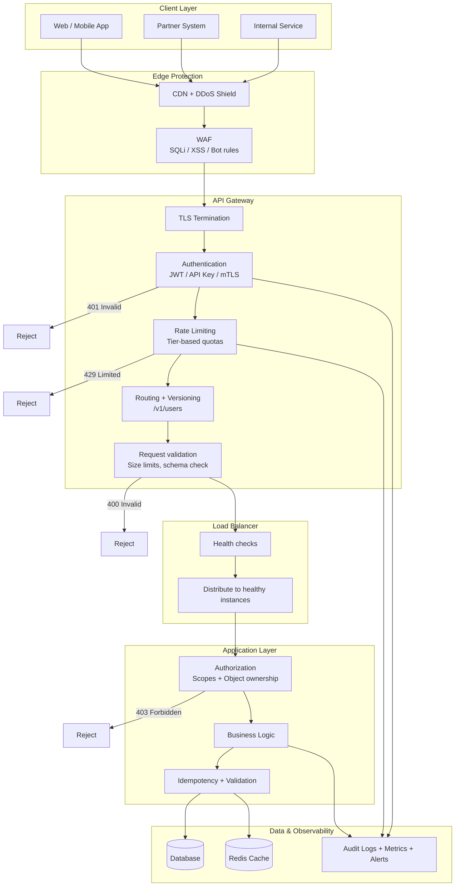
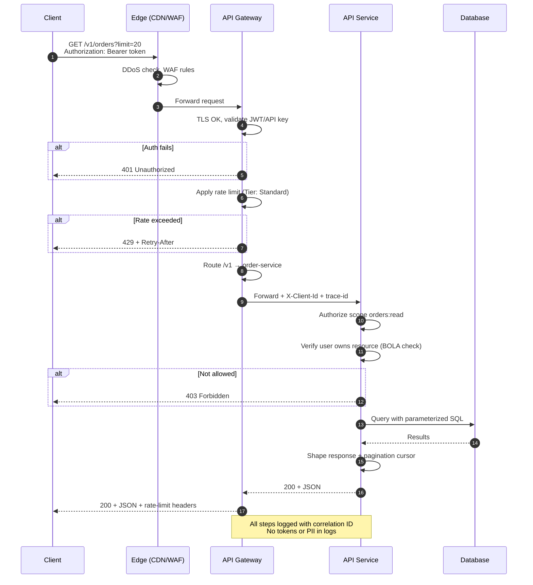
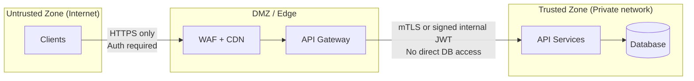

# Overview — API Design, Protection & Full Flow

This guide covers how to **design** public and internal APIs, **protect** them in production, and wire the pieces together: gateway, auth, rate limits, threat modeling, and OpenAPI/Swagger.

> **Related:** Rate limiting algorithms → [api-rate-limiting](../../api-rate-limiting/README.md) · Event sourcing / audit writes → [event-sourcing-and-cqrs](../../event-sourcing-and-cqrs/README.md) · Throughput order → [high-throughput-systems](../../high-throughput-systems/README.md) · Decision checklist → [§9 Checklist](09-checklist-and-practices.md)

## What this guide covers

| Layer | Topics |
|-------|--------|
| **Design** | Resources, versioning, errors, pagination, idempotency |
| **Protection** | AuthN(Authentication)/AuthZ(Authorization), WAF(Web Application Firewall), TLS(Transport Layer Security), validation, logging |
| **Entry architecture** | Load balancer vs API gateway, flows, tech stacks |
| **Gateway** | Product choice, routing, policy enforcement |
| **Auth model** | OAuth(Open Authorization), API keys, mTLS(Mutual Transport Layer Security), webhooks |
| **Identity (RBAC(Role-Based Access Control) / IAM(Identity and Access Management) / AD(Active Directory))** | Enterprise identity, roles, AD → API access |
| **Rate tiers** | Free → Enterprise quotas |
| **Threat model** | STRIDE(Spoofing, Tampering, Repudiation, Information Disclosure, Denial of Service, Elevation of Privilege) + OWASP(Open Worldwide Application Security Project) API Top 10 |
| **OpenAPI/Swagger** | Contract-first design, docs, contract tests |
| **Async patterns** | Jobs, polling, webhooks, SSE(Server-Sent Events), streaming |
| **Idempotency** | Safe retries, Idempotency-Key, storage patterns |
| **Stateless architecture** | Externalized state, scaling, token-based auth, deploy freedom |

## End-to-end request flow

## Sequence: one protected API call

## Trust zones

## Default recommendation

For most **public SaaS(Software as a Service) APIs**:

1. **Design** contract-first with OpenAPI (`/v1`, consistent errors, cursor pagination)
2. **Edge**: Cloudflare or equivalent (DDoS + WAF + bot management)
3. **Gateway**: Kong or AWS API Gateway (authN, tier rate limits, routing)
4. **Load balancer**: ALB or equivalent per service group (scale + health checks)
5. **App**: OAuth for users, scoped API keys for partners; object-level AuthZ in code
6. **Operate**: contract tests in CI(Continuous Integration), monitoring on 401/403/429/5xx, key rotation

See [Load Balancer, API Gateway & Entry Architecture](03-api-gateway.md) for flows and stack choices.

## Pros of this layered approach

- Each layer has a single responsibility — easier to reason about and audit
- Failures are contained (edge absorbs DDoS; gateway absorbs auth/rate abuse)
- Design contract (OpenAPI) stays separate from runtime enforcement (gateway)
- Teams can evolve services behind a stable `/v1` surface

## Cons of this layered approach

- More moving parts — ops complexity, cost, and latency hops
- Policies must stay consistent across edge, gateway, and app (drift risk)
- Over-engineering for internal-only APIs with trusted callers
- Debugging requires correlation IDs across all layers

## When a simpler stack is enough

- Internal-only APIs behind VPN with mTLS and trusted services
- Early MVP with one service, HTTPS + API key + basic rate limit
- Batch/integration workloads with low QPS and contractual SLAs only

## Common mistakes

| Mistake | Fix |
|---------|-----|
| Full gateway stack on day-one MVP | HTTPS + API key + basic rate limit first |
| AuthN at gateway without app AuthZ | Object-level checks on every `{id}` route |
| OpenAPI as docs only, not CI contract | Spectral + breaking diff + contract tests |
| Rate limits only by IP for B2B(Business-to-Business) APIs | Per API key / user identity |
| No correlation ID across layers | `X-Request-Id` from edge through app |