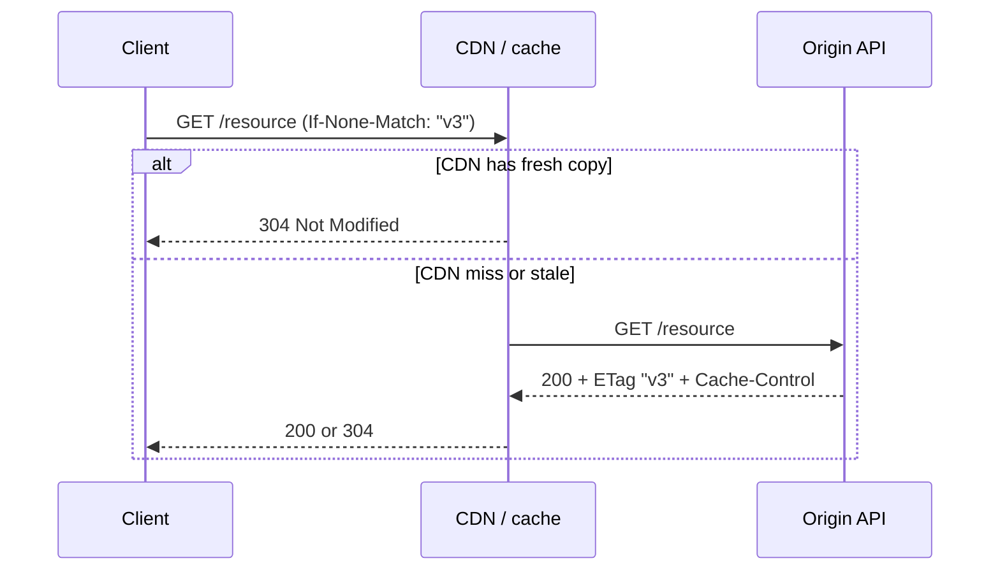

# HTTP Caching and Conditional Requests

HTTP(Hypertext Transfer Protocol) caching is a **contract between origin, intermediaries, and clients**. `Cache-Control`, `ETag`, and conditional headers (`If-None-Match`, `If-Match`) let you trade freshness for throughput — but only when response semantics are explicit. Misconfigured caching causes stale reads, lost updates, and CDN(Content Delivery Network) incidents that look like application bugs.

> **Scope:** Cache headers, validators, and conditional GET/PUT/PATCH semantics for REST(Representational State Transfer) APIs. General resource design → [§1](01-api-design.md). CDN cache keys and purge → [system-design §9A](../../system-design-walkthroughs/includes/09A-cdn-and-media-delivery.md). Layered cache strategy → [HTS §4](../../high-throughput-systems/includes/04-caching-layers.md).
>
> **Related:** [§1 API design](01-api-design.md) · Idempotency and concurrency → [§13](13-idempotency.md) · Gateway passthrough → [§3](03-api-gateway.md) · Object uploads (no CDN on private blobs) → [§18](18-object-storage-and-uploads.md)

---

## At a glance

| Concern | Default |
|---------|---------|
| **Safe GET caching** | `Cache-Control: private, max-age=…` only when staleness is acceptable |
| **Validators** | Strong `ETag` on mutable resources; `Last-Modified` as secondary |
| **Conditional GET** | `If-None-Match` → `304 Not Modified` saves bandwidth |
| **Optimistic writes** | `If-Match` on PATCH/PUT/DELETE prevents lost updates |
| **CDN contract** | Document cache key, auth variant, purge path |
| **Non-cacheable** | Personalized, auth-gated, or legally sensitive responses |

**Rule of thumb:** If a response must never be shared across users, mark it **`private`** or **`no-store`** — do not rely on URL uniqueness alone at the CDN edge.

---

## Read path: validators and 304

| Header | Role |
|--------|------|
| `ETag` | Opaque version token; prefer strong validators for JSON bodies |
| `Last-Modified` | Coarse; OK for large blobs, weak for fast-changing aggregates |
| `If-None-Match` | Conditional GET; skip body on match |
| `Cache-Control` | `max-age`, `s-maxage` (shared), `private`, `no-store`, `must-revalidate` |
| `Vary` | Names dimensions that change representation (e.g. `Accept-Language`, auth) |

Publish **cacheability in OpenAPI** — [§7](07-openapi-swagger.md) — so BFF(Backend for Frontend) and mobile clients do not invent divergent TTL(Time To Live) behavior.

---

## Write path: If-Match and concurrency

| Pattern | Header | Outcome |
|---------|--------|---------|
| Read-modify-write | Client sends `If-Match: "<etag>"` on PATCH | `412 Precondition Failed` if someone else won |
| Delete | `If-Match` or `If-Unmodified-Since` | Prevents deleting a newer version |
| Create-if-absent | `If-None-Match: *` on PUT to fixed URL | Idempotent create semantics |

Return **`ETag` on every successful mutation** so clients can chain updates. Pair with [§13](13-idempotency.md) for retries — a replayed PATCH with the same idempotency key should not require a fresh ETag guess.

---

## CDN contracts

Edge caches only work when origin and CDN agree on the **cache key** and **authorization boundary** — depth in [system-design §9A](../../system-design-walkthroughs/includes/09A-cdn-and-media-delivery.md).

| Decision | Document for partners |
|----------|----------------------|
| What is cacheable | Path patterns, methods, status codes |
| Cache key components | Path, query allowlist, `Vary`, signed cookie/query token |
| TTL source | Origin `Cache-Control` vs CDN override |
| Purge | Tag/API(Application Programming Interface) purge on deploy or content takedown |
| Stale behavior | `stale-while-revalidate`, `stale-if-error` for public catalogs only |

Never cache **tenant-specific** JSON at the edge unless the cache key includes an explicit tenant/auth variant — see [§16](16-multi-tenant-apis.md).

---

## Layer alignment

Application Redis, read replicas, and CDN layers compose — [HTS §4](../../high-throughput-systems/includes/04-caching-layers.md).

| Layer | Invalidate when |
|-------|-------------------|
| CDN | Publish, legal takedown, major schema change |
| App cache | Domain event or explicit key delete |
| DB read model | Accept replication lag or route session-critical reads to primary |

One invalidation story beats three silent TTLs that drift.

---

## Operational checklist

- [ ] OpenAPI documents cache headers per operation where non-default
- [ ] Mutable resources return `ETag`; writes honor `If-Match`
- [ ] Personalized responses use `private` or `no-store`
- [ ] CDN cache key and purge runbook linked from [§9A](../../system-design-walkthroughs/includes/09A-cdn-and-media-delivery.md)
- [ ] Load tests include conditional GET and cache miss storms

---

## Common mistakes

| Mistake | Fix |
|---------|-----|
| `ETag` from wall clock only | Hash representation or version column |
| CDN caches `Authorization` responses without `Vary` | `private` / signed URLs / cache key includes auth |
| PATCH without concurrency control | Require `If-Match`; return `412` |
| `no-cache` treated as “do not cache” | Means revalidate every time — use `no-store` to forbid storage |
| Same TTL for catalog and account settings | Classify per resource in [§1](01-api-design.md) |
| Purge forgotten on deploy | Automate tag purge or short `s-maxage` for hot paths |
