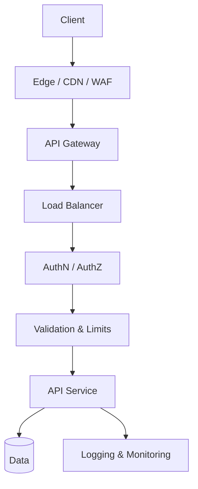

# API Protection

> **Related:** Entry architecture → [§3 Gateway](03-api-gateway.md) · Auth model → [§4 Auth model](04-auth-model.md) · Threat model → [§6 Threat model](06-threat-model.md) · Rate limits → [api-rate-limiting](../../api-rate-limiting/README.md)

## What it is

API protection is **layered defense**: verify callers, limit abuse, validate input, encrypt transport, and detect attacks. No single control is sufficient.

## Defense in depth

> LB may be omitted for a single-instance MVP. See [entry architecture](03-api-gateway.md).

## Protection layers

| Layer | Responsibilities | Typical tools |
|-------|------------------|---------------|
| **Edge** | DDoS, WAF(Web Application Firewall), bot management, geo rules | Cloudflare, AWS Shield, Fastly |
| **Gateway** | TLS(Transport Layer Security), authN, rate limits, routing, size limits | Kong, AWS API Gateway, Azure APIM |
| **Load balancer** | Health checks, scale replicas | AWS ALB/NLB, NGINX, K8s Service |
| **Application** | authZ, validation, idempotency, business rules | Your service code |
| **Data** | Encryption at rest, least-privilege DB roles | RDS, PostgreSQL RLS(Row-Level Security) |
| **Operations** | Audit logs, alerting, secret rotation, pen tests | Datadog, SIEM, Vault |

## 1. Transport security

- **HTTPS only** — reject or redirect HTTP(Hypertext Transfer Protocol)
- **TLS 1.2+** (prefer 1.3)
- **HSTS** for browser-facing APIs
- **mTLS(Mutual Transport Layer Security)** for high-trust B2B(Business-to-Business) or internal service mesh

### Pros

- Industry baseline; required for compliance
- Protects credentials and data in transit

### Cons

- Certificate management overhead
- mTLS adds operational complexity for partners

## 2. Authentication (AuthN)

Prove **who** is calling.

| Method | Best for |
|--------|----------|
| OAuth(Open Authorization) 2.0 / OIDC(OpenID Connect) | User-facing and third-party apps |
| API keys | Server-to-server, partners |
| JWT(JSON Web Token) access tokens | Stateless auth across services |
| mTLS | High-trust B2B, internal mesh |

**Practices:**

- Never put credentials in URL query strings
- Fail closed → `401`, not anonymous fallback
- Rotate secrets; support overlapping validity during rotation
- Store secrets in a vault, not in code or git

## 3. Authorization (AuthZ)

Prove **what** the caller may do — always in the **application layer**, not gateway alone.

- Scope-based: `orders:read`, `orders:write`
- Object-level: user 123 may only access their orders (**BOLA(Broken Object-Level Authorization)** — OWASP(Open Worldwide Application Security Project) API #1)
- RBAC(Role-Based Access Control) / ABAC(Attribute-Based Access Control) as appropriate

| Response | When |
|----------|------|
| `401` | Missing or invalid credentials |
| `403` | Valid credentials but insufficient permission |

## 4. Input validation

Treat all input as hostile: body, query, path, headers.

- Validate type, length, format, range, enum
- Reject unknown fields on write (mass assignment)
- Parameterized queries — no SQL(Structured Query Language) string concatenation
- Cap payload size and JSON nesting depth
- Sanitize file uploads

## 5. Rate limiting

Controls **how much** a caller can consume. Not a substitute for auth.

See the dedicated guide: [api-rate-limiting](../../api-rate-limiting/README.md).

## 6. Idempotency and replay protection

**Write idempotency** (client retries, duplicate POSTs):

- `Idempotency-Key` on POST with side effects — see [Idempotency](13-idempotency.md)

**Inbound webhook replay protection:**

- HMAC(Hash-based Message Authentication Code) signatures + timestamps for webhooks
- Constant-time signature comparison
- Reject stale signed requests
- Dedup by `event_id` in a shared store

## 7. CORS, CSRF, browser-facing APIs

- CORS: allowlist origins; never `*` with credentials
- CSRF tokens or SameSite cookies for cookie-based sessions
- Security headers: `Content-Security-Policy`, `X-Content-Type-Options`

## 8. Logging and monitoring

**Log safely:**

- Request/correlation ID, client ID, endpoint, status, latency
- Rate-limit and auth failure counts

**Never log:**

- Raw tokens, API keys, passwords, full PAN(Primary Account Number), unnecessary PII(Personally Identifiable Information)

**Alert on:**

- Spikes in `401`, `403`, `429`
- Error rate anomalies
- Unusual geo or IP patterns

## Fail-open vs fail-closed

| Strategy | Pros | Cons | When |
|----------|------|------|------|
| **Fail closed** (reject if limiter down) | Safer under attack | Availability hit if Redis/gateway fails | Financial, auth, write endpoints |
| **Fail open** (allow if limiter down) | Higher availability | Vulnerable during outages | Read-heavy, internal low-risk |

Default: **fail closed** for auth and expensive writes; document the choice. Production fail-open policy and war stories → [api-rate-limiting §11](../../api-rate-limiting/includes/11-common-mistakes-and-architecture.md).

## Pros of layered API protection

- Attack surface reduced at each hop
- Blast radius contained (edge absorbs volumetric attacks)
- Clear audit trail when combined with correlation IDs
- Aligns with compliance frameworks (SOC2, PCI)

## Cons

- Latency added at each layer
- Cost of WAF, gateway, and observability tooling
- Policy drift if edge, gateway, and app disagree
- False positives from WAF/bot rules blocking legitimate clients

## Common mistakes

| Mistake | Fix |
|---------|-----|
| WAF only, no app validation | Validate input in service layer too |
| Rate limit store down with no policy | Document fail-open vs fail-closed per endpoint class |
| Log `Authorization` headers | Redact tokens; log client ID only |
| TLS termination only at app | Terminate at edge/gateway; enforce HTTPS |
| No alert on 401/403/429 spikes | Dashboard + paging on auth and limit anomalies |