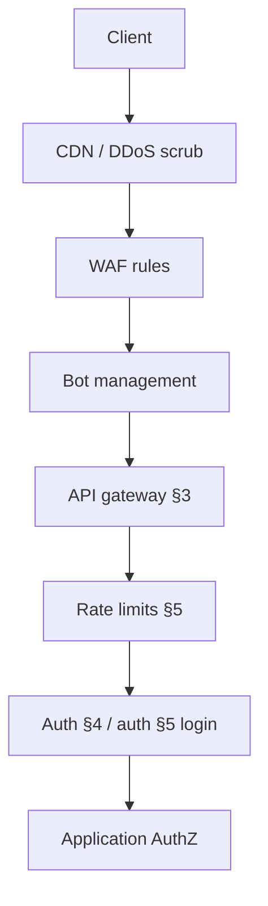
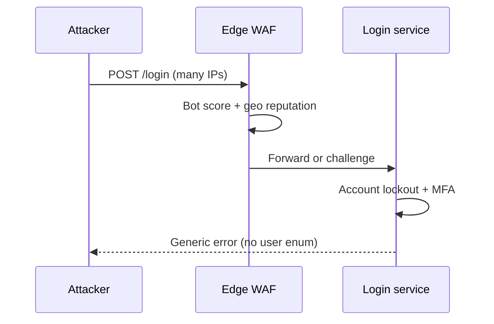

# Edge Abuse, WAF, and Bots

Most abuse hits **before** your application: volumetric DDoS(Distributed Denial of Service), credential stuffing, scrapers, and account takeover(ATO) probes. Edge controls — CDN(Content Delivery Network), WAF(Web Application Firewall), bot management, and geo rules — complement gateway rate limits and login hardening.

> **Scope:** WAF/DDoS/bot/credential-stuffing/ATO(Account Takeover) at the edge. Layered protection overview → [§2](02-api-protection.md). Rate-limit algorithms and tiers → [api-rate-limiting](../../api-rate-limiting/README.md) · [§5](05-rate-limit-tiers.md). Login throttling and MFA(Multi-Factor Authentication) → [auth §5](../../auth-oauth-oidc-and-login-security/includes/05-login-security-playbook.md). Threat model → [§6](06-threat-model.md).
>
> **Related:** Gateway request flows → [§3A](03A-api-gateway-request-flows.md) · Auth model → [§4](04-auth-model.md) · HTS entry/edge → [HTS §2](../../high-throughput-systems/includes/02-entry-and-edge.md)

---

## At a glance

| Threat | Edge signal | App still required |
|--------|-------------|-------------------|
| **Volumetric DDoS** | Traffic spike, SYN flood | Idempotency, pool limits |
| **Application abuse** | Same path, many IPs | AuthZ(Authorization), business rules |
| **Credential stuffing** | Login failures, password spray | MFA, lockout — [auth §5](../../auth-oauth-oidc-and-login-security/includes/05-login-security-playbook.md) |
| **Scrapers / bots** | Headless UA, no JS challenge pass | Rate limits — [§5](05-rate-limit-tiers.md) |
| **ATO** | Impossible travel, new device flood | Step-up, session revoke |

**Rule of thumb:** Edge **filters noise**; application **authorizes identity**. Never treat WAF as AuthN(Authentication).

---

## Defense stack

Depth on gateway placement → [§2](02-api-protection.md). Algorithm details → [api-rate-limiting](../../api-rate-limiting/README.md) — not duplicated here.

---

## WAF

| Mode | Use |
|------|-----|
| **Managed rule sets** | OWASP(Open Worldwide Application Security Project) CRS baseline |
| **Custom rules** | Block known bad paths, IP reputation |
| **Count / log first** | Tune before block on new apps |

| Pattern | Example rule |
|---------|--------------|
| **SQLi/XSS(Cross-Site Scripting)** paths | Managed OWASP rules |
| **Admin path probe** | `/admin`, `/.env` → block or challenge |
| **Oversized body** | Align with gateway max — [§3](03-api-gateway.md) |
| **Geo block** | Sanctioned regions only when legal approves |

False positives burn real users — maintain allowlists for partner egress IPs and health checks.

---

## DDoS

| Layer | Handles |
|-------|---------|
| **Network (L3/L4)** | SYN/UDP floods — provider scrub |
| **Application (L7)** | HTTP(Hypertext Transfer Protocol) flood on expensive routes |

| Practice | Detail |
|----------|--------|
| Origin shield | CDN absorbs before origin |
| Separate static vs API(Application Programming Interface) | Different cache/challenge policy |
| Fail open vs closed | Document during provider outage |

Saturation signals → [HTS §11](../../high-throughput-systems/includes/11-observability.md). Load shedding → [resilience §5](../../resilience-patterns/includes/05-load-shedding-and-degradation.md).

---

## Bots and scrapers

| Signal | Action |
|--------|--------|
| Headless browser fingerprint | Challenge or deny |
| Missing cookie / JS proof | Challenge on sensitive routes |
| Sequential ID scraping | Rate limit + anomaly score |

| Tier | Policy |
|------|--------|
| **Public read API** | Higher limits; bot score soft block |
| **Authenticated API** | Key-based limits — [§5](05-rate-limit-tiers.md) |
| **Login** | Stricter; never exempt “monitoring” without auth |

---

## Credential stuffing and ATO

Edge sees **distributed login attempts**; app and auth own outcomes.

| Control | Where |
|---------|-------|
| **IP / ASN reputation** | Edge WAF |
| **Per-IP and per-account throttle** | Edge + auth — [auth §5](../../auth-oauth-oidc-and-login-security/includes/05-login-security-playbook.md) |
| **CAPTCHA / proof-of-work** | Edge on auth routes after threshold |
| **MFA / WebAuthn(Web Authentication)** | Auth on success path |
| **Impossible travel / new device** | Auth risk engine |
| **Session revoke on compromise** | Auth — [auth §3](../../auth-oauth-oidc-and-login-security/includes/03-token-lifecycle-and-validation.md) |

Do not reveal **valid vs invalid email** in error text — [auth §5](../../auth-oauth-oidc-and-login-security/includes/05-login-security-playbook.md).

---

## Operational checklist

- [ ] WAF in log/count mode before enforce on new surfaces
- [ ] Partner IP allowlist maintained
- [ ] Login routes have edge + auth throttling
- [ ] Bot rules differ for HTML vs JSON API(Application Programming Interface)
- [ ] Runbooks for false-positive unblock
- [ ] Dashboards: block rate, challenge rate, login failure spike

---

## Common mistakes

| Mistake | Fix |
|---------|-----|
| WAF only on web, not API | Protect JSON routes too |
| Rate limit by IP alone on login | Per-account + IP — auth §5 |
| Block without monitoring | Count mode first |
| CAPTCHA on every request | Threshold-based |
| Edge replaces MFA | Layer both |

---

## Pros and cons

| Approach | Pros | Cons |
|----------|------|------|
| **Managed WAF/CDN** | Fast baseline | Cost; tuning needed |
| **Self-hosted WAF** | Control | Ops burden |
| **Always-on CAPTCHA** | Stops bots | Hurts conversion |
| **IP-only defense** | Simple | Bypassed by botnets |
