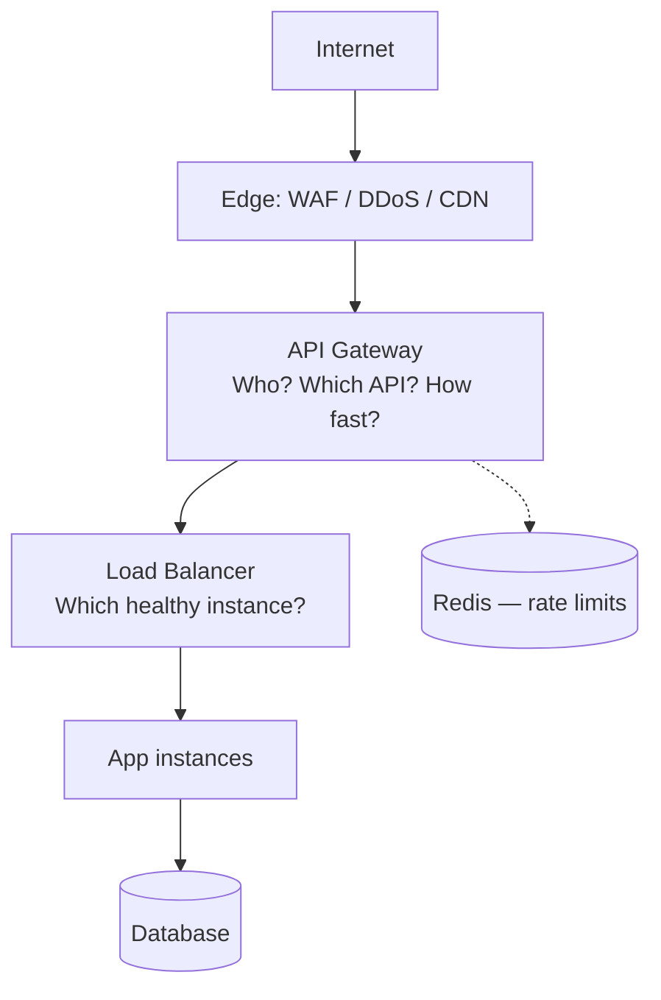
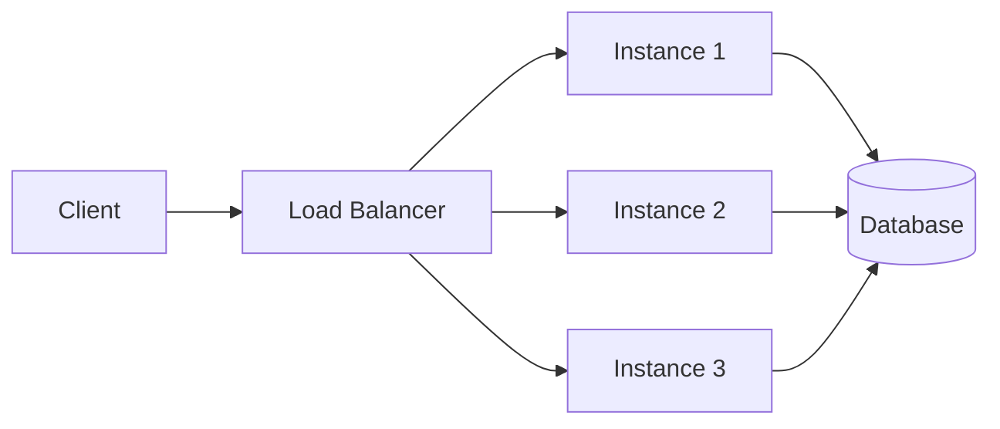
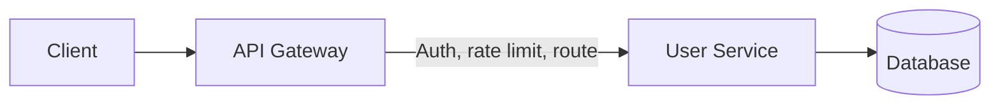
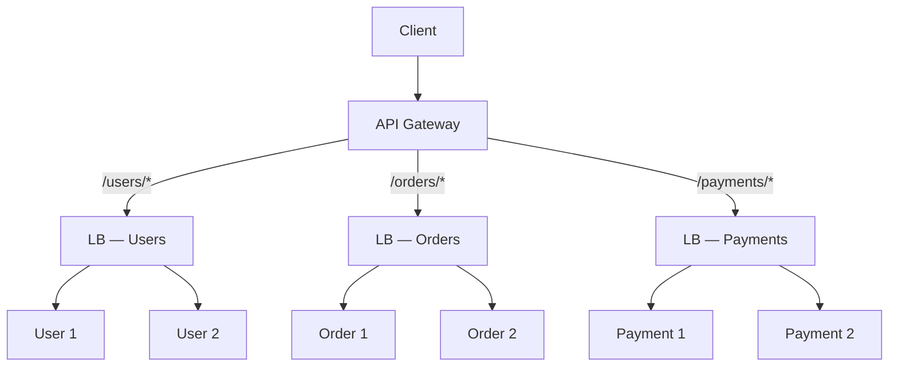
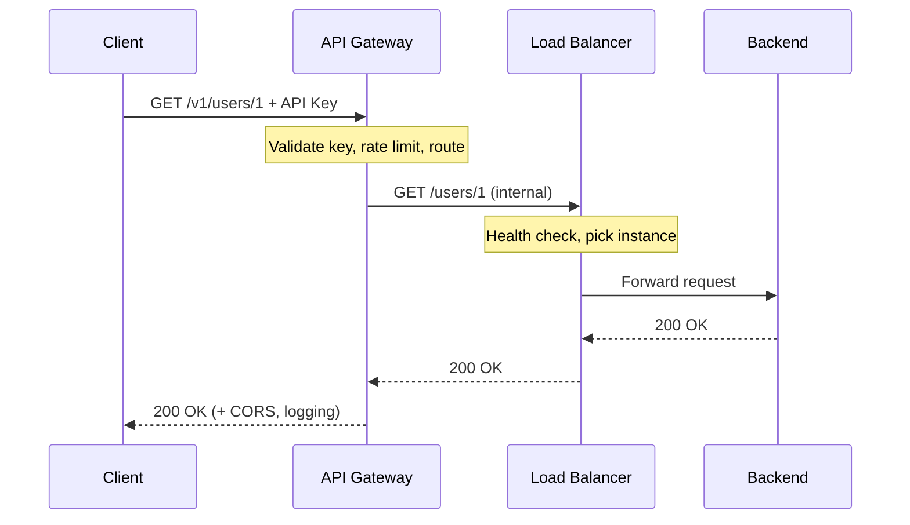
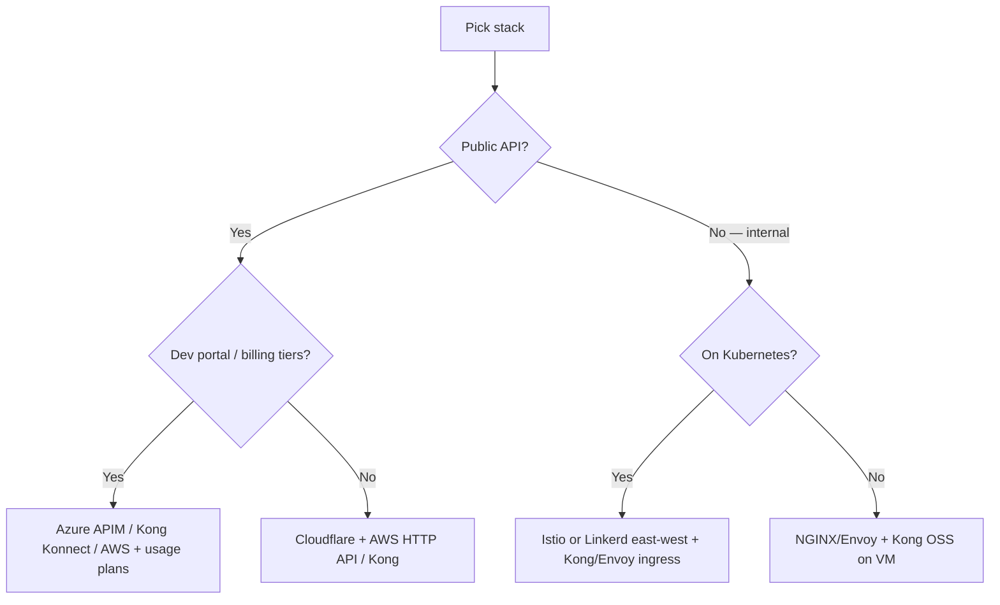
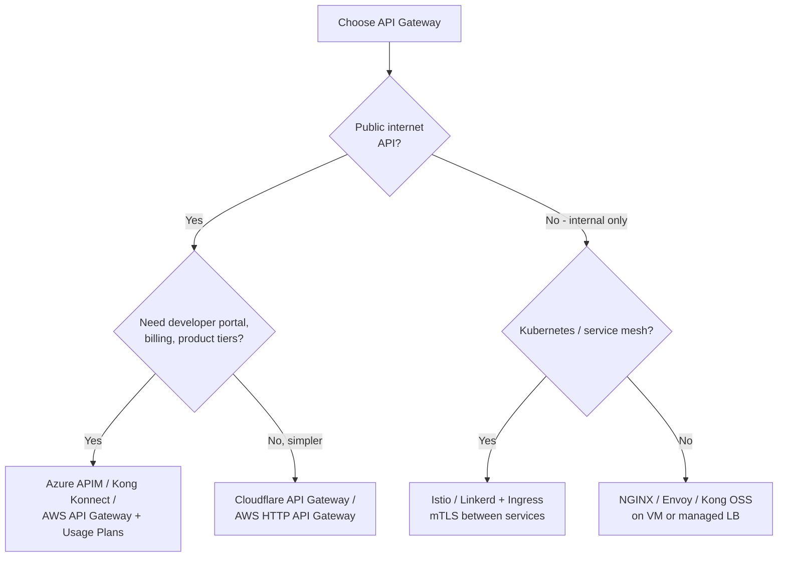

# Load Balancer, API Gateway & Entry Architecture

How traffic enters your API stack: what load balancers and API gateways each do, how they work together, and which products to pick by scenario.

> **Scope:** **Architecture lens** — LB vs gateway, request flows, product selection. Throughput tips (CDN(Content Delivery Network) cache, hop count, TLS(Transport Layer Security) CPU) → [HTS §2 Entry and edge](../../high-throughput-systems/includes/02-entry-and-edge.md).
>
> **Related:** Rate-limit deployment layers → [api-rate-limiting §7](../../api-rate-limiting/includes/07-deployment-layers.md) · Throughput tips → [HTS §2 Entry and edge](../../high-throughput-systems/includes/02-entry-and-edge.md)

---

## At a glance

| | **Load balancer (LB)** | **API gateway** |
|---|---|---|
| **Primary job** | Distribute traffic across healthy backends | Manage, secure, and route **API** traffic |
| **Layer** | L4 (TCP/UDP) or L7 (HTTP(Hypertext Transfer Protocol)) | L7 (HTTP/HTTPS) |
| **Routing** | IP, port, basic path/host | Path, method, headers, version, tenant |
| **Auth / rate limits** | Usually none (minimal at L7) | JWT(JSON Web Token), API keys, OAuth(Open Authorization), throttling, usage plans |
| **Transformation** | Rare | Request/response rewrite, aggregation |
| **Examples** | AWS ALB/NLB, NGINX, HAProxy | Kong, AWS API Gateway, Azure APIM, Cloudflare |

**Rule of thumb:** A load balancer sends traffic to the right **server**. An API gateway sends traffic to the right **API operation** with policy and developer-facing concerns.

Stateless app tiers (no sticky sessions) → [Stateless architecture](11-stateless-architecture.md).



---

## Load balancer vs API gateway

Both sit in front of backend services, but they solve different problems.

### Comparison

| Concern | Load balancer | API gateway |
|---------|---------------|-------------|
| Scale identical app instances | ✅ Primary use | Optional upstream LB |
| API keys, JWT, OAuth at the edge | ❌ | ✅ |
| Path routing `/users`, `/orders` | Basic (L7 ALB) | ✅ Rich |
| Usage plans / product tiers | ❌ | ✅ |
| Health checks + failover | ✅ | Via upstream targets |
| mTLS(Mutual Transport Layer Security) service-to-service | NLB or mesh | Client mTLS at gateway |
| Global low latency | CDN(Content Delivery Network) in front | Edge gateway (Cloudflare) |

### When to use which

| Scenario | Use |
|----------|-----|
| Scale web app or microservice replicas | **Load balancer** |
| Single entry point for many microservices | **API gateway** |
| Public third-party API with keys and quotas | **API gateway** |
| Raw TCP / internal non-HTTP(Hypertext Transfer Protocol) traffic | **L4 load balancer** (not gateway) |
| TLS termination + simple path routing only | **L7 load balancer** may be enough |
| BFF(Backend for Frontend), request aggregation, GraphQL federation | **API gateway** or dedicated BFF |

### Overlap (why people confuse them)

Modern **L7 load balancers** (AWS ALB, NGINX) can do path routing, TLS, and WAF(Web Application Firewall) integration. **API gateways** also load-balance across upstreams. The difference is **intent**:

- **LB** — infrastructure: availability and distribution
- **Gateway** — application/API: contracts, security, developer experience

### Gateway vs load balancer vs service mesh

| Component | Role | Direction | Pros | Cons |
|-----------|------|-----------|------|------|
| **Load balancer** | Distribute traffic to healthy instances | North-south (to apps) | Simple, fast | No API-aware policies |
| **API gateway** | Auth, limits, versioning, routing | North-south (from clients) | Central API policy | Extra hop, cost |
| **Service mesh** | mTLS, retries, observability between services | East-west (service-to-service) | Zero-trust internal | Not a public API product alone |

---

## Request flows

### Flow 1 — Load balancer only

Traffic spreads across identical (or similar) service instances. The client uses one hostname; the LB picks a backend.



**Steps:**

1. Client → `GET https://api.example.com/users/123`
2. LB receives request (often TLS termination here)
3. Health checks exclude unhealthy instances
4. LB picks instance (round-robin, least connections, etc.)
5. Same instance handles the full request/response

**Good for:** scaling one service, high availability, simple path pools (`/api` → one pool, `/static` → another).

---

### Flow 2 — API gateway only (single backend pool)

The gateway handles API concerns; one service (or small set) sits behind it.



**Steps:**

1. Client → `GET /v2/users/123` with `Authorization: Bearer …`
2. Gateway validates API key or JWT
3. Applies rate limit per client or subscription tier
4. Routes `/v2/users/*` → User Service
5. May strip path prefix, add internal headers, log metrics
6. Forwards to backend; returns response (optionally transformed)

**Good for:** public APIs, versioning, monetization, central auth, OpenAPI-backed portals.

---

### Flow 3 — Both together (common at scale)

**Gateway** for API policy; **LB** for scaling each microservice.



**Example — `GET /orders/456`:**

```
Client
  → API Gateway     (auth, rate limit, route to Orders)
  → Orders LB       (pick healthy Order pod)
  → Order Service   (business logic)
  → Database
  ← response back through the chain
```

---

### Flow 4 — Sequence: what each layer sees



This sequence matches the protected call in [Overview — full flow](00-overview.md#sequence-one-protected-api-call); the overview diagram adds edge WAF and application AuthZ layers.

---

## Tech stacks by scenario

### Layer reference

| Layer | Job | Common choices |
|-------|-----|----------------|
| **Edge** | DDoS, WAF, coarse rate limits | Cloudflare, AWS CloudFront + WAF, Fastly |
| **API gateway** | Auth, API keys, versioning, routing | Kong, AWS API Gateway, Azure APIM, Cloudflare API Gateway |
| **Load balancer** | Scale + health-check backends | AWS ALB/NLB, GCP LB, Azure App Gateway, NGINX, HAProxy |
| **Services** | Business logic | Node, Go, Java microservices, or monolith |
| **Rate-limit store** | Shared counters across gateway instances | Redis (ElastiCache, Memorystore, etc.) |

### Stack decision flow



### Recommended stacks by API type

| API type | Stack |
|----------|-------|
| **Public SaaS API** | Cloudflare (edge) → Kong or AWS API Gateway → **ALB per service** → pods/VMs |
| **AWS-native** | Route 53 → CloudFront + WAF → API Gateway → ALB → ECS/EKS/Lambda |
| **Kubernetes** | Ingress / Gateway API or Kong Ingress → K8s Service (LB) → pods; Istio/Linkerd for east-west |
| **B2B partner API** | Azure Front Door or Cloudflare → Azure APIM or Kong → ALB + optional client mTLS |
| **Mobile backend** | Cloudflare + AWS HTTP API + Cognito/OAuth → ALB → services |
| **Internal microservices** | Istio/Linkerd mTLS + ingress gateway for north-south; mesh for east-west |
| **Startup MVP** | Cloudflare + single gateway (AWS HTTP API or Kong OSS); skip separate LB until you scale |
| **Self-hosted / on-prem** | HAProxy or NGINX (LB) → Kong OSS or Tyk → app servers; Redis for limits |

### Scenario details

#### Public SaaS API

```
Cloudflare (edge)
  → Kong or AWS API Gateway (auth, tiers, routing)
    → ALB / NGINX (per microservice)
      → ECS/EKS pods or EC2
```

| Piece | Pick |
|-------|------|
| Edge | Cloudflare (WAF + edge rate limits) |
| Gateway | Kong Konnect or AWS API Gateway + usage plans |
| LB | AWS ALB (L7) per service group |
| Auth | Auth0, Cognito, or Kong OAuth/JWT plugins |
| Limits | Gateway + Redis; app layer for plan-specific quotas |

#### AWS-native

```
Route 53 → CloudFront + WAF → API Gateway → ALB → ECS Fargate / EKS / Lambda
```

| Piece | Pick |
|-------|------|
| Gateway | AWS API Gateway (HTTP API for simple; REST(Representational State Transfer) for usage plans) |
| LB | ALB for containers; NLB for raw TCP |
| Auth | Cognito, Lambda authorizers, IAM (internal) |
| IaC | Terraform or AWS CDK |

#### Kubernetes

| Piece | Pick |
|-------|------|
| Gateway (north-south) | Kong Ingress, Envoy Gateway, Istio ingress, or cloud LB + Gateway API |
| LB (in-cluster) | Kubernetes Service + cloud LB annotation or MetalLB |
| East-west | Istio or Linkerd — **not** a substitute for a public API gateway |
| Limits | Kong + Redis, or Envoy rate limit service |

**Mental model:** Ingress/Gateway API ≈ API gateway layer; Kubernetes Service ≈ load balancer for pods.

#### Greenfield default

If no strong constraints: **Cloudflare** (edge) + **Kong** or **AWS API Gateway** + **ALB** per service + **EKS/ECS** + **Cognito/Auth0** + **OpenAPI 3** contract.

---

## Choosing an API gateway product

Once you know you need a gateway (not just an LB), pick the product.

### Gateway selection flow



### Gateway comparison matrix

| Gateway | Best for | Auth | Rate limits | WAF/DDoS | Pros | Cons |
|---------|----------|------|-------------|----------|------|------|
| **AWS API Gateway** | AWS-native stacks | Cognito, Lambda authorizer, IAM | Throttling + usage plans | Via AWS WAF + Shield | Deep AWS integration, usage plans for tiers | Vendor lock-in, config complexity |
| **Kong / Kong Konnect** | Multi-cloud, plugins | OAuth, JWT, key-auth, mTLS | Redis-backed, flexible | Pair with Cloudflare/AWS WAF | Rich plugin ecosystem, portable | Self-hosted ops unless Konnect |
| **Azure APIM** | Enterprise B2B | OAuth, certs, subscriptions | Per-subscription quotas | Azure Front Door + WAF | Developer portal, enterprise features | Heavier, Azure-centric |
| **Cloudflare API Gateway** | Edge-first, global latency | JWT, mTLS, API tokens | Edge rate limiting | Built-in WAF + DDoS | Low ops, global edge | Less backend transformation |
| **NGINX / Envoy** | Self-hosted, K8s ingress | External auth subrequest | lua/redis modules | External WAF required | Full control, predictable cost | You operate everything |
| **Istio / Linkerd** | Internal microservices | mTLS + RBAC(Role-Based Access Control) | Local limits | Not north-south alone | Strong east-west zero-trust | Wrong tool as sole public gateway |

---

## What the gateway should do

| Responsibility | Gateway | Load balancer | Application |
|----------------|---------|---------------|-------------|
| TLS termination | ✅ | ✅ (common) | Optional internal mTLS |
| Authentication (AuthN) | ✅ | ❌ | Validate internal identity headers |
| Rate limiting | ✅ | ❌ | Optional second layer on expensive ops |
| Routing `/v1` → service | ✅ | Basic | — |
| Request size limits | ✅ | Sometimes | — |
| Health checks + failover | Via upstream | ✅ | — |
| Authorization (AuthZ) | Partial (scopes) | ❌ | ✅ Object-level checks |
| Business logic | ❌ | ❌ | ✅ |
| Idempotency | ❌ | ❌ | ✅ |

---

## Importing OpenAPI into gateway

Some gateways (Kong, Azure APIM, AWS) can **import OpenAPI** to auto-create routes.

### Pros

- Faster bootstrap from contract-first spec
- Routes stay aligned with documented paths

### Cons

- Policies (rate limits, auth) still configured separately
- Spec drift if import is one-time only — use CI to verify

See [OpenAPI / Swagger](07-openapi-swagger.md) for the full lifecycle role of the spec.

---

## Pros and cons

### Using a load balancer

**Pros:** Simple, fast, proven HA pattern; minimal latency overhead.

**Cons:** No API-aware auth, tiers, or versioning; wrong tool for public API products alone.

### Using an API gateway

**Pros:** Central auth, rate limits, and routing; hides internal topology; usage plans map to product tiers.

**Cons:** Single point of failure if not HA; added latency (typically single-digit ms); can become a policy junk drawer; migration pain if chosen wrong.

### Using both (typical production)

**Pros:** Clear separation — gateway for API policy, LB for scaling each service.

**Cons:** More hops, cost, and operational surface; requires correlation IDs for debugging.

## Common mistakes

| Mistake | Fix |
|---------|-----|
| Gateway as only auth layer | App still enforces object-level AuthZ |
| One-time OpenAPI import, never synced | CI verify routes match spec |
| LB only for public API products | Add gateway for auth, tiers, versioning |
| Policy junk drawer in gateway | Keep business rules in app; gateway for cross-cutting |
| No health check distinction | Readiness must include DB/cache dependencies |