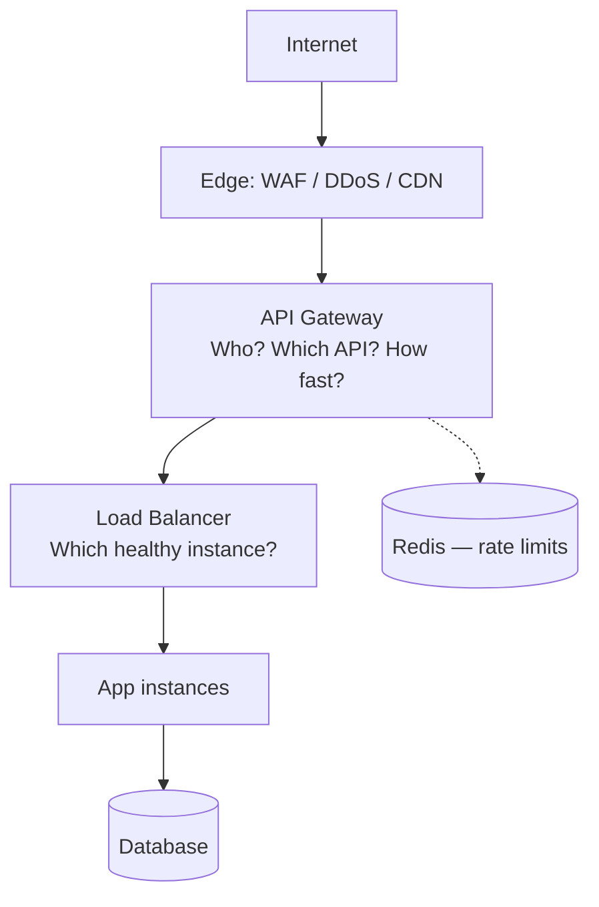

# Load Balancer, API Gateway & Entry Architecture

How traffic enters your API stack: what load balancers and API gateways each do, how they work together, and which products to pick by scenario.

> **Scope:** **Architecture lens** — LB vs gateway, request flows, product selection. Throughput tips (CDN(Content Delivery Network) cache, hop count, TLS(Transport Layer Security) CPU) → [HTS §2 Entry and edge](../../high-throughput-systems/includes/02-entry-and-edge.md).
>
> **Related:** Rate-limit deployment layers → [api-rate-limiting §7](../../api-rate-limiting/includes/07-deployment-layers.md) · Throughput tips → [HTS §2 Entry and edge](../../high-throughput-systems/includes/02-entry-and-edge.md) · DNS(Domain Name System), protocol, and TLS placement depth → [HTS §16 Networking fundamentals](../../high-throughput-systems/includes/16-networking-fundamentals.md)

## Articles in this section

| Article | Topics |
|---------|--------|
| [Request flows](03A-api-gateway-request-flows.md) | LB-only, gateway-only, both together, sequence diagram |
| [Stacks and product selection](03B-api-gateway-stacks-and-selection.md) | Scenario stacks, gateway matrix, OpenAPI import, gateway responsibilities |

---

## At a glance

| | **Load balancer (LB)** | **API gateway** |
|---|---|---|
| **Primary job** | Distribute traffic across healthy backends | Manage, secure, and route **API** traffic |
| **Layer** | L4 (TCP/UDP) or L7 (HTTP(Hypertext Transfer Protocol)) | L7 (HTTP/HTTPS) |
| **Routing** | IP, port, basic path/host | Path, method, headers, version, tenant |
| **Auth / rate limits** | Usually none (minimal at L7) | JWT(JSON Web Token), API keys, OAuth(Open Authorization), throttling, usage plans |
| **Transformation** | Rare | Request/response rewrite, aggregation |
| **Examples** | AWS ALB/NLB, NGINX, HAProxy | Kong, AWS API Gateway, Azure APIM, Cloudflare |

**Rule of thumb:** A load balancer sends traffic to the right **server**. An API gateway sends traffic to the right **API operation** with policy and developer-facing concerns.

Stateless app tiers (no sticky sessions) → [Stateless architecture](11-stateless-architecture.md).

---

## Load balancer vs API gateway

Both sit in front of backend services, but they solve different problems.

### Comparison

| Concern | Load balancer | API gateway |
|---------|---------------|-------------|
| Scale identical app instances | ✅ Primary use | Optional upstream LB |
| API keys, JWT, OAuth at the edge | ❌ | ✅ |
| Path routing `/users`, `/orders` | Basic (L7 ALB) | ✅ Rich |
| Usage plans / product tiers | ❌ | ✅ |
| Health checks + failover | ✅ | Via upstream targets |
| mTLS(Mutual Transport Layer Security) service-to-service | NLB or mesh | Client mTLS at gateway |
| Global low latency | CDN(Content Delivery Network) in front | Edge gateway (Cloudflare) |

### When to use which

| Scenario | Use |
|----------|-----|
| Scale web app or microservice replicas | **Load balancer** |
| Single entry point for many microservices | **API gateway** |
| Public third-party API with keys and quotas | **API gateway** |
| Raw TCP / internal non-HTTP(Hypertext Transfer Protocol) traffic | **L4 load balancer** (not gateway) |
| TLS termination + simple path routing only | **L7 load balancer** may be enough |
| BFF(Backend for Frontend), request aggregation, GraphQL federation | **API gateway** or dedicated BFF |

### Overlap (why people confuse them)

Modern **L7 load balancers** (AWS ALB, NGINX) can do path routing, TLS, and WAF(Web Application Firewall) integration. **API gateways** also load-balance across upstreams. The difference is **intent**:

- **LB** — infrastructure: availability and distribution
- **Gateway** — application/API: contracts, security, developer experience

### Gateway vs load balancer vs service mesh

| Component | Role | Direction | Pros | Cons |
|-----------|------|-----------|------|------|
| **Load balancer** | Distribute traffic to healthy instances | North-south (to apps) | Simple, fast | No API-aware policies |
| **API gateway** | Auth, limits, versioning, routing | North-south (from clients) | Central API policy | Extra hop, cost |
| **Service mesh** | mTLS, retries, observability between services | East-west (service-to-service) | Zero-trust internal | Not a public API product alone |

---

## Pros and cons

### Using a load balancer

**Pros:** Simple, fast, proven HA pattern; minimal latency overhead.

**Cons:** No API-aware auth, tiers, or versioning; wrong tool for public API products alone.

### Using an API gateway

**Pros:** Central auth, rate limits, and routing; hides internal topology; usage plans map to product tiers.

**Cons:** Single point of failure if not HA; added latency (typically single-digit ms); can become a policy junk drawer; migration pain if chosen wrong.

### Using both (typical production)

**Pros:** Clear separation — gateway for API policy, LB for scaling each service.

**Cons:** More hops, cost, and operational surface; requires correlation IDs for debugging.

## Common mistakes

| Mistake | Fix |
|---------|-----|
| Gateway as only auth layer | App still enforces object-level AuthZ(Authorization) |
| One-time OpenAPI import, never synced | CI(Continuous Integration) verify routes match spec |
| LB only for public API products | Add gateway for auth, tiers, versioning |
| Policy junk drawer in gateway | Keep business rules in app; gateway for cross-cutting |
| No health check distinction | Readiness must include DB/cache dependencies |