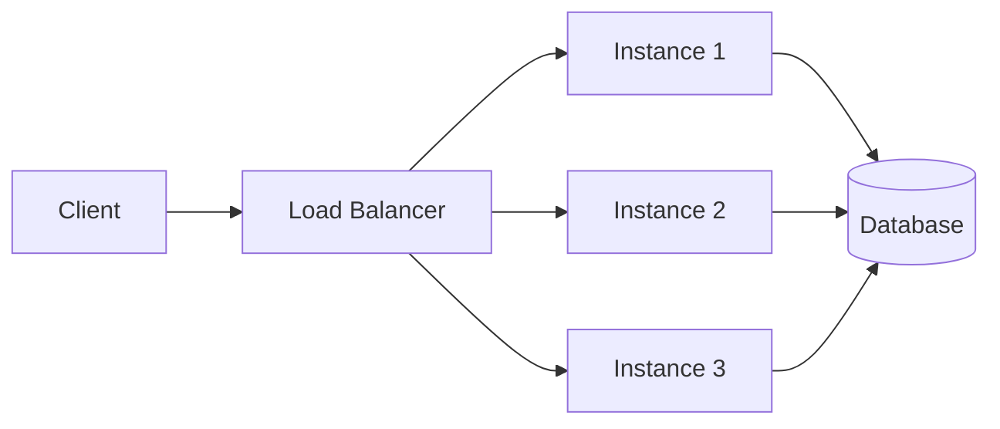
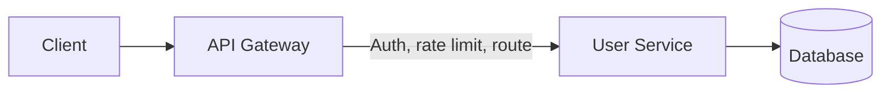
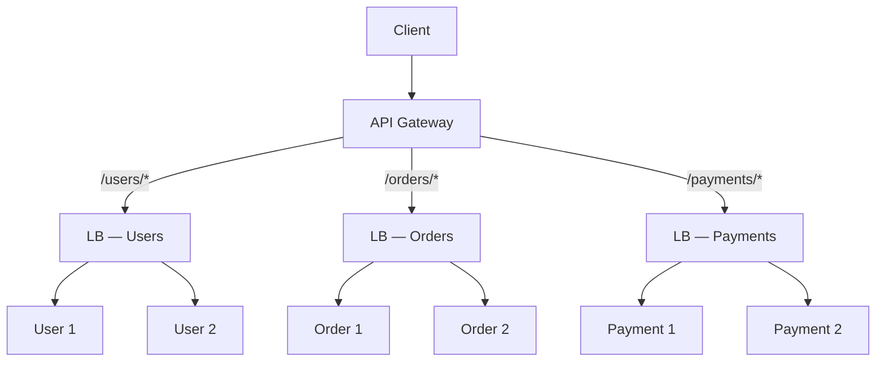
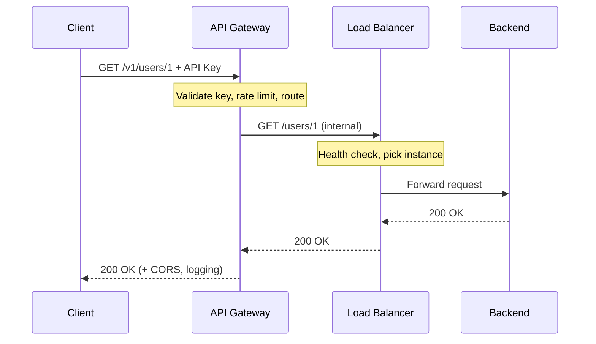

# API Gateway — request flows

> **Related:** Overview → [Load balancer & API gateway](03-api-gateway.md) · Stacks and product selection → [03B-api-gateway-stacks-and-selection.md](03B-api-gateway-stacks-and-selection.md)

---

## Request flows

### Flow 1 — Load balancer only

Traffic spreads across identical (or similar) service instances. The client uses one hostname; the LB picks a backend.



**Steps:**

1. Client → `GET https://api.example.com/users/123`
2. LB receives request (often TLS(Transport Layer Security) termination here)
3. Health checks exclude unhealthy instances
4. LB picks instance (round-robin, least connections, etc.)
5. Same instance handles the full request/response

**Good for:** scaling one service, high availability, simple path pools (`/api` → one pool, `/static` → another).

---

### Flow 2 — API gateway only (single backend pool)

The gateway handles API concerns; one service (or small set) sits behind it.



**Steps:**

1. Client → `GET /v2/users/123` with `Authorization: Bearer …`
2. Gateway validates API key or JWT(JSON Web Token)
3. Applies rate limit per client or subscription tier
4. Routes `/v2/users/*` → User Service
5. May strip path prefix, add internal headers, log metrics
6. Forwards to backend; returns response (optionally transformed)

**Good for:** public APIs, versioning, monetization, central auth, OpenAPI-backed portals.

---

### Flow 3 — Both together (common at scale)

**Gateway** for API policy; **LB** for scaling each microservice.



**Example — `GET /orders/456`:**

```
Client
  → API Gateway     (auth, rate limit, route to Orders)
  → Orders LB       (pick healthy Order pod)
  → Order Service   (business logic)
  → Database
  ← response back through the chain
```

---

### Flow 4 — Sequence: what each layer sees



This sequence matches the protected call in [Overview — full flow](00-overview.md#sequence-one-protected-api-call); the overview diagram adds edge WAF(Web Application Firewall) and application AuthZ(Authorization) layers.