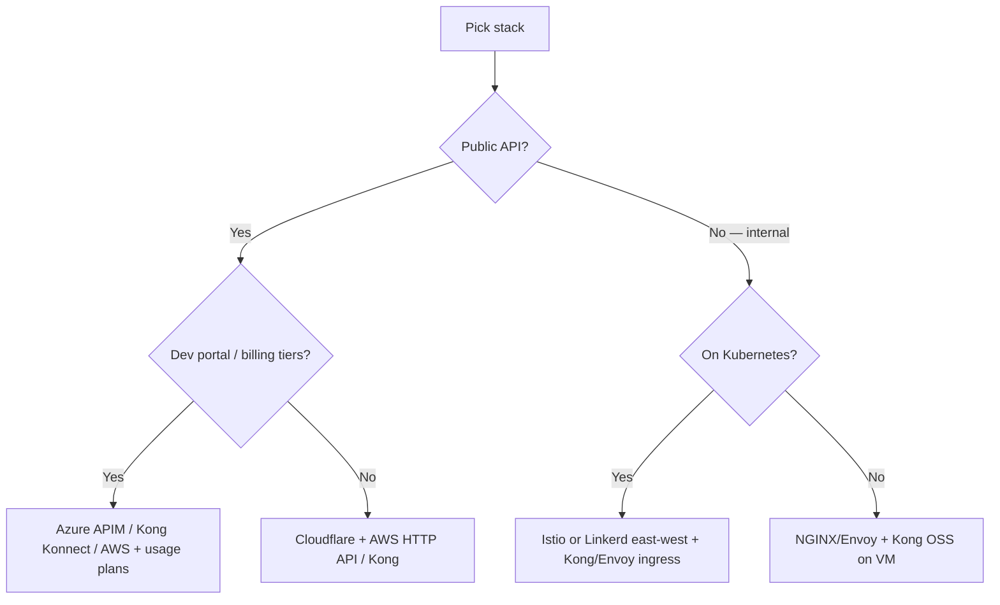
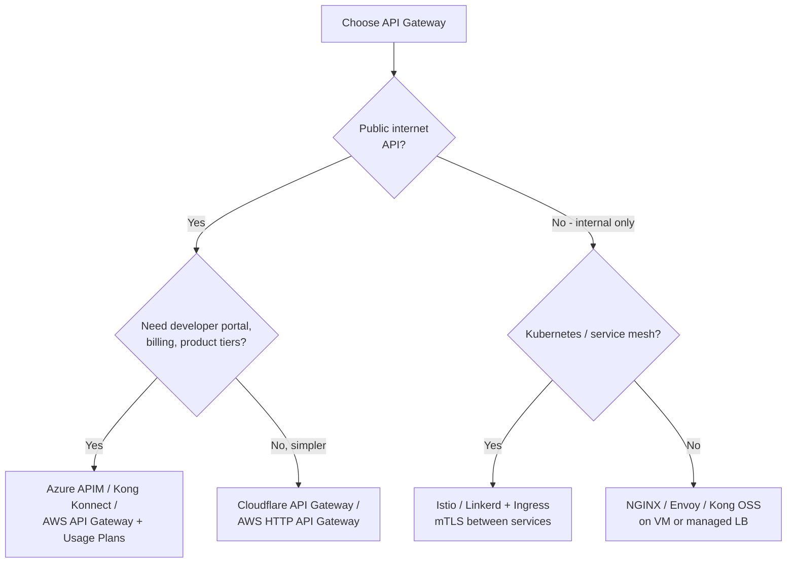

# API Gateway — stacks and product selection

> **Related:** Overview → [Load balancer & API gateway](03-api-gateway.md) · Request flows → [03A-api-gateway-request-flows.md](03A-api-gateway-request-flows.md)

---

## Tech stacks by scenario

### Layer reference

| Layer | Job | Common choices |
|-------|-----|----------------|
| **Edge** | DDoS, WAF(Web Application Firewall), coarse rate limits | Cloudflare, AWS CloudFront + WAF, Fastly |
| **API gateway** | Auth, API keys, versioning, routing | Kong, AWS API Gateway, Azure APIM, Cloudflare API Gateway |
| **Load balancer** | Scale + health-check backends | AWS ALB/NLB, GCP LB, Azure App Gateway, NGINX, HAProxy |
| **Services** | Business logic | Node, Go, Java microservices, or monolith |
| **Rate-limit store** | Shared counters across gateway instances | Redis (ElastiCache, Memorystore, etc.) |

### Stack decision flow



### Recommended stacks by API type

| API type | Stack |
|----------|-------|
| **Public SaaS API** | Cloudflare (edge) → Kong or AWS API Gateway → **ALB per service** → pods/VMs |
| **AWS-native** | Route 53 → CloudFront + WAF → API Gateway → ALB → ECS/EKS/Lambda |
| **Kubernetes** | Ingress / Gateway API or Kong Ingress → K8s Service (LB) → pods; Istio/Linkerd for east-west |
| **B2B partner API** | Azure Front Door or Cloudflare → Azure APIM or Kong → ALB + optional client mTLS(Mutual Transport Layer Security) |
| **Mobile backend** | Cloudflare + AWS HTTP(Hypertext Transfer Protocol) API + Cognito/OAuth(Open Authorization) → ALB → services |
| **Internal microservices** | Istio/Linkerd mTLS + ingress gateway for north-south; mesh for east-west |
| **Startup MVP** | Cloudflare + single gateway (AWS HTTP API or Kong OSS); skip separate LB until you scale |
| **Self-hosted / on-prem** | HAProxy or NGINX (LB) → Kong OSS or Tyk → app servers; Redis for limits |

### Scenario details

#### Public SaaS API

```
Cloudflare (edge)
  → Kong or AWS API Gateway (auth, tiers, routing)
    → ALB / NGINX (per microservice)
      → ECS/EKS pods or EC2
```

| Piece | Pick |
|-------|------|
| Edge | Cloudflare (WAF + edge rate limits) |
| Gateway | Kong Konnect or AWS API Gateway + usage plans |
| LB | AWS ALB (L7) per service group |
| Auth | Auth0, Cognito, or Kong OAuth/JWT(JSON Web Token) plugins |
| Limits | Gateway + Redis; app layer for plan-specific quotas |

#### AWS-native

```
Route 53 → CloudFront + WAF → API Gateway → ALB → ECS Fargate / EKS / Lambda
```

| Piece | Pick |
|-------|------|
| Gateway | AWS API Gateway (HTTP API for simple; REST(Representational State Transfer) for usage plans) |
| LB | ALB for containers; NLB for raw TCP |
| Auth | Cognito, Lambda authorizers, IAM (internal) |
| IaC | Terraform or AWS CDK |

#### Kubernetes

| Piece | Pick |
|-------|------|
| Gateway (north-south) | Kong Ingress, Envoy Gateway, Istio ingress, or cloud LB + Gateway API |
| LB (in-cluster) | Kubernetes Service + cloud LB annotation or MetalLB |
| East-west | Istio or Linkerd — **not** a substitute for a public API gateway |
| Limits | Kong + Redis, or Envoy rate limit service |

**Mental model:** Ingress/Gateway API ≈ API gateway layer; Kubernetes Service ≈ load balancer for pods.

#### Greenfield default

If no strong constraints: **Cloudflare** (edge) + **Kong** or **AWS API Gateway** + **ALB** per service + **EKS/ECS** + **Cognito/Auth0** + **OpenAPI 3** contract.

---

## Choosing an API gateway product

Once you know you need a gateway (not just an LB), pick the product.

### Gateway selection flow



### Gateway comparison matrix

| Gateway | Best for | Auth | Rate limits | WAF/DDoS | Pros | Cons |
|---------|----------|------|-------------|----------|------|------|
| **AWS API Gateway** | AWS-native stacks | Cognito, Lambda authorizer, IAM | Throttling + usage plans | Via AWS WAF + Shield | Deep AWS integration, usage plans for tiers | Vendor lock-in, config complexity |
| **Kong / Kong Konnect** | Multi-cloud, plugins | OAuth, JWT, key-auth, mTLS | Redis-backed, flexible | Pair with Cloudflare/AWS WAF | Rich plugin ecosystem, portable | Self-hosted ops unless Konnect |
| **Azure APIM** | Enterprise B2B | OAuth, certs, subscriptions | Per-subscription quotas | Azure Front Door + WAF | Developer portal, enterprise features | Heavier, Azure-centric |
| **Cloudflare API Gateway** | Edge-first, global latency | JWT, mTLS, API tokens | Edge rate limiting | Built-in WAF + DDoS | Low ops, global edge | Less backend transformation |
| **NGINX / Envoy** | Self-hosted, K8s ingress | External auth subrequest | lua/redis modules | External WAF required | Full control, predictable cost | You operate everything |
| **Istio / Linkerd** | Internal microservices | mTLS + RBAC(Role-Based Access Control) | Local limits | Not north-south alone | Strong east-west zero-trust | Wrong tool as sole public gateway |

---

## What the gateway should do

| Responsibility | Gateway | Load balancer | Application |
|----------------|---------|---------------|-------------|
| TLS(Transport Layer Security) termination | ✅ | ✅ (common) | Optional internal mTLS |
| Authentication (AuthN) | ✅ | ❌ | Validate internal identity headers |
| Rate limiting | ✅ | ❌ | Optional second layer on expensive ops |
| Routing `/v1` → service | ✅ | Basic | — |
| Request size limits | ✅ | Sometimes | — |
| Health checks + failover | Via upstream | ✅ | — |
| Authorization (AuthZ) | Partial (scopes) | ❌ | ✅ Object-level checks |
| Business logic | ❌ | ❌ | ✅ |
| Idempotency | ❌ | ❌ | ✅ |

---

## Importing OpenAPI into gateway

Some gateways (Kong, Azure APIM, AWS) can **import OpenAPI** to auto-create routes.

### Pros

- Faster bootstrap from contract-first spec
- Routes stay aligned with documented paths

### Cons

- Policies (rate limits, auth) still configured separately
- Spec drift if import is one-time only — use CI to verify

See [OpenAPI / Swagger](07-openapi-swagger.md) for the full lifecycle role of the spec.
