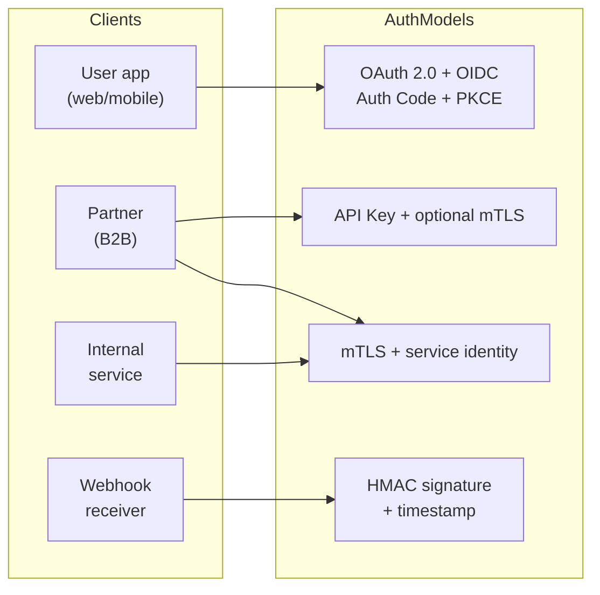
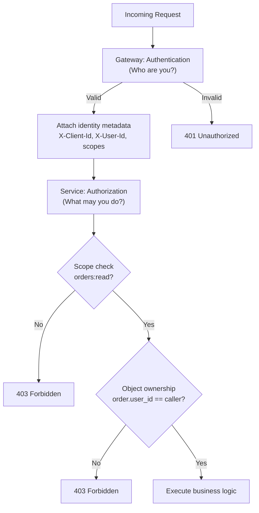

# Auth Model

> **Related:** Enterprise identity → [§12 Identity RBAC / IAM / AD](12-identity-rbac-iam-ad.md) · Gateway enforcement → [§3 Gateway](03-api-gateway.md) · Webhook security → [§10 Async patterns](10-async-patterns.md)

## What it is

The **auth model** defines how clients prove identity (authentication) and how the system decides what they may access (authorization). Gateway handles AuthN; services must handle AuthZ — especially **object-level** permissions.

OAuth(Open Authorization) and JWT(JSON Web Token) tell you **who** called; **RBAC(Role-Based Access Control)** and **IAM(Identity and Access Management)** define **what roles and permissions** they have. Enterprise identity often flows from Active Directory (or Entra ID) into token claims and API(Application Programming Interface) policies.

Full details → [Identity: RBAC, IAM & Active Directory](12-identity-rbac-iam-ad.md)

## Auth by client type

## Decision matrix

| Client | Auth model | Token lifetime | Gateway | Application |
|--------|------------|----------------|---------|-------------|
| **End-user app** | OAuth 2.0 + PKCE(Proof Key for Code Exchange) → JWT | Access: ~15 min; refresh: days | Validate JWT sig, iss, aud, exp | Scopes + user owns resource |
| **Partner / server** | API key + IP allowlist; optional mTLS(Mutual Transport Layer Security) | Rotate quarterly | Key lookup → `client_id` | Scope per key; audit all calls |
| **Internal service** | mTLS + short-lived service JWT | 5–15 min | Terminate mTLS, forward identity | RBAC / service allowlists |
| **Webhooks (inbound)** | HMAC(Hash-based Message Authentication Code)-SHA256 + timestamp | N/A | Optional IP allowlist | Verify signature, reject replays |

## Layered auth flow

## OAuth 2.0 + OIDC (user-facing)

### Pros

- Industry standard; SDK support everywhere
- Short-lived access tokens; refresh token rotation
- Fine-grained scopes
- PKCE secures public clients (SPAs, mobile)

### Cons

- Complex to implement correctly (many failure modes)
- Token validation overhead at gateway
- Refresh token storage must be secure
- Implicit flow is deprecated — avoid it

**Best practices:**

- Authorization Code + PKCE for public clients
- Lock redirect URIs exactly
- Minimal scopes per client
- Short access token TTL

## API keys (server-to-server)

### Pros

- Simple for partners to integrate
- Easy to issue, revoke, and rotate
- Maps cleanly to rate-limit tiers

### Cons

- Long-lived secrets — high impact if leaked
- No built-in user context (service identity only)
- Often sent in headers — must never log them
- IP allowlists break with dynamic partner IPs

**Best practices:**

- Scoped keys (read-only where possible)
- Rotation with overlapping validity
- Store hashed keys server-side if feasible
- Per-key audit logging

## JWT access tokens

### Pros

- Stateless validation (no DB lookup per request)
- Works across distributed services
- Claims carry scopes and subject

### Cons

- Hard to revoke instantly without blocklist or short TTL
- Payload is signed, not encrypted — no secrets in claims
- Clock skew and algorithm confusion attacks if validation is sloppy
- Teams misuse JWTs as long-lived "API keys"

**Best practices:**

- Validate: signature, `exp`, `iss`, `aud`, `nbf`
- Short TTL (minutes)
- Asymmetric keys (RS256) with key rotation

## mTLS (mutual TLS)

### Pros

- Strong cryptographic identity for B2B and internal calls
- No shared secret in every request header
- Fits zero-trust internal mesh

### Cons

- Certificate lifecycle management for every client
- Partner onboarding friction
- Not suitable for browser clients
- Debugging connectivity issues is harder

## HMAC webhooks

### Pros

- Proves payload integrity and origin
- No OAuth dance for simple callbacks

### Cons

- Shared secret rotation requires coordination
- Replay attacks if timestamp/nonce not enforced
- Each provider uses different header conventions

## Auth model comparison summary

| Model | Security | Ease of integration | Revocation | Best fit |
|-------|----------|---------------------|------------|----------|
| OAuth + JWT | High | Medium | Medium (short TTL + revoke refresh) | User apps |
| API key | Medium | High | High (revoke key) | Partners, scripts |
| mTLS | Very high | Low | Medium (cert revoke) | B2B, internal |
| HMAC webhook | Medium | Medium | Medium | Inbound webhooks |

## Common mistakes

- AuthN at gateway but **no object-level AuthZ** in app (BOLA(Broken Object-Level Authorization))
- Long-lived JWTs treated as permanent API keys
- Returning `404` instead of `403` inconsistently
- Logging `Authorization` headers
- One global admin API key for all partners