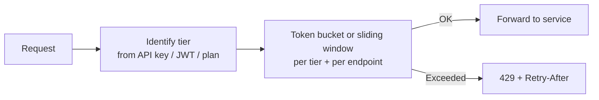

# Rate-Limit Tiers

> **Scope:** **Product lens** — tier definitions, per-endpoint multipliers, canonical `429` headers. Algorithms, deployment layers, and production architecture → [api-rate-limiting](../../api-rate-limiting/README.md).
>
> **Related:** Limiter algorithms → [api-rate-limiting](../../api-rate-limiting/README.md) · Gateway usage plans → [§3 Gateway](03-api-gateway.md) · Async escape hatch → [§10 Async patterns](10-async-patterns.md)

## What it is

**Rate-limit tiers** map product plans (Free, Standard, Professional, Enterprise) to request quotas. Limits should be keyed by **identity** (API(Application Programming Interface) key, user, subscription) — not IP alone.

For algorithm details (fixed window, token bucket, sliding window), see: [api-rate-limiting](../../api-rate-limiting/README.md).

## Tier flow



## Tier definitions

| Tier | Typical caller | Requests/min | Requests/day | Burst | Expensive endpoints* | Monthly quota |
|------|----------------|--------------|--------------|-------|----------------------|---------------|
| **Free** | Trial / dev | 60 | 10,000 | 10 | 5/min | 100K |
| **Standard** | Paid small team | 600 | 500,000 | 100 | 30/min | 5M |
| **Professional** | Production app | 3,000 | 5,000,000 | 500 | 150/min | 50M |
| **Enterprise** | Contract | Custom | Custom | Custom | Custom SLA | Unlimited† |
| **Internal** | Your services | 10,000+ | N/A | High | Separate pool | N/A |

\*Expensive: reports, search, bulk export, ML inference, file processing  
†Still apply abuse caps and cost alerts

## Per-endpoint multipliers

Apply stricter limits to costlier operations:

| Endpoint class | Limit multiplier | Example |
|----------------|------------------|---------|
| Read single resource | 1× base | `GET /v1/users/123` |
| List / search | 0.5× base | `GET /v1/orders?...` |
| Write | 0.3× base | `POST /v1/orders` |
| Bulk / export | 0.05× base | `POST /v1/reports/export` |
| Auth / token | 0.2× base + CAPTCHA at edge | `POST /oauth/token` |

## Response headers

Always return rate-limit metadata (canonical header set for product tiers):

```http
HTTP/1.1 429 Too Many Requests
Retry-After: 60
X-RateLimit-Limit: 600
X-RateLimit-Remaining: 0
X-RateLimit-Reset: 1718380860
```

Response strategies (hard reject vs throttle, retry-storm prevention) → [api-rate-limiting §9 Response strategies](../../api-rate-limiting/includes/09-response-strategies.md).

## Layered limits

Enforce **global → per-IP → per-tier/API(Application Programming Interface) key → per-endpoint** (cheapest check first). This section defines **product tiers**; where each layer runs and how counters are shared is in the rate-limiting guide:

- Deployment layers (edge, gateway, app) → [api-rate-limiting §7](../../api-rate-limiting/includes/07-deployment-layers.md)
- Production architecture diagram + fail-open policy → [api-rate-limiting §11](../../api-rate-limiting/includes/11-common-mistakes-and-architecture.md)

## Async escape hatch

For heavy work, return `202 Accepted` instead of holding a request slot — tier limits still apply at enqueue time, but the client does not block on completion.

Full design (job states, webhooks, SSE(Server-Sent Events), OpenAPI) → [Async patterns](10-async-patterns.md).

## Mapping tiers to gateway products

| Platform | Feature |
|----------|---------|
| **AWS API Gateway** | Usage plans + API keys |
| **Kong** | Consumers, plugins, Redis rate limiting |
| **Azure APIM** | Subscriptions + product tiers |
| **Cloudflare** | Rate limiting rules per hostname/path |

## Pros of tier-based rate limiting

- Fair monetization aligned with product plans
- Protects infrastructure cost predictably
- Clear upgrade path for customers hitting limits
- Combines with analytics for capacity planning

## Cons

- Complex to communicate (multiple counters confuse developers)
- Wrong tier defaults frustrate free-tier users
- Enterprise "unlimited" still needs abuse protection
- Per-endpoint multipliers require maintenance as API evolves
- Distributed rate limiting needs Redis/similar — failure mode → [api-rate-limiting §11](../../api-rate-limiting/includes/11-common-mistakes-and-architecture.md#5-fail-open-vs-fail-closed)

## Tier design best practices

- Document limits in OpenAPI description and developer portal
- Return consistent `429` body with `request_id`
- Offer `Retry-After` always
- Monitor `429` rate per tier — signals product or attack issues
- Separate **auth endpoint** limits to prevent credential stuffing

## Common mistakes

| Mistake | Fix |
|---------|-----|
| IP-only limits for authenticated B2B | Rate limit by API key / `client_id` |
| Enterprise tier with no abuse cap | "Unlimited" still needs ceiling + monitoring |
| Opaque 429 without `Retry-After` | Standard body + retry header always |
| Same limit for cheap GET and expensive POST | Per-endpoint multipliers |
| Tier limits only in dashboard, not OpenAPI | Document quotas in spec and portal |
