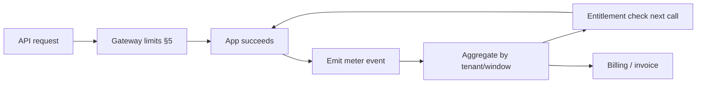
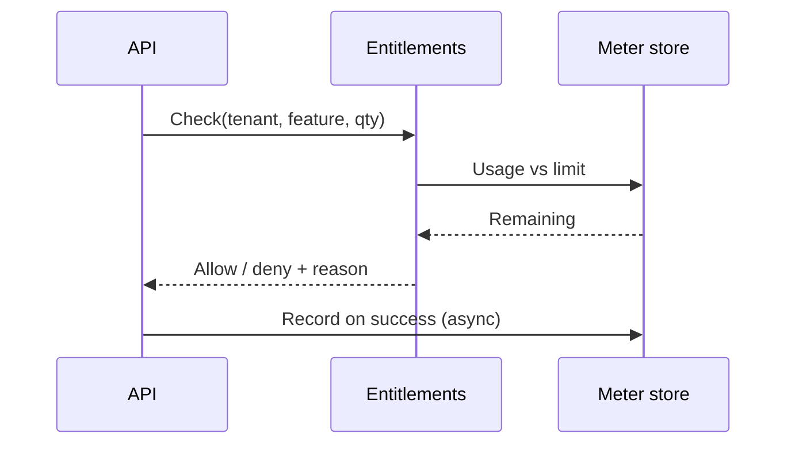

# Metering, Entitlements, and Billable Events

Usage-based products need a **metering pipeline** that turns API(Application Programming Interface) activity into billable units, and an **entitlements layer** that answers “may this tenant consume this capability right now?” Rate limits stop abuse; metering and entitlements drive **packaging, invoices, and feature gates**.

> **Scope:** Idempotent meter events, aggregation windows, entitlement AuthZ(Authorization), and how billable events connect to tiers and finance. Tier definitions and `429` headers → [§5](05-rate-limit-tiers.md). Unit economics → [finops §1](../../finops-and-cost/includes/01-unit-economics.md). Org/stage/pricing fit → [architecture §14](../../architecture-decisions/includes/14-org-stage-and-pricing-fit.md). Fine-grained AuthZ → [§12D](12D-fine-grained-authz.md). Money paths → [payments §2](../../payments-and-fintech/includes/02-idempotency-and-double-charge.md).
>
> **Related:** Gateway enforcement → [§3](03-api-gateway.md) · Idempotency patterns → [§13](13-idempotency.md) · Developer portal usage display → [§7A](07A-developer-portal.md) · Multi-tenant APIs → [§16](16-multi-tenant-apis.md)

---

## At a glance

| Layer | Question | Typical owner |
|-------|----------|---------------|
| **Meter event** | What happened, for whom, when? | App + async pipeline |
| **Aggregation** | How much in this billing window? | Meter store / warehouse |
| **Entitlement** | Is this feature/quota allowed now? | AuthZ service + cache |
| **Billing** | What do we invoice? | Finance / billing provider |

**Rule of thumb:** Meter **at the business boundary** (successful export, inference call, seat activated) — not every HTTP(Hypertext Transfer Protocol) probe. Rate limits protect the system; meters measure **value delivered**.

---

## End-to-end flow

| Step | Requirement |
|------|-------------|
| **Identify subject** | Tenant + subscription + plan from JWT(JSON Web Token) / API key — [§16](16-multi-tenant-apis.md) |
| **Emit once** | Idempotent event key — duplicate retries must not double-count |
| **Aggregate** | Hourly/daily rollups; align to contract window (calendar month vs anniversary) |
| **Enforce** | Entitlement check before expensive paths; soft vs hard block per tier |

---

## Billable events

| Property | Guidance |
|----------|----------|
| **Event type** | Stable name (`api.report.generated`, `storage.gb_day`) |
| **Dimensions** | `tenant_id`, `subscription_id`, `feature`, `region`, optional `user_id` |
| **Quantity** | Integer or decimal with fixed precision (avoid float money) |
| **Timestamp** | Source time (when work completed), not only ingest time |
| **Idempotency key** | `{tenant}:{operation_id}` or natural domain key — [§13](13-idempotency.md) |

**Idempotent meter ingest:** Accept `(idempotency_key, event)`; store outcome; return same `202`/body on replay. Never “best effort drop duplicates” for paid units.

For payment-adjacent meters (per-transaction fees), tie the meter key to the **order/charge natural key** — [payments §2](../../payments-and-fintech/includes/02-idempotency-and-double-charge.md).

---

## Aggregation

| Window | Use |
|--------|-----|
| **Real-time counter** | Entitlement enforcement, portal “usage this hour” |
| **Daily rollup** | Ops dashboards, anomaly detection |
| **Billing period** | Invoice line items |

| Pattern | Pros | Cons |
|---------|------|------|
| **Stream + materialized counter** | Low-latency enforce | Must handle late/out-of-order events |
| **Batch warehouse rollup** | Simple reconciliation | Lag for hard enforcement |
| **Hybrid** | Fast gate + nightly truth | Two systems to reconcile |

Reconcile stream counters to warehouse totals; alert on drift above a small epsilon — [finops §1](../../finops-and-cost/includes/01-unit-economics.md).

---

## Entitlements AuthZ

Entitlements answer **product questions** coarse RBAC(Role-Based Access Control) cannot:

| Check | Example |
|-------|---------|
| **Feature flag by plan** | Enterprise SSO(Single Sign-On), custom domains |
| **Quota remaining** | API calls, seats, storage GB |
| **Overage policy** | Block vs allow + bill vs grace period |

| Practice | Why |
|----------|-----|
| Cache entitlement decisions briefly (TTL(Time To Live) seconds) | Protect meter store under load |
| Invalidate cache on plan change | Avoid stale “allowed” after downgrade |
| Return machine-readable deny (`quota_exceeded`, `feature_not_in_plan`) | Portal and support self-serve |
| Log every deny with tenant + feature | FinOps(Cloud Financial Operations) and sales forensics |

Object-level “may edit this document?” stays in fine AuthZ — [§12D](12D-fine-grained-authz.md). Entitlements are **plan and quota**, not per-row ACLs(Access Control Lists).

---

## Tie to tiers and pricing

| [§5 tier](05-rate-limit-tiers.md) knob | Meter / entitlement mirror |
|----------------------------------------|----------------------------|
| Requests/min | Included API units per month |
| Expensive endpoint multipliers | Weighted meter (`report = 10 units`) |
| Enterprise custom | Contract table overrides defaults |

Portal and gateway must show the **same limits** — [§7A](07A-developer-portal.md). Architecture §14 maps **GTM(Go-To-Market) and pricing stage** to when you need hard silos vs pooled quotas — [architecture §14](../../architecture-decisions/includes/14-org-stage-and-pricing-fit.md).

---

## Operational checklist

- [ ] Every billable action has a stable event type and idempotency key
- [ ] Late events handled (backfill window documented)
- [ ] Real-time counter reconciled to billing rollup
- [ ] Entitlement deny reasons exposed to API clients
- [ ] Plan change propagates to cache within SLO(Service Level Objective)
- [ ] Finance sign-off on rounding, timezone, and proration rules

---

## Common mistakes

| Mistake | Why it hurts | Fix |
|---------|--------------|-----|
| Meter on every `GET` | Invoices disagree with value | Meter completed work only |
| No idempotency on emit | Retries inflate usage | Key per business operation |
| Entitlement only in UI | API bypass burns margin | Enforce in app before side effects |
| Float quantities for money | Rounding disputes | Decimal / integer minor units |
| Rate limit = billing limit | Abuse blocks vs plan blocks conflated | Separate gateway tier from entitlement |

---

## Pros and cons

| Approach | Pros | Cons |
|----------|------|------|
| **Vendor billing (Stripe Usage, etc.)** | Invoices + tax handled | Event schema lock-in; lag |
| **In-house meter + export** | Full control | Reconciliation and finance ops |
| **Hard block at quota** | Predictable cost | CX(Customer Experience) friction at limit |
| **Soft overage + bill** | Revenue upside | Surprise invoices; needs alerts |
