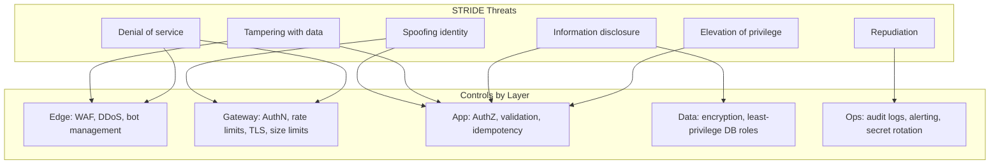
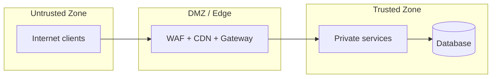

# Threat Model

> **Related:** Protection layers → [§2 API protection](02-api-protection.md) · AuthZ gaps (BOLA(Broken Object-Level Authorization)) → [§4 Auth model](04-auth-model.md) · Pre-launch checklist → [§9 Checklist](09-checklist-and-practices.md)

## What it is

A **threat model** identifies what can go wrong, who might attack, and which controls mitigate each risk. For APIs, combine **STRIDE(Spoofing, Tampering, Repudiation, Information Disclosure, Denial of Service, Elevation of Privilege)** (systematic categories) with **OWASP(Open Worldwide Application Security Project) API(Application Programming Interface) Security Top 10** (API-specific risks).

## STRIDE mapped to layers

## STRIDE detail

| Threat | Definition | API example | Primary control |
|--------|------------|-------------|-----------------|
| **Spoofing** | Pretending to be someone else | Stolen API key, forged JWT(JSON Web Token) | Strong authN, short TTL, rotation |
| **Tampering** | Modifying data in transit or storage | SQL(Structured Query Language) injection, MITM | TLS(Transport Layer Security), WAF(Web Application Firewall), parameterized queries |
| **Repudiation** | Denying an action | Partner denies placing order | Audit logs with correlation IDs; append-only domain events ([Event Sourcing](../../event-sourcing-and-cqrs/includes/04-api-design-implications.md#audit-and-history-apis)) |
| **Information disclosure** | Leaking sensitive data | Verbose errors, BOLA(Broken Object-Level Authorization) | Safe errors, object-level AuthZ |
| **Denial of service** | Making service unavailable | Flood expensive endpoints | Rate limits, WAF, autoscaling |
| **Elevation of privilege** | Gaining unauthorized access | Mass assignment `role=admin` | Field whitelists, RBAC(Role-Based Access Control) |

## OWASP API Security Top 10 (2023)

| # | Risk | Example attack | Control |
|---|------|----------------|---------|
| 1 | **Broken object-level authorization (BOLA)** | `GET /v1/orders/999` (not yours) | Owner check on every `{id}` route |
| 2 | **Broken authentication** | Leaked API key, weak OAuth(Open Authorization) | MFA for admin, key rotation, PKCE(Proof Key for Code Exchange) |
| 3 | **Broken object property-level authorization** | PATCH sets `"role":"admin"` | Whitelist writable fields |
| 4 | **Unrestricted resource consumption** | Flood `POST /search` | Tier limits, pagination caps, async queues |
| 5 | **Broken function-level authorization** | Regular user calls `/admin` | RBAC on every route; separate admin surface |
| 6 | **Unrestricted access to sensitive business flows** | Automated checkout abuse | Step-up auth, fraud signals, flow limits |
| 7 | **Server-side request forgery (SSRF(Server-Side Request Forgery))** | Webhook URL → `169.254.169.254` | Outbound allowlist; block private IPs |
| 8 | **Security misconfiguration** | Debug mode in prod | Hardened defaults, no stack traces in errors |
| 9 | **Improper inventory management** | Old `/v0` still exposed | API inventory, Sunset headers, gateway audit |
| 10 | **Unsafe consumption of third-party APIs** | Malformed upstream crashes parser | Validate external responses, timeouts, circuit breakers |

## Trust zones

**Assumption:** Everything in the untrusted zone is hostile. Everything crossing into trusted must be authenticated, validated, and logged.

## Threat modeling workshop (minimal)

1. **Draw data flow** — client → edge → gateway → service → DB
2. **List assets** — user PII, payment data, API keys, admin functions
3. **List actors** — anonymous, authenticated user, partner, insider, attacker
4. **Apply STRIDE** per component
5. **Map to OWASP API** for API-specific gaps
6. **Prioritize** — likelihood × impact
7. **Assign controls** — design, gateway, code, ops
8. **Revisit** on every major API version or new endpoint class

## Pros of formal threat modeling

- Finds BOLA and auth gaps before production
- Aligns security and product teams on priorities
- Evidence for compliance audits
- Reduces pen-test surprises

## Cons

- Time-consuming if done as heavy documentation only
- Can become stale if not tied to CI/CD and reviews
- Over-focus on theoretical threats vs actual abuse patterns
- Not a substitute for penetration testing and monitoring

## Red team vs real abuse

| Approach | Pros | Cons |
|----------|------|------|
| **Threat modeling (design-time)** | Cheap, early | May miss novel attacks |
| **Pen testing (periodic)** | Finds real exploitable bugs | Point-in-time snapshot |
| **Production monitoring** | Catches live abuse | Reactive; damage may already occur |
| **Bug bounty** | Continuous testing | Noise, cost, scope management |

Use all four at different maturity stages.

## Common mistakes

| Mistake | Fix |
|---------|-----|
| Threat model doc never updated | Revisit on major version or new endpoint class |
| STRIDE workshop only, no monitoring | Production alerts on abuse patterns |
| Assume gateway stops BOLA | Object ownership checks in app code |
| Pen test once, no follow-up | Track findings to closure; retest |
| Ignore insider / partner threat actors | Include in actor list and controls |