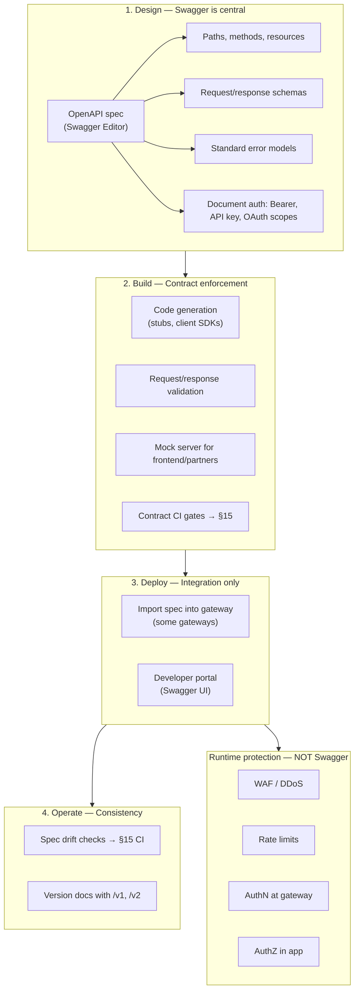

# OpenAPI / Swagger

> **Scope:** **Author and publish** the API(Application Programming Interface) contract — OpenAPI format, Swagger UI, codegen, gateway import, terminology. **CI gates** (Spectral, breaking diff, contract tests, deploy coupling) → [§15 Contract and schema testing](15-contract-and-schema-testing.md).
>
> **Related:** Contract testing in CI → [§15 Contract and schema testing](15-contract-and-schema-testing.md) · Versioning → [§14 API versioning](14-api-versioning-and-deprecation.md) · Gateway import → [§3 Gateway](03-api-gateway.md)

## What it is

**OpenAPI Specification (OAS)** is a standard format (`openapi.yaml` / `openapi.json`) for describing REST(Representational State Transfer) APIs. **Swagger** is the tooling ecosystem around OAS: Swagger Editor, Swagger UI, Swagger Codegen, and related validators.

Swagger does **not** replace gateway auth, WAF(Web Application Firewall), or rate limits. It defines and documents the **contract**; runtime protection is configured separately.

## Where Swagger fits in the lifecycle



## Step-by-step responsibilities

| Step | Swagger/OpenAPI role | What actually enforces security |
|------|----------------------|----------------------------------|
| **Design** | Define paths, schemas, errors, auth schemes | Threat modeling (separate) |
| **Build** | Codegen, validation middleware, mocks | App validation code; **contract CI** → [§15](15-contract-and-schema-testing.md) |
| **Deploy** | Publish Swagger UI; optional gateway route import | Gateway policies, WAF, TLS(Transport Layer Security) |
| **Operate** | Version docs; drift detection via §15 pipeline | Monitoring, key rotation |

## Example spec fragment

```yaml
openapi: 3.0.3
info:
  title: Orders API
  version: 1.0.0

paths:
  /v1/orders:
    get:
      summary: List orders
      security:
        - BearerAuth: [orders:read]
      parameters:
        - name: limit
          in: query
          schema:
            type: integer
            maximum: 100
        - name: cursor
          in: query
          schema:
            type: string
      responses:
        '200':
          description: OK
        '401':
          $ref: '#/components/responses/Unauthorized'
        '429':
          $ref: '#/components/responses/RateLimited'

components:
  securitySchemes:
    BearerAuth:
      type: http
      scheme: bearer
      bearerFormat: JWT
```

Document rate-limit headers in response descriptions even though the gateway enforces them.

## Swagger UI (developer portal)

### Pros

- Interactive docs — partners try endpoints with real auth
- Always in sync if generated from the same spec as CI
- Reduces integration support burden
- Shows required scopes and error codes

### Cons

- Exposes full API(Application Programming Interface) surface to attackers (mitigate with auth on try-it-out)
- Can drift from implementation if not CI-gated
- Not a substitute for narrative guides and examples
- Large specs are hard to navigate without grouping/tags

Contract testing (Spectral, Dredd, Schemathesis, breaking diff) → [§15 Contract and schema testing](15-contract-and-schema-testing.md).

## Code generation

| Direction | Pros | Cons |
|-----------|------|------|
| **Server stubs from spec** | Fast bootstrap; matches contract | Generated code quality varies; merge pain |
| **Client SDKs from spec** | Consistent partner integrations | SDK versioning and publishing overhead |
| **Hand-written server + spec** | Full control | Drift risk without CI checks |

## Gateway import from OpenAPI

Some gateways auto-create routes from the spec.

### Pros

- Faster initial gateway setup
- Route paths match documentation

### Cons

- Auth, rate limits, WAF still manual
- One-time import drifts quickly — prefer pipeline sync or verification

## OpenAPI vs implementation — who wins?

| Approach | Pros | Cons |
|----------|------|------|
| **Contract-first** (spec → code) | Design reviewed before build | Slower start |
| **Code-first** (code → spec) | Faster for small teams | Spec often neglected |
| **Hybrid + CI drift check** | Balance speed and safety | Requires discipline — see [§15 CI pipeline](15-contract-and-schema-testing.md#ci-pipeline-minimal) |

**Recommendation:** Contract-first for public/partner APIs; enforce drift with [§15](15-contract-and-schema-testing.md).

## Terminology

| Term | Meaning |
|------|---------|
| **OpenAPI (OAS)** | The specification standard |
| **Swagger Editor** | Edit OpenAPI visually or as YAML |
| **Swagger UI** | Renders spec as interactive HTML docs |
| **Spectral** | Linter for OpenAPI style and security rules |
| **Schemathesis / Dredd** | Contract test runners |

## What Swagger does NOT do

| Capability | Swagger? | Who does it |
|------------|----------|-------------|
| Rate limiting | No | API Gateway, Cloudflare |
| WAF / DDoS | No | Edge provider |
| JWT(JSON Web Token) validation | No | Gateway / middleware |
| Object-level AuthZ | No | Application |
| Idempotency enforcement | No | Application |
| Secret storage | No | Vault, cloud secret managers |

## Mental model

```
OpenAPI/Swagger  =  blueprint and instruction manual
API Gateway      =  bouncer, traffic cop, ID checker
Your app         =  business rules and object permissions
```

## Pros of using OpenAPI/Swagger in the workflow

- Single source of truth for design, docs, and tests
- Faster partner onboarding
- Enforces consistency (errors, pagination, auth documentation)
- Integrates with gateway and SDK pipelines

## Cons

- Learning curve for OpenAPI syntax and tooling
- Large specs become hard to maintain without modular `$ref` files
- Spec cannot express all runtime policies (rate tier numbers, WAF rules)
- Codegen can produce ugly or insecure boilerplate if used blindly

## Common mistakes

| Mistake | Fix |
|---------|-----|
| Spec drift from implementation | [§15](15-contract-and-schema-testing.md) CI pipeline blocks merge on drift |
| Monolithic 5k-line spec | Modular `$ref` files per domain |
| Document auth but not scopes | List OAuth(Open Authorization) scopes per operation |
| Treat spec as rate-limit source of truth | Document tiers in portal; enforce in gateway |
| Skip breaking-change detection | `openapi-diff` / oasdiff on every PR |