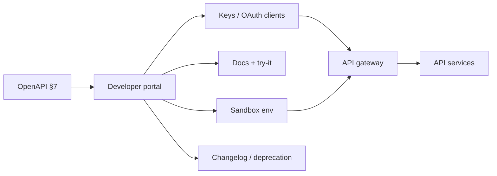

# Developer Portal

A developer portal is the **self-serve product surface** for your public or partner APIs(Application Programming Interfaces): keys, sandboxes, try-it authentication, changelogs, plan tiers, and breaking-change communication. OpenAPI describes the contract ([§7](07-openapi-swagger.md)); the portal operationalizes **onboarding and ongoing consumption**.

> **Scope:** Portal UX and ops for API(Application Programming Interface) consumers — credentials, environments, docs try-it, tier communication, deprecation notices. Spec authoring → [§7](07-openapi-swagger.md). Gateway enforcement → [§3](03-api-gateway.md) · [§3A](03A-api-gateway-request-flows.md). Rate / plan tiers → [§5](05-rate-limit-tiers.md). Versioning → [§14](14-api-versioning-and-deprecation.md).
>
> **Related:** [§7 OpenAPI / Swagger](07-openapi-swagger.md) · Gateway → [§3](03-api-gateway.md) · Auth model → [§4](04-auth-model.md) · Contract CI(Continuous Integration) → [§15](15-contract-and-schema-testing.md) · Multi-tenant partner APIs → [§16](16-multi-tenant-apis.md)

---

## At a glance

| Concern | Portal default |
|---------|----------------|
| **Keys / credentials** | Self-serve create/rotate/revoke; scoped to app + env |
| **Sandboxes** | Isolated data and keys; resettable; rate-limited |
| **Try-it** | Authenticated against sandbox; never silently use prod |
| **Changelog** | Human + machine-readable; linked to versions |
| **Plan tiers** | Display limits that match gateway enforcement |
| **Breaking changes** | Proactive notice with dates, migration, contact |

**Rule of thumb:** If partners learn about a breaking change from a production 400, the portal (and versioning process) failed — [§14](14-api-versioning-and-deprecation.md).

---

## Portal in the API lifecycle

| Artifact | Source of truth |
|----------|-----------------|
| Paths / schemas | OpenAPI — [§7](07-openapi-swagger.md) |
| Runtime auth / limits | Gateway + IdP(Identity Provider) — [§3](03-api-gateway.md) · [§4](04-auth-model.md) |
| Consumer credentials | Portal (or IdP) with audit |
| Tier display | Portal mirrors [§5](05-rate-limit-tiers.md) config |

Do not let the portal invent a second contract. Render docs from the same OpenAPI artifact that CI(Continuous Integration) gates — [§15](15-contract-and-schema-testing.md).

---

## Keys and credentials

| Practice | Why |
|----------|-----|
| Create / rotate / revoke without tickets | Partner velocity; incident response |
| Separate sandbox vs prod credentials | Accidental prod writes |
| Scope keys to apps / OAuth(Open Authorization) clients | Blast radius — [§4](04-auth-model.md) |
| Show last-used and create time | Hygiene and compromise detection |
| Never display full secret twice | Store hashed or one-time reveal |
| Audit every credential event | Compliance and SEV(Severity) forensics |

For OAuth(Open Authorization) partner apps, portal onboarding should create the client and guide redirect URI registration — depth in [auth guide](../../auth-oauth-oidc-and-login-security/README.md).

---

## Sandboxes

| Property | Requirement |
|----------|-------------|
| **Data** | Synthetic or scrubbed; no prod PII(Personally Identifiable Information) by default |
| **Reset** | Self-serve wipe / seed |
| **Parity** | Same auth and error shapes as prod; call out known gaps |
| **Limits** | Stricter rate limits; abuse controls |
| **Isolation** | Tenant-level separation — [§16](16-multi-tenant-apis.md) |

Document differences honestly (webhooks may be mocked, payments may be test processor). False “full parity” burns trust.

---

## Try-it authentication

| Rule | Why |
|------|-----|
| Try-it uses **sandbox** credentials by default | Prod safety |
| Explicit opt-in if prod try-it exists (rare) | Accidental side effects |
| OAuth try-it uses real redirect against sandbox client | Matches real integration |
| Do not embed long-lived secrets in static docs pages | Leakage via CDN(Content Delivery Network) caches |

Swagger UI / portal try-it is a **convenience**, not a substitute for an SDK(Software Development Kit) quickstart that handles refresh and errors correctly.

---

## Changelog and plan tiers

| Surface | Content |
|---------|---------|
| **Changelog** | Additive vs breaking; version tag; date; migration link |
| **Status / incidents** | Link to status page; do not bury outages in changelog only |
| **Plan tiers** | QPS, quotas, burst, enterprise features — must match gateway |
| **Usage** | Self-serve usage vs quota so partners can self-diagnose 429s |

Tier semantics → [§5](05-rate-limit-tiers.md). Algorithm depth → [api-rate-limiting](../../api-rate-limiting/README.md).

---

## Breaking-change communications

| Channel | Use |
|---------|-----|
| Portal banner + email / webhook to admin contacts | Primary notice |
| Changelog + migration guide | Durable record |
| Sunset headers / `Deprecation` on responses | Runtime hint — [§14](14-api-versioning-and-deprecation.md) |
| Account managers for enterprise | High-touch confirmation |

| Timeline element | Include |
|------------------|---------|
| Announcement date | When you told them |
| End-of-life date | When old behavior stops |
| Parallel-run window | Dual versions if needed |
| Migration steps | Concrete code/config changes |
| Escalation contact | Who answers integration questions |

---

## Operational checklist

- [ ] Docs generated from the gated OpenAPI artifact
- [ ] Self-serve key rotate/revoke with audit
- [ ] Sandbox isolated and resettable
- [ ] Try-it defaults to sandbox auth
- [ ] Plan limits displayed = gateway enforced
- [ ] Breaking-change playbook with minimum notice period
- [ ] Usage dashboards for consumers (and support)

---

## Common mistakes

| Mistake | Fix |
|---------|-----|
| Hand-edited portal docs drifting from OpenAPI | Generate from §7 artifact + §15 CI |
| One key for sandbox and prod | Separate credentials |
| Try-it hitting prod | Sandbox default |
| Marketing tiers ≠ gateway limits | Single config source |
| Breaking change only in Slack | Portal + email + deprecation headers |
| No revoke path during key leak | Self-serve revoke + runbook |

---

## Pros and cons

### First-class developer portal

**Pros:** Faster partner onboarding, fewer support tickets, controlled deprecations.

**Cons:** Another product to operate (auth, uptime, content); must stay synced with gateway and OpenAPI.

### Static docs site only

**Pros:** Cheap to start.

**Cons:** Ticket-driven keys, stale examples, surprise breakages.