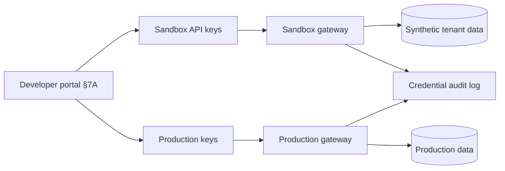

# Partner Sandbox and API Keys

Partner sandboxes and API(Application Programming Interface) keys are the **credential and environment boundary** for B2B(Business-to-Business) integrations. The developer portal surfaces them — [§7A](07A-developer-portal.md) — but gateway enforcement, auth model, and tenant isolation make them safe.

> **Scope:** Sandbox isolation, API key lifecycle (create, rotate, revoke), and parity expectations for partner environments. Portal UX → [§7A](07A-developer-portal.md). Auth models → [§4](04-auth-model.md). Tenant boundaries → [§16](16-multi-tenant-apis.md).
>
> **Related:** [§7A Developer portal](07A-developer-portal.md) · [§4 Auth model](04-auth-model.md) · [§16 Multi-tenant APIs](16-multi-tenant-apis.md) · Rate tiers → [§5](05-rate-limit-tiers.md) · Contract CI(Continuous Integration) → [§15](15-contract-and-schema-testing.md)

---

## At a glance

| Concern | Sandbox default |
|---------|-----------------|
| **Keys** | Separate from prod; scoped to app + environment |
| **Data** | Synthetic or scrubbed; no prod PII(Personally Identifiable Information) |
| **Parity** | Same auth, errors, and rate-limit *shapes*; document gaps |
| **Lifecycle** | Self-serve rotate/revoke with audit |
| **Isolation** | Hard tenant separation; no cross-partner reads |
| **Abuse** | Stricter limits; WAF(Web Application Firewall) where public |

**Rule of thumb:** A sandbox key must **never** work against production — different issuer, hostname, or key prefix enforced at the gateway.

---

## Environment topology

| Property | Sandbox | Production |
|----------|---------|------------|
| Hostname / base URL | `api.sandbox.example.com` | `api.example.com` |
| Key material | Distinct prefix / KMS(Key Management Service) namespace | Production namespace |
| Webhooks | Mock receiver or signed tunnel | Real endpoints |
| Payments / SMS | Test processor stubs | Live providers |

Document honest gaps (batch sizes, webhook delay, feature flags). False “full parity” causes launch-week surprises.

---

## API key lifecycle

Align with [§4](04-auth-model.md) — keys prove **client identity** at the gateway; services still enforce **object-level AuthZ(Authorization)**.

| Event | Requirement |
|-------|-------------|
| **Create** | One-time secret reveal; hash at rest |
| **Rotate** | Overlap window with two active keys; auto-expire old |
| **Revoke** | Immediate gateway deny; propagate to edge caches |
| **Scope** | Least privilege: read vs write, product areas, IP allowlist optional |
| **Audit** | Who, when, which app; last-used timestamp |
| **Incident** | Self-serve revoke + runbook; notify partner contacts |

For OAuth(Open Authorization) partners, prefer registered clients over long-lived shared secrets — portal guides redirect URI and scopes per [auth guide](../../auth-oauth-oidc-and-login-security/README.md).

---

## Sandbox isolation

| Layer | Control |
|-------|---------|
| **Gateway** | Route sandbox keys only to sandbox upstream pool |
| **Data** | Separate DB/schema or tenant IDs never overlapping prod |
| **Search / cache** | Namespace keys; reset wipes all partner test data |
| **Multi-tenant** | Partner A cannot read Partner B sandbox — [§16](16-multi-tenant-apis.md) |
| **Reset** | Self-serve seed/wipe without tickets |

Scheduled sandbox **data refresh** from anonymized prod snapshots is optional and high-risk — default to generated fixtures unless legal and security sign off.

---

## Operational checklist

- [ ] Sandbox and prod keys cryptographically or logically distinct at gateway
- [ ] Rotate/revoke without support tickets; audit trail retained
- [ ] Rate limits and error bodies match prod semantics — [§5](05-rate-limit-tiers.md)
- [ ] Portal displays environment on every credential screen — [§7A](07A-developer-portal.md)
- [ ] Compromise runbook: revoke, notify, force rotate

---

## Common mistakes

| Mistake | Fix |
|---------|-----|
| One key works in both envs | Enforce env binding at gateway |
| Sandbox seeded with prod exports | Synthetic data only by default |
| Shared sandbox tenant for all partners | Per-partner isolation — [§16](16-multi-tenant-apis.md) |
| No revoke during leak | Self-serve revoke + paging on anomalous use |
| Portal shows prod URL in sandbox docs | Environment badges and separate base URLs |
| Rotated key instantly breaks prod | Dual-key overlap window |
