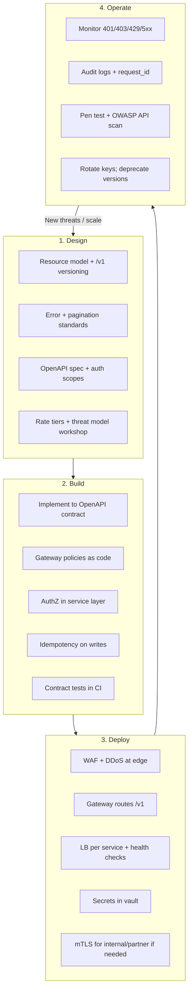
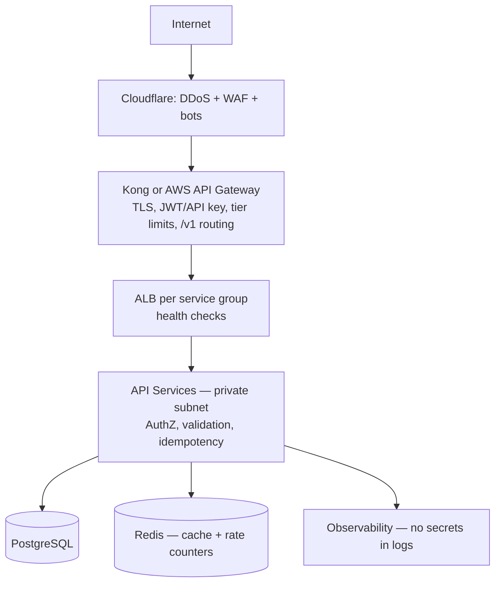
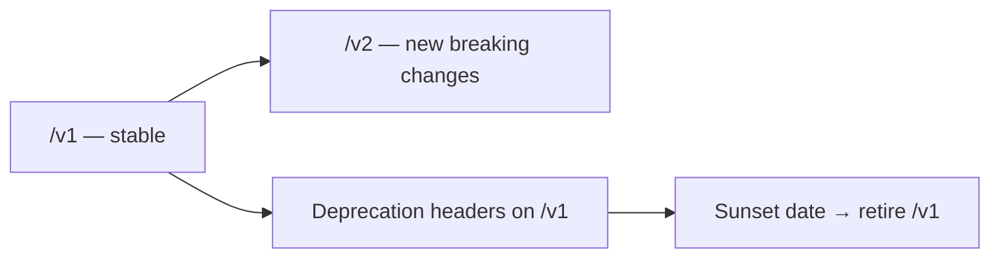
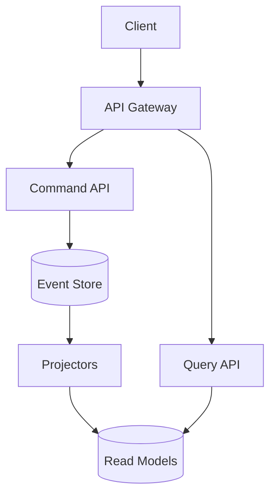
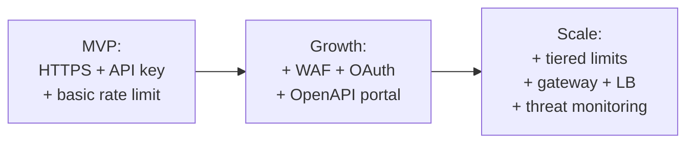

# Lifecycle & Reference Architecture

> **Related:** Deploy safely → [deployment-strategies](../../deployment-strategies/README.md) · Stateless scaling → [§11 Stateless architecture](11-stateless-architecture.md) · Checklist → [§9 Checklist](09-checklist-and-practices.md)

## Full lifecycle



## Reference architecture — public SaaS API



**Text view:**

```
Internet
   │
   ▼
[ Cloudflare: DDoS + WAF + bot management ]
   │
   ▼
[ Kong or AWS API Gateway ]
   • TLS termination
   • JWT / API key validation
   • Tier-based rate limits (Redis)
   • /v1 routing
   │
   ▼
[ Load balancer per service — e.g. AWS ALB ]
   • Health checks
   • Scale pods/VMs horizontally
   │
   ▼
[ API Services (private subnet) ]
   • Scope + object authorization
   • Input validation + idempotency
   • Structured errors
   │
   ├──► PostgreSQL (encrypted, least-privilege role)
   ├──► Redis (cache + rate limit counters)
   └──► Observability (logs, metrics, traces — no secrets)
```

Entry-layer details and stack options → [Load Balancer, API Gateway & Entry Architecture](03-api-gateway.md).

Why app instances must not hold session state → [Stateless architecture](11-stateless-architecture.md).

## Layer responsibility matrix

| Layer | Responsibility | Does NOT do |
|-------|----------------|-------------|
| **OpenAPI spec** | Contract, docs, CI validation | Runtime enforcement |
| **Edge (CDN/WAF)** | DDoS, bot rules, geo block | Business logic |
| **API Gateway** | AuthN, rate limits, routing, size caps | Object-level AuthZ; instance scaling |
| **Load balancer** | Health checks, distribute to replicas | API keys, tiers, versioning |
| **Application** | AuthZ, validation, idempotency | TLS at edge (usually) |
| **Database** | Persist with encryption + least privilege | Rate limiting |
| **Observability** | Detect abuse, debug with correlation IDs | Block attacks alone |

## Version evolution



**Safe changes (no new version):**

- Add optional response fields
- Add new endpoints
- Add new enum values (if clients tolerate unknowns)

**Breaking changes (require /v2):**

- Remove or rename fields
- Change field types or semantics
- Change auth requirements

## Async and long-running work

Do not hold rate-limit slots for minutes-long work. Use the **job resource pattern**: `POST` → `202 Accepted` + `Location: /v1/jobs/{id}` → poll or webhook → signed result URL.

See [Async patterns](10-async-patterns.md) for full flows (polling, webhooks, SSE, streaming), HTTP contracts, and architecture.

## Event Sourcing and CQRS (optional write/read split)

For audit-heavy domains, commands append to an **event store**; queries hit **read projections** (eventual consistency). Gateway routes command POSTs and query GETs; scale each tier independently.



Full pattern → [Event Sourcing & CQRS](../../event-sourcing-and-cqrs/README.md).

## Internal vs public API architectures

| Aspect | Public API | Internal API |
|--------|------------|--------------|
| Edge | Full WAF + DDoS | Optional; VPN/private network |
| Gateway | Full features + tiers | Lightweight ingress or mesh |
| Load balancer | ALB/NLB per service | K8s Service or internal LB |
| Auth | OAuth + API keys | mTLS + service JWT |
| Rate limits | Product tiers | High limits; concurrency caps |
| OpenAPI | Required + portal | Recommended for discovery |
| Threat model | Full OWASP + abuse | Focus on lateral movement |

## Pros of the reference architecture

- Proven pattern used by most SaaS platforms
- Scales horizontally at edge, gateway, and load balancer
- Clear separation for security audits
- OpenAPI stays the contract; gateway enforces traffic

## Cons

- High operational surface area
- Cost at scale (edge + gateway + LB + Redis + observability)
- Overkill for monolith MVP — start simpler and evolve
- Requires strong platform team or managed services

## Simpler MVP evolution path



Do not build the full stack on day one unless compliance requires it.

## Common mistakes

| Mistake | Fix |
|---------|-----|
| Deploy full reference arch for MVP | Evolve MVP → growth → scale path |
| Skip contract tests in CI | OpenAPI lint + breaking diff on every PR |
| Liveness probe hits DB | Readiness checks dependencies; liveness stays light |
| No build ID in metrics/logs | Tag traces with version for rollback correlation |
| Rotate secrets without dual-active window | Overlap old/new credentials during deploy |
