# Async Patterns in API Design

How to design APIs for work that outlasts connection timeouts: job resources, polling, webhooks, streaming, and how each layer (gateway, queue, workers) participates.

> **Related:** Rate-limit async escape hatch → [Rate-limit tiers](05-rate-limit-tiers.md#async-escape-hatch) · Idempotency → [Idempotency](13-idempotency.md) · Webhook HMAC → [Auth model](04-auth-model.md#hmac-webhooks) · Reference stack → [Lifecycle & architecture](08-lifecycle-and-architecture.md) · Domain events + outbox → [Event Sourcing & CQRS](../../event-sourcing-and-cqrs/includes/05-async-integration.md) · Read consistency after jobs → [Strong consistency — promises and costs](../../postgresql-performance/includes/14-consistency-promises-and-costs.md)

---

## What it is

**Async API design** moves long or expensive work off the request thread. The client starts work, receives a trackable handle (usually a **job resource**), and retrieves the result via polling, push (webhook), or stream — instead of holding an HTTP connection open for minutes.

**Rule of thumb:** If work might exceed **~10–30 seconds**, or is CPU/IO expensive (exports, ML inference, bulk search), design it async from day one.

---

## Why sync breaks

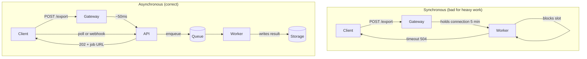

| Problem with sync | What async fixes |
|-------------------|------------------|
| Gateway/LB connection timeouts (30–60s typical) | Client disconnects after `202` |
| Rate-limit slot held for minutes | Only enqueue costs a write slot |
| Worker thread blocked on I/O | Workers pull from queue at their pace |
| Client retries → duplicate work | Job ID + idempotency keys |
| Unpredictable latency | Explicit job states |

---

## Pattern 1 — Job resource + polling (default)

The **async escape hatch** used in [Rate-limit tiers](05-rate-limit-tiers.md#async-escape-hatch). Best default for reports, exports, batch jobs, and any operation with unpredictable duration.

### Full sequence

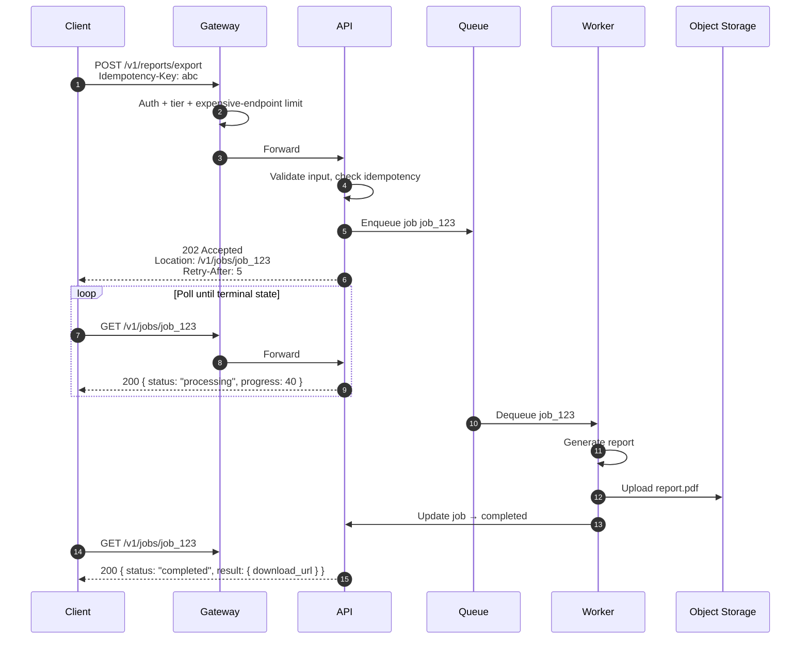

### Job state machine

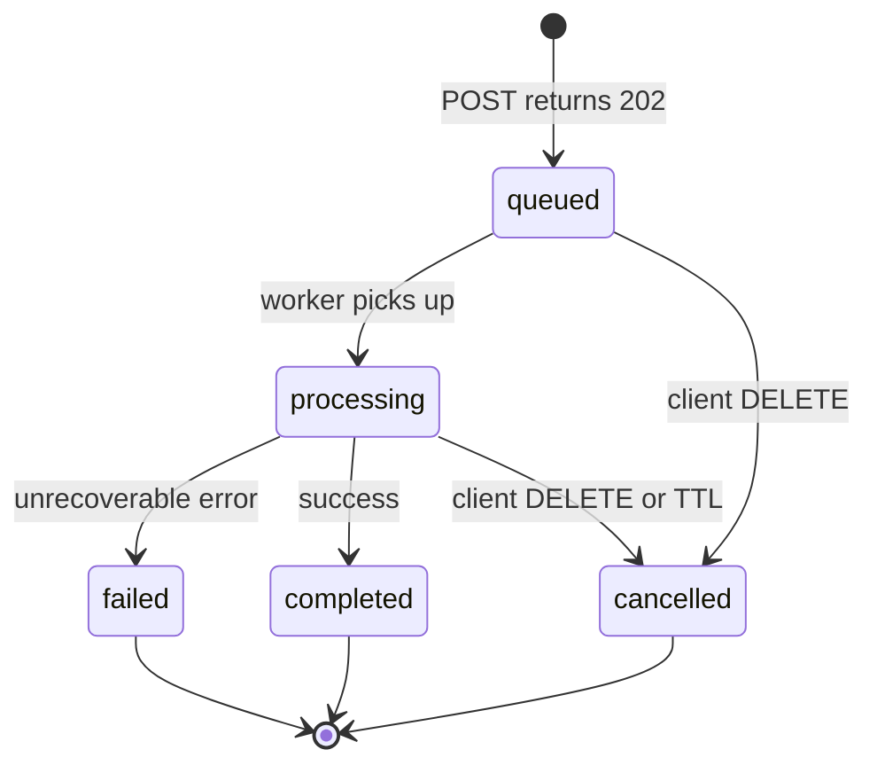

### HTTP contract

**Start work:**

```http
POST /v1/reports/export
Authorization: Bearer …
Idempotency-Key: 7c9e6679-7425-40de-944b-e07fc1f90ae7
Content-Type: application/json

{ "format": "csv", "filters": { "status": "open" } }
```

**Response:**

```http
HTTP/1.1 202 Accepted
Location: /v1/jobs/job_abc123
Retry-After: 5
Content-Type: application/json

{
  "data": {
    "id": "job_abc123",
    "status": "queued",
    "created_at": "2026-06-14T18:30:00Z",
    "links": {
      "self": "/v1/jobs/job_abc123",
      "cancel": "/v1/jobs/job_abc123"
    }
  }
}
```

**Poll status:**

```json
{
  "data": {
    "id": "job_abc123",
    "status": "processing",
    "progress": { "percent": 40, "message": "Fetching rows…" },
    "created_at": "2026-06-14T18:30:00Z",
    "updated_at": "2026-06-14T18:30:12Z"
  }
}
```

**Completed:**

```json
{
  "data": {
    "id": "job_abc123",
    "status": "completed",
    "result": {
      "download_url": "https://cdn.example.com/exports/…",
      "expires_at": "2026-06-14T19:30:00Z"
    }
  }
}
```

### Design rules

| Decision | Recommendation |
|----------|----------------|
| Status codes | `202` on create; `200` on GET (job is a resource) |
| `Location` header | Always point to the job resource |
| `Retry-After` | On `202` and in responses while status is non-terminal |
| Progress | Optional `percent` + `message`; avoid false precision |
| Result delivery | Signed URL to object storage — not inline megabyte payloads |
| TTL | Auto-expire jobs and artifacts (e.g. 24h); document in API |
| Cancel | `DELETE /v1/jobs/{id}` → `status: cancelled` if not yet started |
| Idempotency | Same `Idempotency-Key` → return same `job_id`, do not enqueue twice |

### Polling rate limits

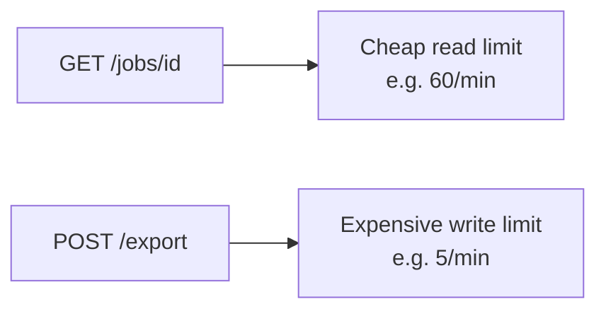

- Apply a **separate, generous** limit on `GET /jobs/{id}` vs the expensive `POST`.
- Return `Retry-After` so well-behaved clients back off.
- Consider **ETag** / `If-None-Match` — return `304` when status unchanged.

---

## Pattern 2 — Webhooks (server push)

Polling wastes requests when completion is rare or slow. **Webhooks** push terminal state to a client URL. See [HMAC webhooks](04-auth-model.md#hmac-webhooks) for inbound verification; apply the same pattern **outbound**.

### Flow

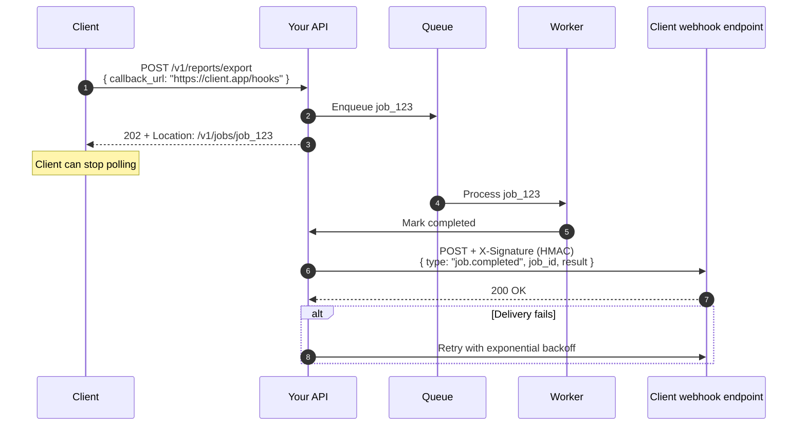

### Webhook payload

```json
{
  "id": "evt_9f2a",
  "type": "job.completed",
  "created_at": "2026-06-14T18:35:00Z",
  "data": {
    "job_id": "job_123",
    "status": "completed",
    "result": { "download_url": "…" }
  }
}
```

### Security controls

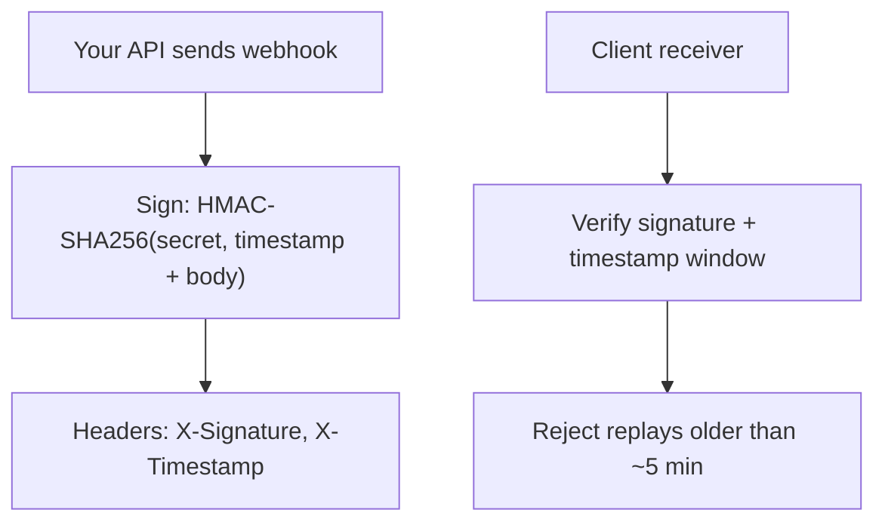

| Control | Why |
|---------|-----|
| HMAC signature | Proves payload came from you |
| Timestamp | Prevents replay attacks |
| Event ID (`evt_…`) | Client deduplicates |
| HTTPS only | Transport security |
| **SSRF on `callback_url`** | Block private IPs, metadata endpoints (OWASP API #7) |

### Hybrid: webhook + poll fallback

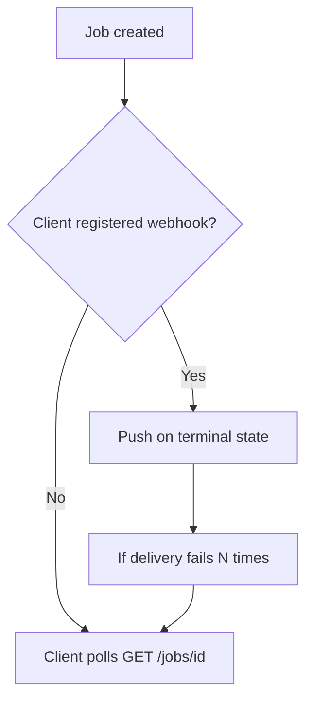

**Best practice:** webhook primary, `GET /jobs/{id}` always available as source of truth.

---

## Pattern 3 — Long polling

For **near-real-time** status without webhooks (mobile, firewalled clients):

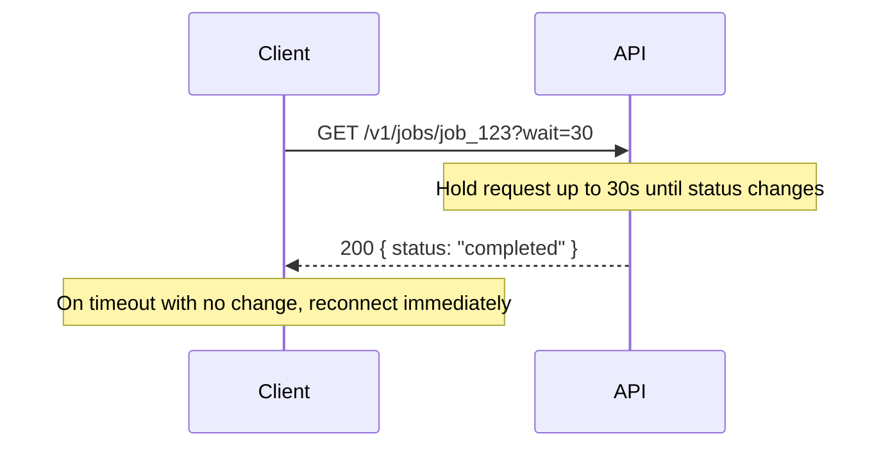

| Pros | Cons |
|------|------|
| Fewer requests than short polling | Holds a server connection |
| Simple client logic | Gateway timeout must exceed `wait` |
| Works through most firewalls | Less scalable than webhooks at high volume |

---

## Pattern 4 — Server-Sent Events (SSE)

**One-way server → client stream** over HTTP. Good for progress logs, live feeds, LLM token streaming.

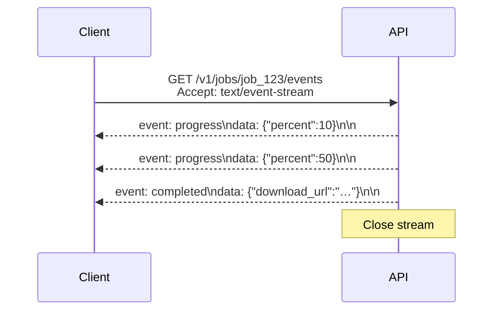

```http
GET /v1/jobs/job_123/events
Accept: text/event-stream
Authorization: Bearer …
```

Response (chunked):

```
event: progress
data: {"percent": 10}

event: completed
data: {"download_url": "https://…"}
```

| Good for | Not good for |
|----------|--------------|
| Progress UI, log tailing | Client → server messages |
| Browser `EventSource` API | Binary payloads (use WebSockets) |
| AI/LLM token streams | High concurrency without connection planning |

---

## Pattern 5 — Chunked streaming (NDJSON)

**Incremental results in a single request** — search results, large CSV rows, LLM output:

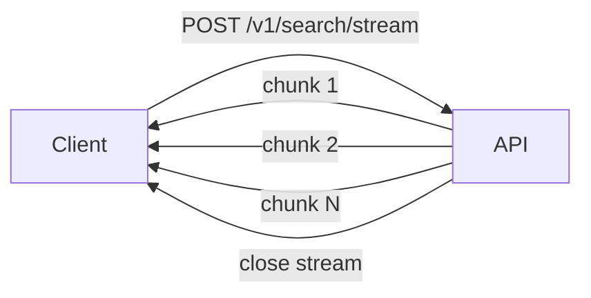

```http
HTTP/1.1 200 OK
Content-Type: application/x-ndjson
Transfer-Encoding: chunked

{"id":"res_1","title":"…"}
{"id":"res_2","title":"…"}
```

One JSON object per line. Client must stay connected; mid-stream retry is harder than job + poll.

---

## Pattern 6 — Sync timeout fallback (avoid if possible)

Gateway timeout can force a hybrid — prefer **always `202`** for known-slow endpoints:

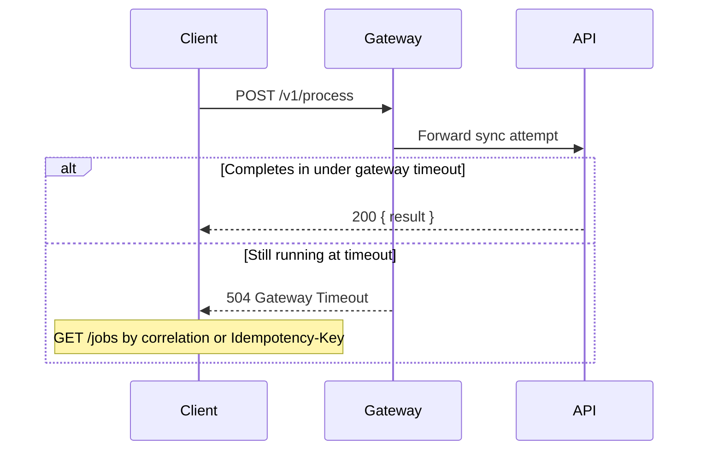

---

## Pattern comparison

| Pattern | Direction | Connection | Best for | Complexity |
|---------|-----------|------------|----------|------------|
| **Job + poll** | Client pulls | Short | Reports, exports, batch jobs | Low |
| **Webhooks** | Server pushes | Short (outbound) | B2B integrations | Medium |
| **Long poll** | Client pulls | Long (held) | Near-real-time status | Medium |
| **SSE** | Server pushes | Long | Progress, feeds, LLM tokens | Medium |
| **WebSockets** | Bidirectional | Long | Chat, live collaboration | High |
| **NDJSON stream** | Server pushes in one request | Long | Search, incremental pipelines | Medium |

### Decision flow

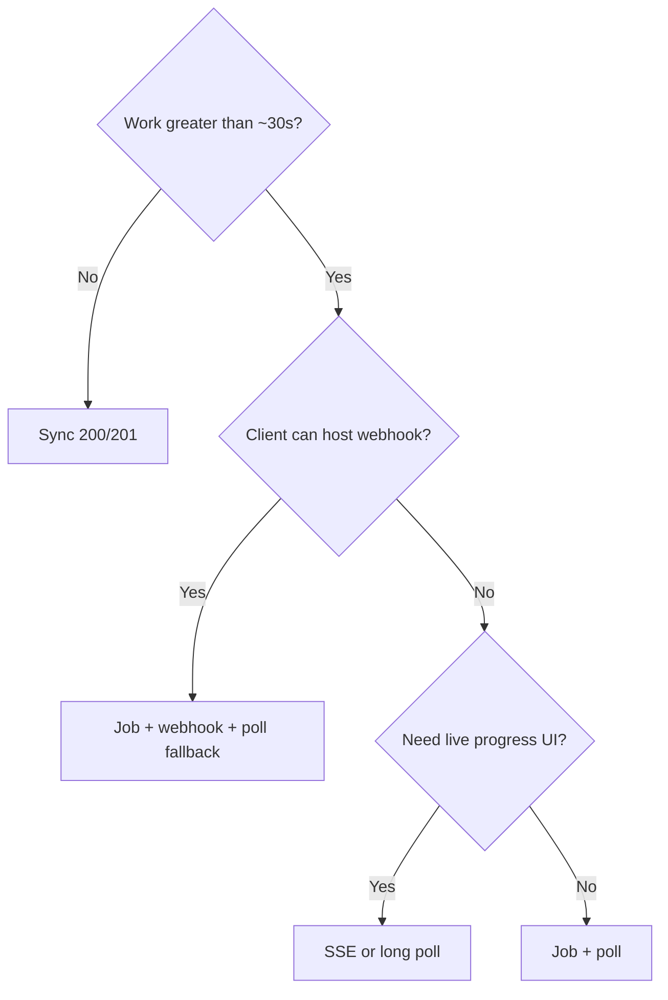

---

## End-to-end architecture

How async work fits the [reference architecture](08-lifecycle-and-architecture.md):

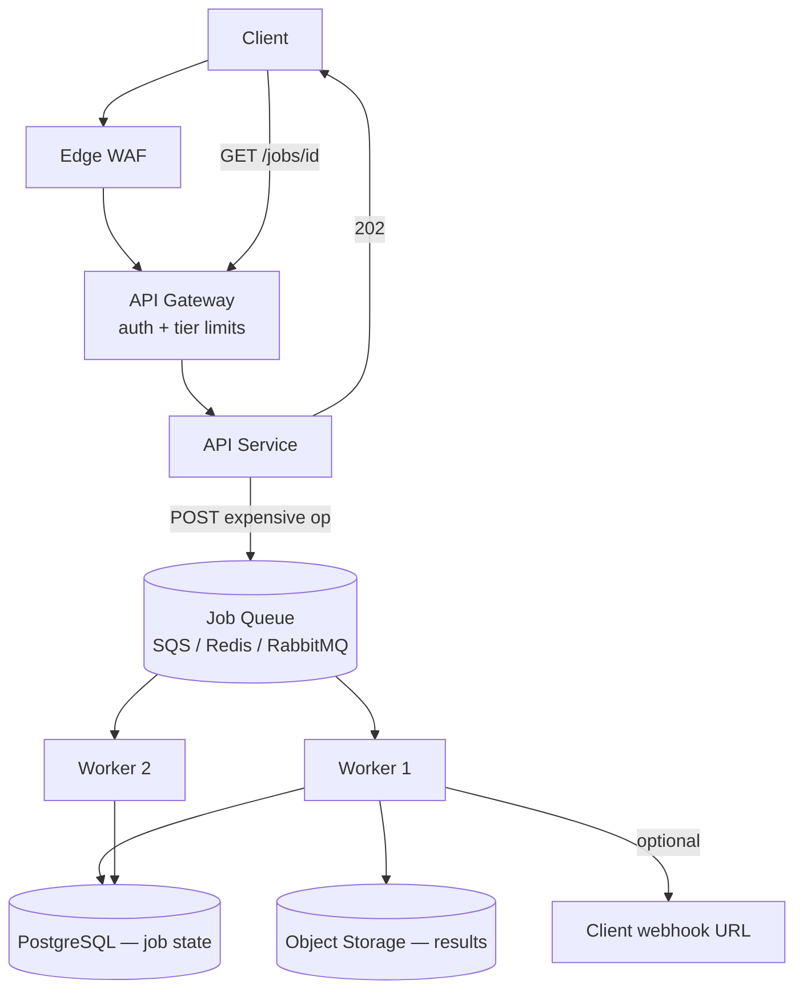

| Layer | Async role |
|-------|------------|
| **Gateway** | Strict limits on expensive `POST`; lighter limits on `GET /jobs`; configure timeouts for long poll/SSE |
| **API** | Validate, enqueue, return `202` — never block on worker completion |
| **Queue** | Decouple burst from worker capacity |
| **Worker** | Idempotent processing; atomic job state updates |
| **Storage** | Artifacts via signed URLs, not DB blobs |

### Domain events and transactional outbox

Job queues handle **long work** (`202` + poll). **Transactional outbox** handles **reliable delivery** after a write: append domain events and outbox rows in one DB transaction; a relay publishes to Kafka or workers. Used heavily in [Event Sourcing & CQRS](../../event-sourcing-and-cqrs/includes/05-async-integration.md) — combine with job resources when an event triggers minutes-long processing.

---

## Idempotency across async

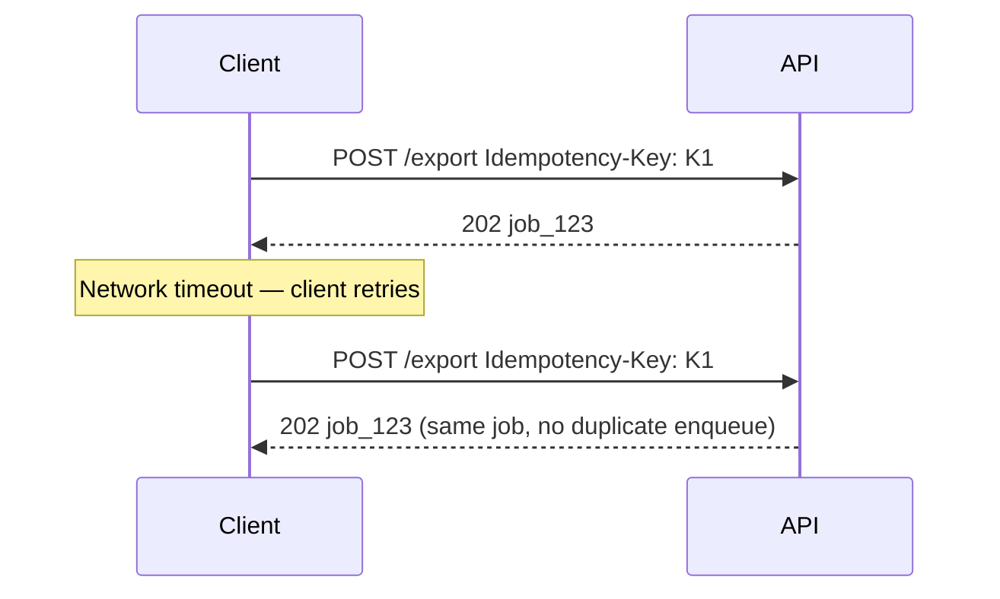

Without idempotency, retries create duplicate exports, charges, or notifications. See [Idempotency](13-idempotency.md).

---

## OpenAPI modeling

```yaml
paths:
  /v1/reports/export:
    post:
      summary: Start async export
      responses:
        '202':
          description: Job accepted
          headers:
            Location:
              schema: { type: string }
            Retry-After:
              schema: { type: integer }
          content:
            application/json:
              schema:
                $ref: '#/components/schemas/Job'

  /v1/jobs/{job_id}:
    get:
      summary: Poll job status
      responses:
        '200':
          content:
            application/json:
              schema:
                $ref: '#/components/schemas/Job'

components:
  schemas:
    Job:
      type: object
      properties:
        id: { type: string, example: job_abc123 }
        status:
          type: string
          enum: [queued, processing, completed, failed, cancelled]
        progress:
          type: object
          properties:
            percent: { type: integer, minimum: 0, maximum: 100 }
        result: { type: object }
        error: { $ref: '#/components/schemas/Error' }
```

See [OpenAPI / Swagger](07-openapi-swagger.md) for contract-first workflow.

---

## Common mistakes

| Mistake | Fix |
|---------|-----|
| `200 OK` with `{ "status": "pending" }` on POST | Use `202 Accepted` + `Location` |
| No job resource — client cannot recover after disconnect | Always expose `GET /jobs/{id}` |
| Polling with no `Retry-After` | Clients hammer every 100ms |
| Inline 50MB response body | Signed URL to storage |
| Webhook without signature | HMAC + timestamp |
| Arbitrary `callback_url` | SSRF allowlist |
| Same rate limit for POST export and GET status | Separate tiers |
| Missing `failed` / `cancelled` states | Full state machine |

---

## Pros of async-first design

- Protects worker pools, connection limits, and rate-limit fairness
- Clear UX for long operations with explicit progress
- Retries and idempotency integrate naturally via job IDs
- Webhooks reduce polling load for B2B partners

## Cons

- More API surface (`/jobs`, events, webhook registration)
- Polling and SSE still consume limits and connections
- Webhook delivery, retries, and SSRF controls add operational complexity
- Clients must implement state machines — document clearly in portal

---

## HTTP status codes for async

| Code | Use |
|------|-----|
| `202` | Work accepted; body describes job; `Location` set |
| `200` | Job status read; terminal state includes result or error |
| `304` | Job status unchanged (optional, with ETag) |
| `404` | Unknown job ID |
| `409` | Cancel rejected (already completed) |
| `429` | Poll or create rate limited |
| `504` | Sync fallback only — avoid by using `202` upfront |
