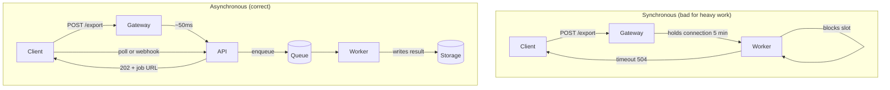
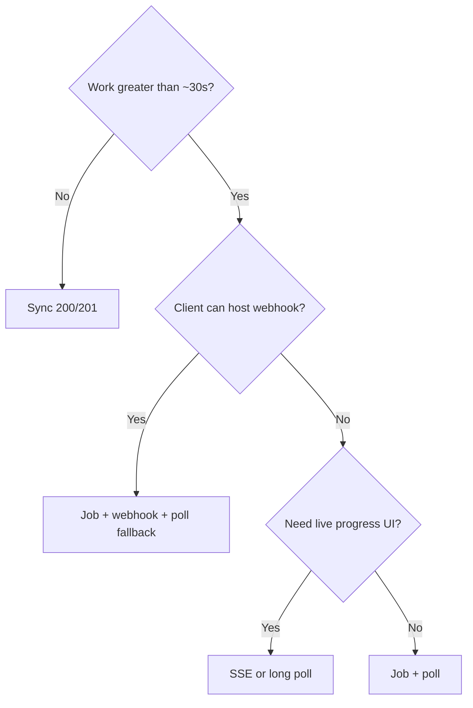
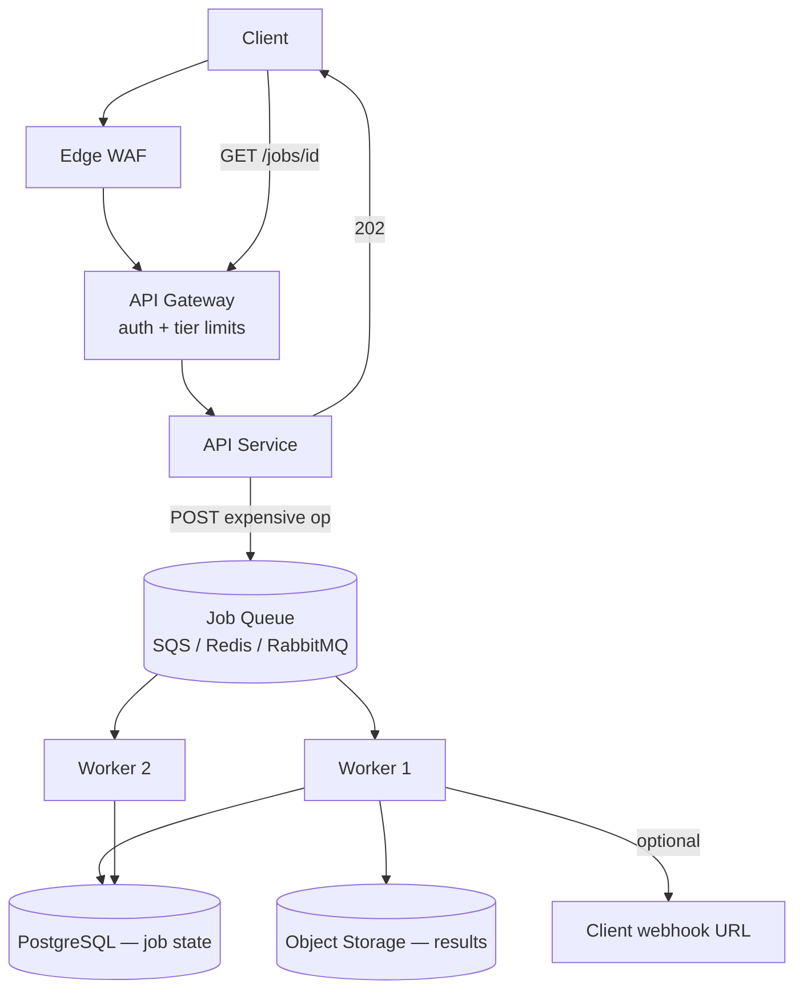

# Async Patterns in API Design

How to design APIs for work that outlasts connection timeouts: job resources, polling, webhooks, streaming, and how each layer (gateway, queue, workers) participates.

> **Scope:** **HTTP(Hypertext Transfer Protocol)/API contract lens** — job resources, status codes, polling, webhooks. Queue sizing, worker autoscale, and throughput → [HTS §6 Async, queues, and workers](../../high-throughput-systems/includes/06-async-queues-workers.md). Reliable domain-event publish → [ES §5 Async integration](../../event-sourcing-and-cqrs/includes/05-async-integration.md).

> **Related:** Rate-limit async escape hatch → [Rate-limit tiers](05-rate-limit-tiers.md#async-escape-hatch) · Idempotency → [Idempotency](13-idempotency.md) · Webhook HMAC(Hash-based Message Authentication Code) → [Auth model](04-auth-model.md#hmac-webhooks) · Reference stack → [Lifecycle & architecture](08-lifecycle-and-architecture.md) · Domain events + outbox → [Event Sourcing & CQRS](../../event-sourcing-and-cqrs/includes/05-async-integration.md) · Read consistency after jobs → [Strong consistency — promises and costs](../../postgresql-performance/includes/14-consistency-promises-and-costs.md)

## Articles in this section

| Article | Topics |
|---------|--------|
| [Jobs and polling](10A-async-jobs-polling.md) | `202` job resource, state machine, HTTP contract, polling limits |
| [Webhooks](10B-async-webhooks.md) | Server push, HMAC, SSRF(Server-Side Request Forgery) on `callback_url`, hybrid fallback |
| [Streaming and long poll](10C-async-streaming.md) | Long poll, SSE(Server-Sent Events), NDJSON, sync-timeout fallback |
| [Notification delivery](10D-notification-delivery.md) | Email/push/SMS preferences, dedup, priority queues, provider ops |

## What it is

**Async API design** moves long or expensive work off the request thread. The client starts work, receives a trackable handle (usually a **job resource**), and retrieves the result via polling, push (webhook), or stream — instead of holding an HTTP connection open for minutes.

**Rule of thumb:** If work might exceed **~10–30 seconds**, or is CPU/IO expensive (exports, ML inference, bulk search), design it async from day one.

---

## Why sync breaks

| Problem with sync | What async fixes |
|-------------------|------------------|
| Gateway/LB connection timeouts (30–60s typical) | Client disconnects after `202` |
| Rate-limit slot held for minutes | Only enqueue costs a write slot |
| Worker thread blocked on I/O | Workers pull from queue at their pace |
| Client retries → duplicate work | Job ID + idempotency keys — [§13](13-idempotency.md), [13A client flow](13A-idempotency-client-and-server-flow.md) |
| Unpredictable latency | Explicit job states |

---

## Pattern comparison

| Pattern | Direction | Connection | Best for | Complexity |
|---------|-----------|------------|----------|------------|
| **Job + poll** | Client pulls | Short | Reports, exports, batch jobs | Low |
| **Webhooks** | Server pushes | Short (outbound) | B2B(Business-to-Business) integrations | Medium |
| **Long poll** | Client pulls | Long (held) | Near-real-time status | Medium |
| **SSE(Server-Sent Events)** | Server pushes | Long | Progress, feeds, LLM tokens | Medium |
| **WebSockets** | Bidirectional | Long | Chat, live collaboration | High |
| **NDJSON stream** | Server pushes in one request | Long | Search, incremental pipelines | Medium |

### Decision flow

---

## End-to-end architecture

How async work fits the [reference architecture](08-lifecycle-and-architecture.md):

| Layer | Async role |
|-------|------------|
| **Gateway** | Strict limits on expensive `POST`; lighter limits on `GET /jobs`; configure timeouts for long poll/SSE |
| **API** | Validate, enqueue, return `202` — never block on worker completion |
| **Queue** | Decouple burst from worker capacity |
| **Worker** | Idempotent processing; atomic job state updates |
| **Storage** | Artifacts via signed URLs, not DB blobs |

### Domain events and transactional outbox

Job queues handle **long work** (`202` + poll). **Transactional outbox** handles **reliable delivery** after a write: append domain events and outbox rows in one DB transaction; a relay publishes to Kafka or workers. Pair with an **inbox** on consume — [ES §5](../../event-sourcing-and-cqrs/includes/05-async-integration.md) · [ES §5A](../../event-sourcing-and-cqrs/includes/05A-outbox-and-inbox.md). Combine with job resources when an event triggers minutes-long processing.

`POST` with `Idempotency-Key` that returns `202` must not enqueue twice on retry — see [13A client and server flow](13A-idempotency-client-and-server-flow.md) and [Async jobs + idempotency](13C-idempotency-integrations.md#async-jobs).

---

## Common mistakes

| Mistake | Fix |
|---------|-----|
| `200 OK` with `{ "status": "pending" }` on POST | Use `202 Accepted` + `Location` |
| No job resource — client cannot recover after disconnect | Always expose `GET /jobs/{id}` |
| Polling with no `Retry-After` | Clients hammer every 100ms |
| Inline 50MB response body | Signed URL to storage |
| Webhook without signature | HMAC + timestamp |
| Arbitrary `callback_url` | SSRF allowlist |
| Same rate limit for POST export and GET status | Separate tiers |
| Missing `failed` / `cancelled` states | Full state machine |

---

## Pros of async-first design

- Protects worker pools, connection limits, and rate-limit fairness
- Clear UX for long operations with explicit progress
- Retries and idempotency integrate naturally via job IDs
- Webhooks reduce polling load for B2B partners

## Cons

- More API surface (`/jobs`, events, webhook registration)
- Polling and SSE still consume limits and connections
- Webhook delivery, retries, and SSRF controls add operational complexity
- Clients must implement state machines — document clearly in portal

---

## HTTP status codes for async

| Code | Use |
|------|-----|
| `202` | Work accepted; body describes job; `Location` set |
| `200` | Job status read; terminal state includes result or error |
| `304` | Job status unchanged (optional, with ETag) |
| `404` | Unknown job ID |
| `409` | Cancel rejected (already completed) |
| `429` | Poll or create rate limited |
| `504` | Sync fallback only — avoid by using `202` upfront |