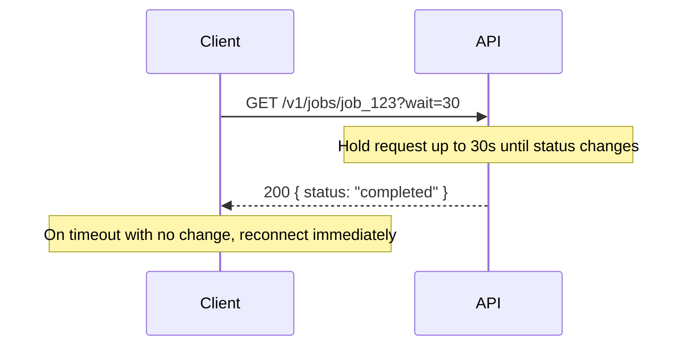
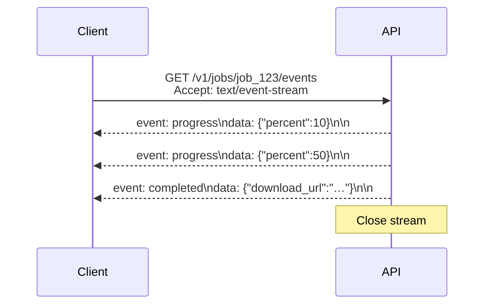
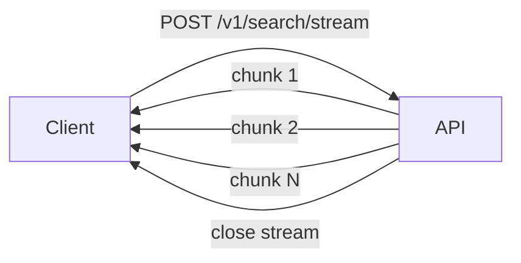
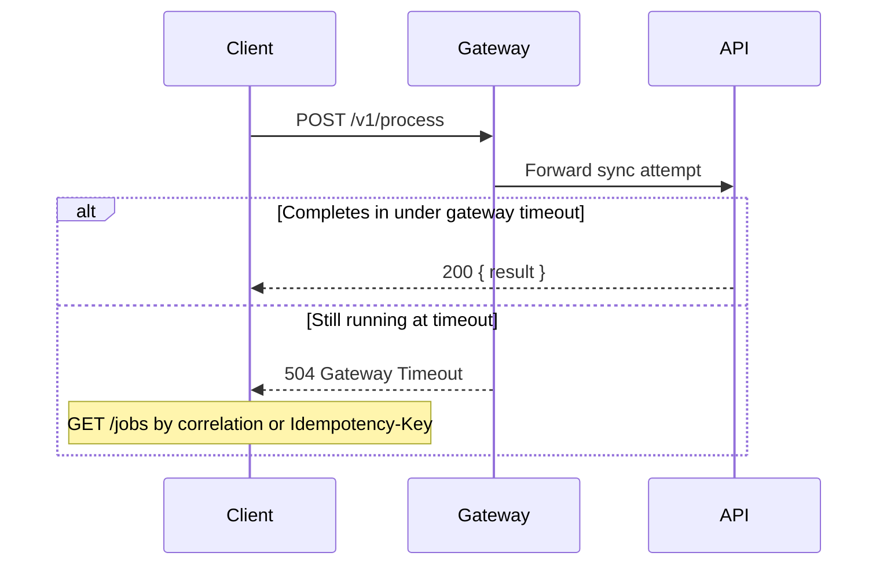

# Async patterns — streaming and long poll

> **Related:** Overview → [Async patterns](10-async-patterns.md) · Jobs and polling → [10-async-jobs-polling.md](10-async-jobs-polling.md) · Webhooks → [10-async-webhooks.md](10-async-webhooks.md)

## Pattern 3 — Long polling

For **near-real-time** status without webhooks (mobile, firewalled clients):



| Pros | Cons |
|------|------|
| Fewer requests than short polling | Holds a server connection |
| Simple client logic | Gateway timeout must exceed `wait` |
| Works through most firewalls | Less scalable than webhooks at high volume |

---

## Pattern 4 — Server-Sent Events (SSE)

**One-way server → client stream** over HTTP(Hypertext Transfer Protocol). Good for progress logs, live feeds, LLM token streaming.



```http
GET /v1/jobs/job_123/events
Accept: text/event-stream
Authorization: Bearer …
```

Response (chunked):

```
event: progress
data: {"percent": 10}

event: completed
data: {"download_url": "https://…"}
```

| Good for | Not good for |
|----------|--------------|
| Progress UI, log tailing | Client → server messages |
| Browser `EventSource` API(Application Programming Interface) | Binary payloads (use WebSockets) |
| AI/LLM token streams | High concurrency without connection planning |

---

## Pattern 5 — Chunked streaming (NDJSON)

**Incremental results in a single request** — search results, large CSV rows, LLM output:



```http
HTTP/1.1 200 OK
Content-Type: application/x-ndjson
Transfer-Encoding: chunked

{"id":"res_1","title":"…"}
{"id":"res_2","title":"…"}
```

One JSON object per line. Client must stay connected; mid-stream retry is harder than job + poll.

---

## Pattern 6 — Sync timeout fallback (avoid if possible)

Gateway timeout can force a hybrid — prefer **always `202`** for known-slow endpoints:



---
