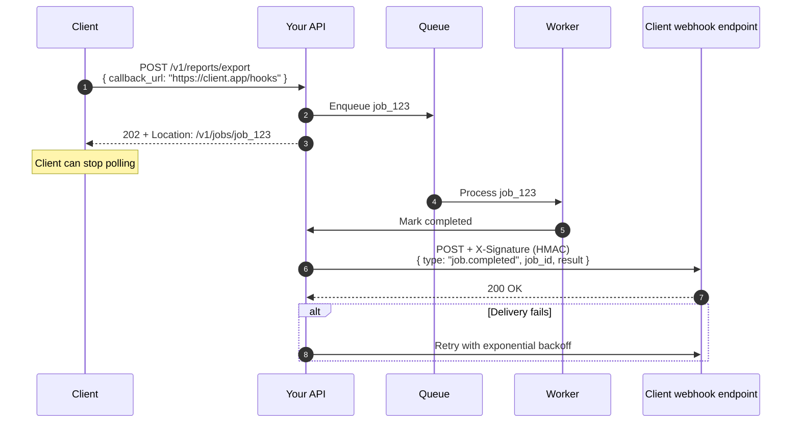
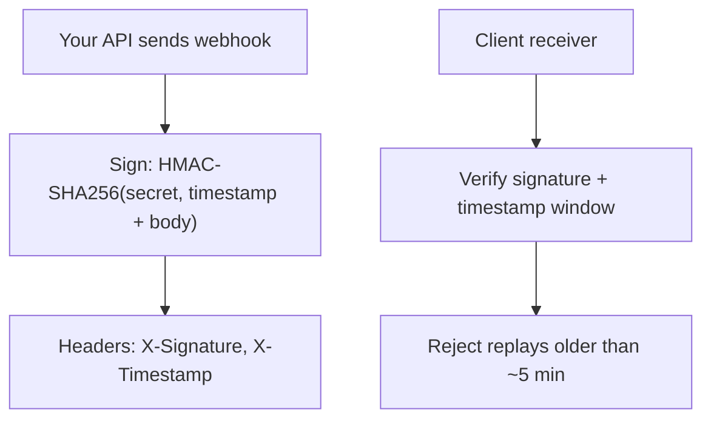
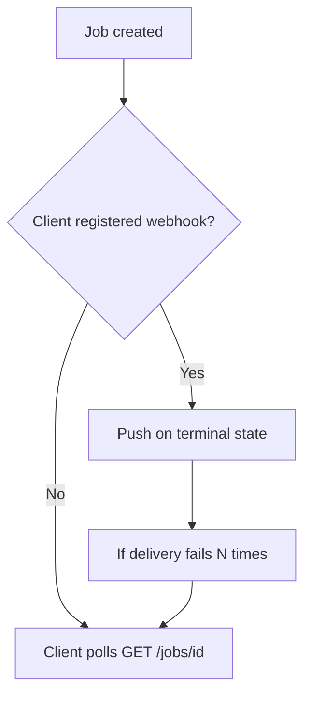

# Async patterns — webhooks

> **Related:** Overview → [Async patterns](10-async-patterns.md) · Jobs and polling → [10-async-jobs-polling.md](10-async-jobs-polling.md) · HMAC(Hash-based Message Authentication Code) webhooks → [Auth model](04-auth-model.md#hmac-webhooks)

## Pattern 2 — Webhooks (server push)

Polling wastes requests when completion is rare or slow. **Webhooks** push terminal state to a client URL. See [HMAC webhooks](04-auth-model.md#hmac-webhooks) for inbound verification; apply the same pattern **outbound**.

### Flow



### Webhook payload

```json
{
  "id": "evt_9f2a",
  "type": "job.completed",
  "created_at": "2026-06-14T18:35:00Z",
  "data": {
    "job_id": "job_123",
    "status": "completed",
    "result": { "download_url": "…" }
  }
}
```

### Security controls



| Control | Why |
|---------|-----|
| HMAC signature | Proves payload came from you |
| Timestamp | Prevents replay attacks |
| Event ID (`evt_…`) | Client deduplicates |
| HTTPS only | Transport security |
| **SSRF(Server-Side Request Forgery) on `callback_url`** | Block private IPs, metadata endpoints (OWASP(Open Worldwide Application Security Project) API(Application Programming Interface) #7) |

### Hybrid: webhook + poll fallback



**Best practice:** webhook primary, `GET /jobs/{id}` always available as source of truth.

