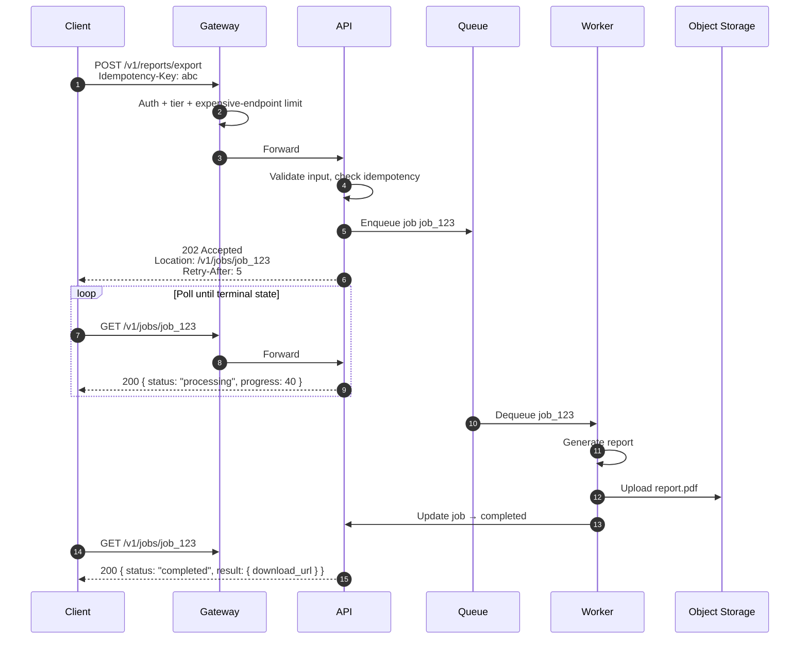
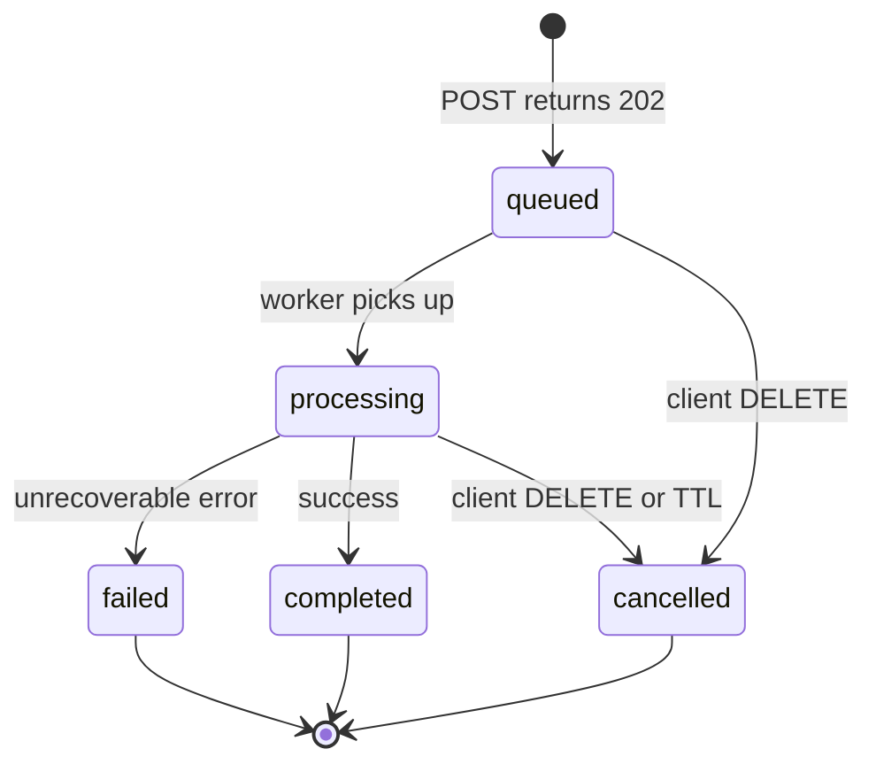
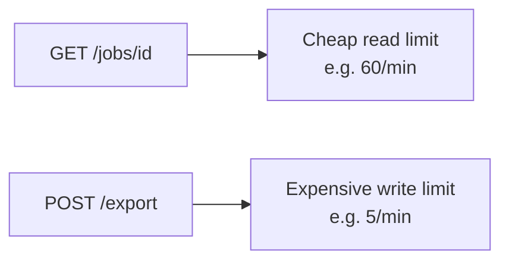

# Async patterns — jobs and polling

> **Related:** Overview → [Async patterns](10-async-patterns.md) · Webhooks → [10B-async-webhooks.md](10B-async-webhooks.md) · Streaming → [10C-async-streaming.md](10C-async-streaming.md)

## Pattern 1 — Job resource + polling (default)

The **async escape hatch** used in [Rate-limit tiers](05-rate-limit-tiers.md#async-escape-hatch). Best default for reports, exports, batch jobs, and any operation with unpredictable duration.

### Full sequence



### Job state machine



### HTTP contract

**Start work:**

```http
POST /v1/reports/export
Authorization: Bearer …
Idempotency-Key: 7c9e6679-7425-40de-944b-e07fc1f90ae7
Content-Type: application/json

{ "format": "csv", "filters": { "status": "open" } }
```

**Response:**

```http
HTTP/1.1 202 Accepted
Location: /v1/jobs/job_abc123
Retry-After: 5
Content-Type: application/json

{
  "data": {
    "id": "job_abc123",
    "status": "queued",
    "created_at": "2026-06-14T18:30:00Z",
    "links": {
      "self": "/v1/jobs/job_abc123",
      "cancel": "/v1/jobs/job_abc123"
    }
  }
}
```

**Poll status:**

```json
{
  "data": {
    "id": "job_abc123",
    "status": "processing",
    "progress": { "percent": 40, "message": "Fetching rows…" },
    "created_at": "2026-06-14T18:30:00Z",
    "updated_at": "2026-06-14T18:30:12Z"
  }
}
```

**Completed:**

```json
{
  "data": {
    "id": "job_abc123",
    "status": "completed",
    "result": {
      "download_url": "https://cdn.example.com/exports/…",
      "expires_at": "2026-06-14T19:30:00Z"
    }
  }
}
```

### Design rules

| Decision | Recommendation |
|----------|----------------|
| Status codes | `202` on create; `200` on GET (job is a resource) |
| `Location` header | Always point to the job resource |
| `Retry-After` | On `202` and in responses while status is non-terminal |
| Progress | Optional `percent` + `message`; avoid false precision |
| Result delivery | Signed URL to object storage — not inline megabyte payloads |
| TTL | Auto-expire jobs and artifacts (e.g. 24h); document in API(Application Programming Interface) |
| Cancel | `DELETE /v1/jobs/{id}` → `status: cancelled` if not yet started |
| Idempotency | Same `Idempotency-Key` → return same `job_id`, do not enqueue twice |

### Polling rate limits



- Apply a **separate, generous** limit on `GET /jobs/{id}` vs the expensive `POST`.
- Return `Retry-After` so well-behaved clients back off.
- Consider **ETag** / `If-None-Match` — return `304` when status unchanged.

---

## OpenAPI modeling

```yaml
paths:
  /v1/reports/export:
    post:
      summary: Start async export
      responses:
        '202':
          description: Job accepted
          headers:
            Location:
              schema: { type: string }
            Retry-After:
              schema: { type: integer }
          content:
            application/json:
              schema:
                $ref: '#/components/schemas/Job'

  /v1/jobs/{job_id}:
    get:
      summary: Poll job status
      responses:
        '200':
          content:
            application/json:
              schema:
                $ref: '#/components/schemas/Job'

components:
  schemas:
    Job:
      type: object
      properties:
        id: { type: string, example: job_abc123 }
        status:
          type: string
          enum: [queued, processing, completed, failed, cancelled]
        progress:
          type: object
          properties:
            percent: { type: integer, minimum: 0, maximum: 100 }
        result: { type: object }
        error: { $ref: '#/components/schemas/Error' }
```

Contract-first workflow → [OpenAPI / Swagger](07-openapi-swagger.md). Idempotency header modeling → [13C async, webhooks, and OpenAPI](13C-idempotency-integrations.md#openapi-modeling).
