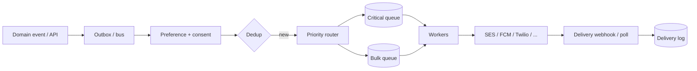

# Async — Notification delivery

System-design interviews sketch fan-out — [system-design §7](../../system-design-walkthroughs/includes/07-notification-pipeline.md). This section is the **production contract**: preferences, consent, provider integration, dedup, priority, and PII(Personally Identifiable Information) in templates.

> **Scope:** Product/API(Application Programming Interface) and worker concerns for email, push, SMS — preferences, idempotent send, retries/DLQ(Dead Letter Queue), quiet hours, audit. HTTP(Hypertext Transfer Protocol) job patterns → [§10](10-async-patterns.md) · [§10A](10A-async-jobs-polling.md). Queue throughput → [HTS §6](../../high-throughput-systems/includes/06-async-queues-workers.md) · [§14](../../high-throughput-systems/includes/14-message-brokers-and-queues.md). Interview-scale design → [system-design §7](../../system-design-walkthroughs/includes/07-notification-pipeline.md).
>
> **Related:** Idempotency → [§13](13-idempotency.md) · Webhook HMAC(Hash-based Message Authentication Code) (provider callbacks) → [§10B](10B-async-webhooks.md) · Outbox when notify-after-commit → [ES §5A](../../event-sourcing-and-cqrs/includes/05A-outbox-and-inbox.md) · PII in content → [ESC §7](../../enterprise-security-compliance/includes/07-pii-and-data-classification.md) · Resilience checkout email tier → [resilience §12](../../resilience-patterns/includes/12-worked-example-checkout.md)

---

## At a glance

| Concern | Practice |
|---------|----------|
| **Trigger** | Domain event or explicit API; never dual-write without outbox |
| **Preferences** | Per-channel / per-category opt-in; respect unsubscribe |
| **Dedup** | Idempotency key `(event_id, user_id, channel, template)` + TTL(Time To Live) |
| **Priority** | Security/transactional ahead of marketing bulk |
| **Provider** | Isolate per channel; circuit-break and DLQ |

**Rule of thumb:** Notifications are a **priority queue + preference filter** problem. Bulk campaigns must not delay password-reset or payment receipts.

---

## Architecture (production)

| Stage | Owns |
|-------|------|
| **Emit** | Domain service via outbox — [ES §5A](../../event-sourcing-and-cqrs/includes/05A-outbox-and-inbox.md) |
| **Filter** | Preference service (channel, category, quiet hours, locale) |
| **Send** | Channel workers with provider SDK + timeouts — [resilience §1–§3](../../resilience-patterns/includes/01-timeouts.md) |
| **Record** | Delivery log (message id, status, provider id); no raw secrets |

---

## Preferences and consent

| Field | Why |
|-------|-----|
| `user_id` / `tenant_id` | Scope; B2B(Business-to-Business) may have org-level defaults |
| Channel enable flags | email / push / SMS |
| Categories | `security`, `transactional`, `product`, `marketing` |
| Quiet hours / timezone | Suppress non-critical |
| Locale / template set | Rendering |
| Unsubscribe token | One-click compliance for marketing |

**Security and transactional** categories usually bypass marketing opt-out but still honor hard blocks (account closed, legal hold).

---

## Idempotency and retries

| Case | Key / action |
|------|----------------|
| Upstream redelivery | Same `event_id` → dedup drop |
| Worker crash after provider accept | Store provider message id; retry is safe if provider idempotent |
| Provider 429 / 5xx | Exponential backoff + jitter; then DLQ — [HTS §6](../../high-throughput-systems/includes/06-async-queues-workers.md) |
| Bad template / invalid address | Poison → DLQ; do not tight-loop |

Use [§13 idempotency](13-idempotency.md) patterns for any “send now” public API.

---

## Channel notes

| Channel | Watch |
|---------|-------|
| **Email** | SPF/DKIM/DMARC; bounce/complaint webhooks; list-unsubscribe |
| **Push** | Token rotation; platform (APNs/FCM) creds per app; silent vs alert |
| **SMS** | Cost; consent; sender IDs; never put secrets in SMS body |

Timeouts and bulkheads per provider — [resilience §4](../../resilience-patterns/includes/04-bulkheads.md) · [§11](../../resilience-patterns/includes/11-policy-placement.md).

---

## PII and templates

| Practice | Why |
|----------|-----|
| Minimize PII in subject/body | Logs and provider retain copies — [ESC §7](../../enterprise-security-compliance/includes/07-pii-and-data-classification.md) |
| Render server-side from ids | Avoid shipping full payloads on the bus |
| Retention on delivery log | Align with privacy; support needs message id not full body forever |
| Erasure | Include notification prefs + provider suppressions in [ESC §7A](../../enterprise-security-compliance/includes/07A-erasure-and-dsar.md) |

---

## API sketch (optional product API)

| Endpoint | Role |
|----------|------|
| `GET/PUT /me/notification-preferences` | User consent |
| `POST /notifications/send` (internal) | Trusted services only; idempotency key required |
| Provider webhooks | Delivery/bounce — verify signatures — [§10B](10B-async-webhooks.md) |

Prefer **events** over a public send API for domain actions (order placed → `OrderPlaced` → notifier).

---

## Operational checklist

- [ ] Critical vs bulk queues separated; bulk cannot starve critical
- [ ] Preferences checked before every non-mandatory send
- [ ] Dedup keys with TTL sized to retry window
- [ ] Per-provider timeouts, breakers, DLQ, dashboards (send rate, bounce, latency)
- [ ] Outbox or equivalent for notify-after-commit
- [ ] Bounce/complaint handling unsubscribes marketing automatically
- [ ] Load test: campaign burst + concurrent password-reset
- [ ] Runbook: provider outage → degrade marketing, keep security channel if possible

---

## Common mistakes

| Mistake | Fix |
|---------|-----|
| Dual-write DB + send email in one request | Outbox / bus |
| One queue for all priorities | Split critical / bulk |
| No dedup | Duplicate receipts on redelivery |
| Marketing ignore unsubscribe | Hard filter + provider suppression |
| Log full email bodies | Message id + template id + redacted vars |
| Sync send in API thread | [§10A](10A-async-jobs-polling.md) job or fire-and-forget bus |

---

## Pros and cons

### Event-driven notifier service

**Pros:** Domain stays clean; scales independently; unified preferences.

**Cons:** Another service; preference correctness becomes load-bearing.

### Inline email from each service

**Pros:** Fast to start.

**Cons:** Inconsistent consent; dual-write bugs; impossible global quiet hours.