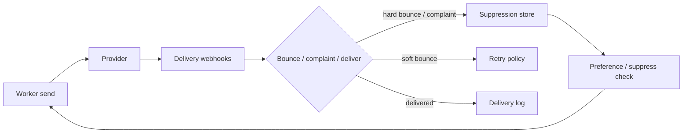
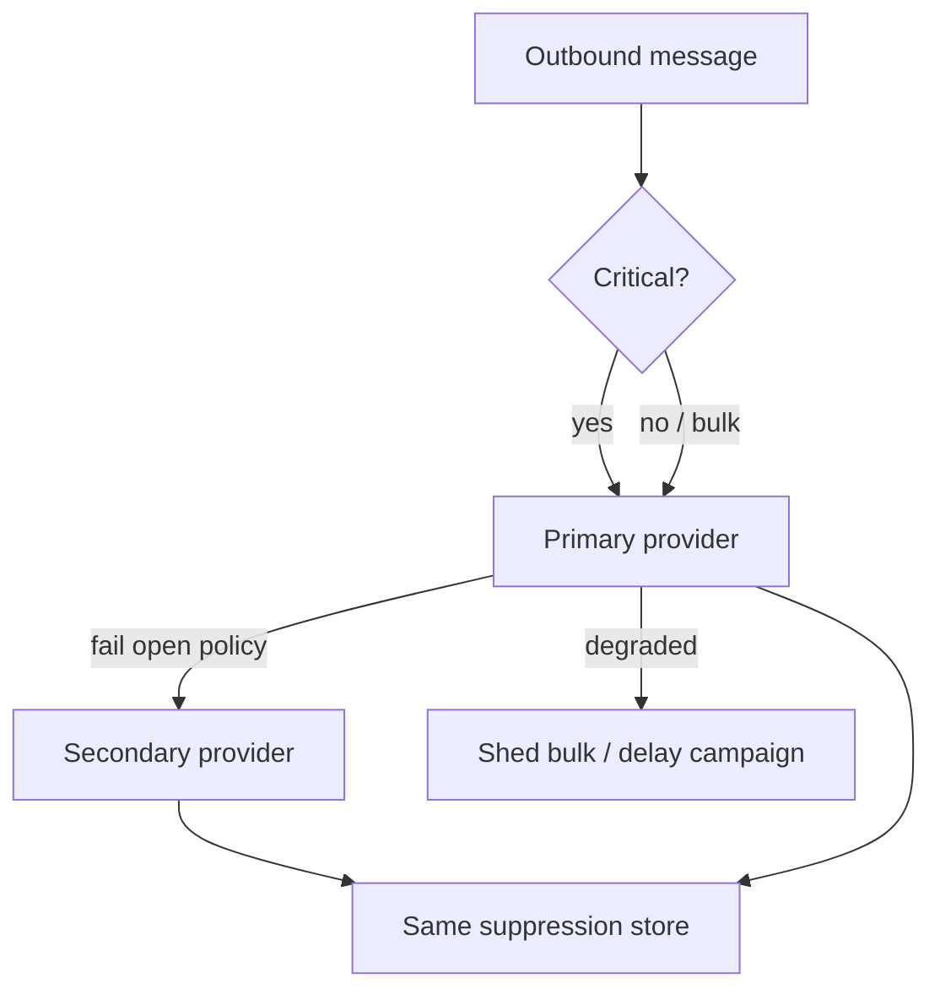

# Notification Provider Operations

Product notification delivery ([§10D](10D-notification-delivery.md)) covers preferences, dedup, and queues. This section is **provider operations**: bounce and complaint handling, suppression lists, sender reputation, and dual-homing across email/SMS vendors so a single provider outage does not silence critical traffic.

> **Scope:** **Email/SMS (and similar) provider ops** — reputation, suppressions, webhooks, failover. Product/API(Application Programming Interface) notify contract → [§10D](10D-notification-delivery.md). Provider webhook HMAC(Hash-based Message Authentication Code) → [§10B](10B-async-webhooks.md). Pipeline sketch → [system-design §7](../../system-design-walkthroughs/includes/07-notification-pipeline.md).
>
> **Related:** [§10D Notification delivery](10D-notification-delivery.md) · Webhooks → [§10B](10B-async-webhooks.md) · Resilience bulkheads → [resilience §4](../../resilience-patterns/includes/04-bulkheads.md) · PII(Personally Identifiable Information) in templates → [ESC §7](../../enterprise-security-compliance/includes/07-pii-and-data-classification.md)

---

## At a glance

| Concern | Ops default |
|---------|-------------|
| **Bounces** | Hard bounce → suppress; soft bounce → retry then suppress |
| **Complaints** | Immediate suppress + honor list-unsubscribe |
| **Suppression list** | Shared across providers; checked before every send |
| **Sender reputation** | Separate domains/IPs for transactional vs bulk |
| **Dual-homing** | Warm secondary; failover critical traffic first |

**Rule of thumb:** Reputation is an **org-level asset**. One bad marketing blast can take down password-reset deliverability if they share identity.

---

## Provider feedback loop

| Signal | Action |
|--------|--------|
| **Hard bounce** (invalid address) | Suppress channel endpoint; do not keep retrying |
| **Soft bounce** (mailbox full, temp fail) | Bounded retries; then suppress or surface to user |
| **Complaint / spam report** | Suppress marketing immediately; review template |
| **Unsubscribe** | Preference + provider suppression — [§10D](10D-notification-delivery.md) |
| **Block / reject at provider** | Circuit-break; protect reputation; page on-call |

Verify webhook signatures — [§10B](10B-async-webhooks.md). Treat provider callbacks as at-least-once; upsert suppression idempotently.

---

## Suppression store

| Field | Why |
|-------|-----|
| `channel` + `address` / `phone` | Endpoint identity |
| `reason` | bounce / complaint / user / legal |
| `source` | which provider or user action |
| `created_at` / `expires_at` | Soft suppressions may age out |
| `tenant_id` | Multi-tenant isolation |

| Rule | Practice |
|------|----------|
| Check suppression **before** provider call | Save cost and reputation |
| Share suppressions across dual-homed providers | Failover must not re-spam a known-bad address |
| Security mail vs marketing | Hard blocks apply to all; marketing opt-out may not block security — document the policy — [§10D](10D-notification-delivery.md) |
| Erasure / DSAR(Data Subject Access Request) | Include suppressions and provider-side lists — [ESC §7A](../../enterprise-security-compliance/includes/07A-erasure-and-dsar.md) |

---

## Sender reputation

| Practice | Why |
|----------|-----|
| **Separate identities** | Transactional subdomain/IP ≠ marketing blast identity |
| **SPF / DKIM / DMARC** | Authentication alignment; monitor DMARC reports |
| **Warm-up** | New IPs/domains ramp volume gradually |
| **List hygiene** | Do not buy lists; prune inactive engagers |
| **Content discipline** | URL shorteners and spammy patterns burn reputation |
| **Per-tenant sending (B2B)** | Noisy tenant must not sink shared IP — consider pools |

SMS sender IDs and throughput registrations are similarly scarce; treat them as capacity with compliance constraints (consent, quiet hours, regional rules).

---

## Dual-homing and failover

| Practice | Why |
|----------|-----|
| Warm secondary with continuous low-volume canary | Cold failover fails DNS(Domain Name System)/auth/config |
| Failover **critical** first (security, receipts) | Bulk can wait — [§10D](10D-notification-delivery.md) |
| Per-provider bulkheads and breakers | [resilience §4](../../resilience-patterns/includes/04-bulkheads.md) |
| Template parity across providers | Failover must not change meaning or drop required fields |
| Dual-write metrics | Compare accept rate, bounce, latency per provider |

Do not dual-send the same logical notification to both providers without dedup — you will double-text users. Fail over **or** primary, keyed by notification id.

---

## SMS-specific notes

| Topic | Watch |
|-------|-------|
| **Throughput / long codes / short codes** | Capacity planning; registration lead times |
| **Carrier filtering** | Reputation analogs; quiet hours |
| **Cost** | Cap campaigns; alert on spend anomalies |
| **Consent** | STOP handling must suppress quickly |
| **PII** | Minimize body content — [ESC §7](../../enterprise-security-compliance/includes/07-pii-and-data-classification.md) |

---

## Operational checklist

- [ ] Bounce/complaint webhooks verified and idempotent
- [ ] Shared suppression store checked pre-send
- [ ] Transactional vs marketing sending identities separated
- [ ] DMARC/SPF/DKIM monitored; warm-up process documented
- [ ] Secondary provider warmed; failover runbook tested
- [ ] Dashboards: accept, bounce, complaint, suppress hits, cost
- [ ] SEV playbook: shed bulk, preserve security channel

---

## Common mistakes

| Mistake | Fix |
|---------|-----|
| Ignoring complaints | Suppress + fix content; protect domain |
| Shared IP for blast + password reset | Split identities |
| Failover without shared suppression | Re-spam bounced addresses |
| Dual-send on failover | Idempotent single delivery per notification id |
| No warm secondary | Test failover before the SEV |
| Treating §10D as enough | Add provider reputation ops (this section) |

---

## Pros and cons

### Dual-homed providers + shared suppression

**Pros:** Survive vendor outages; protect reputation; clearer SEV options.

**Cons:** Template/config parity cost; more webhook surface.

### Single provider, hope

**Pros:** Simple.

**Cons:** Correlated deliverability failure; slow recovery when reputation tanks.