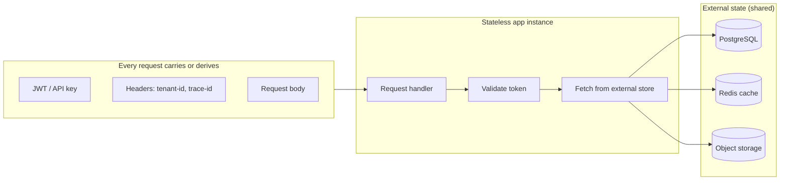
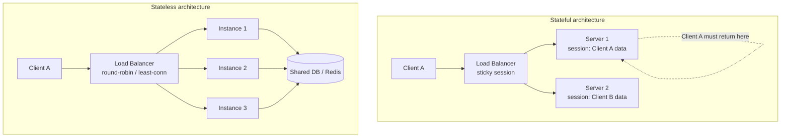
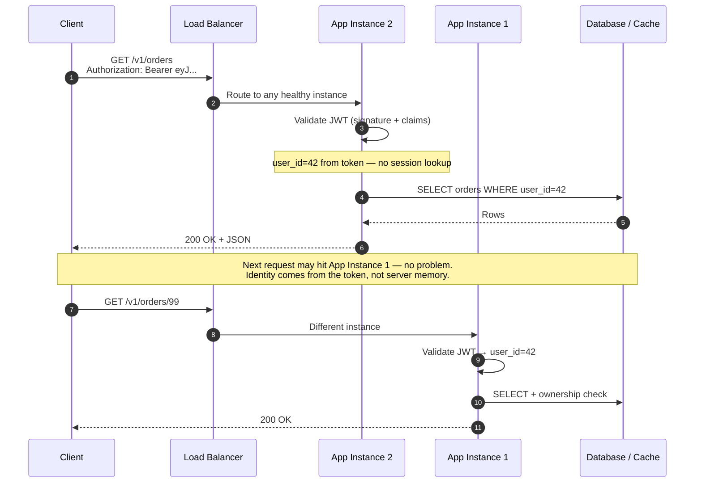
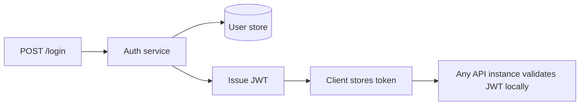
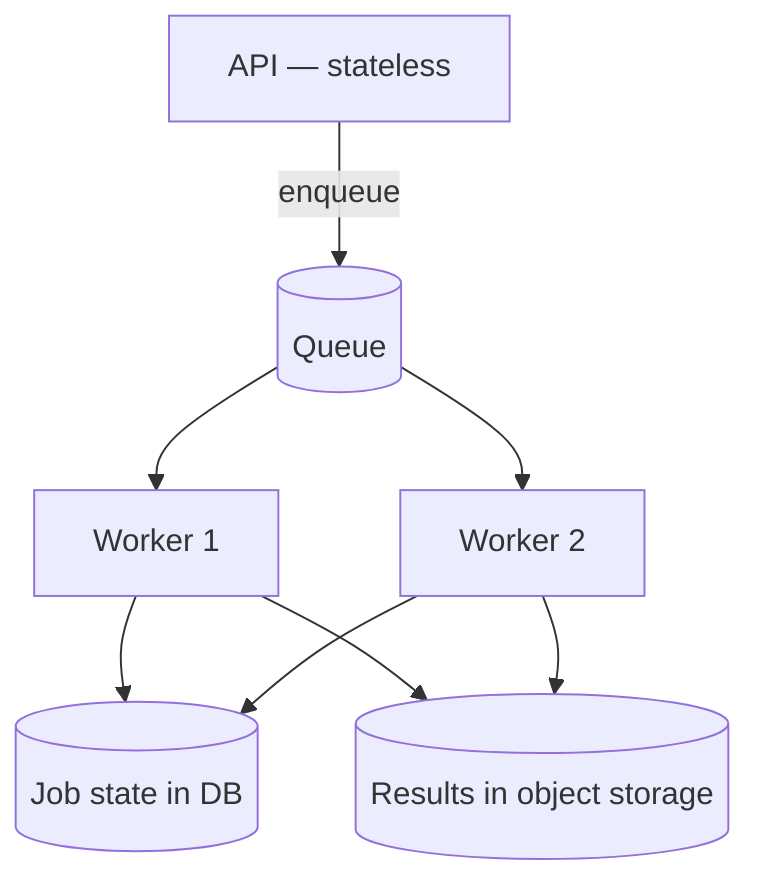

# Stateless Architecture

Why stateless application tiers matter for APIs: how requests flow without server-side sessions, how state is externalized, and how this enables load balancing, scaling, and safe deployments.

> **Scope:** **Architecture lens** — what stateless means, auth flows, externalized state, migration, and deploy safety. Throughput prerequisites (pool sizing, per-request cost, replica scaling) → [HTS §3 Stateless app tier](../../high-throughput-systems/includes/03-stateless-app-tier.md).
>
> **Related:** Entry layer (LB + gateway) → [Load Balancer & API Gateway](03-api-gateway.md) · JWT(JSON Web Token) auth → [Auth model](04-auth-model.md) · Idempotency store → [Idempotency](13-idempotency.md) · Reference stack → [Lifecycle & architecture](08-lifecycle-and-architecture.md) · Async workers → [Async patterns](10-async-patterns.md) · Blue/green deploys → [deployment-strategies §3](../../deployment-strategies/includes/03-blue-green.md)

## Articles in this section

| Article | Topics |
|---------|--------|
| [Auth, consistency, and operations](11-stateless-auth-operations.md) | Token flows, read routing, migration, checklist |

## At a glance

| | **Stateless app tier** | **Stateful app tier** |
|---|---|---|
| **Session data** | Not stored in app memory | Stored on a specific server |
| **Any instance serves any request** | Yes | No — sticky sessions required |
| **Scale out** | Add identical replicas | Session replication or affinity |
| **Instance failure** | Other instances continue | Users on that node lose session |
| **Request context** | Token, headers, body, external store | Server-side session object |
| **Typical fit** | REST(Representational State Transfer) APIs, microservices, serverless | WebSockets rooms, legacy session apps |

**Rule of thumb:** "Stateless" applies to the **application tier**, not the whole system. Durable state lives in **databases, caches, queues, and object storage** — not in individual process memory.

---

## What it is

**Stateless architecture** means each HTTP(Hypertext Transfer Protocol) request is handled **independently**. The server does not rely on in-memory data from prior requests to decide what to do next. Any context needed to serve a request either:

1. **Travels with the request** — JWT, API(Application Programming Interface) key, tenant header, trace ID, body
2. **Lives in shared external stores** — PostgreSQL, Redis, S3, message queues

This is the default pattern behind modern API stacks: load balancers distribute freely, API gateways validate tokens without session affinity, and instances can be replaced at any time.

Nothing in the app instance **must** survive after the response is sent.

---

## Stateless vs stateful

| Concern | Stateless | Stateful |
|---------|-----------|----------|
| Horizontal scaling | Add/remove replicas freely | Session migration or sticky routing |
| Deployments (rolling, blue/green) | New instances serve traffic immediately | Must drain sessions or replicate state |
| Failure recovery | Blast radius = one request | Cohort of users may lose session |
| Load balancer config | Round-robin, least connections | Sticky cookies or IP hash |
| Auth model | JWT / API keys in request | Server-side session cookie |

---

## Request flow

How a stateless API call works end-to-end (extends the [overview sequence](00-overview.md#sequence-one-protected-api-call)):

### What each layer stores

| Layer | Holds state? | What it stores |
|-------|--------------|----------------|
| **Client** | Yes (client-side) | Access token, refresh token, local cache |
| **CDN(Content Delivery Network) / Edge** | Cache only | Cacheable GET responses (no user sessions) |
| **API Gateway** | Minimal | Rate-limit counters (Redis), optional token denylist |
| **Load balancer** | No | Routing table, health status only |
| **App instance** | **No durable state** | Request-scoped variables only |
| **Database / Redis** | Yes (source of truth) | Users, orders, carts, job state |
| **Queue / Workers** | Job state in DB | Interchangeable worker pool |

---

## Key principles

### 1. Identity and authorization in the request

Use **JWT access tokens**, **API keys**, or signed headers so any instance can authenticate without a server-side session table lookup (or with a minimal, cacheable lookup).

See [Auth model — JWT](04-auth-model.md) for token design.

### 2. No session affinity at the load balancer

Prefer **round-robin**, **least connections**, or **random** — not sticky cookies — unless a legacy stateful component requires it.

Entry-layer details → [Load Balancer & API Gateway](03-api-gateway.md#request-flows).

### 3. Externalize all durable state

| Data type | Store | Not |
|-----------|-------|-----|
| User profiles, orders | PostgreSQL | In-memory map per server |
| Shopping cart (if needed) | Redis or DB keyed by `user_id` | Session cookie blob |
| Uploaded files | S3 / object storage | Local disk on instance |
| Async jobs | DB + queue | Blocking request thread |
| Rate-limit counters | Redis (shared) | Per-instance counters |

### 4. Idempotent operations

Retries and duplicate requests are common at scale. Design writes to be safe when repeated — idempotency keys, UPSERT, natural keys. See [Idempotency](13-idempotency.md).

### 5. Configuration via environment

Instances are interchangeable. Config comes from environment variables, secrets managers, or config services — not baked into local files on one machine.

### 6. Workers are stateless too

Async [workers](10-async-patterns.md) pull jobs from a queue, read/write shared stores, and exit. Any worker can process any job.

---

