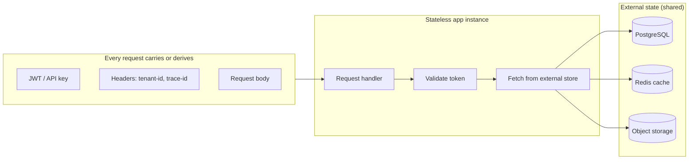
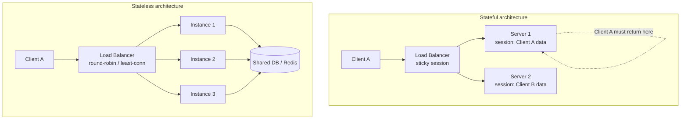
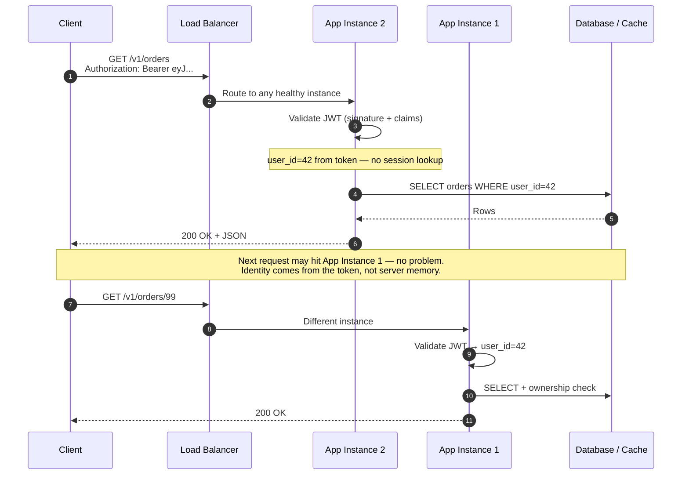
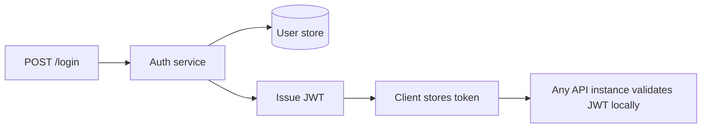
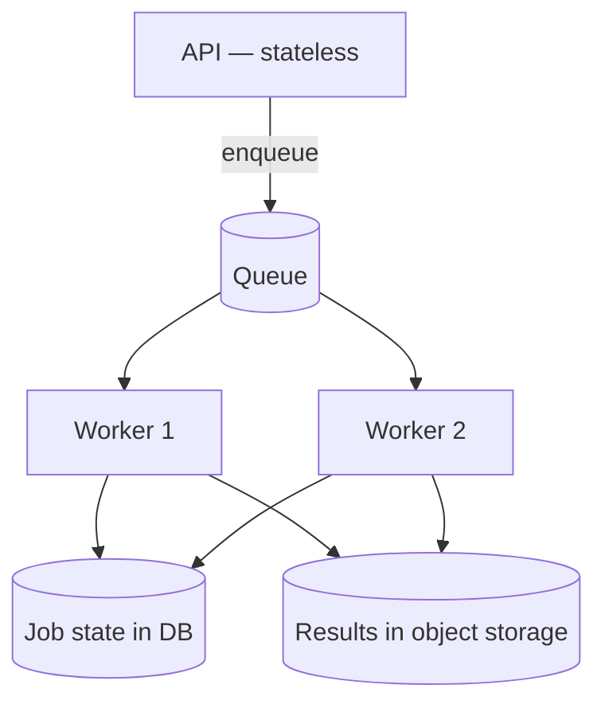
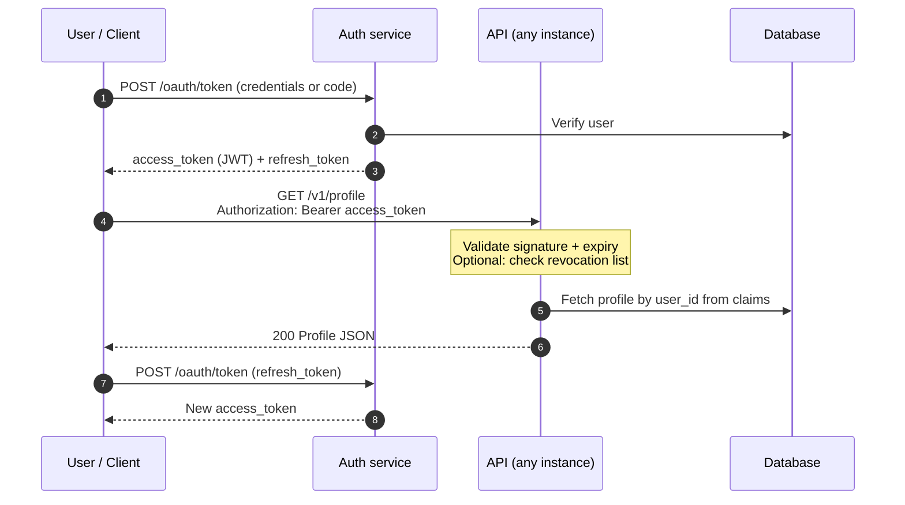
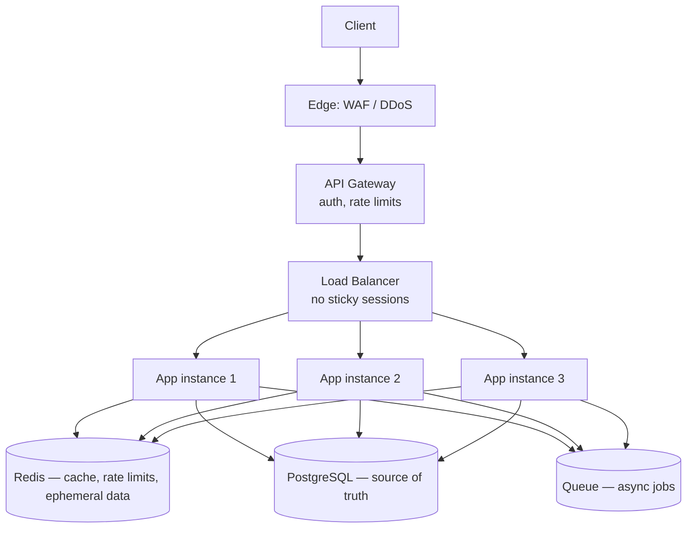
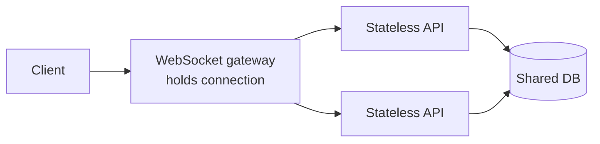
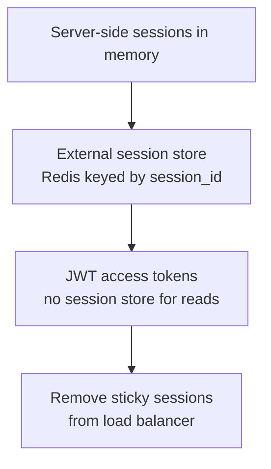

# Stateless Architecture

Why stateless application tiers matter for APIs: how requests flow without server-side sessions, how state is externalized, and how this enables load balancing, scaling, and safe deployments.

> **Scope:** **Architecture lens** — what stateless means, auth flows, externalized state, migration, and deploy safety. Throughput prerequisites (pool sizing, per-request cost, replica scaling) → [HTS §3 Stateless app tier](../../high-throughput-systems/includes/03-stateless-app-tier.md).
>
> **Related:** Entry layer (LB + gateway) → [Load Balancer & API Gateway](03-api-gateway.md) · JWT(JSON Web Token) auth → [Auth model](04-auth-model.md) · Idempotency store → [Idempotency](13-idempotency.md) · Reference stack → [Lifecycle & architecture](08-lifecycle-and-architecture.md) · Async workers → [Async patterns](10-async-patterns.md) · Blue/green deploys → [deployment-strategies §3](../../deployment-strategies/includes/03-blue-green.md)

---

## At a glance

| | **Stateless app tier** | **Stateful app tier** |
|---|---|---|
| **Session data** | Not stored in app memory | Stored on a specific server |
| **Any instance serves any request** | Yes | No — sticky sessions required |
| **Scale out** | Add identical replicas | Session replication or affinity |
| **Instance failure** | Other instances continue | Users on that node lose session |
| **Request context** | Token, headers, body, external store | Server-side session object |
| **Typical fit** | REST(Representational State Transfer) APIs, microservices, serverless | WebSockets rooms, legacy session apps |

**Rule of thumb:** "Stateless" applies to the **application tier**, not the whole system. Durable state lives in **databases, caches, queues, and object storage** — not in individual process memory.

---

## What it is

**Stateless architecture** means each HTTP(Hypertext Transfer Protocol) request is handled **independently**. The server does not rely on in-memory data from prior requests to decide what to do next. Any context needed to serve a request either:

1. **Travels with the request** — JWT, API(Application Programming Interface) key, tenant header, trace ID, body
2. **Lives in shared external stores** — PostgreSQL, Redis, S3, message queues

This is the default pattern behind modern API stacks: load balancers distribute freely, API gateways validate tokens without session affinity, and instances can be replaced at any time.

Nothing in the app instance **must** survive after the response is sent.

---

## Stateless vs stateful

| Concern | Stateless | Stateful |
|---------|-----------|----------|
| Horizontal scaling | Add/remove replicas freely | Session migration or sticky routing |
| Deployments (rolling, blue/green) | New instances serve traffic immediately | Must drain sessions or replicate state |
| Failure recovery | Blast radius = one request | Cohort of users may lose session |
| Load balancer config | Round-robin, least connections | Sticky cookies or IP hash |
| Auth model | JWT / API keys in request | Server-side session cookie |

---

## Request flow

How a stateless API call works end-to-end (extends the [overview sequence](00-overview.md#sequence-one-protected-api-call)):

### What each layer stores

| Layer | Holds state? | What it stores |
|-------|--------------|----------------|
| **Client** | Yes (client-side) | Access token, refresh token, local cache |
| **CDN(Content Delivery Network) / Edge** | Cache only | Cacheable GET responses (no user sessions) |
| **API Gateway** | Minimal | Rate-limit counters (Redis), optional token denylist |
| **Load balancer** | No | Routing table, health status only |
| **App instance** | **No durable state** | Request-scoped variables only |
| **Database / Redis** | Yes (source of truth) | Users, orders, carts, job state |
| **Queue / Workers** | Job state in DB | Interchangeable worker pool |

---

## Key principles

### 1. Identity and authorization in the request

Use **JWT access tokens**, **API keys**, or signed headers so any instance can authenticate without a server-side session table lookup (or with a minimal, cacheable lookup).

See [Auth model — JWT](04-auth-model.md) for token design.

### 2. No session affinity at the load balancer

Prefer **round-robin**, **least connections**, or **random** — not sticky cookies — unless a legacy stateful component requires it.

Entry-layer details → [Load Balancer & API Gateway](03-api-gateway.md#request-flows).

### 3. Externalize all durable state

| Data type | Store | Not |
|-----------|-------|-----|
| User profiles, orders | PostgreSQL | In-memory map per server |
| Shopping cart (if needed) | Redis or DB keyed by `user_id` | Session cookie blob |
| Uploaded files | S3 / object storage | Local disk on instance |
| Async jobs | DB + queue | Blocking request thread |
| Rate-limit counters | Redis (shared) | Per-instance counters |

### 4. Idempotent operations

Retries and duplicate requests are common at scale. Design writes to be safe when repeated — idempotency keys, UPSERT, natural keys. See [Idempotency](13-idempotency.md).

### 5. Configuration via environment

Instances are interchangeable. Config comes from environment variables, secrets managers, or config services — not baked into local files on one machine.

### 6. Workers are stateless too

Async [workers](10-async-patterns.md) pull jobs from a queue, read/write shared stores, and exit. Any worker can process any job.

---

## Stateless auth flow

Typical token-based flow for public APIs:

| Approach | Stateless? | Tradeoff |
|----------|------------|----------|
| JWT access token (short TTL) | Yes — local validation | Revocation needs denylist or very short TTL |
| Opaque token + Redis lookup | Hybrid | DB/cache hit per request; easier revocation |
| Server-side session cookie | No | Requires sticky sessions or shared session store |
| API key in header | Yes | Key rotation and scoping discipline required |

---

## Reference architecture (stateless app tier)

How stateless services fit the [reference stack](08-lifecycle-and-architecture.md#reference-architecture--public-saas-api):

| Pattern | Role in stateless design |
|---------|--------------------------|
| **JWT access tokens** | Identity travels with every request |
| **Redis** | Shared cache and counters — not per-app memory |
| **PostgreSQL** | Durable transactional state |
| **Message queue** | Decouple work; workers are interchangeable |
| **Object storage** | Files and exports — not local disk |
| **Idempotency keys** | Safe retries without duplicate side effects |

---

## Benefits

| Benefit | Why it matters for APIs |
|---------|-------------------------|
| **Horizontal scaling** | Scale on CPU, latency, or queue depth — not session count |
| **High availability** | Failed instance does not strand a cohort of users |
| **Simple deployments** | Blue/green, rolling, canary — new instances serve traffic immediately |
| **Cloud-native fit** | Containers, Kubernetes, serverless, auto-scaling |
| **Load balancer freedom** | Any routing algorithm; no session drain on scale-down |
| **Easier testing** | Each request is self-contained; no hidden server state |
| **Multi-region** | Requests can land in any region if data is shared or replicated |
| **Rate-limit fairness** | Shared Redis counters; identity-based tiers work across nodes |

---

## Use cases

| Use case | Why stateless fits |
|----------|-------------------|
| **REST / GraphQL public APIs** | Each call is independent; JWT/API keys carry identity |
| **Microservices** | Services scale and fail independently |
| **Third-party partner APIs** | Unknown client count; elastic scale required |
| **Serverless / FaaS** | Functions are ephemeral by design |
| **Mobile & SPA backends** | Clients hold tokens; no cookie-based server sessions |
| **CDN-backed read APIs** | Cacheable responses; no per-server session |
| **Queue workers** | Workers pull jobs; no affinity to a specific machine |
| **Blue/green & canary deploys** | New version instances accept traffic without session migration |

---

## Pros and cons

### Pros

- Elastic scaling — add replicas under load, remove them off-peak
- Resilience — blast radius of a bad instance is one request, not many users
- Operational simplicity — identical instances, no session replication cluster
- Aligns with [12-factor app](https://12factor.net/processes) — processes are disposable; state is external
- Pairs naturally with API gateway + load balancer entry architecture
- Enables safe [deployment strategies](../../deployment-strategies/README.md) (rolling, blue/green)

### Cons

- **Token management complexity** — expiry, refresh tokens, revocation lists, key rotation
- **More network I/O** — context often fetched from DB/cache every request (mitigate with caching)
- **JWT payload size** — embedding too many claims bloats headers
- **Revocation is harder** — stateless JWTs cannot be "deleted" without extra infra (denylist, short TTL)
- **Not ideal for all workloads** — WebSockets, long-lived connections, in-memory game rooms
- **Consistency tradeoffs** — distributed caches and read replicas introduce eventual consistency

See [Strong consistency — promises and costs](../../postgresql-performance/includes/14-consistency-promises-and-costs.md) for definitions, costs, and when to require primary reads.

---

## Consistency and read routing

Stateless APIs often fetch context from a DB or cache on every request. That makes **read routing** a consistency decision, not just a performance one.

| Read type | Route to | Example endpoints |
|-----------|----------|-------------------|
| **Strong / session-critical** | Primary DB | `GET /me`, post-checkout order status, balance after transfer |
| **Eventual / stale OK** | Read replica or cache | Product lists, dashboards, search suggestions |
| **Read-your-writes** | Primary for N seconds after user's write, or poll until visible | Create resource → immediate GET by ID |

**API practices:**

- Document consistency per endpoint in OpenAPI (e.g. "Read model may lag up to 30s")
- Return **`409 Conflict`** with `ETag` / version on stale updates — aligns with optimistic concurrency on the write side
- After **`202` async jobs**, treat result reads like projections — poll until complete; don't assume immediate consistency on a replica

> **Related:** Layered read path and replication lag → [Read scaling and caching](../../postgresql-performance/includes/11-read-scaling-and-caching.md) · CQRS(Command Query Responsibility Segregation) projector lag → [Eventual consistency in read models](../../event-sourcing-and-cqrs/includes/02-cqrs-and-read-models.md#eventual-consistency)
- **Security discipline** — never trust client-sent identity without cryptographic validation

---

## When stateless is the wrong default

| Scenario | Better approach |
|----------|-----------------|
| **WebSocket / SSE(Server-Sent Events) connection state** | Stateful connection gateway + stateless business logic behind it |
| **In-memory chat/game room** | Dedicated stateful service or CRDT/sync layer |
| **Heavy model loaded once per GPU** | Stateful worker pool with routing to warm instances |
| **Legacy apps with server sessions** | Sticky sessions temporarily → migrate to external session store (Redis) |
| **Strong immediate revocation required** | Short-lived tokens + introspection endpoint or session store lookup |

**Hybrid is common:** stateless HTTP API + stateful connection layer (WebSocket server forwarding to stateless services).

---

## Migrating from stateful to stateless

| Step | Action |
|------|--------|
| 1 | Move session data from app memory to Redis or DB |
| 2 | Issue JWT or opaque tokens; stop growing in-memory session maps |
| 3 | Remove sticky sessions from load balancer |
| 4 | Verify any instance can serve any authenticated request |
| 5 | Externalize uploads, temp files, and local caches |

---

## Common mistakes

| Mistake | Fix |
|---------|-----|
| Sticky sessions enabled "just in case" | Remove affinity once auth is token-based |
| User ID from request body without token validation | Derive identity only from validated JWT/API key |
| Rate limits stored per instance | Shared Redis counters at gateway or app |
| Shopping cart in server memory | Redis or DB keyed by `user_id` |
| File uploads to local disk | Stream to object storage (S3) |
| Assuming "no session" means "no state anywhere" | State belongs in external stores, not nowhere |
| Long-lived JWT with no revocation plan | Short TTL + refresh token + optional denylist |

---

## Checklist: is your app tier stateless?

| Check | Pass? |
|-------|-------|
| Any instance can handle any request without sticky sessions | |
| User identity comes from validated token/key, not server memory | |
| Durable data is in DB/cache/storage, not local disk or RAM | |
| You can kill an instance mid-traffic without corrupting user state | |
| You can add a new instance and immediately send it traffic | |
| Uploads, temp files, and job state are externalized | |
| Rate limits and idempotency use shared stores | |
| Config and secrets come from env/vault, not local files | |

---

## Decision summary

| Question | Default for public APIs |
|----------|-------------------------|
| Store sessions in app memory? | No — use JWT or external session store |
| Sticky sessions on load balancer? | No — unless legacy migration in progress |
| Where does durable state live? | PostgreSQL + Redis + object storage + queue |
| Where is AuthZ enforced? | Application code on every instance ([Auth model](04-auth-model.md)) |
| Can workers share a queue? | Yes — design workers as stateless consumers |
| Stateless at the gateway too? | Gateway holds policy state (rate limits in Redis), not user sessions |
