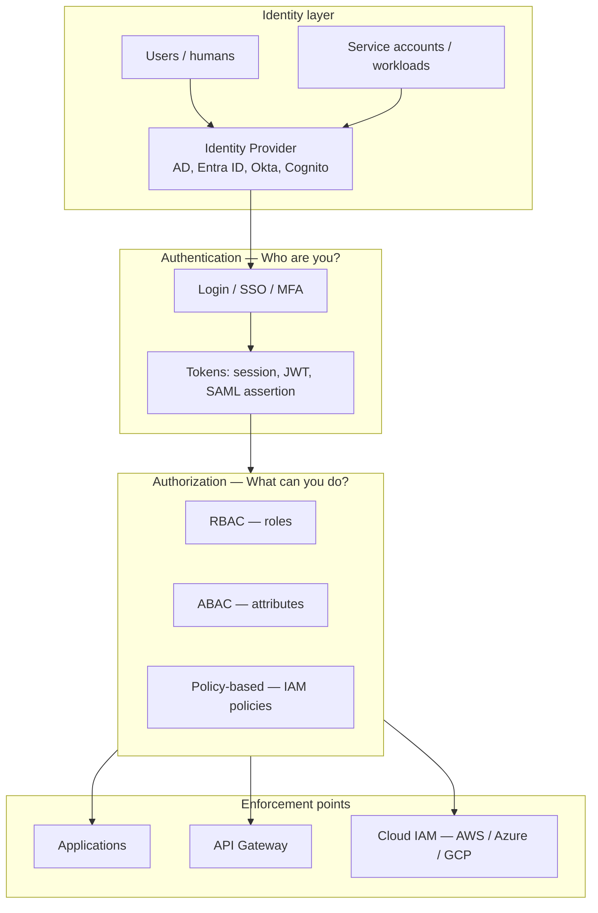
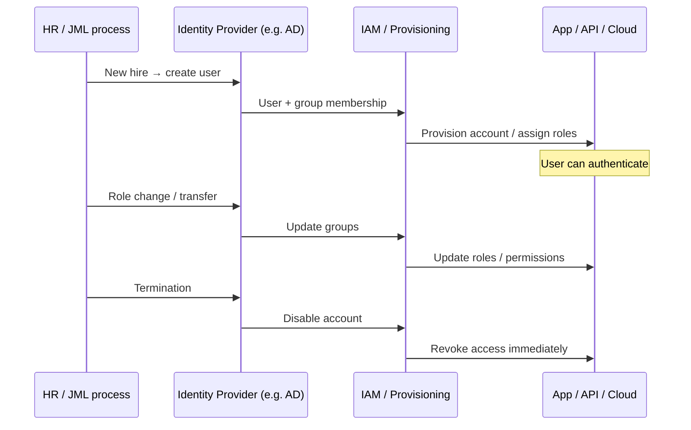
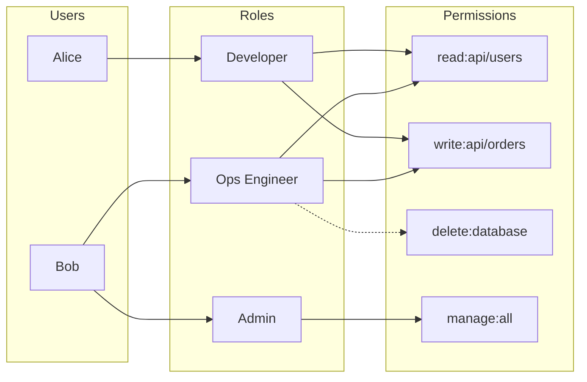
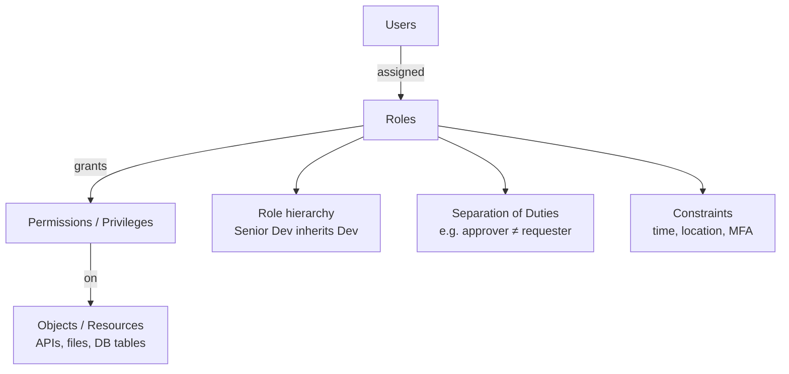
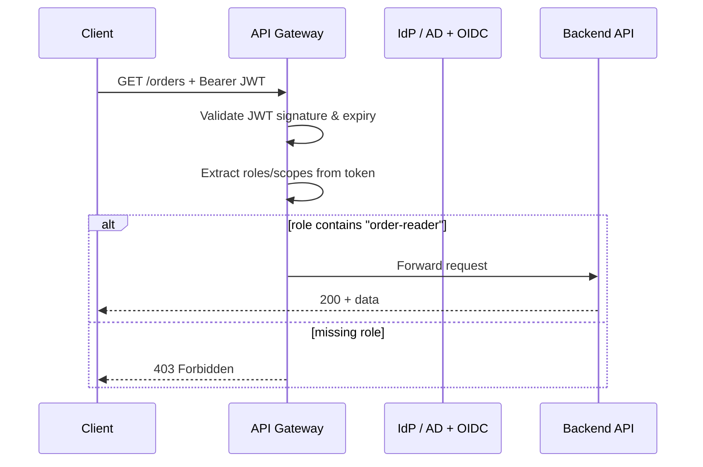
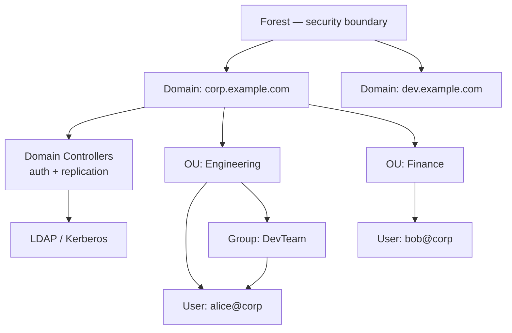
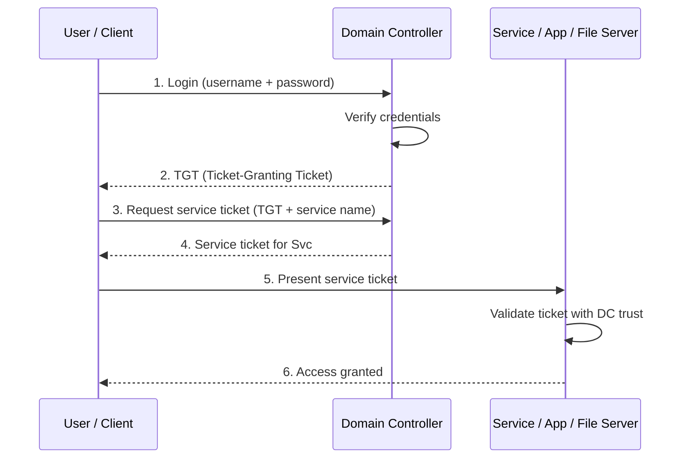
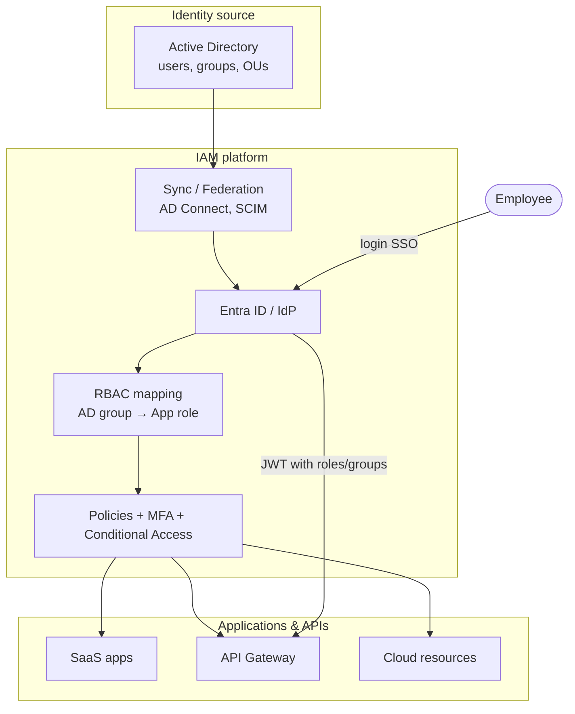
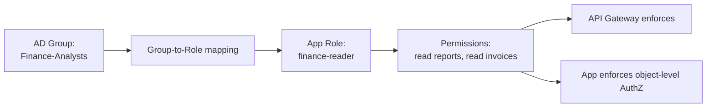
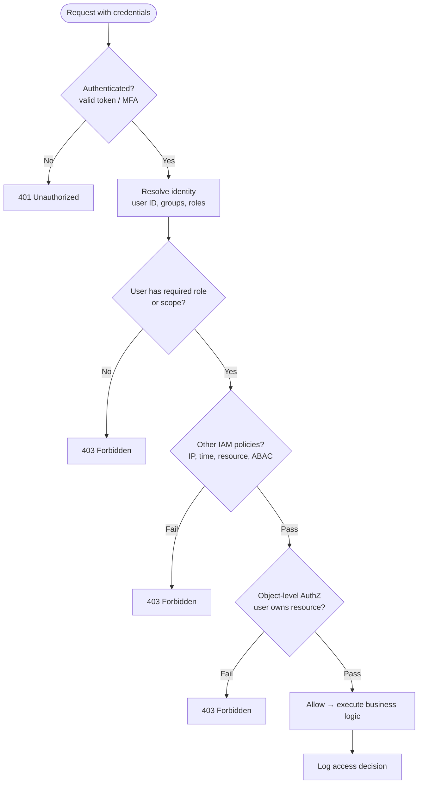

# Identity: RBAC, IAM & Active Directory

Enterprise identity foundations for APIs: how IAM governs access, how RBAC assigns permissions through roles, and how Active Directory (and cloud IdPs) feed tokens and policies your gateway and services enforce.

> **Related:** Auth protocols (OAuth(Open Authorization), JWT(JSON Web Token), mTLS(Mutual Transport Layer Security)) → [Auth model](04-auth-model.md) · Gateway enforcement → [Load Balancer & API Gateway](03-api-gateway.md) · Multi-tenant claims → [16-multi-tenant-apis.md](16-multi-tenant-apis.md) · DB connection identity → [database-connection-and-security](../../database-connection-and-security/README.md)

---

## At a glance

| Concept | What it is | Primary question |
|---------|------------|------------------|
| **IAM** | Discipline + systems for identity and access lifecycle | Who are you, and are you allowed to do this? |
| **RBAC** | Access **model**: permissions via **roles** | What role do you have, and what does that role allow? |
| **Active Directory (AD(Active Directory))** | Microsoft **directory service** (identity store + auth) | Where do users, groups, and computers live in the org? |

**Relationship:** AD (or another IdP) holds identities → IAM is the overall framework that uses them → RBAC is one common way IAM assigns permissions at apps, APIs, and cloud layers.

For **how clients authenticate** (OAuth, API(Application Programming Interface) keys, JWT validation), see [Auth model](04-auth-model.md). This section covers **organizational identity** and **authorization structure**.

---

## What IAM is

**Identity and Access Management (IAM)** is the end-to-end lifecycle and enforcement of access across people, services, and resources.

| Area | Examples |
|------|----------|
| **Authentication (AuthN)** | Password, MFA, SSO, certificates, API keys |
| **Authorization (AuthZ)** | RBAC, ABAC, resource policies |
| **Provisioning** | SCIM, LDAP sync, just-in-time (JIT) access |
| **Governance** | Access reviews, least privilege, audit logs |
| **Federation** | SAML, OIDC(OpenID Connect) — trust external IdPs |
| **Secrets & keys** | Service principals, workload identity |

Cloud **IAM** (AWS IAM, Azure RBAC, GCP IAM) applies the same ideas to cloud control planes: principals + policies + enforcement at the API layer.

### IAM components

### IAM lifecycle (joiner-mover-leaver)

### Pros of a formal IAM program

- Single source of truth for who has access and why
- Faster onboarding/offboarding with fewer orphaned accounts
- Audit trail for compliance (SOC2, ISO 27001)
- Consistent mapping from org structure → app permissions

### Cons

- Tooling sprawl (AD, IdP, SCIM, cloud IAM, app-local roles)
- Group-to-role mapping drift if not governed
- Over-permissioning when teams copy "admin" roles for convenience

---

## What RBAC is

**Role-Based Access Control (RBAC)** assigns permissions to **roles**, not directly to every user. Users get roles; roles get permissions.

### RBAC model

### RBAC hierarchy (NIST-style)

### RBAC vs other access models

| Model | Basis of access | Good for |
|-------|-----------------|----------|
| **RBAC** | Job function (role) | Orgs with stable job titles |
| **ABAC** | Attributes (dept, clearance, resource tags) | Fine-grained, dynamic rules |
| **ACL** | Per-resource list of who can access | Small sets, file shares |
| **PBAC / Policy** | Declarative policies (Rego, IAM JSON) | Cloud, APIs, zero-trust |

### RBAC at the API layer

Map roles to **scopes** or **route policies** at the gateway and re-check in the app for object-level AuthZ ([Auth model — layered flow](04-auth-model.md#layered-auth-flow)).

| RBAC artifact | API example |
|---------------|-------------|
| **Role** | `order-reader`, `order-admin` |
| **Permission** | `GET /orders`, `POST /orders`, `DELETE /orders/{id}` |
| **Assignment** | Alice → `order-reader` (via AD group → app role mapping) |

Gateway checks **coarse** role/scope; the app still enforces **object ownership** (BOLA(Broken Object-Level Authorization)) — see [Auth model](04-auth-model.md).

---

## What Active Directory is

**Active Directory (AD)** is Microsoft's directory service for Windows-centric enterprises. It is primarily an **identity store and authentication system**, not a full IAM product by itself — though **Microsoft Entra ID** (Azure AD) extends it for cloud and modern protocols.

### AD logical structure

### Key AD concepts

| Term | Meaning |
|------|---------|
| **Domain** | Administrative + authentication boundary (e.g. `corp.example.com`) |
| **Forest** | Collection of domains with shared schema |
| **Domain Controller (DC)** | Server that authenticates users and holds directory data |
| **OU (Organizational Unit)** | Container for users/groups/computers; delegation and GPO |
| **Security Group** | Collection of principals; permissions and RBAC mapping |
| **GPO (Group Policy)** | Central config for machines/users (password policy, software) |
| **Kerberos** | Default AD auth protocol (tickets, mutual auth) |
| **LDAP** | Directory query protocol (read users, groups, attributes) |

### AD authentication flow (Kerberos — simplified)

Modern APIs rarely terminate Kerberos at the gateway directly. Typical pattern: AD → Entra ID / IdP → **OIDC/SAML** → JWT with groups/roles → gateway + app.

### AD vs Microsoft Entra ID

| | **On-prem AD** | **Microsoft Entra ID** |
|--|----------------|------------------------|
| **Primary use** | Windows domain, LAN, legacy apps | Cloud, SaaS, modern auth (OIDC/SAML) |
| **Protocol** | Kerberos, NTLM, LDAP | OAuth(Open Authorization) 2.0, OIDC, SAML |
| **Structure** | Domains, OUs, GPO | Tenants, users, groups, conditional access |
| **Hybrid** | — | AD Connect syncs on-prem AD ↔ cloud |

---

## How RBAC, IAM, and AD work together

End-to-end enterprise picture for API access:

### Concrete example

1. **AD:** Alice is in security group `Finance-Analysts`
2. **IAM provisioning:** Sync maps `Finance-Analysts` → app role `finance-reader`
3. **RBAC:** Role `finance-reader` allows `GET /reports`, `GET /invoices`
4. **Enforcement:** API gateway reads JWT `roles: ["finance-reader"]`; app verifies resource ownership

---

## Decision flow: can this user access this API?

Unified authorization check (IAM + RBAC + token from AD-backed IdP):

Aligns with the [layered auth flow](04-auth-model.md#layered-auth-flow): gateway handles AuthN and coarse AuthZ; the app must still run the object check.

---

## Comparison summary

| | **IAM** | **RBAC** | **Active Directory** |
|--|---------|----------|----------------------|
| **Type** | Framework + tooling | Access **model** | Directory + auth **product** |
| **Answers** | Full identity lifecycle | "What can this role do?" | "Who is this user in the org?" |
| **Scope** | People, apps, cloud, APIs | Permissions via roles | Typically enterprise Windows / hybrid |
| **Typical artifacts** | Policies, MFA, audit, provisioning | Roles, bindings, permissions | Users, groups, OUs, GPO, DCs |
| **In API context** | Gateway auth, OAuth, lifecycle | JWT roles/scopes, usage plans | SSO source; groups → API roles |

---

## API design takeaways

| Practice | Why |
|----------|-----|
| Map AD/IdP **groups** → app **roles**, not raw group names in app code | Survives reorgs; central mapping table |
| Put **roles/scopes in JWT** (short TTL) | Stateless validation at gateway |
| Enforce **object-level AuthZ in app** | RBAC alone does not prevent BOLA(Broken Object-Level Authorization) |
| Automate **JML** (joiner-mover-leaver) | Orphan accounts are a top audit finding |
| Regular **access reviews** | Least privilege over time |
| Log **who** (subject), **what** (resource), **decision** | Audit without logging tokens |

Default stack for public SaaS APIs (extends [overview default](00-overview.md#default-recommendation)):

1. **Entra ID / Okta** (fed from AD if hybrid) for employee SSO
2. **OAuth 2.0 + OIDC** for user-facing apps → JWT with scopes/roles
3. **Scoped API keys** for partners (see [Auth model](04-auth-model.md))
4. **Gateway** validates token + coarse RBAC; **app** validates object ownership
5. **Cloud IAM** for service-to-service and data-layer access ([database-connection-and-security](../../database-connection-and-security/README.md))

---

## Common mistakes

| Mistake | Fix |
|---------|-----|
| Checking AD group names hard-coded in every service | Central group → role mapping; roles in token claims |
| RBAC at gateway only, no object AuthZ in app | Layered AuthZ per [Auth model](04-auth-model.md) |
| Long-lived JWT with embedded admin role | Short TTL + refresh; minimal claims |
| No offboarding automation | Disable IdP account → revoke app + API access same day |
| Same role for humans and service accounts | Separate service principals with narrower permissions |
| Confusing cloud IAM with app RBAC | Cloud IAM protects AWS/Azure resources; app RBAC protects business operations |

---

## Related reading

| Guide | Topics |
|-------|--------|
| [Auth model](04-auth-model.md) | OAuth, JWT, API keys, mTLS, webhook HMAC(Hash-based Message Authentication Code) |
| [API Gateway](03-api-gateway.md) | JWT validation, routing, policy at the edge |
| [database-connection-and-security](../../database-connection-and-security/README.md) | RDS IAM, Vault, workload identity to databases |
| [api-rate-limiting — scope identity](../../api-rate-limiting/includes/06-scope-identity.md) | Identity keys for rate-limit tiers |